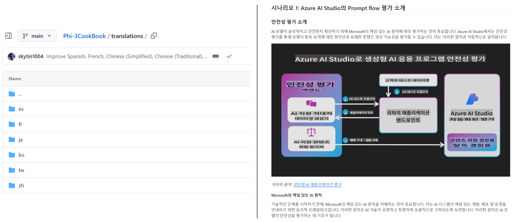

<!--
CO_OP_TRANSLATOR_METADATA:
{
  "original_hash": "1d7514f77c46850bc8a88b732c6ea86b",
  "translation_date": "2025-11-22T05:55:31+00:00",
  "source_file": "README.md",
  "language_code": "te"
}
-->
# కో-ఆప్ ట్రాన్స్‌లేటర్

_మీ విద్యా GitHub కంటెంట్‌ను అనేక భాషలలోకి అనువదించడం సులభంగా ఆటోమేట్ చేయండి, ప్రపంచవ్యాప్తంగా ఉన్న ప్రేక్షకులను చేరుకోండి._

### 🌐 బహుభాషా మద్దతు

#### [కో-ఆప్ ట్రాన్స్‌లేటర్](https://github.com/Azure/Co-op-Translator) ద్వారా మద్దతు పొందినవి

<!-- CO-OP TRANSLATOR LANGUAGES TABLE START -->
[అరబిక్](../ar/README.md) | [బెంగాలీ](../bn/README.md) | [బల్గేరియన్](../bg/README.md) | [బర్మీస్ (మయన్మార్)](../my/README.md) | [చైనీస్ (సింప్లిఫైడ్)](../zh/README.md) | [చైనీస్ (ట్రెడిషనల్, హాంగ్ కాంగ్)](../hk/README.md) | [చైనీస్ (ట్రెడిషనల్, మకావు)](../mo/README.md) | [చైనీస్ (ట్రెడిషనల్, తైవాన్)](../tw/README.md) | [క్రొయేషియన్](../hr/README.md) | [చెక్](../cs/README.md) | [డానిష్](../da/README.md) | [డచ్](../nl/README.md) | [ఎస్టోనియన్](../et/README.md) | [ఫిన్నిష్](../fi/README.md) | [ఫ్రెంచ్](../fr/README.md) | [జర్మన్](../de/README.md) | [గ్రీక్](../el/README.md) | [హీబ్రూ](../he/README.md) | [హిందీ](../hi/README.md) | [హంగేరియన్](../hu/README.md) | [ఇండోనేషియన్](../id/README.md) | [ఇటాలియన్](../it/README.md) | [జపనీస్](../ja/README.md) | [కొరియన్](../ko/README.md) | [లిథువేనియన్](../lt/README.md) | [మలయ్](../ms/README.md) | [మరాఠీ](../mr/README.md) | [నేపాలీ](../ne/README.md) | [నార్వేజియన్](../no/README.md) | [పర్షియన్ (ఫార్సీ)](../fa/README.md) | [పోలిష్](../pl/README.md) | [పోర్చుగీస్ (బ్రెజిల్)](../br/README.md) | [పోర్చుగీస్ (పోర్చుగల్)](../pt/README.md) | [పంజాబీ (గుర్ముఖి)](../pa/README.md) | [రోమేనియన్](../ro/README.md) | [రష్యన్](../ru/README.md) | [సెర్బియన్ (సిరిలిక్)](../sr/README.md) | [స్లోవాక్](../sk/README.md) | [స్లోవేనియన్](../sl/README.md) | [స్పానిష్](../es/README.md) | [స్వాహిలి](../sw/README.md) | [స్వీడిష్](../sv/README.md) | [టాగలాగ్ (ఫిలిపినో)](../tl/README.md) | [తమిళం](../ta/README.md) | [థాయ్](../th/README.md) | [టర్కిష్](../tr/README.md) | [ఉక్రేనియన్](../uk/README.md) | [ఉర్దూ](../ur/README.md) | [వియత్నామీస్](../vi/README.md)
<!-- CO-OP TRANSLATOR LANGUAGES TABLE END -->

## అవలోకనం

**కో-ఆప్ ట్రాన్స్‌లేటర్** మీ విద్యా GitHub కంటెంట్‌ను అనేక భాషలలోకి సులభంగా స్థానికీకరించడానికి సహాయపడుతుంది.  
మీ Markdown ఫైళ్లను, చిత్రాలను లేదా నోట్‌బుక్‌లను మీరు నవీకరించినప్పుడు, అనువాదాలు ఆటోమేటిక్‌గా సమకాలీకరించబడతాయి, తద్వారా మీ కంటెంట్ ప్రపంచవ్యాప్తంగా ఉన్న విద్యార్థుల కోసం ఖచ్చితంగా మరియు నవీకరించబడుతుంది.

అనువదించిన కంటెంట్ ఎలా నిర్వహించబడుతుందో ఉదాహరణ:



## త్వరిత ప్రారంభం

```bash
# వర్చువల్ ఎన్విరాన్‌మెంట్‌ను సృష్టించి, సక్రియం చేయండి (సిఫార్సు చేయబడింది)
python -m venv .venv
# విండోస్
.venv\Scripts\activate
# మాక్‌ఓఎస్/లినక్స్
source .venv/bin/activate
# ప్యాకేజీని ఇన్‌స్టాల్ చేయండి
pip install co-op-translator
# అనువదించండి
translate -l "ko ja fr" -md
```
  
డాకర్:

```bash
# GHCR నుండి పబ్లిక్ ఇమేజ్‌ను తీసుకోండి
docker pull ghcr.io/azure/co-op-translator:latest
# ప్రస్తుత ఫోల్డర్ మౌంట్ చేయబడిన మరియు .env అందించబడిన (Bash/Zsh) తో నడపండి
docker run --rm -it --env-file .env -v "${PWD}:/work" ghcr.io/azure/co-op-translator:latest -l "ko ja fr" -md
```
  

## కనీస సెటప్

1. టెంప్లేట్ ఉపయోగించి `.env` ఫైల్‌ను సృష్టించండి: [.env.template](../../.env.template)  
2. ఒక LLM ప్రొవైడర్‌ను కాన్ఫిగర్ చేయండి (Azure OpenAI లేదా OpenAI)  
3. (ఐచ్ఛికం) చిత్ర అనువాదం కోసం (`-img`), Azure AI Vision ను కాన్ఫిగర్ చేయండి  
4. (సిఫార్సు) ఏదైనా గత అనువాదాలను తొలగించండి (ఉదా., `translations/`)  
5. (సిఫార్సు) [README languages template](./getting_started/README_languages_template.md) ఉపయోగించి మీ READMEకి అనువాద విభాగాన్ని జోడించండి  
6. చూడండి: [Set up Azure AI](./getting_started/set-up-azure-ai.md)  

## వాడుక

మద్దతు ఉన్న అన్ని రకాల ఫైళ్లను అనువదించండి:

```bash
translate -l "ko ja"
```
  
Markdown మాత్రమే:

```bash
translate -l "de" -md
```
  
Markdown + చిత్రాలు:

```bash
translate -l "pt" -md -img
```
  
నోట్‌బుక్‌లు మాత్రమే:

```bash
translate -l "zh" -nb
```
  
మరిన్ని ఫ్లాగ్‌లు: [Command reference](./getting_started/command-reference.md)  

## లక్షణాలు

- Markdown, నోట్‌బుక్‌లు, మరియు చిత్రాల కోసం ఆటోమేటెడ్ అనువాదం  
- మూలం మార్పులతో అనువాదాలను సమకాలీకరంగా ఉంచుతుంది  
- స్థానికంగా (CLI) లేదా CI (GitHub Actions)లో పనిచేస్తుంది  
- Azure OpenAI లేదా OpenAI ఉపయోగిస్తుంది; చిత్రాల కోసం ఐచ్ఛిక Azure AI Vision  
- Markdown ఫార్మాటింగ్ మరియు నిర్మాణాన్ని కాపాడుతుంది  

## డాక్స్

- [కమాండ్-లైన్ గైడ్](./getting_started/command-line-guide/command-line-guide.md)  
- [GitHub Actions గైడ్ (పబ్లిక్ రిపోజిటరీలు & స్టాండర్డ్ సీక్రెట్స్)](./getting_started/github-actions-guide/github-actions-guide-public.md)  
- [GitHub Actions గైడ్ (Microsoft సంస్థ రిపోజిటరీలు & ఆర్గ్-లెవల్ సెటప్స్)](./getting_started/github-actions-guide/github-actions-guide-org.md)  
- [README భాషల టెంప్లేట్](./getting_started/README_languages_template.md)  
- [మద్దతు ఉన్న భాషలు](./getting_started/supported-languages.md)  
- [కాంట్రిబ్యూటింగ్](./CONTRIBUTING.md)  
- [ట్రబుల్‌షూటింగ్](./getting_started/troubleshooting.md)  

### Microsoft-స్పెసిఫిక్ గైడ్  
> [!NOTE]  
> Microsoft “For Beginners” రిపోజిటరీల నిర్వహకుల కోసం మాత్రమే.  

- [“ఇతర కోర్సుల” జాబితాను నవీకరించడం (MS Beginners రిపోజిటరీల కోసం మాత్రమే)](./getting_started/update-other-courses.md)  

## మాకు మద్దతు ఇవ్వండి మరియు ప్రపంచవ్యాప్తంగా విద్యను ప్రోత్సహించండి

విద్యా కంటెంట్‌ను ప్రపంచవ్యాప్తంగా ఎలా భాగస్వామ్యం చేయాలో విప్లవాత్మకంగా మార్చడంలో మాకు చేరండి! GitHubలో [కో-ఆప్ ట్రాన్స్‌లేటర్](https://github.com/azure/co-op-translator)కి ⭐ ఇవ్వండి మరియు విద్య మరియు సాంకేతికతలో భాషా అవరోధాలను అధిగమించడానికి మా లక్ష్యాన్ని మద్దతు ఇవ్వండి. మీ ఆసక్తి మరియు కాంట్రిబ్యూషన్లు గొప్ప ప్రభావాన్ని చూపుతాయి! కోడ్ కాంట్రిబ్యూషన్లు మరియు ఫీచర్ సూచనలు ఎల్లప్పుడూ స్వాగతించబడతాయి.  

### మీ భాషలో Microsoft విద్యా కంటెంట్‌ను అన్వేషించండి

- [AZD for Beginners](https://github.com/microsoft/AZD-for-beginners)  
- [Edge AI for Beginners](https://github.com/microsoft/edgeai-for-beginners)  
- [Model Context Protocol (MCP) For Beginners](https://github.com/microsoft/mcp-for-beginners)  
- [AI Agents for Beginners](https://github.com/microsoft/ai-agents-for-beginners)  
- [Generative AI for Beginners using .NET](https://github.com/microsoft/Generative-AI-for-beginners-dotnet)  
- [Generative AI for Beginners](https://github.com/microsoft/generative-ai-for-beginners)  
- [Generative AI for Beginners using Java](https://github.com/microsoft/generative-ai-for-beginners-java)  
- [ML for Beginners](https://aka.ms/ml-beginners)  
- [Data Science for Beginners](https://aka.ms/datascience-beginners)  
- [AI for Beginners](https://aka.ms/ai-beginners)  
- [Cybersecurity for Beginners](https://github.com/microsoft/Security-101)  
- [Web Dev for Beginners](https://aka.ms/webdev-beginners)  
- [IoT for Beginners](https://aka.ms/iot-beginners)  
- [PhiCookBook](https://github.com/microsoft/PhiCookBook)  

## వీడియో ప్రదర్శనలు

👉 YouTubeలో చూడటానికి దిగువ చిత్రంపై క్లిక్ చేయండి.

- **Open at Microsoft**: కో-ఆప్ ట్రాన్స్‌లేటర్‌ను ఎలా ఉపయోగించాలో 18 నిమిషాల పరిచయం మరియు త్వరిత గైడ్.

  [](https://www.youtube.com/watch?v=jX_swfH_KNU)  

## కాంట్రిబ్యూటింగ్

ఈ ప్రాజెక్ట్ కాంట్రిబ్యూషన్లు మరియు సూచనలను స్వాగతిస్తుంది. Azure కో-ఆప్ ట్రాన్స్‌లేటర్‌కు కాంట్రిబ్యూట్ చేయడంలో ఆసక్తి ఉందా? కో-ఆప్ ట్రాన్స్‌లేటర్‌ను మరింత అందుబాటులోకి తీసుకురావడంలో మీరు ఎలా సహాయపడగలరో తెలుసుకోవడానికి దయచేసి మా [CONTRIBUTING.md](./CONTRIBUTING.md) చూడండి.  

## కాంట్రిబ్యూటర్లు

[](https://github.com/Azure/co-op-translator/graphs/contributors)  

## ప్రవర్తనా నియమావళి

ఈ ప్రాజెక్ట్ [Microsoft Open Source Code of Conduct](https://opensource.microsoft.com/codeofconduct/)ను స్వీకరించింది.  
మరింత సమాచారం కోసం [Code of Conduct FAQ](https://opensource.microsoft.com/codeofconduct/faq/) చూడండి లేదా  
మరింత ప్రశ్నలు లేదా వ్యాఖ్యల కోసం [opencode@microsoft.com](mailto:opencode@microsoft.com)ను సంప్రదించండి.  

## బాధ్యతాయుత AI

Microsoft మా AI ఉత్పత్తులను బాధ్యతాయుతంగా ఉపయోగించడానికి మా వినియోగదారులకు సహాయపడటానికి, మా అభ్యాసాలను భాగస్వామ్యం చేయడానికి మరియు పారదర్శకత గమనికలు మరియు ప్రభావం అంచనాలు వంటి సాధనాల ద్వారా నమ్మకంపై ఆధారపడిన భాగస్వామ్యాలను నిర్మించడానికి కట్టుబడి ఉంది. ఈ వనరులలో చాలా [https://aka.ms/RAI](https://aka.ms/RAI) వద్ద అందుబాటులో ఉన్నాయి.  
Microsoft యొక్క బాధ్యతాయుత AI పద్ధతి న్యాయం, విశ్వసనీయత మరియు భద్రత, గోప్యత మరియు భద్రత, సమగ్రత, పారదర్శకత మరియు బాధ్యత వంటి AI సూత్రాలపై ఆధారపడి ఉంటుంది.  

ఈ నమూనాలో ఉపయోగించిన పెద్ద-స్థాయి సహజ భాష, చిత్రం మరియు వాక్య మోడళ్లు - అన్యాయంగా, విశ్వసనీయంగా లేదా ఆపరాధకరంగా ప్రవర్తించే అవకాశం ఉంది, తద్వారా హానులను కలిగించవచ్చు. ప్రమాదాలు మరియు పరిమితుల గురించి సమాచారం పొందడానికి దయచేసి [Azure OpenAI service Transparency note](https://learn.microsoft.com/legal/cognitive-services/openai/transparency-note?tabs=text)ను సంప్రదించండి.  
ఈ ప్రమాదాలను తగ్గించడానికి సిఫార్సు చేయబడిన విధానం మీ ఆర్కిటెక్చర్‌లో ఒక భద్రతా వ్యవస్థను చేర్చడం, ఇది హానికరమైన ప్రవర్తనను గుర్తించి నివారించగలదు. [Azure AI Content Safety](https://learn.microsoft.com/azure/ai-services/content-safety/overview) అనేది ఒక స్వతంత్ర రక్షణ పొరను అందిస్తుంది, ఇది అప్లికేషన్లు మరియు సేవలలో వినియోగదారులు మరియు AI ఉత్పత్తి చేసిన హానికరమైన కంటెంట్‌ను గుర్తించగలదు. Azure AI Content Safetyలో హానికరమైన పదార్థాన్ని గుర్తించడానికి టెక్స్ట్ మరియు ఇమేజ్ APIలు ఉన్నాయి. మేము ఒక ఇంటరాక్టివ్ కంటెంట్ సేఫ్టీ స్టూడియోను కూడా అందిస్తున్నాము, ఇది వివిధ మోడ్‌లలో హానికరమైన కంటెంట్‌ను గుర్తించడానికి నమూనా కోడ్‌ను చూడటానికి, అన్వేషించడానికి మరియు ప్రయత్నించడానికి అనుమతిస్తుంది. ఈ [క్విక్‌స్టార్ట్ డాక్యుమెంటేషన్](https://learn.microsoft.com/azure/ai-services/content-safety/quickstart-text?tabs=visual-studio%2Clinux&pivots=programming-language-rest) సేవకు అభ్యర్థనలు చేయడం ద్వారా మీకు మార్గనిర్దేశం చేస్తుంది.

మరొక అంశం మొత్తం అప్లికేషన్ పనితీరును పరిగణలోకి తీసుకోవడం. మల్టీ-మోడల్ మరియు మల్టీ-మోడల్స్ అప్లికేషన్లతో, పనితీరును మీరు మరియు మీ వినియోగదారులు ఆశించిన విధంగా వ్యవస్థ పనిచేస్తుందని, హానికరమైన అవుట్‌పుట్‌లను ఉత్పత్తి చేయకుండా ఉండటం అని భావిస్తాము. [జనరేషన్ క్వాలిటీ మరియు రిస్క్ మరియు సేఫ్టీ మెట్రిక్స్](https://learn.microsoft.com/azure/ai-studio/concepts/evaluation-metrics-built-in) ఉపయోగించి మీ మొత్తం అప్లికేషన్ పనితీరును అంచనా వేయడం ముఖ్యం.

మీ అభివృద్ధి వాతావరణంలో మీ AI అప్లికేషన్‌ను [ప్రాంప్ట్ ఫ్లో SDK](https://microsoft.github.io/promptflow/index.html) ఉపయోగించి అంచనా వేయవచ్చు. పరీక్ష డేటాసెట్ లేదా లక్ష్యాన్ని ఇచ్చినప్పుడు, మీ జనరేటివ్ AI అప్లికేషన్ జనరేషన్లు బిల్ట్-ఇన్ ఈవాల్యుయేటర్లు లేదా మీ ఎంపిక చేసిన కస్టమ్ ఈవాల్యుయేటర్లతో పరిమాణాత్మకంగా కొలవబడతాయి. మీ వ్యవస్థను అంచనా వేయడానికి ప్రాంప్ట్ ఫ్లో SDKతో ప్రారంభించడానికి, మీరు [క్విక్‌స్టార్ట్ గైడ్](https://learn.microsoft.com/azure/ai-studio/how-to/develop/flow-evaluate-sdk)ను అనుసరించవచ్చు. మీరు ఒక ఈవాల్యుయేషన్ రన్‌ను అమలు చేసిన తర్వాత, మీరు [Azure AI స్టూడియోలో ఫలితాలను విజువలైజ్ చేయవచ్చు](https://learn.microsoft.com/azure/ai-studio/how-to/evaluate-flow-results).

## ట్రేడ్‌మార్క్స్

ఈ ప్రాజెక్ట్‌లో ప్రాజెక్టులు, ఉత్పత్తులు లేదా సేవల కోసం ట్రేడ్‌మార్క్‌లు లేదా లోగోలు ఉండవచ్చు. Microsoft ట్రేడ్‌మార్క్‌లు లేదా లోగోలను అనుమతించిన ఉపయోగం [Microsoft's Trademark & Brand Guidelines](https://www.microsoft.com/en-us/legal/intellectualproperty/trademarks/usage/general)ను అనుసరించాలి మరియు పాటించాలి. ఈ ప్రాజెక్ట్ యొక్క మార్చబడిన వెర్షన్లలో Microsoft ట్రేడ్‌మార్క్‌లు లేదా లోగోలను ఉపయోగించడం గందరగోళాన్ని కలిగించకూడదు లేదా Microsoft స్పాన్సర్‌షిప్‌ను సూచించకూడదు. మూడవ పార్టీ ట్రేడ్‌మార్క్‌లు లేదా లోగోలను ఉపయోగించడం ఆ మూడవ పార్టీ విధానాలకు లోబడి ఉంటుంది.

## సహాయం పొందడం

మీరు ఇరుక్కుపోయినప్పుడు లేదా AI యాప్‌లను నిర్మించడం గురించి మీకు ఏవైనా ప్రశ్నలు ఉంటే, చేరండి:

[](https://aka.ms/foundry/discord)

మీకు ఉత్పత్తి ఫీడ్‌బ్యాక్ లేదా నిర్మాణంలో లోపాలు ఉంటే, సందర్శించండి:

[](https://aka.ms/foundry/forum)

---

<!-- CO-OP TRANSLATOR DISCLAIMER START -->
**అస్వీకరణ**:  
ఈ పత్రం AI అనువాద సేవ [Co-op Translator](https://github.com/Azure/co-op-translator) ఉపయోగించి అనువదించబడింది. మేము ఖచ్చితత్వానికి ప్రయత్నిస్తున్నప్పటికీ, ఆటోమేటెడ్ అనువాదాలు తప్పులు లేదా అసమగ్రతలను కలిగి ఉండవచ్చు. దాని స్వదేశ భాషలో ఉన్న అసలు పత్రాన్ని అధికారం కలిగిన మూలంగా పరిగణించాలి. కీలకమైన సమాచారం కోసం, ప్రొఫెషనల్ మానవ అనువాదాన్ని సిఫారసు చేస్తాము. ఈ అనువాదాన్ని ఉపయోగించడం వల్ల కలిగే ఏవైనా అపార్థాలు లేదా తప్పుదారులు కోసం మేము బాధ్యత వహించము.
<!-- CO-OP TRANSLATOR DISCLAIMER END -->