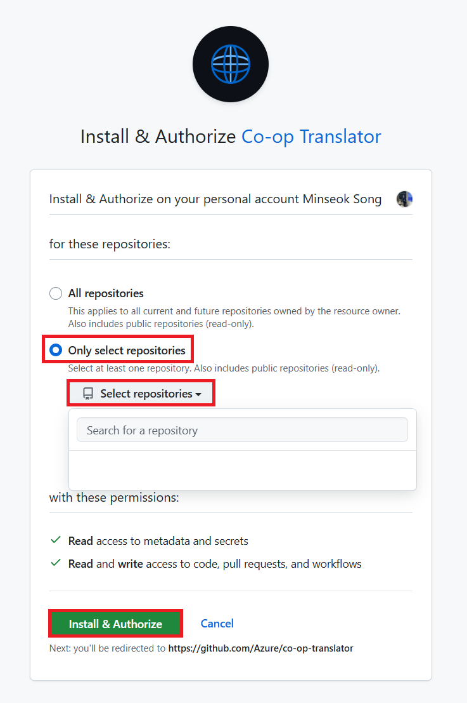

<!--
CO_OP_TRANSLATOR_METADATA:
{
  "original_hash": "9fac847815936ef6e6c8bfde6d191571",
  "translation_date": "2025-11-22T06:01:05+00:00",
  "source_file": "getting_started/github-actions-guide/github-actions-guide-org.md",
  "language_code": "te"
}
-->
# Co-op Translator GitHub Action ఉపయోగించడం (సంస్థల గైడ్)

**లక్ష్య ప్రేక్షకులు:** ఈ గైడ్ **Microsoft లోపలి వినియోగదారులు** లేదా **Co-op Translator GitHub App కోసం అవసరమైన క్రెడెన్షియల్స్‌కి యాక్సెస్ ఉన్న టీమ్స్** లేదా తమ స్వంత GitHub App సృష్టించగలిగిన వారికి ఉద్దేశించబడింది.

మీ రిపోజిటరీ డాక్యుమెంటేషన్‌ను సులభంగా అనువదించడానికి Co-op Translator GitHub Action ఉపయోగించండి. ఈ గైడ్, మీ సోర్స్ Markdown ఫైళ్ళు లేదా చిత్రాలు మారినప్పుడు, అనువాదాలతో అప్డేట్ చేసిన Pull Requests‌ను ఆటోమేటిక్‌గా సృష్టించడానికి Action సెటప్ చేయడం ఎలా అనేది వివరిస్తుంది.

> [!IMPORTANT]
> 
> **సరైన గైడ్ ఎంపిక:**
>
> ఈ గైడ్ **GitHub App ID మరియు Private Key** ఉపయోగించి సెటప్ వివరాలను అందిస్తుంది. మీరు సాధారణ `GITHUB_TOKEN` అనుమతులు పరిమితం చేయబడినప్పుడు ఈ "సంస్థల గైడ్" పద్ధతి అవసరం అవుతుంది: **`GITHUB_TOKEN` అనుమతులు పరిమితం చేయబడినవి:** మీ సంస్థ లేదా రిపోజిటరీ సెట్టింగ్స్, సాధారణ `GITHUB_TOKEN`కి ఇచ్చే డిఫాల్ట్ అనుమతులను పరిమితం చేస్తాయి. ముఖ్యంగా, `GITHUB_TOKEN` అవసరమైన `write` అనుమతులు (ఉదా: `contents: write` లేదా `pull-requests: write`) అనుమతించబడని సందర్భంలో, [Public Setup Guide](./github-actions-guide-public.md)లోని వర్క్‌ఫ్లో అనుమతుల కొరత కారణంగా విఫలమవుతుంది. ప్రత్యేకంగా అనుమతులు ఇచ్చిన GitHub App ఉపయోగించడం ఈ పరిమితిని అధిగమిస్తుంది.
>
> **మీకు పైవన్నీ వర్తించకపోతే:**
>
> మీ రిపోజిటరీలో సాధారణ `GITHUB_TOKEN`కి సరిపడిన అనుమతులు ఉంటే (ఉదా: మీరు సంస్థ పరిమితుల వల్ల అడ్డంకి పడకపోతే), **[Public Setup Guide using GITHUB_TOKEN](./github-actions-guide-public.md)** ఉపయోగించండి. పబ్లిక్ గైడ్ App IDs లేదా Private Keys పొందడం లేదా నిర్వహించడం అవసరం లేకుండా, కేవలం `GITHUB_TOKEN` మరియు రిపోజిటరీ అనుమతులపై ఆధారపడుతుంది.

## ముందస్తు అవసరాలు

GitHub Actionను సెటప్ చేయడానికి ముందు, అవసరమైన AI సర్వీస్ క్రెడెన్షియల్స్ సిద్ధంగా ఉండాలి.

**1. అవసరం: AI భాషా మోడల్ క్రెడెన్షియల్స్**
కనీసం ఒక మద్దతు ఉన్న భాషా మోడల్ కోసం క్రెడెన్షియల్స్ అవసరం:

- **Azure OpenAI**: Endpoint, API Key, Model/Deployment Names, API Version అవసరం.
- **OpenAI**: API Key అవసరం, (ఐచ్ఛికం: Org ID, Base URL, Model ID).
- వివరాలకు [Supported Models and Services](../../../../README.md) చూడండి.
- సెటప్ గైడ్: [Set up Azure OpenAI](../set-up-resources/set-up-azure-openai.md).

**2. ఐచ్ఛికం: కంప్యూటర్ విజన్ క్రెడెన్షియల్స్ (చిత్ర అనువాదం కోసం)**

- చిత్రాలలోని టెక్స్ట్‌ను అనువదించాల్సిన అవసరం ఉన్నప్పుడు మాత్రమే అవసరం.
- **Azure Computer Vision**: Endpoint మరియు Subscription Key అవసరం.
- అందుబాటులో లేకపోతే, Action [Markdown-only mode](../markdown-only-mode.md)కి డిఫాల్ట్ అవుతుంది.
- సెటప్ గైడ్: [Set up Azure Computer Vision](../set-up-resources/set-up-azure-computer-vision.md).

## సెటప్ మరియు కాన్ఫిగరేషన్

మీ రిపోజిటరీలో Co-op Translator GitHub Actionను సెటప్ చేయడానికి ఈ దశలను అనుసరించండి:

### దశ 1: GitHub App ఆథెంటికేషన్ ఇన్‌స్టాల్ మరియు కాన్ఫిగర్ చేయండి

వర్క్‌ఫ్లో మీ రిపోజిటరీతో సురక్షితంగా ఇంటరాక్ట్ చేయడానికి (ఉదా: Pull Requests సృష్టించడం) GitHub App ఆథెంటికేషన్‌ను ఉపయోగిస్తుంది. ఒక ఎంపికను ఎంచుకోండి:

#### **ఎంపిక A: ప్రీ-బిల్ట్ Co-op Translator GitHub App ఇన్‌స్టాల్ చేయండి (Microsoft లోపలి వినియోగం కోసం)**

1. [Co-op Translator GitHub App](https://github.com/apps/co-op-translator) పేజీకి వెళ్లండి.

1. **Install** ఎంచుకుని, మీ టార్గెట్ రిపోజిటరీ ఉన్న ఖాతా లేదా సంస్థను ఎంచుకోండి.

    

1. **Only select repositories** ఎంచుకుని, మీ టార్గెట్ రిపోజిటరీ (ఉదా: `PhiCookBook`) ఎంచుకోండి. **Install** క్లిక్ చేయండి. మీరు ఆథెంటికేట్ చేయవలసి ఉండవచ్చు.

    

1. **App Credentials పొందండి (లోపలి ప్రక్రియ అవసరం):** వర్క్‌ఫ్లో Appగా ఆథెంటికేట్ చేయడానికి, Co-op Translator టీమ్ అందించే రెండు సమాచారం అవసరం:
  - **App ID:** Co-op Translator Appకు ప్రత్యేకమైన గుర్తింపు. App ID: `1164076`.
  - **Private Key:** `.pem` ప్రైవేట్ కీ ఫైల్ యొక్క **మొత్తం కంటెంట్**ను మెయింటైనర్ కాంటాక్ట్ నుండి పొందాలి. **ఈ కీని పాస్‌వర్డ్‌లా పరిగణించి సురక్షితంగా ఉంచండి.**

1. దశ 2కి కొనసాగండి.

#### **ఎంపిక B: మీ స్వంత కస్టమ్ GitHub App ఉపయోగించండి**

- మీరు కోరుకుంటే, మీ స్వంత GitHub Appను సృష్టించి కాన్ఫిగర్ చేయవచ్చు. ఇది Contents మరియు Pull requestsకి Read & write యాక్సెస్ కలిగి ఉండాలి. దీని App ID మరియు జనరేట్ చేసిన Private Key అవసరం.

### దశ 2: రిపోజిటరీ సీక్రెట్స్‌ను కాన్ఫిగర్ చేయండి

GitHub App క్రెడెన్షియల్స్ మరియు మీ AI సర్వీస్ క్రెడెన్షియల్స్‌ను రిపోజిటరీ సెట్టింగ్స్‌లో ఎన్క్రిప్టెడ్ సీక్రెట్స్‌గా జోడించాలి.

1. మీ టార్గెట్ GitHub రిపోజిటరీకి (ఉదా: `PhiCookBook`) వెళ్లండి.

1. **Settings** > **Secrets and variables** > **Actions**కి వెళ్లండి.

1. **Repository secrets** కింద, క్రింద పేర్కొన్న ప్రతి సీక్రెట్ కోసం **New repository secret** క్లిక్ చేయండి.

   

**GitHub App ఆథెంటికేషన్ కోసం అవసరమైన సీక్రెట్స్:**

| సీక్రెట్ పేరు          | వివరణ                                      | విలువ మూలం                                     |
| :------------------- | :----------------------------------------------- | :----------------------------------------------- |
| `GH_APP_ID`          | GitHub App యొక్క App ID (దశ 1 నుండి).      | GitHub App సెట్టింగ్స్                              |
| `GH_APP_PRIVATE_KEY` | డౌన్‌లోడ్ చేసిన `.pem` ఫైల్ యొక్క **మొత్తం కంటెంట్**. | `.pem` ఫైల్ (దశ 1 నుండి)                      |

**AI సర్వీస్ సీక్రెట్స్ (మీ ముందస్తు అవసరాల ఆధారంగా వర్తించే అన్ని సీక్రెట్స్ జోడించండి):**

| సీక్రెట్ పేరు                         | వివరణ                               | విలువ మూలం                     |
| :---------------------------------- | :---------------------------------------- | :------------------------------- |
| `AZURE_AI_SERVICE_API_KEY`            | Azure AI Service (Computer Vision) కోసం Key  | Azure AI Foundry                    |
| `AZURE_AI_SERVICE_ENDPOINT`         | Azure AI Service (Computer Vision) కోసం Endpoint | Azure AI Foundry                     |
| `AZURE_OPENAI_API_KEY`              | Azure OpenAI సర్వీస్ కోసం Key              | Azure AI Foundry                     |
| `AZURE_OPENAI_ENDPOINT`             | Azure OpenAI సర్వీస్ కోసం Endpoint         | Azure AI Foundry                     |
| `AZURE_OPENAI_MODEL_NAME`           | మీ Azure OpenAI మోడల్ పేరు              | Azure AI Foundry                     |
| `AZURE_OPENAI_CHAT_DEPLOYMENT_NAME` | మీ Azure OpenAI Deployment పేరు         | Azure AI Foundry                     |
| `AZURE_OPENAI_API_VERSION`          | Azure OpenAI కోసం API వెర్షన్              | Azure AI Foundry                     |
| `OPENAI_API_KEY`                    | OpenAI కోసం API Key                        | OpenAI Platform                  |
| `OPENAI_ORG_ID`                     | OpenAI సంస్థ ID                    | OpenAI Platform                  |
| `OPENAI_CHAT_MODEL_ID`              | ప్రత్యేక OpenAI మోడల్ ID                  | OpenAI Platform                    |
| `OPENAI_BASE_URL`                   | కస్టమ్ OpenAI API Base URL                | OpenAI Platform                    |


### దశ 3: వర్క్‌ఫ్లో ఫైల్ సృష్టించండి

చివరగా, ఆటోమేటెడ్ వర్క్‌ఫ్లోను నిర్వచించే YAML ఫైల్‌ను సృష్టించండి.

1. మీ రిపోజిటరీ రూట్ డైరెక్టరీలో `.github/workflows/` డైరెక్టరీ లేకపోతే, దాన్ని సృష్టించండి.

1. `.github/workflows/` లో, `co-op-translator.yml` అనే ఫైల్‌ను సృష్టించండి.

1. `co-op-translator.yml`లో క్రింది కంటెంట్‌ను పేస్ట్ చేయండి.

```
name: Co-op Translator

on:
  push:
    branches:
      - main

jobs:
  co-op-translator:
    runs-on: ubuntu-latest

    permissions:
      contents: write
      pull-requests: write

    steps:
      - name: Checkout repository
        uses: actions/checkout@v4
        with:
          fetch-depth: 0

      - name: Set up Python
        uses: actions/setup-python@v4
        with:
          python-version: '3.10'

      - name: Install Co-op Translator
        run: |
          python -m pip install --upgrade pip
          pip install co-op-translator

      - name: Run Co-op Translator
        env:
          PYTHONIOENCODING: utf-8
          # Azure AI Service Credentials
          AZURE_AI_SERVICE_API_KEY: ${{ secrets.AZURE_AI_SERVICE_API_KEY }}
          AZURE_AI_SERVICE_ENDPOINT: ${{ secrets.AZURE_AI_SERVICE_ENDPOINT }}

          # Azure OpenAI Credentials
          AZURE_OPENAI_API_KEY: ${{ secrets.AZURE_OPENAI_API_KEY }}
          AZURE_OPENAI_ENDPOINT: ${{ secrets.AZURE_OPENAI_ENDPOINT }}
          AZURE_OPENAI_MODEL_NAME: ${{ secrets.AZURE_OPENAI_MODEL_NAME }}
          AZURE_OPENAI_CHAT_DEPLOYMENT_NAME: ${{ secrets.AZURE_OPENAI_CHAT_DEPLOYMENT_NAME }}
          AZURE_OPENAI_API_VERSION: ${{ secrets.AZURE_OPENAI_API_VERSION }}

          # OpenAI Credentials
          OPENAI_API_KEY: ${{ secrets.OPENAI_API_KEY }}
          OPENAI_ORG_ID: ${{ secrets.OPENAI_ORG_ID }}
          OPENAI_CHAT_MODEL_ID: ${{ secrets.OPENAI_CHAT_MODEL_ID }}
          OPENAI_BASE_URL: ${{ secrets.OPENAI_BASE_URL }}
        run: |
          # =====================================================================
          # IMPORTANT: Set your target languages here (REQUIRED CONFIGURATION)
          # =====================================================================
          # Example: Translate to Spanish, French, German. Add -y to auto-confirm.
          translate -l "es fr de" -y  # <--- MODIFY THIS LINE with your desired languages

      - name: Authenticate GitHub App
        id: generate_token
        uses: tibdex/github-app-token@v1
        with:
          app_id: ${{ secrets.GH_APP_ID }}
          private_key: ${{ secrets.GH_APP_PRIVATE_KEY }}

      - name: Create Pull Request with translations
        uses: peter-evans/create-pull-request@v5
        with:
          token: ${{ steps.generate_token.outputs.token }}
          commit-message: "🌐 Update translations via Co-op Translator"
          title: "🌐 Update translations via Co-op Translator"
          body: |
            This PR updates translations for recent changes to the main branch.

            ### 📋 Changes included
            - Translated contents are available in the `translations/` directory
            - Translated images are available in the `translated_images/` directory

            ---
            🌐 Automatically generated by the [Co-op Translator](https://github.com/Azure/co-op-translator) GitHub Action.
          branch: update-translations
          base: main
          labels: translation, automated-pr
          delete-branch: true
          add-paths: |
            translations/
            translated_images/

```

4.  **వర్క్‌ఫ్లోను అనుకూలీకరించండి:**
  - **[!IMPORTANT] టార్గెట్ భాషలు:** `Run Co-op Translator` దశలో, మీరు **`translate -l "..." -y` కమాండ్‌లో భాషా కోడ్ల జాబితాను** మీ ప్రాజెక్ట్ అవసరాలకు అనుగుణంగా సమీక్షించి మార్చాలి. ఉదాహరణ జాబితా (`ar de es...`)ను భర్తీ చేయాలి లేదా సవరించాలి.
  - **ట్రిగ్గర్ (`on:`):** ప్రస్తుత ట్రిగ్గర్ `main`కి ప్రతి pushపై నడుస్తుంది. పెద్ద రిపోజిటరీల కోసం, వర్క్‌ఫ్లోను కేవలం సంబంధిత ఫైళ్ళు (ఉదా: సోర్స్ డాక్యుమెంటేషన్) మారినప్పుడు మాత్రమే నడపడానికి `paths:` ఫిల్టర్ జోడించడం (YAMLలో వ్యాఖ్యానించిన ఉదాహరణ చూడండి) runner నిమిషాలను ఆదా చేస్తుంది.
  - **PR వివరాలు:** `Create Pull Request` దశలో `commit-message`, `title`, `body`, `branch` పేరు, మరియు `labels`ను అవసరమైతే అనుకూలీకరించండి.

## క్రెడెన్షియల్ నిర్వహణ మరియు పునరుద్ధరణ

- **భద్రత:** సున్నితమైన క్రెడెన్షియల్స్ (API keys, private keys) ఎల్లప్పుడూ GitHub Actions సీక్రెట్స్‌గా నిల్వ చేయండి. వాటిని మీ వర్క్‌ఫ్లో ఫైల్ లేదా రిపోజిటరీ కోడ్‌లో ఎప్పుడూ ప్రదర్శించవద్దు.
- **[!IMPORTANT] కీ పునరుద్ధరణ (Microsoft లోపలి వినియోగదారులు):** Microsoftలో ఉపయోగించే Azure OpenAI కీకి తప్పనిసరి పునరుద్ధరణ విధానం ఉండవచ్చు (ఉదా: ప్రతి 5 నెలలకొకసారి). వర్క్‌ఫ్లో వైఫల్యాలను నివారించడానికి, GitHub సీక్రెట్స్ (`AZURE_OPENAI_...` keys) **అవి గడువు ముగియడానికి ముందు** అప్డేట్ చేయడం నిర్ధారించండి.

## వర్క్‌ఫ్లో నడపడం

> [!WARNING]  
> **GitHub-hosted Runner సమయ పరిమితి:**  
> `ubuntu-latest` వంటి GitHub-hosted runnersకు **గరిష్ట అమలు సమయ పరిమితి 6 గంటలు** ఉంటుంది.  
> పెద్ద డాక్యుమెంటేషన్ రిపోజిటరీల కోసం, అనువాద ప్రక్రియ 6 గంటలకంటే ఎక్కువ సమయం తీసుకుంటే, వర్క్‌ఫ్లో ఆటోమేటిక్‌గా నిలిపివేయబడుతుంది.  
> దీన్ని నివారించడానికి, పరిగణించండి:  
> - **self-hosted runner** ఉపయోగించడం (సమయ పరిమితి లేదు)  
> - ప్రతి రన్‌కు టార్గెట్ భాషల సంఖ్యను తగ్గించడం

`co-op-translator.yml` ఫైల్ మీ main బ్రాంచ్‌లో (లేదా `on:` ట్రిగ్గర్‌లో పేర్కొన్న బ్రాంచ్‌లో) విలీనం చేయబడిన తర్వాత, ఆ బ్రాంచ్‌కు పుష్ చేసినప్పుడు (మరియు `paths` ఫిల్టర్, కాన్ఫిగర్ చేసినట్లయితే, సరిపోతే) వర్క్‌ఫ్లో ఆటోమేటిక్‌గా నడుస్తుంది.

అనువాదాలు సృష్టించబడితే లేదా అప్డేట్ చేయబడితే, Action మార్పులతో Pull Requestను ఆటోమేటిక్‌గా సృష్టిస్తుంది, ఇది మీ సమీక్ష మరియు విలీనం కోసం సిద్ధంగా ఉంటుంది.

---

<!-- CO-OP TRANSLATOR DISCLAIMER START -->
**అస్వీకరణ**:  
ఈ పత్రం AI అనువాద సేవ [Co-op Translator](https://github.com/Azure/co-op-translator) ఉపయోగించి అనువదించబడింది. మేము ఖచ్చితత్వానికి ప్రయత్నిస్తున్నప్పటికీ, ఆటోమేటెడ్ అనువాదాలు తప్పులు లేదా అసమగ్రతలను కలిగి ఉండవచ్చు. దాని స్వదేశ భాషలో ఉన్న అసలు పత్రాన్ని అధికారం కలిగిన మూలంగా పరిగణించాలి. కీలకమైన సమాచారం కోసం, ప్రొఫెషనల్ మానవ అనువాదాన్ని సిఫారసు చేస్తాము. ఈ అనువాదాన్ని ఉపయోగించడం వల్ల కలిగే ఏవైనా అపార్థాలు లేదా తప్పుదారులు కోసం మేము బాధ్యత వహించము.
<!-- CO-OP TRANSLATOR DISCLAIMER END -->