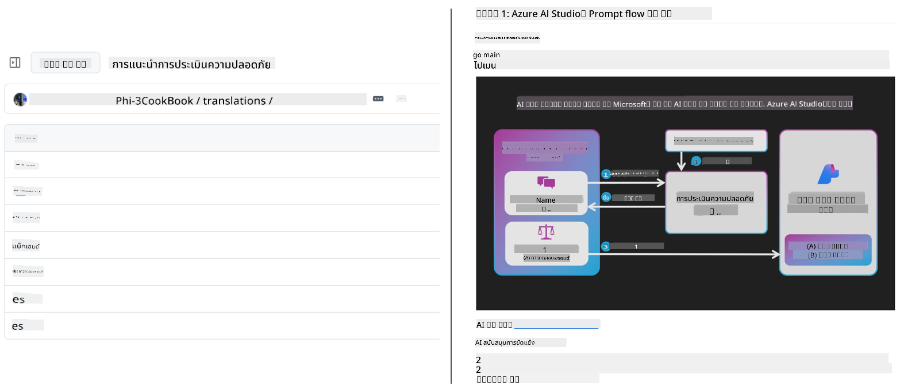
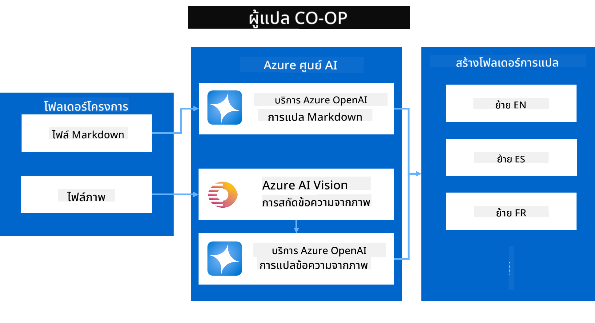
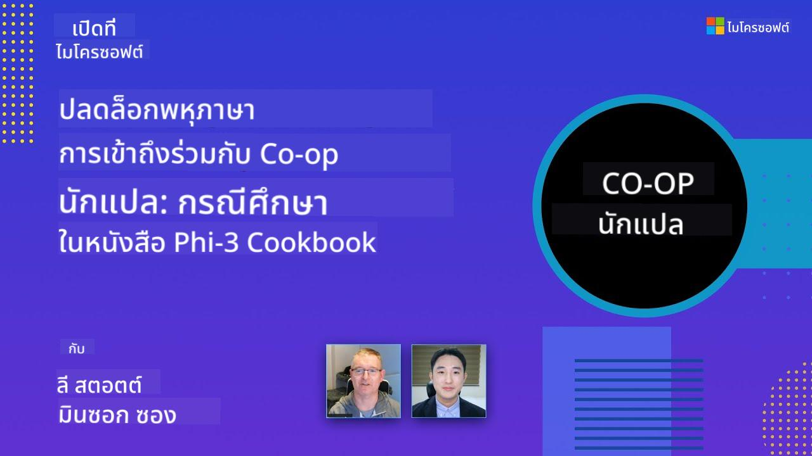

<!--
CO_OP_TRANSLATOR_METADATA:
{
  "original_hash": "044724537b57868117aadae8e7728c7c",
  "translation_date": "2025-06-12T10:29:33+00:00",
  "source_file": "README.md",
  "language_code": "th"
}
-->


# Co-op Translator: แปลงานเอกสารการศึกษาของคุณโดยอัตโนมัติอย่างง่ายดาย

_แปลงานเอกสารของคุณเป็นหลายภาษาอย่างง่ายดายเพื่อเข้าถึงผู้ชมทั่วโลก_

[](https://pypi.org/project/co-op-translator/)
[](https://github.com/azure/co-op-translator/blob/main/LICENSE)
[](https://pepy.tech/project/co-op-translator)
[](https://pepy.tech/project/co-op-translator)
[](https://github.com/psf/black)

[](https://GitHub.com/azure/co-op-translator/graphs/contributors/)
[](https://GitHub.com/azure/co-op-translator/issues/)
[](https://GitHub.com/azure/co-op-translator/pulls/)
[](http://makeapullrequest.com)

### การสนับสนุนภาษาขับเคลื่อนโดย Co-op Translator
[ฝรั่งเศส](../fr/README.md) | [สเปน](../es/README.md) | [เยอรมัน](../de/README.md) | [รัสเซีย](../ru/README.md) | [อาหรับ](../ar/README.md) | [เปอร์เซีย (ฟาร์ซี)](../fa/README.md) | [อูรดู](../ur/README.md) | [จีน (ตัวย่อ)](../zh/README.md) | [จีน (ตัวเต็ม, มาเก๊า)](../mo/README.md) | [จีน (ตัวเต็ม, ฮ่องกง)](../hk/README.md) | [จีน (ตัวเต็ม, ไต้หวัน)](../tw/README.md) | [ญี่ปุ่น](../ja/README.md) | [เกาหลี](../ko/README.md) | [ฮินดี](../hi/README.md) | [เบงกาลี](../bn/README.md) | [มราฐี](../mr/README.md) | [เนปาลี](../ne/README.md) | [ปัญจาบ (กุรมุขี)](../pa/README.md) | [โปรตุเกส (โปรตุเกส)](../pt/README.md) | [โปรตุเกส (บราซิล)](../br/README.md) | [อิตาลี](../it/README.md) | [โปแลนด์](../pl/README.md) | [ตุรกี](../tr/README.md) | [กรีก](../el/README.md) | [ไทย](./README.md) | [สวีเดน](../sv/README.md) | [เดนมาร์ก](../da/README.md) | [นอร์เวย์](../no/README.md) | [ฟินแลนด์](../fi/README.md) | [ดัตช์](../nl/README.md) | [ฮีบรู](../he/README.md) | [เวียดนาม](../vi/README.md) | [อินโดนีเซีย](../id/README.md) | [มาเลย์](../ms/README.md) | [ตากาล็อก (ฟิลิปปินส์)](../tl/README.md) | [สวาฮิลี](../sw/README.md) | [ฮังการี](../hu/README.md) | [เช็ก](../cs/README.md) | [สโลวัก](../sk/README.md) | [โรมาเนีย](../ro/README.md) | [บัลแกเรีย](../bg/README.md) | [เซอร์เบีย (ซีริลลิก)](../sr/README.md) | [โครเอเชีย](../hr/README.md) | [สโลวีเนีย](../sl/README.md) | [ยูเครน](../uk/README.md) | [พม่า (เมียนมา)](../my/README.md)
> [!NOTE]
> นี่คือคำแปลปัจจุบันของเนื้อหาในที่เก็บนี้ สำหรับรายการภาษาที่รองรับโดย Co-op Translator อย่างครบถ้วน โปรดดูที่ส่วน [Language Support](../..)

[](https://GitHub.com/azure/co-op-translator/watchers/)
[](https://GitHub.com/azure/co-op-translator/network/)
[](https://GitHub.com/azure/co-op-translator/stargazers/)

[](https://discord.com/invite/ByRwuEEgH4)

[](https://codespaces.new/azure/co-op-translator)
[](https://vscode.dev/redirect?url=vscode://ms-vscode-remote.remote-containers/cloneInVolume?url=https://github.com/azure/co-op-translator)

## ภาพรวม: ปรับกระบวนการแปลเนื้อหาการศึกษาให้รวดเร็วขึ้น

อุปสรรคทางภาษาเป็นตัวขัดขวางสำคัญที่ทำให้การเข้าถึงทรัพยากรการศึกษาที่มีคุณค่าและความรู้ทางเทคนิคสำหรับผู้เรียนและนักพัฒนาทั่วโลกเป็นไปได้ยาก ซึ่งจำกัดการมีส่วนร่วมและชะลอความก้าวหน้าของนวัตกรรมและการเรียนรู้ในระดับโลก

**Co-op Translator** ถูกสร้างขึ้นเพื่อตอบโจทย์ปัญหาการแปลด้วยมือที่ไม่ประสิทธิภาพสำหรับชุดการศึกษาขนาดใหญ่ของ Microsoft (เช่น คู่มือ "For Beginners") และพัฒนามาเป็นเครื่องมือที่ใช้งานง่ายและทรงพลัง เพื่อช่วยทำลายอุปสรรคเหล่านี้สำหรับทุกคน ด้วยการให้บริการแปลคุณภาพสูงแบบอัตโนมัติผ่าน CLI และ GitHub Actions Co-op Translator ช่วยให้ครู นักเรียน นักวิจัย และนักพัฒนาทั่วโลกสามารถแบ่งปันและเข้าถึงความรู้ได้โดยไม่มีข้อจำกัดด้านภาษา

ดูวิธีที่ Co-op Translator จัดระเบียบเนื้อหาการศึกษาที่แปลแล้ว:



ไฟล์ Markdown และข้อความในภาพจะถูกแปลโดยอัตโนมัติและจัดเก็บอย่างเป็นระเบียบในโฟลเดอร์แยกตามภาษา

**เปิดประตูสู่การเข้าถึงเนื้อหาการศึกษาของคุณทั่วโลกด้วย Co-op Translator วันนี้!**

## สนับสนุนการเข้าถึงทั่วโลกสำหรับแหล่งเรียนรู้ของ Microsoft

Co-op Translator ช่วยเชื่อมช่องว่างทางภาษาในโครงการการศึกษาหลักของ Microsoft โดยทำงานแปลอัตโนมัติสำหรับที่เก็บข้อมูลที่ให้บริการชุมชนนักพัฒนาทั่วโลก ตัวอย่างโครงการที่ใช้ Co-op Translator ได้แก่:

[](https://github.com/microsoft/Generative-AI-for-beginners)
[](https://github.com/microsoft/ML-For-Beginners)
[](https://github.com/microsoft/AI-For-Beginners)
[](https://github.com/microsoft/ai-agents-for-beginners)
[](https://github.com/microsoft/PhiCookBook)
[](https://github.com/microsoft/Generative-AI-for-beginners-dotnet)

## คุณสมบัติหลัก

- **แปลอัตโนมัติ**: แปลข้อความเป็นหลายภาษาได้อย่างง่ายดาย
- **ผสานรวมกับ GitHub Actions**: ทำให้การแปลเป็นส่วนหนึ่งของกระบวนการ CI/CD ของคุณโดยอัตโนมัติ
- **รักษารูปแบบ Markdown**: คงรูปแบบ Markdown ที่ถูกต้องขณะทำการแปล
- **แปลข้อความในภาพ**: ดึงและแปลข้อความที่อยู่ในภาพ
- **เทคโนโลยี LLM ขั้นสูง**: ใช้โมเดลภาษาระดับสูงเพื่อให้ได้การแปลคุณภาพสูง
- **ผสานรวมง่าย**: เชื่อมต่อกับโปรเจกต์ของคุณได้อย่างราบรื่น
- **ทำให้การทำ Localization ง่ายขึ้น**: ปรับกระบวนการแปลโปรเจกต์สำหรับตลาดสากลให้สะดวกขึ้น

## วิธีการทำงาน



Co-op Translator จะนำไฟล์ Markdown และภาพจากโฟลเดอร์โปรเจกต์ของคุณมาแปรรูปดังนี้:

1. **ดึงข้อความ**: ดึงข้อความจากไฟล์ Markdown และถ้าตั้งค่าไว้ (เช่น ใช้ Azure AI Vision) จะดึงข้อความที่ฝังอยู่ในภาพด้วย
1. **แปลด้วย AI**: ส่งข้อความที่ดึงมาให้โมเดล LLM ที่ตั้งค่าไว้ (Azure OpenAI, OpenAI ฯลฯ) เพื่อแปล
1. **บันทึกผลลัพธ์**: บันทึกไฟล์ Markdown และภาพที่แปลแล้วลงในโฟลเดอร์แยกตามภาษา พร้อมรักษารูปแบบต้นฉบับไว้

## เริ่มต้นใช้งาน

เริ่มใช้งานได้อย่างรวดเร็วด้วย CLI หรือตั้งค่าอัตโนมัติเต็มรูปแบบด้วย GitHub Actions เลือกวิธีที่เหมาะกับกระบวนการทำงานของคุณ:

1. **Command Line (CLI)** - สำหรับการแปลครั้งเดียวหรือควบคุมด้วยตนเอง
2. **GitHub Actions** - สำหรับการแปลอัตโนมัติทุกครั้งที่มีการ push

> [!NOTE]
> แม้บทแนะนำนี้จะเน้นที่ Azure resources คุณสามารถใช้โมเดลภาษาที่รองรับอื่น ๆ ได้

### Language Support

Co-op Translator รองรับภาษาหลากหลายเพื่อช่วยให้คุณเข้าถึงผู้ชมทั่วโลก นี่คือสิ่งที่ควรรู้:

#### อ้างอิงด่วน

| Language | Code | Language | Code | Language | Code |
|----------|------|----------|------|----------|------|
| Arabic | ar | Bengali | bn | Bulgarian | bg |
| Burmese (Myanmar) | my | Chinese (Simplified) | zh | Chinese (Traditional, HK) | hk |
| Chinese (Traditional, Macau) | mo | Chinese (Traditional, TW) | tw | Croatian | hr |
| Czech | cs | Danish | da | Dutch | nl |
| Finnish | fi | French | fr | German | de |
| Greek | el | Hebrew | he | Hindi | hi |
| Hungarian | hu | Indonesian | id | Italian | it |
| Japanese | ja | Korean | ko | Malay | ms |
| Marathi | mr | Nepali | ne | Norwegian | no |
| Persian (Farsi) | fa | Polish | pl | Portuguese (Brazil) | br |
| Portuguese (Portugal) | pt | Punjabi (Gurmukhi) | pa | Romanian | ro |
| Russian | ru | Serbian (Cyrillic) | sr | Slovak | sk |
| Slovenian | sl | Spanish | es | Swahili | sw |
| Swedish | sv | Tagalog (Filipino) | tl | Thai | th |
| Turkish | tr | Ukrainian | uk | Urdu | ur |
| Vietnamese | vi | — | — | — | — |

#### การใช้รหัสภาษา

เมื่อใช้ Co-op Translator คุณจะต้องระบุภาษาด้วยรหัสของภาษา เช่น:

```bash
# Translate to French, Spanish, and German
translate -l "fr es de"

# Translate to Chinese (Simplified) and Japanese
translate -l "zh ja"
```

> [!NOTE]
> สำหรับข้อมูลทางเทคนิคโดยละเอียดเกี่ยวกับการรองรับภาษา รวมถึง:
>
> - สเปคฟอนต์สำหรับแต่ละภาษา
> - ปัญหาที่ทราบ
> - วิธีเพิ่มภาษาใหม่
>
> โปรดดูที่ [Supported Languages Documentation](./getting_started/supported-languages.md)

### โมเดลและบริการที่รองรับ

| ประเภท                | ชื่อ                          |
|-----------------------|-------------------------------|
| Language Model        |   |
| AI Vision             |  |

> [!NOTE]
> หากบริการ AI Vision ไม่พร้อมใช้งาน Co-op Translator จะเปลี่ยนไปใช้ [Markdown-only mode](./getting_started/markdown-only-mode.md)

### การตั้งค่าเริ่มต้น

ก่อนเริ่มต้น คุณต้องตั้งค่าทรัพยากรต่อไปนี้:

1. Language Model Resource (จำเป็น):
   - Azure OpenAI (แนะนำ) - ให้การแปลคุณภาพสูงและความน่าเชื่อถือระดับองค์กร
   - OpenAI - ตัวเลือกทางเลือกหากไม่มีสิทธิ์ใช้งาน Azure
   - สำหรับข้อมูลรายละเอียดเกี่ยวกับโมเดลที่รองรับ ดูที่ [Supported Models and Services](../..)

1. AI Vision Resource (ไม่บังคับ):
   - Azure AI Vision - ช่วยให้แปลข้อความในภาพได้
   - หากไม่ได้ตั้งค่า ตัวแปลจะใช้ [Markdown-only mode](./getting_started/markdown-only-mode.md) โดยอัตโนมัติ
   - แนะนำสำหรับโปรเจกต์ที่มีภาพที่ต้องแปลข้อความ

1. ขั้นตอนการตั้งค่า:
   - ทำตาม [Azure AI setup guide](./getting_started/set-up-azure-ai.md) สำหรับคำแนะนำอย่างละเอียด
   - สร้างไฟล์ `.env` พร้อมคีย์ API และ endpoints ของคุณ (ดูที่ส่วน [Quick Start](../..))
   - ตรวจสอบให้แน่ใจว่าคุณมีสิทธิ์และโควต้าเพียงพอสำหรับบริการที่เลือกใช้

### การเตรียมโปรเจกต์ก่อนแปล

ก่อนเริ่มแปล ให้ทำตามขั้นตอนเหล่านี้เพื่อเตรียมโปรเจกต์ของคุณ:

1. เตรียม README ของคุณ:
   - เพิ่มตารางแปลใน README.md เพื่อเชื่อมโยงไปยังเวอร์ชันที่แปลแล้ว
   - ตัวอย่างรูปแบบ:

     ```markdown

     ### 🌐 Multi-Language Support
     
     [French](../fr/README.md) | [Spanish](../es/README.md) | [German](../de/README.md) | [Russian](../ru/README.md) | [Arabic](../ar/README.md) | [Persian (Farsi)](../fa/README.md) | [Urdu](../ur/README.md) | [Chinese (Simplified)](../zh/README.md) | [Chinese (Traditional, Macau)](../mo/README.md) | [Chinese (Traditional, Hong Kong)](../hk/README.md) | [Chinese (Traditional, Taiwan)](../tw/README.md) | [Japanese](../ja/README.md) | [Korean](../ko/README.md) | [Hindi](../hi/README.md) | [Bengali](../bn/README.md) | [Marathi](../mr/README.md) | [Nepali](../ne/README.md) | [Punjabi (Gurmukhi)](../pa/README.md) | [Portuguese (Portugal)](../pt/README.md) | [Portuguese (Brazil)](../br/README.md) | [Italian](../it/README.md) | [Polish](../pl/README.md) | [Turkish](../tr/README.md) | [Greek](../el/README.md) | [Thai](./README.md) | [Swedish](../sv/README.md) | [Danish](../da/README.md) | [Norwegian](../no/README.md) | [Finnish](../fi/README.md) | [Dutch](../nl/README.md) | [Hebrew](../he/README.md) | [Vietnamese](../vi/README.md) | [Indonesian](../id/README.md) | [Malay](../ms/README.md) | [Tagalog (Filipino)](../tl/README.md) | [Swahili](../sw/README.md) | [Hungarian](../hu/README.md) | [Czech](../cs/README.md) | [Slovak](../sk/README.md) | [Romanian](../ro/README.md) | [Bulgarian](../bg/README.md) | [Serbian (Cyrillic)](../sr/README.md) | [Croatian](../hr/README.md) | [Slovenian](../sl/README.md) | [Ukrainian](../uk/README.md) | [Burmese (Myanmar)](../my/README.md) 
    
     ```

1. ลบการแปลที่มีอยู่ (ถ้าจำเป็น):
   - ลบโฟลเดอร์การแปลที่มีอยู่ (เช่น `translations/`)
   - ลบไฟล์แปลเก่า ๆ เพื่อเริ่มต้นใหม่
   - เพื่อป้องกันความขัดแย้งกับกระบวนการแปลใหม่

### เริ่มต้นอย่างรวดเร็ว: Command Line

สำหรับการเริ่มต้นอย่างรวดเร็วด้วยคำสั่ง CLI:

1. สร้าง virtual environment:

    ```bash
    python -m venv .venv
    ```

1. เปิดใช้งาน virtual environment:

    - บน Windows:

    ```bash
    .venv\scripts\activate
    ```

    - บน Linux/macOS:

    ```bash
    source .venv/bin/activate
    ```

1. ติดตั้งแพ็กเกจ:

    ```bash
    pip install co-op-translator
    ```

1. ตั้งค่าข้อมูลรับรอง:

    - สร้างไฟล์ `.env` file in your project's root directory.
    - Copy the contents from the [.env.template](../../.env.template) file into your new `.env` file.
    - Fill in the required API keys and endpoint information in your `.env` file.

1. Run Translation:
    - Navigate to your project's root directory in your terminal.
    - Execute the translate command, specifying target languages with the `-l` flag:

    ```bash
    translate -l "ko ja fr"
    ```

    _(แทนที่ `"ko ja fr"` with your desired space-separated language codes)_

### Detailed Usage Guides

Choose the approach that best fits your workflow:

#### 1. Using the Command Line (CLI)

- Best for: One-time translations, manual control, or integration into custom scripts.
- Requires: Local installation of Python and the `co-op-translator` package.
- Guide: [Command Line Guide](./getting_started/command-line-guide/command-line-guide.md)

#### 2. Using GitHub Actions (Automation)

- Best for: Automatically translating content whenever changes are pushed to your repository. Keeps translations consistently up-to-date.
- Requires: Setting up a workflow file (`.github/workflows`) ในที่เก็บของคุณ โดยไม่ต้องติดตั้งในเครื่อง
- คู่มือ:
  - [GitHub Actions Guide (Public Repositories & Standard Secrets)](./getting_started/github-actions-guide/github-actions-guide-public.md) - ใช้สำหรับที่เก็บสาธารณะหรือส่วนตัวส่วนใหญ่ที่ใช้ standard repository secrets
  - [GitHub Actions Guide (Microsoft Organization Repos & Org-Level Setups)](./getting_started/github-actions-guide/github-actions-guide-org.md) - ใช้คู่มือนี้ถ้าคุณทำงานในองค์กร GitHub ของ Microsoft หรือต้องการใช้ secrets หรือ runners ระดับองค์กร

### การแก้ไขปัญหาและเคล็ดลับ

- [Troubleshooting Guide](./getting_started/troubleshooting.md)

### แหล่งข้อมูลเพิ่มเติม

- [Command Reference](./getting_started/command-reference.md): คู่มือคำสั่งและตัวเลือกทั้งหมด
- [Supported Languages](./getting_started/supported-languages.md): รายการภาษาที่รองรับและวิธีเพิ่มภาษาใหม่
- [Markdown-Only Mode](./getting_started/markdown-only-mode.md): วิธีแปลเฉพาะข้อความโดยไม่แปลภาพ

## วิดีโอนำเสนอ

เรียนรู้เพิ่มเติมเกี่ยวกับ Co-op Translator ผ่านการนำเสนอของเรา _(คลิกที่ภาพด้านล่างเพื่อชมบน YouTube)_:

- **Open at Microsoft**: การแนะนำสั้น 18 นาที พร้อมคู่มือการใช้งาน Co-op Translator อย่างรวดเร็ว
[](https://www.youtube.com/watch?v=jX_swfH_KNU)

## สนับสนุนเราและส่งเสริมการเรียนรู้ระดับโลก

มาร่วมเปลี่ยนแปลงวิธีการแบ่งปันเนื้อหาการศึกษาทั่วโลกไปด้วยกัน! ให้ [Co-op Translator](https://github.com/azure/co-op-translator) ⭐ บน GitHub และสนับสนุนภารกิจของเราในการขจัดอุปสรรคด้านภาษาในการเรียนรู้และเทคโนโลยี ความสนใจและการมีส่วนร่วมของคุณมีผลกระทบอย่างมาก! ยินดีรับการส่งโค้ดและข้อเสนอแนะฟีเจอร์เสมอ

## การมีส่วนร่วม

โปรเจกต์นี้ยินดีต้อนรับการส่งโค้ดและข้อเสนอแนะ หากคุณสนใจมีส่วนร่วมกับ Azure Co-op Translator โปรดดูที่ [CONTRIBUTING.md](./CONTRIBUTING.md) เพื่อดูแนวทางการช่วยทำให้ Co-op Translator เข้าถึงได้ง่ายขึ้น

## ผู้ร่วมพัฒนา

[](https://github.com/Azure/co-op-translator/graphs/contributors)

## ระเบียบปฏิบัติ

โปรเจกต์นี้ได้นำ [Microsoft Open Source Code of Conduct](https://opensource.microsoft.com/codeofconduct/) มาใช้
สำหรับข้อมูลเพิ่มเติมดูที่ [Code of Conduct FAQ](https://opensource.microsoft.com/codeofconduct/faq/) หรือ
ติดต่อ [opencode@microsoft.com](mailto:opencode@microsoft.com) หากมีคำถามหรือข้อคิดเห็นเพิ่มเติม

## AI ที่รับผิดชอบ

Microsoft มุ่งมั่นช่วยให้ลูกค้าใช้ผลิตภัณฑ์ AI อย่างรับผิดชอบ แชร์บทเรียนของเรา และสร้างความไว้วางใจผ่านเครื่องมือต่างๆ เช่น Transparency Notes และ Impact Assessments ทรัพยากรเหล่านี้หลายส่วนสามารถพบได้ที่ [https://aka.ms/RAI](https://aka.ms/RAI)  
แนวทางของ Microsoft ในการใช้ AI อย่างรับผิดชอบยึดหลักตาม AI principles ของเรา ได้แก่ ความยุติธรรม ความน่าเชื่อถือและความปลอดภัย ความเป็นส่วนตัวและความมั่นคง ความครอบคลุม ความโปร่งใส และความรับผิดชอบ

โมเดลภาษาธรรมชาติ ภาพ และเสียงขนาดใหญ่ — เช่นที่ใช้ในตัวอย่างนี้ — อาจแสดงพฤติกรรมที่ไม่ยุติธรรม ไม่น่าเชื่อถือ หรือไม่เหมาะสม ซึ่งอาจก่อให้เกิดความเสียหายได้ โปรดดู [Azure OpenAI service Transparency note](https://learn.microsoft.com/legal/cognitive-services/openai/transparency-note?tabs=text) เพื่อรับทราบความเสี่ยงและข้อจำกัด

วิธีที่แนะนำในการลดความเสี่ยงเหล่านี้คือการใส่ระบบความปลอดภัยในสถาปัตยกรรมของคุณที่สามารถตรวจจับและป้องกันพฤติกรรมที่เป็นอันตรายได้ [Azure AI Content Safety](https://learn.microsoft.com/azure/ai-services/content-safety/overview) ให้ชั้นป้องกันอิสระที่สามารถตรวจจับเนื้อหาที่เป็นอันตรายทั้งที่สร้างโดยผู้ใช้และ AI ในแอปพลิเคชันและบริการต่างๆ Azure AI Content Safety มี API สำหรับข้อความและภาพที่ช่วยให้คุณตรวจจับเนื้อหาที่เป็นอันตราย เรายังมี Content Safety Studio แบบโต้ตอบที่ให้คุณดู สำรวจ และทดลองใช้โค้ดตัวอย่างสำหรับตรวจจับเนื้อหาที่เป็นอันตรายในรูปแบบต่างๆ เอกสาร [quickstart](https://learn.microsoft.com/azure/ai-services/content-safety/quickstart-text?tabs=visual-studio%2Clinux&pivots=programming-language-rest) ด้านล่างจะแนะนำวิธีส่งคำขอไปยังบริการนี้

อีกประเด็นที่ควรพิจารณาคือประสิทธิภาพโดยรวมของแอปพลิเคชัน ด้วยแอปที่มีหลายโหมดและหลายโมเดล เรามองว่าประสิทธิภาพหมายถึงระบบทำงานตามที่คุณและผู้ใช้คาดหวัง รวมถึงไม่สร้างผลลัพธ์ที่เป็นอันตราย การประเมินประสิทธิภาพของแอปโดยรวมจึงสำคัญ โดยใช้ [generation quality and risk and safety metrics](https://learn.microsoft.com/azure/ai-studio/concepts/evaluation-metrics-built-in)

คุณสามารถประเมินแอป AI ของคุณในสภาพแวดล้อมการพัฒนาด้วย [prompt flow SDK](https://microsoft.github.io/promptflow/index.html) ไม่ว่าจะเป็นชุดข้อมูลทดสอบหรือเป้าหมาย การสร้างผลลัพธ์ของแอป AI ของคุณจะถูกวัดเชิงปริมาณด้วยตัวประเมินในตัวหรือที่คุณกำหนดเอง เพื่อเริ่มต้นใช้ prompt flow sdk ในการประเมินระบบ สามารถดู [quickstart guide](https://learn.microsoft.com/azure/ai-studio/how-to/develop/flow-evaluate-sdk) หลังจากรันการประเมินแล้ว คุณสามารถ [ดูผลลัพธ์ใน Azure AI Studio](https://learn.microsoft.com/azure/ai-studio/how-to/evaluate-flow-results)

## เครื่องหมายการค้า

โปรเจกต์นี้อาจมีเครื่องหมายการค้าหรือโลโก้ของโปรเจกต์ ผลิตภัณฑ์ หรือบริการ การใช้เครื่องหมายการค้าหรือโลโก้ของ Microsoft อย่างถูกต้องต้องเป็นไปตาม
[Microsoft's Trademark & Brand Guidelines](https://www.microsoft.com/en-us/legal/intellectualproperty/trademarks/usage/general)  
การใช้เครื่องหมายการค้าหรือโลโก้ของ Microsoft ในเวอร์ชันที่ดัดแปลงของโปรเจกต์นี้ต้องไม่ก่อให้เกิดความสับสนหรือสื่อถึงการสนับสนุนจาก Microsoft  
การใช้เครื่องหมายการค้าหรือโลโก้ของบุคคลที่สามต้องเป็นไปตามนโยบายของบุคคลที่สามนั้นๆ

**ข้อจำกัดความรับผิดชอบ**:  
เอกสารนี้ได้รับการแปลโดยใช้บริการแปลภาษา AI [Co-op Translator](https://github.com/Azure/co-op-translator) แม้เราจะพยายามให้ความถูกต้องสูงสุด แต่โปรดทราบว่าการแปลอัตโนมัติอาจมีข้อผิดพลาดหรือความคลาดเคลื่อนได้ เอกสารต้นฉบับในภาษาต้นทางควรถูกพิจารณาเป็นแหล่งข้อมูลที่เชื่อถือได้ สำหรับข้อมูลที่มีความสำคัญ ควรใช้บริการแปลโดยผู้เชี่ยวชาญมนุษย์ เราไม่รับผิดชอบต่อความเข้าใจผิดหรือการตีความที่ผิดพลาดที่เกิดจากการใช้การแปลนี้