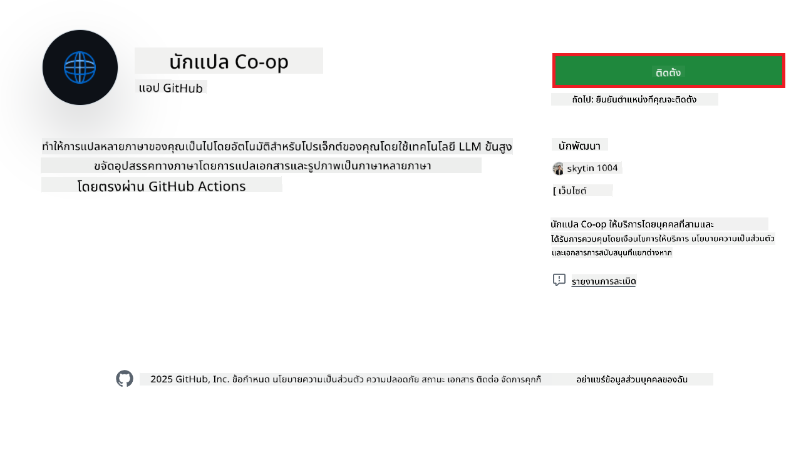
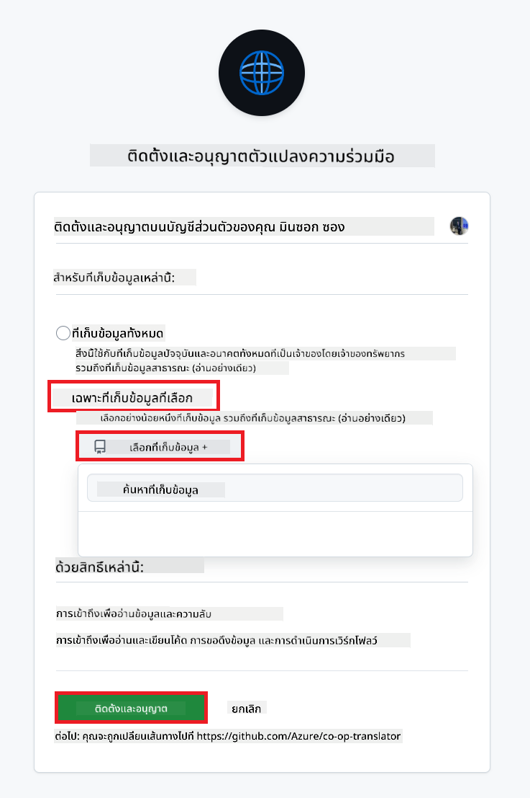
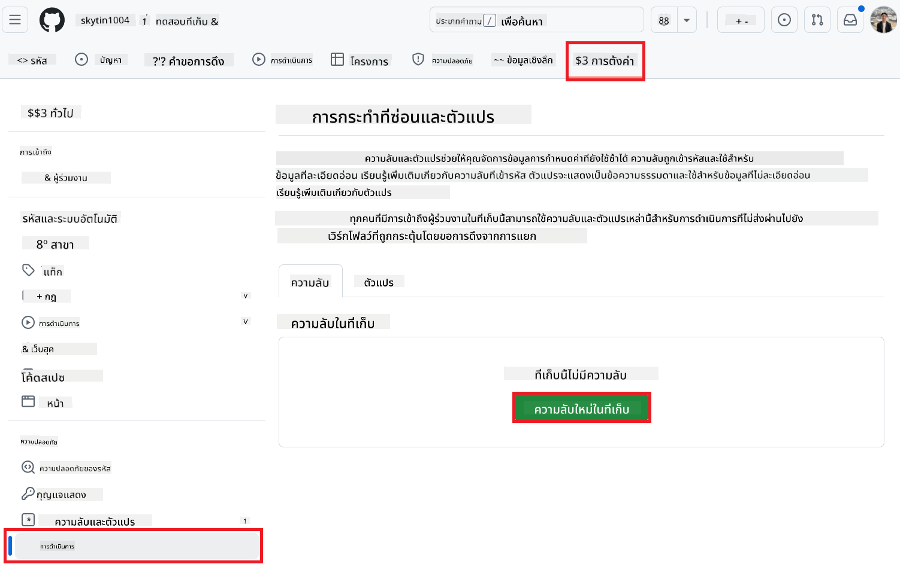
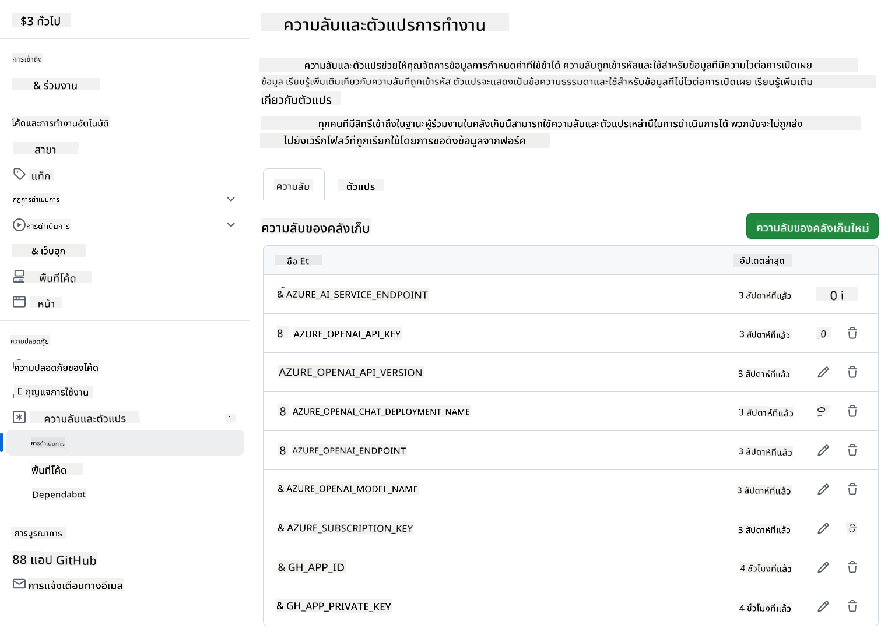

<!--
CO_OP_TRANSLATOR_METADATA:
{
  "original_hash": "c437820027c197f25fb2cbee95bae28c",
  "translation_date": "2025-06-12T19:10:35+00:00",
  "source_file": "getting_started/github-actions-guide/github-actions-guide-org.md",
  "language_code": "th"
}
-->
# การใช้ Co-op Translator GitHub Action (คู่มือสำหรับองค์กร)

**กลุ่มเป้าหมาย:** คู่มือนี้จัดทำขึ้นสำหรับ **ผู้ใช้งานภายใน Microsoft** หรือ **ทีมที่มีสิทธิ์เข้าถึงข้อมูลรับรองที่จำเป็นสำหรับแอป Co-op Translator GitHub ที่สร้างไว้ล่วงหน้า** หรือสามารถสร้างแอป GitHub แบบกำหนดเองได้

ทำให้งานแปลเอกสารในที่เก็บของคุณเป็นไปโดยอัตโนมัติอย่างง่ายดายด้วย Co-op Translator GitHub Action คู่มือนี้จะนำทางคุณผ่านขั้นตอนการตั้งค่าแอคชันเพื่อสร้าง pull request โดยอัตโนมัติพร้อมการแปลที่อัปเดตทุกครั้งที่ไฟล์ Markdown ต้นทางหรือรูปภาพของคุณมีการเปลี่ยนแปลง

> [!IMPORTANT]
> 
> **การเลือกคู่มือที่เหมาะสม:**
>
> คู่มือนี้อธิบายการตั้งค่าด้วย **GitHub App ID และ Private Key** โดยปกติคุณจะต้องใช้วิธี "คู่มือองค์กร" นี้หาก: **`GITHUB_TOKEN` สิทธิ์ถูกจำกัด:** การตั้งค่าองค์กรหรือที่เก็บของคุณจำกัดสิทธิ์เริ่มต้นที่มอบให้กับ `GITHUB_TOKEN` ปกติ โดยเฉพาะอย่างยิ่งหาก `GITHUB_TOKEN` ไม่ได้รับสิทธิ์ `write` ที่จำเป็น (เช่น `contents: write` หรือ `pull-requests: write`) เวิร์กโฟลว์ใน [คู่มือการตั้งค่าสาธารณะ](./github-actions-guide-public.md) จะล้มเหลวเนื่องจากสิทธิ์ไม่เพียงพอ การใช้ GitHub App ที่มีสิทธิ์เฉพาะเจาะจงช่วยข้ามข้อจำกัดนี้
>
> **ถ้าข้อข้างต้นไม่ตรงกับคุณ:**
>
> หาก `GITHUB_TOKEN` ปกติมีสิทธิ์เพียงพอในที่เก็บของคุณ (เช่น คุณไม่ได้ถูกบล็อกจากข้อจำกัดขององค์กร) กรุณาใช้ **[คู่มือการตั้งค่าสาธารณะโดยใช้ GITHUB_TOKEN](./github-actions-guide-public.md)** คู่มือสาธารณะไม่ต้องใช้การขอหรือจัดการ App ID หรือ Private Key และอาศัยเพียง `GITHUB_TOKEN` และสิทธิ์ของที่เก็บเท่านั้น

## สิ่งที่ต้องเตรียม

ก่อนตั้งค่า GitHub Action ให้แน่ใจว่าคุณมีข้อมูลรับรองบริการ AI ที่จำเป็นพร้อมใช้งาน

**1. จำเป็น: ข้อมูลรับรองโมเดลภาษาของ AI**  
คุณต้องมีข้อมูลรับรองสำหรับโมเดลภาษาอย่างน้อยหนึ่งตัวที่รองรับ:

- **Azure OpenAI:** ต้องใช้ Endpoint, API Key, ชื่อโมเดล/Deployment, และเวอร์ชัน API  
- **OpenAI:** ต้องใช้ API Key, (ไม่บังคับ: Org ID, Base URL, Model ID)  
- ดูรายละเอียดเพิ่มเติมได้ที่ [โมเดลและบริการที่รองรับ](../../../../README.md)  
- คู่มือการตั้งค่า: [ตั้งค่า Azure OpenAI](../set-up-resources/set-up-azure-openai.md)

**2. ไม่จำเป็น: ข้อมูลรับรอง Computer Vision (สำหรับแปลข้อความในรูปภาพ)**

- จำเป็นเฉพาะถ้าคุณต้องการแปลข้อความในรูปภาพเท่านั้น  
- **Azure Computer Vision:** ต้องใช้ Endpoint และ Subscription Key  
- หากไม่ได้ระบุ แอคชันจะทำงานใน [โหมด Markdown เท่านั้น](../markdown-only-mode.md)  
- คู่มือการตั้งค่า: [ตั้งค่า Azure Computer Vision](../set-up-resources/set-up-azure-computer-vision.md)

## การตั้งค่าและการกำหนดค่า

ทำตามขั้นตอนเหล่านี้เพื่อกำหนดค่า Co-op Translator GitHub Action ในที่เก็บของคุณ:

### ขั้นตอนที่ 1: ติดตั้งและกำหนดค่า GitHub App Authentication

เวิร์กโฟลว์นี้ใช้การตรวจสอบสิทธิ์ผ่าน GitHub App เพื่อโต้ตอบกับที่เก็บของคุณอย่างปลอดภัย (เช่น สร้าง pull request) ในฐานะตัวแทนของคุณ เลือกตัวเลือกหนึ่ง:

#### **ตัวเลือก A: ติดตั้ง Co-op Translator GitHub App ที่สร้างไว้ล่วงหน้า (สำหรับใช้งานภายใน Microsoft)**

1. ไปที่หน้า [Co-op Translator GitHub App](https://github.com/apps/co-op-translator)

1. เลือก **Install** และเลือกบัญชีหรือองค์กรที่มีที่เก็บเป้าหมายของคุณอยู่

    

1. เลือก **Only select repositories** แล้วเลือกที่เก็บเป้าหมายของคุณ (เช่น `PhiCookBook`) คลิก **Install** คุณอาจถูกขอให้ยืนยันตัวตน

    

1. **รับข้อมูลรับรองแอป (ต้องดำเนินการภายในองค์กร):** เพื่อให้เวิร์กโฟลว์ตรวจสอบสิทธิ์ในฐานะแอป คุณต้องมีข้อมูลสองส่วนที่ทีม Co-op Translator มอบให้:  
  - **App ID:** รหัสเฉพาะของแอป Co-op Translator รหัส App ID คือ: `1164076`  
  - **Private Key:** คุณต้องรับ **เนื้อหาทั้งหมด** ของไฟล์ `.pem` private key จากผู้ดูแล ติดต่อผู้ดูแลเพื่อขอรับข้อมูลนี้ **เก็บกุญแจนี้อย่างปลอดภัยเหมือนรหัสผ่าน**

1. ดำเนินการต่อไปยังขั้นตอนที่ 2

#### **ตัวเลือก B: ใช้ GitHub App แบบกำหนดเองของคุณเอง**

- หากต้องการ คุณสามารถสร้างและกำหนดค่า GitHub App ของคุณเอง ให้แน่ใจว่ามีสิทธิ์อ่านและเขียนใน Contents และ Pull requests คุณจะต้องใช้ App ID และ Private Key ที่สร้างขึ้น

### ขั้นตอนที่ 2: กำหนดค่า Secrets ในที่เก็บ

คุณต้องเพิ่มข้อมูลรับรอง GitHub App และข้อมูลรับรองบริการ AI เป็น secrets ที่เข้ารหัสในการตั้งค่าที่เก็บของคุณ

1. ไปที่ที่เก็บ GitHub เป้าหมายของคุณ (เช่น `PhiCookBook`)

1. ไปที่ **Settings** > **Secrets and variables** > **Actions**

1. ภายใต้ **Repository secrets** ให้คลิก **New repository secret** สำหรับแต่ละ secret ที่ระบุด้านล่าง

   

**Secrets ที่จำเป็น (สำหรับการตรวจสอบสิทธิ์ GitHub App):**

| ชื่อ Secret          | คำอธิบาย                                      | แหล่งที่มาของค่า                                     |
| :------------------- | :----------------------------------------------- | :----------------------------------------------- |
| `GH_APP_ID`          | App ID ของ GitHub App (จากขั้นตอนที่ 1)      | การตั้งค่า GitHub App                              |
| `GH_APP_PRIVATE_KEY` | **เนื้อหาทั้งหมด** ของไฟล์ `.pem` ที่ดาวน์โหลดมา | ไฟล์ `.pem` (จากขั้นตอนที่ 1)                      |

**Secrets บริการ AI (เพิ่มทั้งหมดที่เกี่ยวข้องตามสิ่งที่ต้องเตรียม):**

| ชื่อ Secret                         | คำอธิบาย                               | แหล่งที่มาของค่า                     |
| :---------------------------------- | :---------------------------------------- | :------------------------------- |
| `AZURE_SUBSCRIPTION_KEY`            | คีย์สำหรับ Azure AI Service (Computer Vision)  | Azure AI Foundry                    |
| `AZURE_AI_SERVICE_ENDPOINT`         | Endpoint สำหรับ Azure AI Service (Computer Vision) | Azure AI Foundry                     |
| `AZURE_OPENAI_API_KEY`              | คีย์สำหรับบริการ Azure OpenAI              | Azure AI Foundry                     |
| `AZURE_OPENAI_ENDPOINT`             | Endpoint สำหรับบริการ Azure OpenAI         | Azure AI Foundry                     |
| `AZURE_OPENAI_MODEL_NAME`           | ชื่อโมเดล Azure OpenAI ของคุณ              | Azure AI Foundry                     |
| `AZURE_OPENAI_CHAT_DEPLOYMENT_NAME` | ชื่อ Deployment Azure OpenAI ของคุณ         | Azure AI Foundry                     |
| `AZURE_OPENAI_API_VERSION`          | เวอร์ชัน API สำหรับ Azure OpenAI              | Azure AI Foundry                     |
| `OPENAI_API_KEY`                    | API Key สำหรับ OpenAI                        | OpenAI Platform                  |
| `OPENAI_ORG_ID`                     | OpenAI Organization ID                    | OpenAI Platform                  |
| `OPENAI_CHAT_MODEL_ID`              | รหัสโมเดล OpenAI เฉพาะ                  | OpenAI Platform                    |
| `OPENAI_BASE_URL`                   | URL ฐาน API แบบกำหนดเองของ OpenAI                | OpenAI Platform                    |



### ขั้นตอนที่ 3: สร้างไฟล์เวิร์กโฟลว์

สุดท้าย สร้างไฟล์ YAML ที่กำหนดเวิร์กโฟลว์อัตโนมัติ

1. ในไดเรกทอรีรากของที่เก็บของคุณ ให้สร้างไดเรกทอรี `.github/workflows/` หากยังไม่มี

1. ภายใน `.github/workflows/` สร้างไฟล์ชื่อ `co-op-translator.yml`

1. วางเนื้อหาต่อไปนี้ลงใน co-op-translator.yml

```
name: Co-op Translator

on:
  push:
    branches:
      - main

jobs:
  co-op-translator:
    runs-on: ubuntu-latest

    permissions:
      contents: write
      pull-requests: write

    steps:
      - name: Checkout repository
        uses: actions/checkout@v4
        with:
          fetch-depth: 0

      - name: Set up Python
        uses: actions/setup-python@v4
        with:
          python-version: '3.10'

      - name: Install Co-op Translator
        run: |
          python -m pip install --upgrade pip
          pip install co-op-translator

      - name: Run Co-op Translator
        env:
          PYTHONIOENCODING: utf-8
          # Azure AI Service Credentials
          AZURE_SUBSCRIPTION_KEY: ${{ secrets.AZURE_SUBSCRIPTION_KEY }}
          AZURE_AI_SERVICE_ENDPOINT: ${{ secrets.AZURE_AI_SERVICE_ENDPOINT }}

          # Azure OpenAI Credentials
          AZURE_OPENAI_API_KEY: ${{ secrets.AZURE_OPENAI_API_KEY }}
          AZURE_OPENAI_ENDPOINT: ${{ secrets.AZURE_OPENAI_ENDPOINT }}
          AZURE_OPENAI_MODEL_NAME: ${{ secrets.AZURE_OPENAI_MODEL_NAME }}
          AZURE_OPENAI_CHAT_DEPLOYMENT_NAME: ${{ secrets.AZURE_OPENAI_CHAT_DEPLOYMENT_NAME }}
          AZURE_OPENAI_API_VERSION: ${{ secrets.AZURE_OPENAI_API_VERSION }}

          # OpenAI Credentials
          OPENAI_API_KEY: ${{ secrets.OPENAI_API_KEY }}
          OPENAI_ORG_ID: ${{ secrets.OPENAI_ORG_ID }}
          OPENAI_CHAT_MODEL_ID: ${{ secrets.OPENAI_CHAT_MODEL_ID }}
          OPENAI_BASE_URL: ${{ secrets.OPENAI_BASE_URL }}
        run: |
          # =====================================================================
          # IMPORTANT: Set your target languages here (REQUIRED CONFIGURATION)
          # =====================================================================
          # Example: Translate to Spanish, French, German. Add -y to auto-confirm.
          translate -l "es fr de" -y  # <--- MODIFY THIS LINE with your desired languages

      - name: Authenticate GitHub App
        id: generate_token
        uses: tibdex/github-app-token@v1
        with:
          app_id: ${{ secrets.GH_APP_ID }}
          private_key: ${{ secrets.GH_APP_PRIVATE_KEY }}

      - name: Create Pull Request with translations
        uses: peter-evans/create-pull-request@v5
        with:
          token: ${{ steps.generate_token.outputs.token }}
          commit-message: "🌐 Update translations via Co-op Translator"
          title: "🌐 Update translations via Co-op Translator"
          body: |
            This PR updates translations for recent changes to the main branch.

            ### 📋 Changes included
            - Translated contents are available in the `translations/` directory
            - Translated images are available in the `translated_images/` directory

            ---
            🌐 Automatically generated by the [Co-op Translator](https://github.com/Azure/co-op-translator) GitHub Action.
          branch: update-translations
          base: main
          labels: translation, automated-pr
          delete-branch: true
          add-paths: |
            translations/
            translated_images/

```

4.  **ปรับแต่งเวิร์กโฟลว์:**  
  - **[!IMPORTANT] ภาษาที่ต้องการแปล:** ในคำสั่ง `Run Co-op Translator` step, you **MUST review and modify the list of language codes** within the `translate -l "..." -y` command to match your project's requirements. The example list (`ar de es...`) needs to be replaced or adjusted.
  - **Trigger (`on:`):** The current trigger runs on every push to `main`. For large repositories, consider adding a `paths:` filter (see commented example in the YAML) to run the workflow only when relevant files (e.g., source documentation) change, saving runner minutes.
  - **PR Details:** Customize the `commit-message`, `title`, `body`, `branch` name, and `labels` in the `Create Pull Request` step if needed.

## Credential Management and Renewal

- **Security:** Always store sensitive credentials (API keys, private keys) as GitHub Actions secrets. Never expose them in your workflow file or repository code.
- **[!IMPORTANT] Key Renewal (Internal Microsoft Users):** Be aware that Azure OpenAI key used within Microsoft might have a mandatory renewal policy (e.g., every 5 months). Ensure you update the corresponding GitHub secrets (`AZURE_OPENAI_...` ให้แก้ไขรายการภาษาก่อนที่คีย์เหล่านี้จะหมดอายุ เพื่อป้องกันไม่ให้เวิร์กโฟลว์ล้มเหลว

## การรันเวิร์กโฟลว์

เมื่อไฟล์ `co-op-translator.yml` ถูกผสานเข้ากับสาขาหลักของคุณ (หรือสาขาที่ระบุในตัวกรอง `on:` trigger), the workflow will automatically run whenever changes are pushed to that branch (and match the `paths` หากมีการตั้งค่า)

หากมีการสร้างหรืออัปเดตการแปล แอคชันจะสร้าง Pull Request โดยอัตโนมัติพร้อมกับการเปลี่ยนแปลงเหล่านั้น เพื่อให้คุณตรวจสอบและผสานเข้ากับสาขาหลักได้ทันที

**ข้อจำกัดความรับผิดชอบ**:  
เอกสารฉบับนี้ได้รับการแปลโดยใช้บริการแปลภาษาด้วย AI [Co-op Translator](https://github.com/Azure/co-op-translator) แม้เราจะพยายามให้ความถูกต้องสูงสุด แต่โปรดทราบว่าการแปลอัตโนมัติอาจมีข้อผิดพลาดหรือความคลาดเคลื่อนได้ เอกสารต้นฉบับในภาษาต้นทางควรถูกพิจารณาเป็นแหล่งข้อมูลที่เชื่อถือได้ สำหรับข้อมูลที่มีความสำคัญ ควรใช้บริการแปลโดยผู้เชี่ยวชาญด้านภาษามนุษย์ เราไม่รับผิดชอบต่อความเข้าใจผิดหรือการตีความที่ผิดพลาดที่เกิดขึ้นจากการใช้การแปลนี้