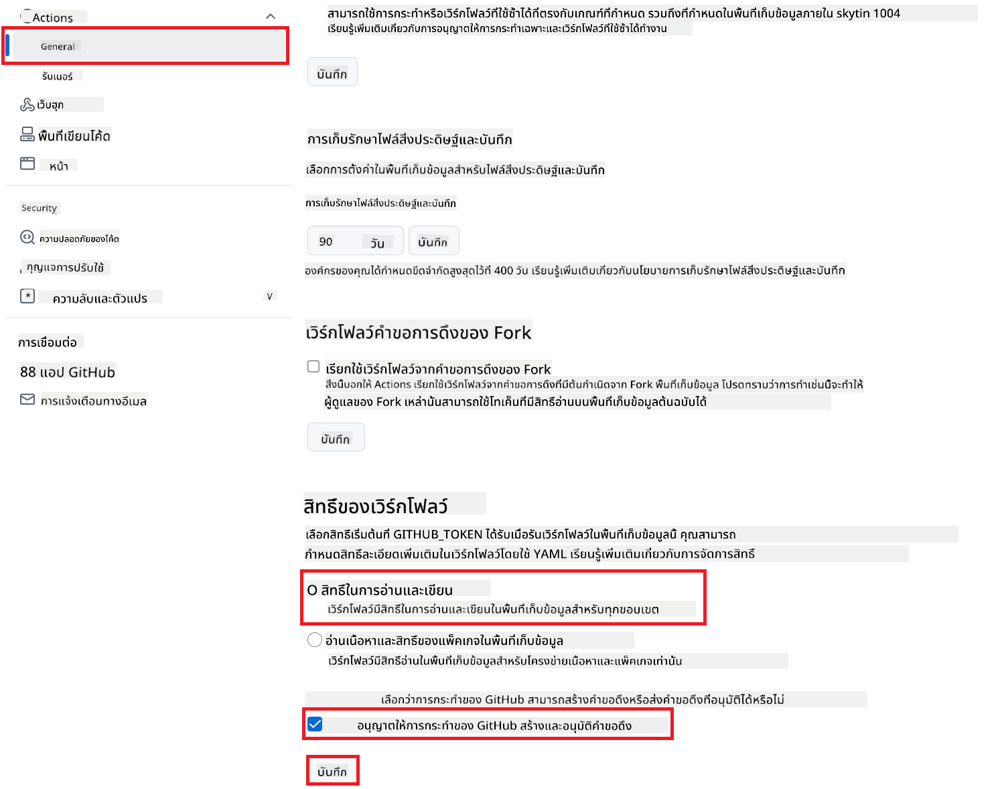

<!--
CO_OP_TRANSLATOR_METADATA:
{
  "original_hash": "a52587a512e667f70d92db853d3c61d5",
  "translation_date": "2025-06-12T19:29:18+00:00",
  "source_file": "getting_started/github-actions-guide/github-actions-guide-public.md",
  "language_code": "th"
}
-->
# การใช้ Co-op Translator GitHub Action (การตั้งค่าสาธารณะ)

**กลุ่มเป้าหมาย:** คู่มือนี้เหมาะสำหรับผู้ใช้ในที่เก็บข้อมูลสาธารณะหรือส่วนตัวส่วนใหญ่ที่มีสิทธิ์ GitHub Actions มาตรฐานเพียงพอ โดยใช้ `GITHUB_TOKEN` ที่มีอยู่ในตัว

ช่วยให้การแปลเอกสารในที่เก็บของคุณเป็นไปโดยอัตโนมัติอย่างง่ายดายด้วย Co-op Translator GitHub Action คู่มือนี้จะแนะนำวิธีตั้งค่าการทำงานเพื่อสร้าง pull request โดยอัตโนมัติพร้อมการแปลที่อัปเดตทุกครั้งที่ไฟล์ Markdown หรือรูปภาพต้นทางของคุณเปลี่ยนแปลง

> [!IMPORTANT]
>
> **การเลือกคู่มือที่เหมาะสม:**
>
> คู่มือนี้อธิบายการตั้งค่าที่ง่ายกว่าโดยใช้ `GITHUB_TOKEN` มาตรฐาน ซึ่งเป็นวิธีที่แนะนำสำหรับผู้ใช้ส่วนใหญ่เพราะไม่ต้องจัดการกับ GitHub App Private Keys ที่มีความละเอียดอ่อน
>

## สิ่งที่ต้องเตรียม

ก่อนตั้งค่า GitHub Action ให้ตรวจสอบว่าคุณมีข้อมูลรับรองบริการ AI ที่จำเป็นพร้อมแล้ว

**1. จำเป็น: ข้อมูลรับรองโมเดลภาษา AI**  
คุณต้องมีข้อมูลรับรองสำหรับโมเดลภาษาอย่างน้อยหนึ่งตัวที่รองรับ:

- **Azure OpenAI**: ต้องมี Endpoint, API Key, ชื่อ Model/Deployment, API Version  
- **OpenAI**: ต้องมี API Key, (ไม่บังคับ: Org ID, Base URL, Model ID)  
- ดูรายละเอียดได้ที่ [Supported Models and Services](../../../../README.md)

**2. ไม่จำเป็น: ข้อมูลรับรอง AI Vision (สำหรับแปลข้อความในรูปภาพ)**

- จำเป็นเฉพาะเมื่อคุณต้องแปลข้อความในรูปภาพเท่านั้น  
- **Azure AI Vision**: ต้องมี Endpoint และ Subscription Key  
- หากไม่ระบุ จะใช้ [โหมด Markdown เท่านั้น](../markdown-only-mode.md) เป็นค่าเริ่มต้น

## การตั้งค่าและกำหนดค่า

ทำตามขั้นตอนเหล่านี้เพื่อกำหนดค่า Co-op Translator GitHub Action ในที่เก็บของคุณโดยใช้ `GITHUB_TOKEN` มาตรฐาน

### ขั้นตอนที่ 1: ทำความเข้าใจการตรวจสอบสิทธิ์ (ใช้ `GITHUB_TOKEN`)

เวิร์กโฟลว์นี้ใช้ `GITHUB_TOKEN` ที่มีอยู่ใน GitHub Actions ซึ่งโทเค็นนี้จะให้สิทธิ์เวิร์กโฟลว์ในการเข้าถึงที่เก็บของคุณโดยอัตโนมัติตามการตั้งค่าที่กำหนดไว้ใน **ขั้นตอนที่ 3**

### ขั้นตอนที่ 2: กำหนดค่า Repository Secrets

คุณเพียงแค่เพิ่ม **ข้อมูลรับรองบริการ AI** เป็นความลับที่เข้ารหัสในการตั้งค่าที่เก็บของคุณ

1. เข้าไปที่ที่เก็บ GitHub เป้าหมายของคุณ  
2. ไปที่ **Settings** > **Secrets and variables** > **Actions**  
3. ภายใต้ **Repository secrets** คลิก **New repository secret** สำหรับแต่ละข้อมูลรับรองบริการ AI ที่จำเป็นดังนี้

     *(ภาพอ้างอิง: แสดงตำแหน่งเพิ่มความลับ)*

**ข้อมูลรับรองบริการ AI ที่จำเป็น (เพิ่มทั้งหมดที่เกี่ยวข้องตามที่คุณเตรียมไว้):**

| ชื่อความลับ                         | คำอธิบาย                               | แหล่งข้อมูล                     |
| :---------------------------------- | :---------------------------------------- | :------------------------------- |
| `AZURE_SUBSCRIPTION_KEY`            | คีย์สำหรับ Azure AI Service (Computer Vision)  | Azure AI Foundry ของคุณ               |
| `AZURE_AI_SERVICE_ENDPOINT`         | Endpoint สำหรับ Azure AI Service (Computer Vision) | Azure AI Foundry ของคุณ               |
| `AZURE_OPENAI_API_KEY`              | คีย์สำหรับบริการ Azure OpenAI              | Azure AI Foundry ของคุณ               |
| `AZURE_OPENAI_ENDPOINT`             | Endpoint สำหรับบริการ Azure OpenAI         | Azure AI Foundry ของคุณ               |
| `AZURE_OPENAI_MODEL_NAME`           | ชื่อโมเดล Azure OpenAI ของคุณ              | Azure AI Foundry ของคุณ               |
| `AZURE_OPENAI_CHAT_DEPLOYMENT_NAME` | ชื่อ Deployment ของ Azure OpenAI ของคุณ         | Azure AI Foundry ของคุณ               |
| `AZURE_OPENAI_API_VERSION`          | เวอร์ชัน API สำหรับ Azure OpenAI              | Azure AI Foundry ของคุณ               |
| `OPENAI_API_KEY`                    | API Key สำหรับ OpenAI                        | แพลตฟอร์ม OpenAI ของคุณ              |
| `OPENAI_ORG_ID`                     | รหัสองค์กร OpenAI (ไม่บังคับ)         | แพลตฟอร์ม OpenAI ของคุณ              |
| `OPENAI_CHAT_MODEL_ID`              | รหัสโมเดล OpenAI เฉพาะ (ไม่บังคับ)       | แพลตฟอร์ม OpenAI ของคุณ              |
| `OPENAI_BASE_URL`                   | URL ฐาน API OpenAI แบบกำหนดเอง (ไม่บังคับ)     | แพลตฟอร์ม OpenAI ของคุณ              |

### ขั้นตอนที่ 3: กำหนดค่าสิทธิ์เวิร์กโฟลว์

GitHub Action ต้องได้รับสิทธิ์ผ่าน `GITHUB_TOKEN` เพื่อดึงโค้ดและสร้าง pull request

1. ในที่เก็บของคุณ ไปที่ **Settings** > **Actions** > **General**  
2. เลื่อนลงไปที่ส่วน **Workflow permissions**  
3. เลือก **Read and write permissions** เพื่อให้ `GITHUB_TOKEN` มีสิทธิ์ `contents: write` และ `pull-requests: write` ที่จำเป็นสำหรับเวิร์กโฟลว์นี้  
4. ตรวจสอบให้แน่ใจว่าเลือกช่อง **Allow GitHub Actions to create and approve pull requests**  
5. คลิก **Save**



### ขั้นตอนที่ 4: สร้างไฟล์เวิร์กโฟลว์

สุดท้าย สร้างไฟล์ YAML ที่กำหนดเวิร์กโฟลว์อัตโนมัติที่ใช้ `GITHUB_TOKEN`

1. ในไดเรกทอรีหลักของที่เก็บ สร้างโฟลเดอร์ `.github/workflows/` หากยังไม่มี  
2. ภายใน `.github/workflows/` สร้างไฟล์ชื่อ `co-op-translator.yml`  
3. วางเนื้อหาต่อไปนี้ลงใน `co-op-translator.yml`

```yaml
name: Co-op Translator

on:
  push:
    branches:
      - main

jobs:
  co-op-translator:
    runs-on: ubuntu-latest

    permissions:
      contents: write
      pull-requests: write

    steps:
      - name: Checkout repository
        uses: actions/checkout@v4
        with:
          fetch-depth: 0

      - name: Set up Python
        uses: actions/setup-python@v4
        with:
          python-version: '3.10'

      - name: Install Co-op Translator
        run: |
          python -m pip install --upgrade pip
          pip install co-op-translator

      - name: Run Co-op Translator
        env:
          PYTHONIOENCODING: utf-8
          # === AI Service Credentials ===
          AZURE_SUBSCRIPTION_KEY: ${{ secrets.AZURE_SUBSCRIPTION_KEY }}
          AZURE_AI_SERVICE_ENDPOINT: ${{ secrets.AZURE_AI_SERVICE_ENDPOINT }}
          AZURE_OPENAI_API_KEY: ${{ secrets.AZURE_OPENAI_API_KEY }}
          AZURE_OPENAI_ENDPOINT: ${{ secrets.AZURE_OPENAI_ENDPOINT }}
          AZURE_OPENAI_MODEL_NAME: ${{ secrets.AZURE_OPENAI_MODEL_NAME }}
          AZURE_OPENAI_CHAT_DEPLOYMENT_NAME: ${{ secrets.AZURE_OPENAI_CHAT_DEPLOYMENT_NAME }}
          AZURE_OPENAI_API_VERSION: ${{ secrets.AZURE_OPENAI_API_VERSION }}
          OPENAI_API_KEY: ${{ secrets.OPENAI_API_KEY }}
          OPENAI_ORG_ID: ${{ secrets.OPENAI_ORG_ID }}
          OPENAI_CHAT_MODEL_ID: ${{ secrets.OPENAI_CHAT_MODEL_ID }}
          OPENAI_BASE_URL: ${{ secrets.OPENAI_BASE_URL }}
        run: |
          # =====================================================================
          # IMPORTANT: Set your target languages here (REQUIRED CONFIGURATION)
          # =====================================================================
          # Example: Translate to Spanish, French, German. Add -y to auto-confirm.
          translate -l "es fr de" -y  # <--- MODIFY THIS LINE with your desired languages

      - name: Create Pull Request with translations
        uses: peter-evans/create-pull-request@v5
        with:
          token: ${{ secrets.GITHUB_TOKEN }}
          commit-message: "🌐 Update translations via Co-op Translator"
          title: "🌐 Update translations via Co-op Translator"
          body: |
            This PR updates translations for recent changes to the main branch.

            ### 📋 Changes included
            - Translated contents are available in the `translations/` directory
            - Translated images are available in the `translated_images/` directory

            ---
            🌐 Automatically generated by the [Co-op Translator](https://github.com/Azure/co-op-translator) GitHub Action.
          branch: update-translations
          base: main
          labels: translation, automated-pr
          delete-branch: true
          add-paths: |
            translations/
            translated_images/
```  
4. **ปรับแต่งเวิร์กโฟลว์:**  
  - **[!IMPORTANT] ภาษาที่ต้องการ:** ในขั้นตอน `Run Co-op Translator` step, you **MUST review and modify the list of language codes** within the `translate -l "..." -y` command to match your project's requirements. The example list (`ar de es...`) needs to be replaced or adjusted.
  - **Trigger (`on:`):** The current trigger runs on every push to `main`. For large repositories, consider adding a `paths:` filter (see commented example in the YAML) to run the workflow only when relevant files (e.g., source documentation) change, saving runner minutes.
  - **PR Details:** Customize the `commit-message`, `title`, `body`, `branch` name, and `labels` in the `Create Pull Request` ปรับแก้ตามต้องการได้เลย

**ข้อจำกัดความรับผิดชอบ**:  
เอกสารนี้ได้รับการแปลโดยใช้บริการแปลภาษาด้วย AI [Co-op Translator](https://github.com/Azure/co-op-translator) แม้เราจะพยายามให้ความถูกต้องสูงสุด แต่โปรดทราบว่าการแปลอัตโนมัติอาจมีข้อผิดพลาดหรือความไม่ถูกต้อง เอกสารต้นฉบับในภาษาต้นทางถือเป็นแหล่งข้อมูลที่เชื่อถือได้ สำหรับข้อมูลที่สำคัญ ขอแนะนำให้ใช้การแปลโดยมนุษย์มืออาชีพ เราไม่รับผิดชอบต่อความเข้าใจผิดหรือการตีความผิดใด ๆ ที่เกิดจากการใช้การแปลนี้