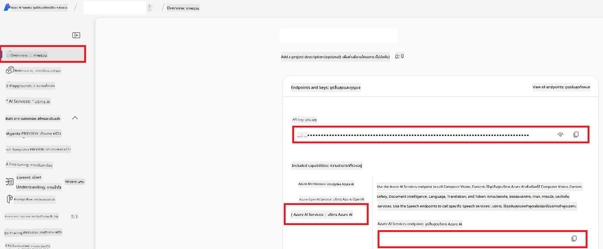

<!--
CO_OP_TRANSLATOR_METADATA:
{
  "original_hash": "b58d7c3cb4210697a073d20eb3064945",
  "translation_date": "2025-06-12T11:53:21+00:00",
  "source_file": "getting_started/set-up-azure-ai.md",
  "language_code": "th"
}
-->
# ตั้งค่า Azure AI สำหรับ Co-op Translator (Azure OpneAI & Azure AI Vision)

คำแนะนำนี้จะแนะนำขั้นตอนการตั้งค่า Azure OpenAI สำหรับการแปลภาษา และ Azure Computer Vision สำหรับการวิเคราะห์เนื้อหาภาพ (ซึ่งสามารถนำไปใช้สำหรับการแปลภาพ) ภายใน Azure AI Foundry

**สิ่งที่ต้องเตรียม:**
- บัญชี Azure ที่มีการสมัครใช้งานที่ยังใช้งานอยู่
- สิทธิ์เพียงพอในการสร้างทรัพยากรและการปรับใช้ในบัญชี Azure ของคุณ

## สร้างโปรเจกต์ Azure AI

คุณจะเริ่มต้นด้วยการสร้างโปรเจกต์ Azure AI ซึ่งเป็นที่รวมศูนย์สำหรับการจัดการทรัพยากร AI ของคุณ

1. ไปที่ [https://ai.azure.com](https://ai.azure.com) และเข้าสู่ระบบด้วยบัญชี Azure ของคุณ

1. เลือก **+Create** เพื่อสร้างโปรเจกต์ใหม่

1. ดำเนินการตามขั้นตอนดังนี้:
   - กรอก **ชื่อโปรเจกต์** (เช่น `CoopTranslator-Project`)
   - เลือก **AI hub** (เช่น `CoopTranslator-Hub`) (สร้างใหม่ถ้าจำเป็น)

1. คลิก "**Review and Create**" เพื่อสร้างโปรเจกต์ คุณจะถูกนำไปยังหน้าภาพรวมของโปรเจกต์

## ตั้งค่า Azure OpenAI สำหรับการแปลภาษา

ภายในโปรเจกต์ของคุณ คุณจะปรับใช้โมเดล Azure OpenAI เพื่อทำหน้าที่เป็นแบ็กเอนด์สำหรับการแปลข้อความ

### ไปที่โปรเจกต์ของคุณ

ถ้ายังไม่ได้เข้า ให้เปิดโปรเจกต์ที่สร้างใหม่ของคุณ (เช่น `CoopTranslator-Project`) ใน Azure AI Foundry

### ปรับใช้โมเดล OpenAI

1. จากเมนูด้านซ้ายของโปรเจกต์ ใต้หัวข้อ "My assets" ให้เลือก "**Models + endpoints**"

1. เลือก **+ Deploy model**

1. เลือก **Deploy Base Model**

1. จะมีรายการโมเดลให้เลือก กรองหรือค้นหาโมเดล GPT ที่เหมาะสม เราแนะนำ `gpt-4o`

1. เลือกโมเดลที่ต้องการแล้วคลิก **Confirm**

1. เลือก **Deploy**

### การตั้งค่า Azure OpenAI

เมื่อปรับใช้เสร็จแล้ว คุณสามารถเลือกการปรับใช้จากหน้าของ "**Models + endpoints**" เพื่อดู **REST endpoint URL**, **Key**, **Deployment name**, **Model name** และ **API version** ซึ่งจำเป็นสำหรับการเชื่อมต่อโมเดลแปลภาษากับแอปพลิเคชันของคุณ

> [!NOTE]
> คุณสามารถเลือกเวอร์ชัน API ได้จากหน้า [API version deprecation](https://learn.microsoft.com/azure/ai-services/openai/api-version-deprecation) ตามความต้องการ โปรดทราบว่า **API version** แตกต่างจาก **Model version** ที่แสดงในหน้า **Models + endpoints** ของ Azure AI Foundry

## ตั้งค่า Azure Computer Vision สำหรับการแปลภาพ

เพื่อเปิดใช้งานการแปลข้อความในภาพ คุณต้องค้นหา Azure AI Service API Key และ Endpoint

1. ไปที่โปรเจกต์ Azure AI ของคุณ (เช่น `CoopTranslator-Project`) ให้แน่ใจว่าคุณอยู่ในหน้าภาพรวมของโปรเจกต์

### การตั้งค่า Azure AI Service

ค้นหา API Key และ Endpoint จาก Azure AI Service

1. ไปที่โปรเจกต์ Azure AI ของคุณ (เช่น `CoopTranslator-Project`) ให้แน่ใจว่าคุณอยู่ในหน้าภาพรวมของโปรเจกต์

1. ค้นหา **API Key** และ **Endpoint** จากแท็บ Azure AI Service

    

การเชื่อมต่อนี้ทำให้คุณสมบัติของทรัพยากร Azure AI Services ที่เชื่อมโยง (รวมถึงการวิเคราะห์ภาพ) สามารถใช้งานได้ในโปรเจกต์ AI Foundry ของคุณ จากนั้นคุณสามารถใช้การเชื่อมต่อนี้ในโน้ตบุ๊กหรือแอปพลิเคชันของคุณเพื่อดึงข้อความจากภาพ ซึ่งสามารถส่งต่อไปยังโมเดล Azure OpenAI เพื่อแปลภาษาได้

## รวบรวมข้อมูลรับรองของคุณ

ตอนนี้คุณควรจะได้ข้อมูลดังต่อไปนี้:

**สำหรับ Azure OpenAI (การแปลข้อความ):**
- Azure OpenAI Endpoint
- Azure OpenAI API Key
- Azure OpenAI Model Name (เช่น `gpt-4o`)
- Azure OpenAI Deployment Name (เช่น `cooptranslator-gpt4o`)
- Azure OpenAI API Version

**สำหรับ Azure AI Services (การดึงข้อความจากภาพผ่าน Vision):**
- Azure AI Service Endpoint
- Azure AI Service API Key

### ตัวอย่าง: การตั้งค่าสิ่งแวดล้อม (Environment Variable) (ตัวอย่าง)

ในภายหลังเมื่อสร้างแอปพลิเคชัน คุณอาจตั้งค่าด้วยข้อมูลรับรองเหล่านี้เป็นตัวแปรสภาพแวดล้อม เช่น:

```bash
# Azure AI Service Credentials (Required for image translation)
AZURE_AI_SERVICE_API_KEY="your_azure_ai_service_api_key" # e.g., 21xasd...
AZURE_AI_SERVICE_ENDPOINT="https://your_azure_ai_service_endpoint.cognitiveservices.azure.com/"

# Azure OpenAI Credentials (Required for text translation)
AZURE_OPENAI_API_KEY="your_azure_openai_api_key" # e.g., 21xasd...
AZURE_OPENAI_ENDPOINT="https://your_azure_openai_endpoint.openai.azure.com/"
AZURE_OPENAI_MODEL_NAME="your_model_name" # e.g., gpt-4o
AZURE_OPENAI_CHAT_DEPLOYMENT_NAME="your_deployment_name" # e.g., cooptranslator-gpt4o
AZURE_OPENAI_API_VERSION="your_api_version" # e.g., 2024-12-01-preview
```

---

### อ่านเพิ่มเติม

- [วิธีสร้างโปรเจกต์ใน Azure AI Foundry](https://learn.microsoft.com/azure/ai-foundry/how-to/create-projects?tabs=ai-studio)
- [วิธีสร้างทรัพยากร Azure AI](https://learn.microsoft.com/azure/ai-foundry/how-to/create-azure-ai-resource?tabs=portal)
- [วิธีปรับใช้โมเดล OpenAI ใน Azure AI Foundry](https://learn.microsoft.com/en-us/azure/ai-foundry/how-to/deploy-models-openai)

**ข้อจำกัดความรับผิดชอบ**:  
เอกสารนี้ได้รับการแปลโดยใช้บริการแปลภาษาอัตโนมัติ [Co-op Translator](https://github.com/Azure/co-op-translator) แม้ว่าเราจะพยายามให้ความถูกต้องสูงสุด แต่โปรดทราบว่าการแปลโดยอัตโนมัติอาจมีข้อผิดพลาดหรือความคลาดเคลื่อน เอกสารต้นฉบับในภาษาต้นทางถือเป็นแหล่งข้อมูลที่น่าเชื่อถือที่สุด สำหรับข้อมูลที่มีความสำคัญ ควรใช้บริการแปลโดยผู้เชี่ยวชาญมนุษย์ เราจะไม่รับผิดชอบต่อความเข้าใจผิดหรือการตีความที่ผิดพลาดใด ๆ ที่เกิดจากการใช้การแปลนี้