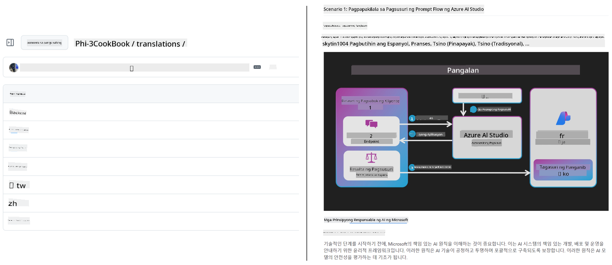
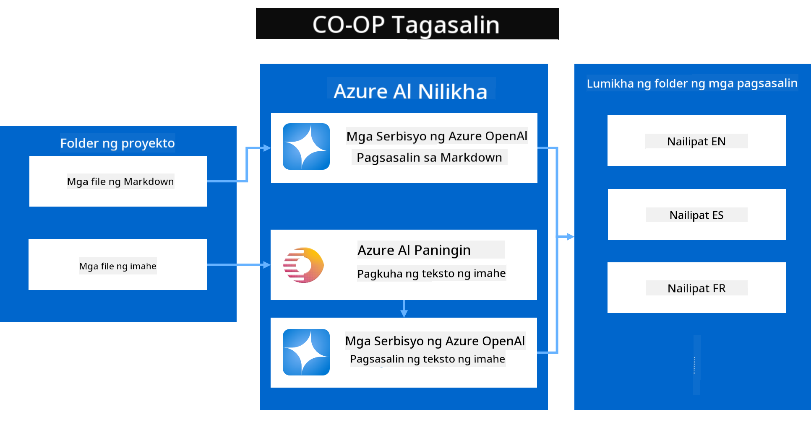
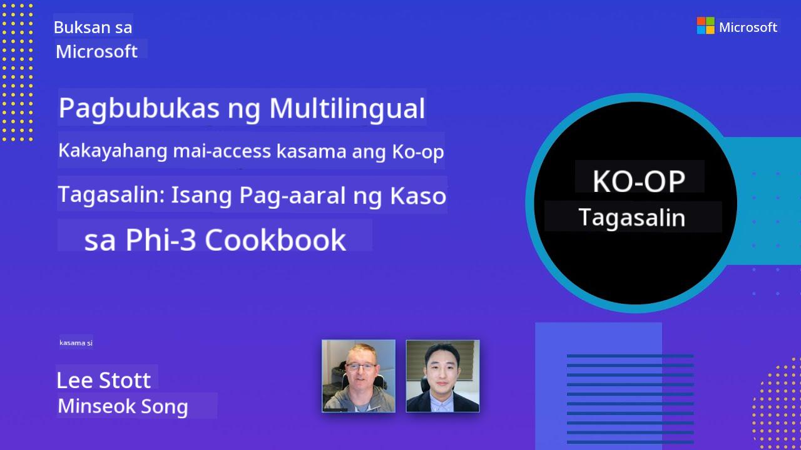

<!--
CO_OP_TRANSLATOR_METADATA:
{
  "original_hash": "044724537b57868117aadae8e7728c7c",
  "translation_date": "2025-06-12T10:44:09+00:00",
  "source_file": "README.md",
  "language_code": "tl"
}
-->


# Co-op Translator: Awtomatikong Isalin ang Dokumentasyong Pang-edukasyon nang Walang Hirap

_Madaling i-automate ang pagsasalin ng iyong dokumentasyon sa iba't ibang wika para maabot ang pandaigdigang tagapakinig._

[](https://pypi.org/project/co-op-translator/)
[](https://github.com/azure/co-op-translator/blob/main/LICENSE)
[](https://pepy.tech/project/co-op-translator)
[](https://pepy.tech/project/co-op-translator)
[](https://github.com/psf/black)

[](https://GitHub.com/azure/co-op-translator/graphs/contributors/)
[](https://GitHub.com/azure/co-op-translator/issues/)
[](https://GitHub.com/azure/co-op-translator/pulls/)
[](http://makeapullrequest.com)

### Suporta sa Wika na Pinapagana ng Co-op Translator
[Pranses](../fr/README.md) | [Espanyol](../es/README.md) | [Aleman](../de/README.md) | [Ruso](../ru/README.md) | [Arabe](../ar/README.md) | [Persian (Farsi)](../fa/README.md) | [Urdu](../ur/README.md) | [Intsik (Pinasimple)](../zh/README.md) | [Intsik (Tradisyonal, Macau)](../mo/README.md) | [Intsik (Tradisyonal, Hong Kong)](../hk/README.md) | [Intsik (Tradisyonal, Taiwan)](../tw/README.md) | [Hapon](../ja/README.md) | [Koreano](../ko/README.md) | [Hindi](../hi/README.md) | [Bengali](../bn/README.md) | [Marathi](../mr/README.md) | [Nepali](../ne/README.md) | [Punjabi (Gurmukhi)](../pa/README.md) | [Portuges (Portugal)](../pt/README.md) | [Portuges (Brazil)](../br/README.md) | [Italyano](../it/README.md) | [Polako](../pl/README.md) | [Turko](../tr/README.md) | [Griyego](../el/README.md) | [Thai](../th/README.md) | [Swedish](../sv/README.md) | [Danish](../da/README.md) | [Norwegian](../no/README.md) | [Finnish](../fi/README.md) | [Dutch](../nl/README.md) | [Hebrew](../he/README.md) | [Vietnamese](../vi/README.md) | [Indonesian](../id/README.md) | [Malay](../ms/README.md) | [Tagalog (Filipino)](./README.md) | [Swahili](../sw/README.md) | [Hungarian](../hu/README.md) | [Czech](../cs/README.md) | [Slovak](../sk/README.md) | [Romanian](../ro/README.md) | [Bulgarian](../bg/README.md) | [Serbian (Cyrillic)](../sr/README.md) | [Croatian](../hr/README.md) | [Slovenian](../sl/README.md) | [Ukrainian](../uk/README.md) | [Burmese (Myanmar)](../my/README.md)Mangyaring isulat ang output mula kaliwa pakaliwa.
> [!NOTE]
> Ito ang mga kasalukuyang salin ng nilalaman ng repositoryong ito. Para sa kumpletong listahan ng mga wikang sinusuportahan ng Co-op Translator, pakitingnan ang seksyong [Language Support](../..).

[](https://GitHub.com/azure/co-op-translator/watchers/)
[](https://GitHub.com/azure/co-op-translator/network/)
[](https://GitHub.com/azure/co-op-translator/stargazers/)

[](https://discord.com/invite/ByRwuEEgH4)

[](https://codespaces.new/azure/co-op-translator)
[](https://vscode.dev/redirect?url=vscode://ms-vscode-remote.remote-containers/cloneInVolume?url=https://github.com/azure/co-op-translator)

## Overview: Pinasimpleng Pagsasalin ng Iyong Pang-edukasyong Nilalaman

Malaki ang hadlang ng mga wika sa pag-access ng mahahalagang pang-edukasyong materyales at teknikal na kaalaman para sa mga mag-aaral at developer sa buong mundo. Nililimitahan nito ang partisipasyon at nagpapabagal sa bilis ng pandaigdigang inobasyon at pagkatuto.

**Co-op Translator** ay nilikha upang tugunan ang hindi episyenteng proseso ng manual na pagsasalin para sa malakihang serye ng edukasyon ng Microsoft (tulad ng mga gabay na "Para sa Mga Nagsisimula"). Ito ay umunlad bilang isang madaling gamitin at makapangyarihang kasangkapan na naglalayong alisin ang mga hadlang na ito para sa lahat. Sa pamamagitan ng pagbibigay ng mataas na kalidad na awtomatikong pagsasalin gamit ang CLI at GitHub Actions, pinapalakas ng Co-op Translator ang mga guro, estudyante, mananaliksik, at developer sa buong mundo na magbahagi at makakuha ng kaalaman nang walang limitasyon sa wika.

Tingnan kung paano inaayos ng Co-op Translator ang mga isinaling pang-edukasyong nilalaman:



Ang mga Markdown file at teksto sa larawan ay awtomatikong isinasalin at maayos na inilalagay sa mga folder ayon sa wika.

**Buksan ang pandaigdigang access sa iyong pang-edukasyong nilalaman gamit ang Co-op Translator ngayon!**

## Suporta para sa Pandaigdigang Access ng Mga Learning Resources ng Microsoft

Tinutulungan ng Co-op Translator na tulayin ang hadlang sa wika para sa mahahalagang inisyatiba sa edukasyon ng Microsoft, na ina-automate ang proseso ng pagsasalin para sa mga repositoryong nagsisilbi sa pandaigdigang komunidad ng mga developer. Ilan sa mga kasalukuyang gumagamit ng Co-op Translator ay:

[](https://github.com/microsoft/Generative-AI-for-beginners)
[](https://github.com/microsoft/ML-For-Beginners)
[](https://github.com/microsoft/AI-For-Beginners)
[](https://github.com/microsoft/ai-agents-for-beginners)
[](https://github.com/microsoft/PhiCookBook)
[](https://github.com/microsoft/Generative-AI-for-beginners-dotnet)

## Pangunahing Tampok

- **Awtomatikong Pagsasalin**: Madaling isalin ang teksto sa maraming wika.
- **Integrasyon sa GitHub Actions**: I-automate ang pagsasalin bilang bahagi ng iyong CI/CD pipeline.
- **Pananatili ng Markdown**: Pinapanatili ang tamang Markdown syntax habang isinasalin.
- **Pagsasalin ng Teksto sa Larawan**: Kinukuha at isinasalin ang teksto sa loob ng mga larawan.
- **Makabagong Teknolohiya ng LLM**: Gumagamit ng pinakabagong mga language model para sa mataas na kalidad na pagsasalin.
- **Madaling Integrasyon**: Walang kahirap-hirap na isama sa iyong kasalukuyang proyekto.
- **Pinadaling Lokalisasyon**: Pinasimple ang proseso ng pag-localize ng iyong proyekto para sa mga internasyonal na merkado.

## Paano Ito Gumagana



Kinukuha ng Co-op Translator ang mga Markdown file at larawan mula sa iyong project folder at pinoproseso ang mga ito sa mga sumusunod na hakbang:

1. **Pagkuha ng Teksto**: Kinukuha ang teksto mula sa Markdown files at, kung naka-configure (hal., gamit ang Azure AI Vision), pati ang teksto na nasa loob ng mga larawan.
1. **Pagsasalin gamit ang AI**: Pinapadala ang nakuha na teksto sa naka-configure na LLM (Azure OpenAI, OpenAI, atbp.) para isalin.
1. **Pagsave ng Resulta**: Sinesave ang mga isinaling Markdown files at mga larawan (na may isinaling teksto) sa mga folder ayon sa wika, habang pinananatili ang orihinal na format.

## Pagsisimula

Magsimula agad gamit ang CLI o i-setup ang full automation gamit ang GitHub Actions. Piliin ang paraang pinakaangkop sa iyong workflow:

1. **Command Line (CLI)** - Para sa isang beses na pagsasalin o manual na kontrol
2. **GitHub Actions** - Para sa awtomatikong pagsasalin sa bawat push

> [!NOTE]
> Bagamat nakatuon ang tutorial na ito sa Azure resources, maaari kang gumamit ng kahit anong sinusuportahang language model.

### Language Support

Sinusuportahan ng Co-op Translator ang malawak na hanay ng mga wika upang matulungan kang maabot ang pandaigdigang audience. Narito ang mga dapat mong malaman:

#### Mabilisang Sanggunian

| Wika | Code | Wika | Code | Wika | Code |
|----------|------|----------|------|----------|------|
| Arabic | ar | Bengali | bn | Bulgarian | bg |
| Burmese (Myanmar) | my | Chinese (Simplified) | zh | Chinese (Traditional, HK) | hk |
| Chinese (Traditional, Macau) | mo | Chinese (Traditional, TW) | tw | Croatian | hr |
| Czech | cs | Danish | da | Dutch | nl |
| Finnish | fi | French | fr | German | de |
| Greek | el | Hebrew | he | Hindi | hi |
| Hungarian | hu | Indonesian | id | Italian | it |
| Japanese | ja | Korean | ko | Malay | ms |
| Marathi | mr | Nepali | ne | Norwegian | no |
| Persian (Farsi) | fa | Polish | pl | Portuguese (Brazil) | br |
| Portuguese (Portugal) | pt | Punjabi (Gurmukhi) | pa | Romanian | ro |
| Russian | ru | Serbian (Cyrillic) | sr | Slovak | sk |
| Slovenian | sl | Spanish | es | Swahili | sw |
| Swedish | sv | Tagalog (Filipino) | tl | Thai | th |
| Turkish | tr | Ukrainian | uk | Urdu | ur |
| Vietnamese | vi | — | — | — | — |

#### Paggamit ng Language Codes

Kapag gumagamit ng Co-op Translator, kailangan mong tukuyin ang mga wika gamit ang kanilang mga code. Halimbawa:

```bash
# Translate to French, Spanish, and German
translate -l "fr es de"

# Translate to Chinese (Simplified) and Japanese
translate -l "zh ja"
```

> [!NOTE]
> Para sa detalyadong teknikal na impormasyon tungkol sa suporta sa mga wika, kabilang ang:
>
> - Mga font specification para sa bawat wika
> - Kilalang mga isyu
> - Paano magdagdag ng bagong mga wika
>
> Tingnan ang aming [Supported Languages Documentation](./getting_started/supported-languages.md).

### Sinusuportahang Mga Modelo at Serbisyo

| Uri                  | Pangalan                           |
|-----------------------|----------------------------------|
| Language Model        |   |
| AI Vision             |  |

> [!NOTE]
> Kung walang AI vision service na available, lilipat ang co-op translator sa [Markdown-only mode](./getting_started/markdown-only-mode.md).

### Paunang Setup

Bago magsimula, kailangan mong i-setup ang mga sumusunod na resources:

1. Language Model Resource (Kailangan):
   - Azure OpenAI (Inirerekomenda) - Nagbibigay ng mataas na kalidad na pagsasalin na may enterprise-grade na katatagan
   - OpenAI - Alternatibong opsyon kung wala kang access sa Azure
   - Para sa detalyadong impormasyon tungkol sa mga sinusuportahang modelo, tingnan ang [Supported Models and Services](../..)

1. AI Vision Resource (Opsyonal):
   - Azure AI Vision - Pinapagana ang pagsasalin ng teksto sa loob ng mga larawan
   - Kung hindi naka-configure, awtomatikong gagamitin ng translator ang [Markdown-only mode](./getting_started/markdown-only-mode.md)
   - Inirerekomenda para sa mga proyekto na may mga larawan na may teksto na kailangang isalin

1. Mga Hakbang sa Configuration:
   - Sundan ang aming [Azure AI setup guide](./getting_started/set-up-azure-ai.md) para sa detalyadong mga tagubilin
   - Gumawa ng `.env` file na may iyong API keys at endpoints (tingnan ang seksyong [Quick Start](../..))
   - Siguraduhin na may tamang permiso at quota ka para sa mga serbisyong pinili mo

### Pagsasaayos ng Proyekto Bago Magsalin

Bago simulan ang proseso ng pagsasalin, sundin ang mga hakbang na ito para ihanda ang iyong proyekto:

1. Ihanda ang Iyong README:
   - Magdagdag ng talahanayan ng mga pagsasalin sa iyong README.md para i-link ang mga isinaling bersyon
   - Halimbawa ng format:

     ```markdown

     ### 🌐 Multi-Language Support
     
     [French](../fr/README.md) | [Spanish](../es/README.md) | [German](../de/README.md) | [Russian](../ru/README.md) | [Arabic](../ar/README.md) | [Persian (Farsi)](../fa/README.md) | [Urdu](../ur/README.md) | [Chinese (Simplified)](../zh/README.md) | [Chinese (Traditional, Macau)](../mo/README.md) | [Chinese (Traditional, Hong Kong)](../hk/README.md) | [Chinese (Traditional, Taiwan)](../tw/README.md) | [Japanese](../ja/README.md) | [Korean](../ko/README.md) | [Hindi](../hi/README.md) | [Bengali](../bn/README.md) | [Marathi](../mr/README.md) | [Nepali](../ne/README.md) | [Punjabi (Gurmukhi)](../pa/README.md) | [Portuguese (Portugal)](../pt/README.md) | [Portuguese (Brazil)](../br/README.md) | [Italian](../it/README.md) | [Polish](../pl/README.md) | [Turkish](../tr/README.md) | [Greek](../el/README.md) | [Thai](../th/README.md) | [Swedish](../sv/README.md) | [Danish](../da/README.md) | [Norwegian](../no/README.md) | [Finnish](../fi/README.md) | [Dutch](../nl/README.md) | [Hebrew](../he/README.md) | [Vietnamese](../vi/README.md) | [Indonesian](../id/README.md) | [Malay](../ms/README.md) | [Tagalog (Filipino)](./README.md) | [Swahili](../sw/README.md) | [Hungarian](../hu/README.md) | [Czech](../cs/README.md) | [Slovak](../sk/README.md) | [Romanian](../ro/README.md) | [Bulgarian](../bg/README.md) | [Serbian (Cyrillic)](../sr/README.md) | [Croatian](../hr/README.md) | [Slovenian](../sl/README.md) | [Ukrainian](../uk/README.md) | [Burmese (Myanmar)](../my/README.md) 
    
     ```

1. Linisin ang Mga Umiiral na Pagsasalin (kung kinakailangan):
   - Alisin ang anumang umiiral na mga folder ng pagsasalin (hal., `translations/`)
   - Burahin ang mga lumang file ng pagsasalin para magsimula ng malinis
   - Ito ay para maiwasan ang mga salungatan sa bagong proseso ng pagsasalin

### Mabilisang Pagsisimula: Command Line

Para sa mabilisang pagsisimula gamit ang command line:

1. Gumawa ng virtual environment:

    ```bash
    python -m venv .venv
    ```

1. I-activate ang virtual environment:

    - Sa Windows:

    ```bash
    .venv\scripts\activate
    ```

    - Sa Linux/macOS:

    ```bash
    source .venv/bin/activate
    ```

1. I-install ang package:

    ```bash
    pip install co-op-translator
    ```

1. I-configure ang Credentials:

    - Gumawa ng `.env` file in your project's root directory.
    - Copy the contents from the [.env.template](../../.env.template) file into your new `.env` file.
    - Fill in the required API keys and endpoint information in your `.env` file.

1. Run Translation:
    - Navigate to your project's root directory in your terminal.
    - Execute the translate command, specifying target languages with the `-l` flag:

    ```bash
    translate -l "ko ja fr"
    ```

_(Palitan ang `"ko ja fr"` with your desired space-separated language codes)_

### Detailed Usage Guides

Choose the approach that best fits your workflow:

#### 1. Using the Command Line (CLI)

- Best for: One-time translations, manual control, or integration into custom scripts.
- Requires: Local installation of Python and the `co-op-translator` package.
- Guide: [Command Line Guide](./getting_started/command-line-guide/command-line-guide.md)

#### 2. Using GitHub Actions (Automation)

- Best for: Automatically translating content whenever changes are pushed to your repository. Keeps translations consistently up-to-date.
- Requires: Setting up a workflow file (`.github/workflows`) sa iyong repositoryo. Hindi kailangan ng lokal na pag-install.
- Mga Gabay:
  - [GitHub Actions Guide (Public Repositories & Standard Secrets)](./getting_started/github-actions-guide/github-actions-guide-public.md) - Gamitin ito para sa karamihan ng mga pampubliko o personal na repositoryong umaasa sa standard na repository secrets.
  - [GitHub Actions Guide (Microsoft Organization Repos & Org-Level Setups)](./getting_started/github-actions-guide/github-actions-guide-org.md) - Gamitin ang gabay na ito kung nagtatrabaho ka sa loob ng Microsoft GitHub organization o kailangan mong gamitin ang organization-level secrets o runners.

### Pag-aayos ng Problema at Mga Tip

- [Troubleshooting Guide](./getting_started/troubleshooting.md)

### Karagdagang Mga Sanggunian

- [Command Reference](./getting_started/command-reference.md): Detalyadong gabay sa lahat ng magagamit na commands at opsyon.
- [Supported Languages](./getting_started/supported-languages.md): Tingnan ang listahan ng mga sinusuportahang wika at mga tagubilin para magdagdag ng bago.
- [Markdown-Only Mode](./getting_started/markdown-only-mode.md): Paano isalin ang teksto lang, nang walang pagsasalin ng larawan.

## Mga Presentasyong Video

Alamin pa tungkol sa Co-op Translator sa pamamagitan ng aming mga presentasyon _(I-click ang larawan sa ibaba para manood sa YouTube.)_:

- **Open at Microsoft**: Isang maikling 18-minutong pagpapakilala at mabilisang gabay kung paano gamitin ang Co-op Translator.
[](https://www.youtube.com/watch?v=jX_swfH_KNU)

## Suportahi Kami kag Pasanyoga ang Global nga Pagtuon

Updan kami sa pagbag-o sang paagi nga ginashare ang edukasyonal nga sulod sa bug-os nga kalibutan! Hatagi sang ⭐ ang [Co-op Translator](https://github.com/azure/co-op-translator) sa GitHub kag suportahi ang amon misyon nga mabungkag ang mga lingwahe nga babag sa pagtuon kag teknolohiya. Ang imo interes kag kontribusyon may dako nga epekto! Ginadawat namon ang mga code contributions kag mga suhestyon para sa mga features.

## Paghatag Kontribusyon

Ginaabi-abi sini nga proyekto ang mga kontribusyon kag mga suhestyon. Interesado ka bala magbulig sa Azure Co-op Translator? Palihog tan-awa ang amon [CONTRIBUTING.md](./CONTRIBUTING.md) para sa mga giya kon paano ka makabulig nga mangin mas accessible ang Co-op Translator.

## Mga Kontribyutor

[](https://github.com/Azure/co-op-translator/graphs/contributors)

## Code of Conduct

Ginsunod sang sini nga proyekto ang [Microsoft Open Source Code of Conduct](https://opensource.microsoft.com/codeofconduct/).
Para sa dugang nga impormasyon, tan-awa ang [Code of Conduct FAQ](https://opensource.microsoft.com/codeofconduct/faq/) ukon kontaka ang [opencode@microsoft.com](mailto:opencode@microsoft.com) kon may iban ka pa nga pamangkot ukon komento.

## Responsable nga AI

Ang Microsoft nagapanginbulahan sa pagbulig sa amon mga kostumer nga gamiton ang amon AI nga mga produkto sa responsable nga paagi, pagbahin sang amon mga natun-an, kag pagtukod sang mga pagsalig nga partnership paagi sa mga himan pareho sang Transparency Notes kag Impact Assessments. Madamo sini nga mga kapanguhaan makit-an sa [https://aka.ms/RAI](https://aka.ms/RAI).
Ang pamaagi sang Microsoft sa responsable nga AI nakabase sa amon mga prinsipyo sang AI nga patas, kasaligan kag segurado, pribasiya kag seguridad, inklusibo, transparent, kag may accountability.

Ang mga daku nga modelo para sa natural nga lingwahe, hulagway, kag tingog - pareho sang ginagamit sa sini nga halimbawa - posible nga magpakita sang mga pamatasan nga indi patas, indi kasaligan, ukon makainsulto, nga mahimo magdala sang kadaut. Palihog tan-awa ang [Azure OpenAI service Transparency note](https://learn.microsoft.com/legal/cognitive-services/openai/transparency-note?tabs=text) para mahibaluan ang mga risgo kag limitasyon.

Ang ginarekomendar nga pamaagi para malikawan ini nga mga risgo amo ang pagbutang sang safety system sa imo arkitektura nga makadetek kag makapugong sang mga malain nga pamatasan. Ang [Azure AI Content Safety](https://learn.microsoft.com/azure/ai-services/content-safety/overview) nagahatag sang independente nga proteksyon, nga makadetek sang malain nga sulod nga ginahimo sang user kag AI sa mga aplikasyon kag serbisyo. Ang Azure AI Content Safety nagalakip sang text kag image APIs nga nagtugot sa imo nga madetek ang malain nga mga materyales. May ara man kami interactive Content Safety Studio nga nagtugot sa imo nga makita, usisaon kag sulayan ang mga sample code para sa pagdetek sang malain nga sulod sa nagkalain-lain nga modality. Ang masunod nga [quickstart documentation](https://learn.microsoft.com/azure/ai-services/content-safety/quickstart-text?tabs=visual-studio%2Clinux&pivots=programming-language-rest) magagiyas sa imo kon paano magpadala sang request sa serbisyo.

Isa pa nga aspeto nga dapat tagdon amo ang kabug-usan nga performance sang aplikasyon. Sa mga multi-modal kag multi-model nga aplikasyon, ginatan-aw namon ang performance bilang ang sistema nagahimo sang ginalauman mo kag sang imo mga user, lakip na ang indi paghatag sang malain nga mga resulta. Importante nga tasahon ang performance sang imo kabug-usan nga aplikasyon gamit ang [generation quality and risk and safety metrics](https://learn.microsoft.com/azure/ai-studio/concepts/evaluation-metrics-built-in).

Mahimo mo ma-evaluate ang imo AI nga aplikasyon sa imo development environment gamit ang [prompt flow SDK](https://microsoft.github.io/promptflow/index.html). Sa paghatag sang test dataset ukon target, ang imo generative AI nga aplikasyon ginameasure quantitatively gamit ang built-in evaluators ukon custom evaluators nga imo pilion. Para makasugod gamit ang prompt flow sdk sa pag-evaluate sang imo sistema, mahimo mo sundon ang [quickstart guide](https://learn.microsoft.com/azure/ai-studio/how-to/develop/flow-evaluate-sdk). Pagkatapos mo magpatigayon sang evaluation run, mahimo mo [i-visualize ang resulta sa Azure AI Studio](https://learn.microsoft.com/azure/ai-studio/how-to/evaluate-flow-results).

## Trademarks

Ini nga proyekto posible may ara sang trademarks ukon mga logo para sa mga proyekto, produkto, ukon serbisyo. Ang otorisado nga paggamit sang Microsoft trademarks ukon mga logo kinahanglan magsunod kag magatuman sang [Microsoft's Trademark & Brand Guidelines](https://www.microsoft.com/en-us/legal/intellectualproperty/trademarks/usage/general).
Ang paggamit sang Microsoft trademarks ukon mga logo sa mga ginbag-o nga bersyon sang sini nga proyekto indi dapat maghatag sang kalain-lain nga pag-intindi ukon magpasabot sang Microsoft sponsorship.
Anumang paggamit sang third-party trademarks ukon mga logo ginadumalahan sang mga polisiya sang amo nga third-party.

**Paunawa**:  
Ang dokumentong ito ay isinalin gamit ang AI translation service na [Co-op Translator](https://github.com/Azure/co-op-translator). Bagamat nagsusumikap kami para sa katumpakan, pakatandaan na ang mga awtomatikong pagsasalin ay maaaring maglaman ng mga pagkakamali o di-tumpak na impormasyon. Ang orihinal na dokumento sa kanyang orihinal na wika ang dapat ituring na pangunahing sanggunian. Para sa mahahalagang impormasyon, inirerekomenda ang propesyonal na pagsasalin ng tao. Hindi kami mananagot sa anumang hindi pagkakaunawaan o maling interpretasyon na maaaring magmula sa paggamit ng pagsasaling ito.