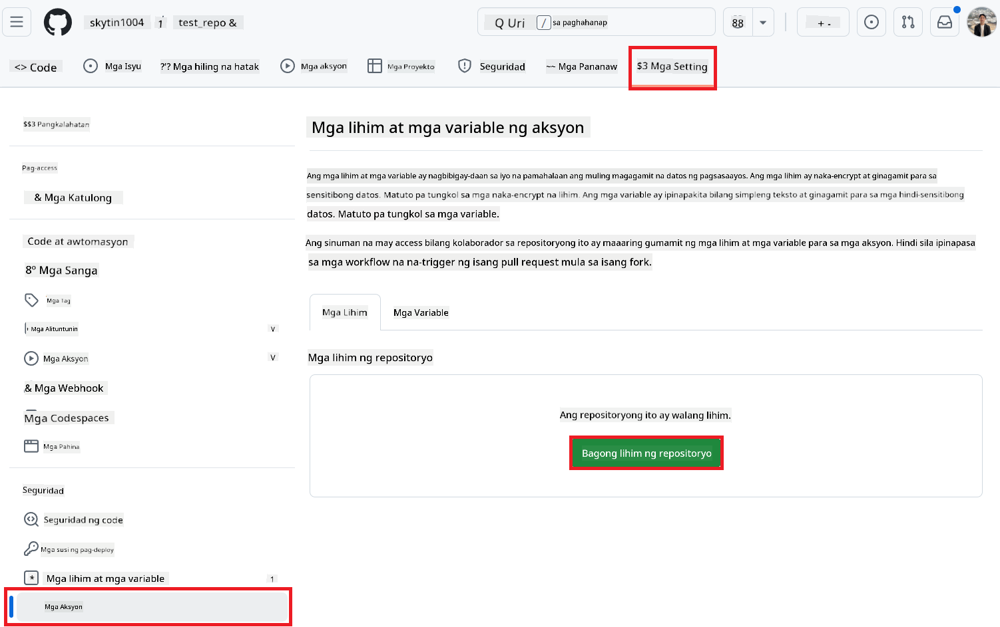

<!--
CO_OP_TRANSLATOR_METADATA:
{
  "original_hash": "c437820027c197f25fb2cbee95bae28c",
  "translation_date": "2025-06-12T19:14:59+00:00",
  "source_file": "getting_started/github-actions-guide/github-actions-guide-org.md",
  "language_code": "tl"
}
-->
# Paggamit ng Co-op Translator GitHub Action (Gabay para sa Organisasyon)

**Target na Mambabasa:** Ang gabay na ito ay para sa **mga internal na user ng Microsoft** o **mga team na may access sa kinakailangang kredensyal para sa pre-built na Co-op Translator GitHub App** o kaya ay kayang gumawa ng sarili nilang custom na GitHub App.

Automatiko mong isalin ang dokumentasyon ng iyong repositoryo gamit ang Co-op Translator GitHub Action. Tinatalakay ng gabay na ito kung paano i-setup ang action upang awtomatikong gumawa ng pull requests na may updated na mga salin kapag may pagbabago sa iyong source Markdown files o mga larawan.

> [!IMPORTANT]
>
> **Pagpili ng Tamang Gabay:**
>
> Detalyado sa gabay na ito ang setup gamit ang **GitHub App ID at Private Key**. Kadalasan, kailangan mo ang paraang "Organization Guide" kung: **`GITHUB_TOKEN` Permissions ay Limitado:** Pinipigilan ng settings ng iyong organisasyon o repositoryo ang mga default na permiso na ibinibigay sa karaniwang `GITHUB_TOKEN`. Partikular, kung hindi pinapayagan ang `GITHUB_TOKEN` ng mga kinakailangang permiso sa `write` (tulad ng `contents: write` o `pull-requests: write`), mabibigo ang workflow sa [Public Setup Guide](./github-actions-guide-public.md) dahil sa kakulangan ng permiso. Ang paggamit ng dedikadong GitHub App na may tahasang ipinagkaloob na mga permiso ay nakakaiwas sa limitasyong ito.
>
> **Kung hindi ito ang kaso para sa iyo:**
>
> Kung ang karaniwang `GITHUB_TOKEN` ay may sapat na permiso sa iyong repositoryo (ibig sabihin, hindi ka nahaharang ng mga limitasyon ng organisasyon), gamitin ang **[Public Setup Guide gamit ang GITHUB_TOKEN](./github-actions-guide-public.md)**. Hindi kailangan ng public guide na kumuha o mag-manage ng App IDs o Private Keys at umaasa lamang sa karaniwang `GITHUB_TOKEN` at permiso ng repositoryo.

## Mga Kinakailangan

Bago i-configure ang GitHub Action, siguraduhing handa na ang mga kinakailangang kredensyal para sa AI service.

**1. Kinakailangan: Kredensyal para sa AI Language Model**  
Kailangan mo ng kredensyal para sa kahit isa sa mga suportadong Language Model:

- **Azure OpenAI**: Kailangan ang Endpoint, API Key, Pangalan ng Model/Deployment, API Version.  
- **OpenAI**: Kailangan ang API Key, (Opsyonal: Org ID, Base URL, Model ID).  
- Tingnan ang [Supported Models and Services](../../../../README.md) para sa detalye.  
- Gabay sa Setup: [I-setup ang Azure OpenAI](../set-up-resources/set-up-azure-openai.md).

**2. Opsyonal: Kredensyal para sa Computer Vision (para sa Pagsasalin ng Larawan)**

- Kailangan lang kung nais mong isalin ang teksto sa loob ng mga larawan.  
- **Azure Computer Vision**: Kailangan ang Endpoint at Subscription Key.  
- Kung hindi ito ibibigay, gagamitin ng action ang [Markdown-only mode](../markdown-only-mode.md).  
- Gabay sa Setup: [I-setup ang Azure Computer Vision](../set-up-resources/set-up-azure-computer-vision.md).

## Setup at Pag-configure

Sundin ang mga hakbang na ito para i-configure ang Co-op Translator GitHub Action sa iyong repositoryo:

### Hakbang 1: I-install at I-configure ang GitHub App Authentication

Gumagamit ang workflow ng GitHub App authentication para ligtas na makipag-ugnayan sa iyong repositoryo (halimbawa, gumawa ng pull requests) sa iyong ngalan. Pumili ng isa sa mga opsyon:

#### **Opsyon A: I-install ang Pre-built na Co-op Translator GitHub App (para sa Internal na Paggamit ng Microsoft)**

1. Pumunta sa [Co-op Translator GitHub App](https://github.com/apps/co-op-translator) na pahina.

1. Piliin ang **Install** at piliin ang account o organisasyon kung saan naroroon ang iyong target na repositoryo.

    

1. Piliin ang **Only select repositories** at piliin ang iyong target na repositoryo (halimbawa, `PhiCookBook`). I-click ang **Install**. Maaaring hilingin sa iyo na mag-authenticate.

    

1. **Kunin ang App Credentials (Kinakailangan ang Internal na Proseso):** Para payagan ang workflow na mag-authenticate bilang app, kailangan mo ng dalawang impormasyon mula sa Co-op Translator team:  
  - **App ID:** Ang natatanging identifier para sa Co-op Translator app. Ang App ID ay: `1164076`.  
  - **Private Key:** Kailangan mong makuha ang **buong nilalaman** ng `.pem` private key file mula sa tagapamahala. **Ituring ang key na ito tulad ng password at panatilihing ligtas.**

1. Magpatuloy sa Hakbang 2.

#### **Opsyon B: Gumamit ng Sariling Custom GitHub App**

- Kung gusto mo, maaari kang gumawa at mag-configure ng sarili mong GitHub App. Siguraduhing mayroon itong Read & write access sa Contents at Pull requests. Kailangan mo ang App ID at isang generated na Private Key.

### Hakbang 2: I-configure ang Repository Secrets

Kailangan mong idagdag ang GitHub App credentials at ang iyong AI service credentials bilang encrypted secrets sa settings ng iyong repositoryo.

1. Pumunta sa iyong target na GitHub repositoryo (halimbawa, `PhiCookBook`).

1. Pumunta sa **Settings** > **Secrets and variables** > **Actions**.

1. Sa ilalim ng **Repository secrets**, i-click ang **New repository secret** para sa bawat secret na nakalista sa ibaba.

   

**Kinakailangang Secrets (para sa GitHub App Authentication):**

| Pangalan ng Secret          | Paglalarawan                                     | Pinagmulan ng Halaga                           |
| :-------------------------- | :----------------------------------------------- | :--------------------------------------------- |
| `GH_APP_ID`          | Ang App ID ng GitHub App (mula sa Hakbang 1).   | GitHub App Settings                            |
| `GH_APP_PRIVATE_KEY`          | **Buong nilalaman** ng na-download na `.pem` file. | `.pem` file (mula sa Hakbang 1)   |

**AI Service Secrets (Idagdag LAHAT ng naaangkop base sa iyong Mga Kinakailangan):**

| Pangalan ng Secret           | Paglalarawan                                   | Pinagmulan ng Halaga                      |
| :--------------------------- | :---------------------------------------------- | :---------------------------------------- |
| `AZURE_SUBSCRIPTION_KEY`           | Key para sa Azure AI Service (Computer Vision) | Azure AI Foundry                         |
| `AZURE_AI_SERVICE_ENDPOINT`           | Endpoint para sa Azure AI Service (Computer Vision) | Azure AI Foundry                         |
| `AZURE_OPENAI_API_KEY`           | Key para sa Azure OpenAI service                | Azure AI Foundry                         |
| `AZURE_OPENAI_ENDPOINT`           | Endpoint para sa Azure OpenAI service           | Azure AI Foundry                         |
| `AZURE_OPENAI_MODEL_NAME`           | Pangalan ng Azure OpenAI Model                   | Azure AI Foundry                         |
| `AZURE_OPENAI_CHAT_DEPLOYMENT_NAME`           | Pangalan ng Azure OpenAI Deployment              | Azure AI Foundry                         |
| `AZURE_OPENAI_API_VERSION`           | API Version para sa Azure OpenAI                 | Azure AI Foundry                         |
| `OPENAI_API_KEY`           | API Key para sa OpenAI                           | OpenAI Platform                         |
| `OPENAI_ORG_ID`           | OpenAI Organization ID                           | OpenAI Platform                         |
| `OPENAI_CHAT_MODEL_ID`           | Partikular na OpenAI model ID                     | OpenAI Platform                         |
| `OPENAI_BASE_URL`           | Custom OpenAI API Base URL                        | OpenAI Platform                         |


### Hakbang 3: Gumawa ng Workflow File

Sa wakas, gumawa ng YAML file na nagde-define ng automated workflow.

1. Sa root directory ng iyong repositoryo, gumawa ng `.github/workflows/` na directory kung wala pa ito.

1. Sa loob ng `.github/workflows/`, gumawa ng file na pinangalanang `co-op-translator.yml`.

1. I-paste ang sumusunod na nilalaman sa co-op-translator.yml.

```
name: Co-op Translator

on:
  push:
    branches:
      - main

jobs:
  co-op-translator:
    runs-on: ubuntu-latest

    permissions:
      contents: write
      pull-requests: write

    steps:
      - name: Checkout repository
        uses: actions/checkout@v4
        with:
          fetch-depth: 0

      - name: Set up Python
        uses: actions/setup-python@v4
        with:
          python-version: '3.10'

      - name: Install Co-op Translator
        run: |
          python -m pip install --upgrade pip
          pip install co-op-translator

      - name: Run Co-op Translator
        env:
          PYTHONIOENCODING: utf-8
          # Azure AI Service Credentials
          AZURE_SUBSCRIPTION_KEY: ${{ secrets.AZURE_SUBSCRIPTION_KEY }}
          AZURE_AI_SERVICE_ENDPOINT: ${{ secrets.AZURE_AI_SERVICE_ENDPOINT }}

          # Azure OpenAI Credentials
          AZURE_OPENAI_API_KEY: ${{ secrets.AZURE_OPENAI_API_KEY }}
          AZURE_OPENAI_ENDPOINT: ${{ secrets.AZURE_OPENAI_ENDPOINT }}
          AZURE_OPENAI_MODEL_NAME: ${{ secrets.AZURE_OPENAI_MODEL_NAME }}
          AZURE_OPENAI_CHAT_DEPLOYMENT_NAME: ${{ secrets.AZURE_OPENAI_CHAT_DEPLOYMENT_NAME }}
          AZURE_OPENAI_API_VERSION: ${{ secrets.AZURE_OPENAI_API_VERSION }}

          # OpenAI Credentials
          OPENAI_API_KEY: ${{ secrets.OPENAI_API_KEY }}
          OPENAI_ORG_ID: ${{ secrets.OPENAI_ORG_ID }}
          OPENAI_CHAT_MODEL_ID: ${{ secrets.OPENAI_CHAT_MODEL_ID }}
          OPENAI_BASE_URL: ${{ secrets.OPENAI_BASE_URL }}
        run: |
          # =====================================================================
          # IMPORTANT: Set your target languages here (REQUIRED CONFIGURATION)
          # =====================================================================
          # Example: Translate to Spanish, French, German. Add -y to auto-confirm.
          translate -l "es fr de" -y  # <--- MODIFY THIS LINE with your desired languages

      - name: Authenticate GitHub App
        id: generate_token
        uses: tibdex/github-app-token@v1
        with:
          app_id: ${{ secrets.GH_APP_ID }}
          private_key: ${{ secrets.GH_APP_PRIVATE_KEY }}

      - name: Create Pull Request with translations
        uses: peter-evans/create-pull-request@v5
        with:
          token: ${{ steps.generate_token.outputs.token }}
          commit-message: "🌐 Update translations via Co-op Translator"
          title: "🌐 Update translations via Co-op Translator"
          body: |
            This PR updates translations for recent changes to the main branch.

            ### 📋 Changes included
            - Translated contents are available in the `translations/` directory
            - Translated images are available in the `translated_images/` directory

            ---
            🌐 Automatically generated by the [Co-op Translator](https://github.com/Azure/co-op-translator) GitHub Action.
          branch: update-translations
          base: main
          labels: translation, automated-pr
          delete-branch: true
          add-paths: |
            translations/
            translated_images/

```

4.  **I-customize ang Workflow:**  
  - **[!IMPORTANT] Target na Mga Wika:** Sa `Run Co-op Translator` step, you **MUST review and modify the list of language codes** within the `translate -l "..." -y` command to match your project's requirements. The example list (`ar de es...`) needs to be replaced or adjusted.
  - **Trigger (`on:`):** The current trigger runs on every push to `main`. For large repositories, consider adding a `paths:` filter (see commented example in the YAML) to run the workflow only when relevant files (e.g., source documentation) change, saving runner minutes.
  - **PR Details:** Customize the `commit-message`, `title`, `body`, `branch` name, and `labels` in the `Create Pull Request` step if needed.

## Credential Management and Renewal

- **Security:** Always store sensitive credentials (API keys, private keys) as GitHub Actions secrets. Never expose them in your workflow file or repository code.
- **[!IMPORTANT] Key Renewal (Internal Microsoft Users):** Be aware that Azure OpenAI key used within Microsoft might have a mandatory renewal policy (e.g., every 5 months). Ensure you update the corresponding GitHub secrets (`AZURE_OPENAI_...` mga susi) **bago ito mag-expire** upang maiwasan ang pagkabigo ng workflow.

## Pagpapatakbo ng Workflow

Kapag na-merge na ang `co-op-translator.yml` file sa iyong main branch (o sa branch na tinukoy sa `on:` trigger), the workflow will automatically run whenever changes are pushed to that branch (and match the `paths` filter, kung naka-configure).

Kung may mga nalikhang o na-update na mga salin, awtomatikong gagawa ang action ng Pull Request na naglalaman ng mga pagbabago, handa nang suriin at i-merge.

**Paunawa**:  
Ang dokumentong ito ay isinalin gamit ang AI translation service na [Co-op Translator](https://github.com/Azure/co-op-translator). Bagamat nagsusumikap kami para sa katumpakan, pakatandaan na ang mga awtomatikong salin ay maaaring maglaman ng mga pagkakamali o hindi pagkakatugma. Ang orihinal na dokumento sa orihinal nitong wika ang dapat ituring na pangunahing sanggunian. Para sa mahahalagang impormasyon, inirerekomenda ang propesyonal na pagsasalin ng tao. Hindi kami mananagot sa anumang hindi pagkakaunawaan o maling interpretasyon na maaaring magmula sa paggamit ng pagsasaling ito.