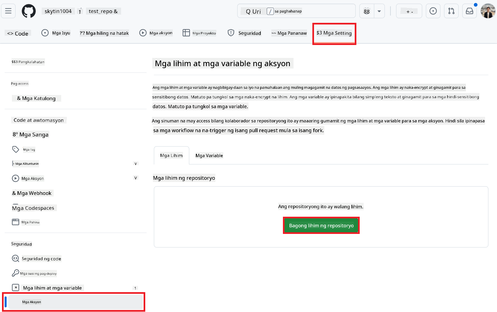
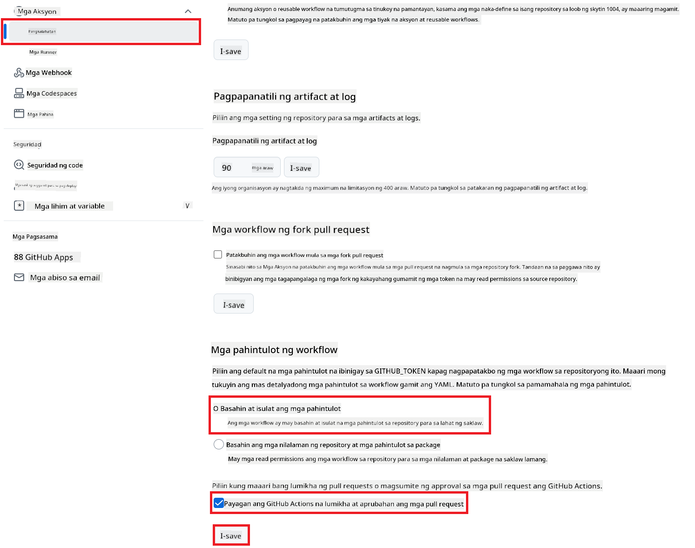

<!--
CO_OP_TRANSLATOR_METADATA:
{
  "original_hash": "a52587a512e667f70d92db853d3c61d5",
  "translation_date": "2025-06-12T19:32:40+00:00",
  "source_file": "getting_started/github-actions-guide/github-actions-guide-public.md",
  "language_code": "tl"
}
-->
# Paggamit ng Co-op Translator GitHub Action (Pampublikong Setup)

**Target na Tagapakinig:** Ang gabay na ito ay para sa mga gumagamit sa karamihan ng pampubliko o pribadong mga repository kung saan sapat ang karaniwang mga pahintulot ng GitHub Actions. Ginagamit nito ang built-in na `GITHUB_TOKEN`.

I-automate ang pagsasalin ng dokumentasyon ng iyong repository nang madali gamit ang Co-op Translator GitHub Action. Tinatalakay ng gabay na ito kung paano i-setup ang action upang awtomatikong gumawa ng mga pull request na may mga na-update na pagsasalin tuwing may pagbabago sa iyong source Markdown files o mga imahe.

> [!IMPORTANT]
>
> **Pagpili ng Tamang Gabay:**
>
> Detalyado sa gabay na ito ang **mas simpleng setup gamit ang karaniwang `GITHUB_TOKEN`**. Ito ang inirerekomendang paraan para sa karamihan ng mga gumagamit dahil hindi nito kailangan ng pamamahala ng sensitibong GitHub App Private Keys.
>

## Mga Kinakailangan

Bago i-configure ang GitHub Action, tiyaking handa na ang mga kinakailangang kredensyal ng AI service.

**1. Kinakailangan: Kredensyal ng AI Language Model**  
Kailangan mo ng kredensyal para sa kahit isa sa mga suportadong Language Model:

- **Azure OpenAI**: Kailangan ang Endpoint, API Key, Pangalan ng Model/Deployment, API Version.  
- **OpenAI**: Kailangan ang API Key, (Opsyonal: Org ID, Base URL, Model ID).  
- Tingnan ang [Supported Models and Services](../../../../README.md) para sa detalye.

**2. Opsyonal: Kredensyal ng AI Vision (para sa Pagsasalin ng Imahe)**

- Kailangan lang ito kung nais mong isalin ang teksto sa loob ng mga imahe.  
- **Azure AI Vision**: Kailangan ang Endpoint at Subscription Key.  
- Kung hindi ito ibibigay, ang action ay awtomatikong gagana sa [Markdown-only mode](../markdown-only-mode.md).

## Setup at Pag-configure

Sundin ang mga hakbang na ito upang i-configure ang Co-op Translator GitHub Action sa iyong repository gamit ang karaniwang `GITHUB_TOKEN`.

### Hakbang 1: Unawain ang Authentication (Paggamit ng `GITHUB_TOKEN`)

Ginagamit ng workflow na ito ang built-in na `GITHUB_TOKEN` na ibinibigay ng GitHub Actions. Ang token na ito ay awtomatikong nagbibigay ng mga pahintulot sa workflow para makipag-interact sa iyong repository base sa mga setting na iaayos sa **Hakbang 3**.

### Hakbang 2: I-configure ang Repository Secrets

Kailangan mo lang idagdag ang iyong **AI service credentials** bilang encrypted secrets sa settings ng iyong repository.

1.  Pumunta sa target na GitHub repository.  
2.  Pumunta sa **Settings** > **Secrets and variables** > **Actions**.  
3.  Sa ilalim ng **Repository secrets**, i-click ang **New repository secret** para sa bawat kinakailangang AI service secret na nakalista sa ibaba.

     *(Larawan ng sanggunian: Ipinapakita kung saan magdagdag ng mga secrets)*

**Kinakailangang AI Service Secrets (Idagdag LAHAT na naaangkop base sa iyong Mga Kinakailangan):**

| Pangalan ng Secret                   | Paglalarawan                            | Pinagmulan ng Halaga            |
| :---------------------------------- | :------------------------------------- | :------------------------------ |
| `AZURE_SUBSCRIPTION_KEY`            | Key para sa Azure AI Service (Computer Vision)  | Iyong Azure AI Foundry           |
| `AZURE_AI_SERVICE_ENDPOINT`         | Endpoint para sa Azure AI Service (Computer Vision) | Iyong Azure AI Foundry           |
| `AZURE_OPENAI_API_KEY`              | Key para sa Azure OpenAI service              | Iyong Azure AI Foundry           |
| `AZURE_OPENAI_ENDPOINT`             | Endpoint para sa Azure OpenAI service         | Iyong Azure AI Foundry           |
| `AZURE_OPENAI_MODEL_NAME`           | Pangalan ng Azure OpenAI Model              | Iyong Azure AI Foundry           |
| `AZURE_OPENAI_CHAT_DEPLOYMENT_NAME` | Pangalan ng Azure OpenAI Deployment         | Iyong Azure AI Foundry           |
| `AZURE_OPENAI_API_VERSION`          | API Version para sa Azure OpenAI              | Iyong Azure AI Foundry           |
| `OPENAI_API_KEY`                    | API Key para sa OpenAI                        | Iyong OpenAI Platform            |
| `OPENAI_ORG_ID`                     | OpenAI Organization ID (Opsyonal)         | Iyong OpenAI Platform            |
| `OPENAI_CHAT_MODEL_ID`              | Tiyak na OpenAI model ID (Opsyonal)       | Iyong OpenAI Platform            |
| `OPENAI_BASE_URL`                   | Custom OpenAI API Base URL (Opsyonal)     | Iyong OpenAI Platform            |

### Hakbang 3: I-configure ang Workflow Permissions

Kailangan ng GitHub Action ng mga pahintulot na ibibigay sa pamamagitan ng `GITHUB_TOKEN` para makapag-check out ng code at makagawa ng pull requests.

1.  Sa iyong repository, pumunta sa **Settings** > **Actions** > **General**.  
2.  Mag-scroll pababa sa seksyong **Workflow permissions**.  
3.  Piliin ang **Read and write permissions**. Binibigyan nito ang `GITHUB_TOKEN` ng kinakailangang `contents: write` at `pull-requests: write` na mga pahintulot para sa workflow na ito.  
4.  Siguraduhing naka-check ang kahon para sa **Allow GitHub Actions to create and approve pull requests**.  
5.  Piliin ang **Save**.



### Hakbang 4: Gumawa ng Workflow File

Sa wakas, gumawa ng YAML file na naglalarawan ng automated workflow gamit ang `GITHUB_TOKEN`.

1.  Sa root directory ng iyong repository, gumawa ng `.github/workflows/` na folder kung wala pa ito.  
2.  Sa loob ng `.github/workflows/`, gumawa ng file na pinangalanang `co-op-translator.yml`.  
3.  I-paste ang sumusunod na nilalaman sa `co-op-translator.yml`.

```yaml
name: Co-op Translator

on:
  push:
    branches:
      - main

jobs:
  co-op-translator:
    runs-on: ubuntu-latest

    permissions:
      contents: write
      pull-requests: write

    steps:
      - name: Checkout repository
        uses: actions/checkout@v4
        with:
          fetch-depth: 0

      - name: Set up Python
        uses: actions/setup-python@v4
        with:
          python-version: '3.10'

      - name: Install Co-op Translator
        run: |
          python -m pip install --upgrade pip
          pip install co-op-translator

      - name: Run Co-op Translator
        env:
          PYTHONIOENCODING: utf-8
          # === AI Service Credentials ===
          AZURE_SUBSCRIPTION_KEY: ${{ secrets.AZURE_SUBSCRIPTION_KEY }}
          AZURE_AI_SERVICE_ENDPOINT: ${{ secrets.AZURE_AI_SERVICE_ENDPOINT }}
          AZURE_OPENAI_API_KEY: ${{ secrets.AZURE_OPENAI_API_KEY }}
          AZURE_OPENAI_ENDPOINT: ${{ secrets.AZURE_OPENAI_ENDPOINT }}
          AZURE_OPENAI_MODEL_NAME: ${{ secrets.AZURE_OPENAI_MODEL_NAME }}
          AZURE_OPENAI_CHAT_DEPLOYMENT_NAME: ${{ secrets.AZURE_OPENAI_CHAT_DEPLOYMENT_NAME }}
          AZURE_OPENAI_API_VERSION: ${{ secrets.AZURE_OPENAI_API_VERSION }}
          OPENAI_API_KEY: ${{ secrets.OPENAI_API_KEY }}
          OPENAI_ORG_ID: ${{ secrets.OPENAI_ORG_ID }}
          OPENAI_CHAT_MODEL_ID: ${{ secrets.OPENAI_CHAT_MODEL_ID }}
          OPENAI_BASE_URL: ${{ secrets.OPENAI_BASE_URL }}
        run: |
          # =====================================================================
          # IMPORTANT: Set your target languages here (REQUIRED CONFIGURATION)
          # =====================================================================
          # Example: Translate to Spanish, French, German. Add -y to auto-confirm.
          translate -l "es fr de" -y  # <--- MODIFY THIS LINE with your desired languages

      - name: Create Pull Request with translations
        uses: peter-evans/create-pull-request@v5
        with:
          token: ${{ secrets.GITHUB_TOKEN }}
          commit-message: "🌐 Update translations via Co-op Translator"
          title: "🌐 Update translations via Co-op Translator"
          body: |
            This PR updates translations for recent changes to the main branch.

            ### 📋 Changes included
            - Translated contents are available in the `translations/` directory
            - Translated images are available in the `translated_images/` directory

            ---
            🌐 Automatically generated by the [Co-op Translator](https://github.com/Azure/co-op-translator) GitHub Action.
          branch: update-translations
          base: main
          labels: translation, automated-pr
          delete-branch: true
          add-paths: |
            translations/
            translated_images/
```  
4.  **I-customize ang Workflow:**  
  - **[!IMPORTANT] Target na mga Wika:** Sa hakbang na `Run Co-op Translator` step, you **MUST review and modify the list of language codes** within the `translate -l "..." -y` command to match your project's requirements. The example list (`ar de es...`) needs to be replaced or adjusted.
  - **Trigger (`on:`):** The current trigger runs on every push to `main`. For large repositories, consider adding a `paths:` filter (see commented example in the YAML) to run the workflow only when relevant files (e.g., source documentation) change, saving runner minutes.
  - **PR Details:** Customize the `commit-message`, `title`, `body`, `branch` name, and `labels` in the `Create Pull Request` kung kinakailangan.

**Pahayag ng Pagtanggi**:  
Ang dokumentong ito ay isinalin gamit ang AI translation service na [Co-op Translator](https://github.com/Azure/co-op-translator). Bagamat nagsusumikap kami para sa katumpakan, pakatandaan na ang mga awtomatikong pagsasalin ay maaaring maglaman ng mga pagkakamali o di-tumpak na impormasyon. Ang orihinal na dokumento sa kanyang likas na wika ang dapat ituring na pangunahing sanggunian. Para sa mga mahahalagang impormasyon, inirerekomenda ang propesyonal na pagsasalin ng tao. Hindi kami mananagot sa anumang hindi pagkakaunawaan o maling interpretasyon na maaaring magmula sa paggamit ng pagsasaling ito.