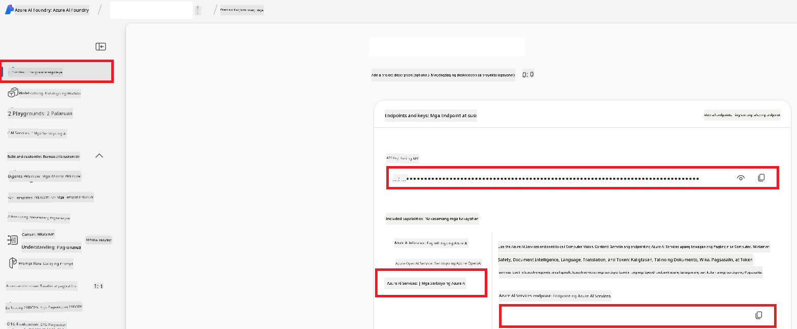

<!--
CO_OP_TRANSLATOR_METADATA:
{
  "original_hash": "b58d7c3cb4210697a073d20eb3064945",
  "translation_date": "2025-06-12T11:56:41+00:00",
  "source_file": "getting_started/set-up-azure-ai.md",
  "language_code": "tl"
}
-->
# I-set Up ang Azure AI para sa Co-op Translator (Azure OpenAI & Azure AI Vision)

Itong gabay ay magtuturo sa'yo kung paano i-set up ang Azure OpenAI para sa pagsasalin ng wika at Azure Computer Vision para sa pagsusuri ng nilalaman ng larawan (na maaari ring gamitin para sa pagsasalin gamit ang larawan) sa loob ng Azure AI Foundry.

**Mga Kinakailangan:**
- Isang Azure account na may aktibong subscription.
- Sapat na permiso para gumawa ng mga resources at deployments sa iyong Azure subscription.

## Gumawa ng Azure AI Project

Magsisimula ka sa paggawa ng Azure AI Project, na magsisilbing sentrong lugar para sa pamamahala ng iyong AI resources.

1. Pumunta sa [https://ai.azure.com](https://ai.azure.com) at mag-sign in gamit ang iyong Azure account.

1. Piliin ang **+Create** para gumawa ng bagong proyekto.

1. Gawin ang mga sumusunod:
   - Ilagay ang **Project name** (halimbawa, `CoopTranslator-Project`).
   - Piliin ang **AI hub** (halimbawa, `CoopTranslator-Hub`) (Gumawa ng bago kung kinakailangan).

1. I-click ang "**Review and Create**" para i-set up ang iyong proyekto. Dadalhin ka sa overview page ng iyong proyekto.

## I-set up ang Azure OpenAI para sa Pagsasalin ng Wika

Sa loob ng iyong proyekto, magde-deploy ka ng Azure OpenAI model na magsisilbing backend para sa pagsasalin ng teksto.

### Pumunta sa Iyong Proyekto

Kung hindi ka pa naroroon, buksan ang bagong likha mong proyekto (halimbawa, `CoopTranslator-Project`) sa Azure AI Foundry.

### Mag-deploy ng OpenAI Model

1. Mula sa kaliwang menu ng iyong proyekto, sa ilalim ng "My assets", piliin ang "**Models + endpoints**".

1. Piliin ang **+ Deploy model**.

1. Piliin ang **Deploy Base Model**.

1. Lalabas ang listahan ng mga available na modelo. Hanapin o i-filter ang angkop na GPT model. Inirerekomenda namin ang `gpt-4o`.

1. Piliin ang nais mong modelo at i-click ang **Confirm**.

1. Piliin ang **Deploy**.

### Azure OpenAI configuration

Kapag na-deploy na, maaari mong piliin ang deployment mula sa "**Models + endpoints**" page para makita ang **REST endpoint URL**, **Key**, **Deployment name**, **Model name** at **API version** nito. Kailangan ang mga ito para ma-integrate ang translation model sa iyong aplikasyon.

> [!NOTE]
> Maaari kang pumili ng API versions mula sa [API version deprecation](https://learn.microsoft.com/azure/ai-services/openai/api-version-deprecation) page base sa iyong pangangailangan. Tandaan na ang **API version** ay iba sa **Model version** na makikita sa **Models + endpoints** page sa Azure AI Foundry.

## I-set up ang Azure Computer Vision para sa Pagsasalin ng Larawan

Para payagan ang pagsasalin ng teksto sa loob ng mga larawan, kailangan mong hanapin ang Azure AI Service API Key at Endpoint.

1. Pumunta sa iyong Azure AI Project (halimbawa, `CoopTranslator-Project`). Siguraduhing nasa project overview page ka.

### Azure AI Service configuration

Hanapin ang API Key at Endpoint mula sa Azure AI Service.

1. Pumunta sa iyong Azure AI Project (halimbawa, `CoopTranslator-Project`). Siguraduhing nasa project overview page ka.

1. Hanapin ang **API Key** at **Endpoint** mula sa Azure AI Service tab.

    

Ang koneksyong ito ang nagbibigay-daan para magamit ang kakayahan ng naka-link na Azure AI Services resource (kasama na ang pagsusuri ng larawan) sa iyong AI Foundry project. Maaari mo itong gamitin sa iyong notebooks o aplikasyon para kunin ang teksto mula sa mga larawan, na maaari namang ipadala sa Azure OpenAI model para sa pagsasalin.

## Pagsasama-sama ng Iyong mga Kredensyal

Sa puntong ito, dapat ay nakolekta mo na ang mga sumusunod:

**Para sa Azure OpenAI (Pagsasalin ng Teksto):**
- Azure OpenAI Endpoint
- Azure OpenAI API Key
- Azure OpenAI Model Name (halimbawa, `gpt-4o`)
- Azure OpenAI Deployment Name (halimbawa, `cooptranslator-gpt4o`)
- Azure OpenAI API Version

**Para sa Azure AI Services (Pagkuha ng Teksto mula sa Larawan gamit ang Vision):**
- Azure AI Service Endpoint
- Azure AI Service API Key

### Halimbawa: Pag-configure ng Environment Variables (Preview)

Sa pagbuo ng iyong aplikasyon, malamang na gagamitin mo ang mga nakolektang kredensyal na ito sa pamamagitan ng environment variables, ganito:

```bash
# Azure AI Service Credentials (Required for image translation)
AZURE_AI_SERVICE_API_KEY="your_azure_ai_service_api_key" # e.g., 21xasd...
AZURE_AI_SERVICE_ENDPOINT="https://your_azure_ai_service_endpoint.cognitiveservices.azure.com/"

# Azure OpenAI Credentials (Required for text translation)
AZURE_OPENAI_API_KEY="your_azure_openai_api_key" # e.g., 21xasd...
AZURE_OPENAI_ENDPOINT="https://your_azure_openai_endpoint.openai.azure.com/"
AZURE_OPENAI_MODEL_NAME="your_model_name" # e.g., gpt-4o
AZURE_OPENAI_CHAT_DEPLOYMENT_NAME="your_deployment_name" # e.g., cooptranslator-gpt4o
AZURE_OPENAI_API_VERSION="your_api_version" # e.g., 2024-12-01-preview
```

---

### Karagdagang Pagbabasa

- [How to Create a project in Azure AI Foundry](https://learn.microsoft.com/azure/ai-foundry/how-to/create-projects?tabs=ai-studio)
- [How to Create Azure AI resources](https://learn.microsoft.com/azure/ai-foundry/how-to/create-azure-ai-resource?tabs=portal)
- [How to Deploy OpenAI models in Azure AI Foundry](https://learn.microsoft.com/en-us/azure/ai-foundry/how-to/deploy-models-openai)

**Pagsasalin ng Teks**:  
Ang dokumentong ito ay isinalin gamit ang serbisyo ng AI na pagsasalin na [Co-op Translator](https://github.com/Azure/co-op-translator). Bagamat nagsusumikap kaming maging tumpak, pakatandaan na ang mga awtomatikong pagsasalin ay maaaring maglaman ng mga pagkakamali o kamalian. Ang orihinal na dokumento sa kanyang sariling wika ang dapat ituring na pangunahing sanggunian. Para sa mahahalagang impormasyon, inirerekomenda ang propesyonal na pagsasalin ng tao. Hindi kami mananagot sa anumang hindi pagkakaunawaan o maling interpretasyon na nagmula sa paggamit ng pagsasaling ito.