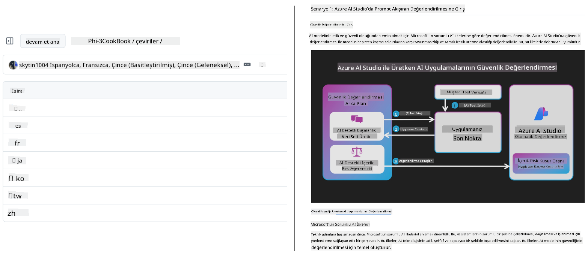
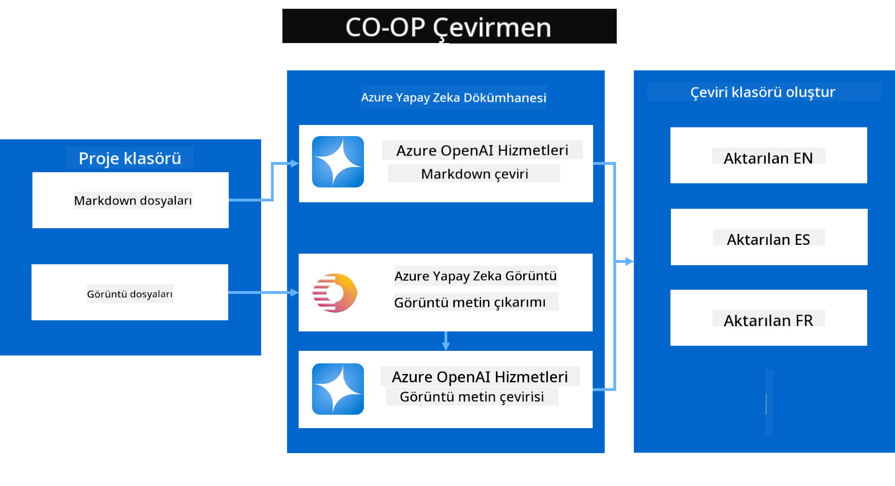
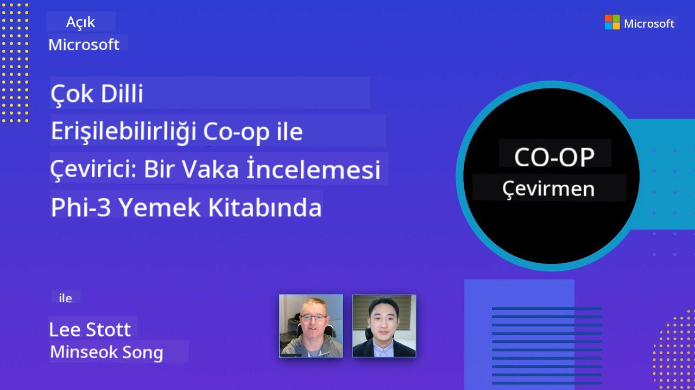

<!--
CO_OP_TRANSLATOR_METADATA:
{
  "original_hash": "044724537b57868117aadae8e7728c7c",
  "translation_date": "2025-06-12T10:24:36+00:00",
  "source_file": "README.md",
  "language_code": "tr"
}
-->


# Co-op Translator: Eğitim Dokümantasyonunu Kolayca Otomatik Çevirin

_Dokümantasyonunuzu birden fazla dile kolayca otomatik çevirerek global bir kitleye ulaşın._

[](https://pypi.org/project/co-op-translator/)
[](https://github.com/azure/co-op-translator/blob/main/LICENSE)
[](https://pepy.tech/project/co-op-translator)
[](https://pepy.tech/project/co-op-translator)
[](https://github.com/psf/black)

[](https://GitHub.com/azure/co-op-translator/graphs/contributors/)
[](https://GitHub.com/azure/co-op-translator/issues/)
[](https://GitHub.com/azure/co-op-translator/pulls/)
[](http://makeapullrequest.com)

### Co-op Translator ile Güçlendirilmiş Dil Desteği
[Fransızca](../fr/README.md) | [İspanyolca](../es/README.md) | [Almanca](../de/README.md) | [Rusça](../ru/README.md) | [Arapça](../ar/README.md) | [Farsça (Farsi)](../fa/README.md) | [Urduca](../ur/README.md) | [Çince (Basitleştirilmiş)](../zh/README.md) | [Çince (Geleneksel, Makao)](../mo/README.md) | [Çince (Geleneksel, Hong Kong)](../hk/README.md) | [Çince (Geleneksel, Tayvan)](../tw/README.md) | [Japonca](../ja/README.md) | [Korece](../ko/README.md) | [Hintçe](../hi/README.md) | [Bengalce](../bn/README.md) | [Marathi](../mr/README.md) | [Nepalce](../ne/README.md) | [Pencapça (Gurmukhi)](../pa/README.md) | [Portekizce (Portekiz)](../pt/README.md) | [Portekizce (Brezilya)](../br/README.md) | [İtalyanca](../it/README.md) | [Lehçe](../pl/README.md) | [Türkçe](./README.md) | [Yunanca](../el/README.md) | [Tayca](../th/README.md) | [İsveççe](../sv/README.md) | [Danca](../da/README.md) | [Norveççe](../no/README.md) | [Fince](../fi/README.md) | [Flemenkçe](../nl/README.md) | [İbranice](../he/README.md) | [Vietnamca](../vi/README.md) | [Endonezce](../id/README.md) | [Malayca](../ms/README.md) | [Tagalogca (Filipince)](../tl/README.md) | [Svahili](../sw/README.md) | [Macarca](../hu/README.md) | [Çekçe](../cs/README.md) | [Slovakça](../sk/README.md) | [Romence](../ro/README.md) | [Bulgarca](../bg/README.md) | [Sırpça (Kiril)](../sr/README.md) | [Hırvatça](../hr/README.md) | [Slovence](../sl/README.md) | [Ukraynaca](../uk/README.md) | [Burmaca (Myanmar)](../my/README.md)
> [!NOTE]
> Bunlar bu depo içeriğinin mevcut çevirileridir. Co-op Translator tarafından desteklenen dillerin tam listesi için lütfen [Language Support](../..) bölümüne bakınız.

[](https://GitHub.com/azure/co-op-translator/watchers/)
[](https://GitHub.com/azure/co-op-translator/network/)
[](https://GitHub.com/azure/co-op-translator/stargazers/)

[](https://discord.com/invite/ByRwuEEgH4)

[](https://codespaces.new/azure/co-op-translator)
[](https://vscode.dev/redirect?url=vscode://ms-vscode-remote.remote-containers/cloneInVolume?url=https://github.com/azure/co-op-translator)

## Genel Bakış: Eğitim İçeriğinizin Çevirisini Kolaylaştırın

Dil engelleri, dünya genelindeki öğrenenler ve geliştiriciler için değerli eğitim kaynaklarına ve teknik bilgiye erişimi önemli ölçüde zorlaştırır. Bu durum katılımı sınırlar ve küresel inovasyon ile öğrenme hızını yavaşlatır.

**Co-op Translator**, Microsoft’un kendi büyük ölçekli eğitim serileri (örneğin "Yeni Başlayanlar İçin" rehberleri) için verimsiz manuel çeviri sürecini çözme ihtiyacından doğdu. Herkes için bu engelleri kaldırmak üzere kolay kullanımlı, güçlü bir araç haline evrildi. CLI ve GitHub Actions aracılığıyla yüksek kaliteli otomatik çeviriler sunarak, Co-op Translator eğitimcilerin, öğrencilerin, araştırmacıların ve geliştiricilerin dünya çapında dil engeli olmadan bilgi paylaşmasını ve erişmesini sağlar.

Co-op Translator’ın çevrilmiş eğitim içeriğini nasıl düzenlediğine göz atın:



Markdown dosyaları ve resim metinleri otomatik olarak çevrilir ve dil bazlı klasörlere düzenli şekilde yerleştirilir.

**Eğitim içeriğinize Co-op Translator ile bugün küresel erişim sağlayın!**

## Microsoft’un Öğrenme Kaynakları İçin Küresel Erişimi Desteklemek

Co-op Translator, küresel geliştirici topluluğuna hizmet eden Microsoft’un önemli eğitim girişimleri için dil bariyerini aşmaya yardımcı olur ve çeviri sürecini otomatikleştirir. Şu anda Co-op Translator kullanan örnekler şunlardır:

[](https://github.com/microsoft/Generative-AI-for-beginners)
[](https://github.com/microsoft/ML-For-Beginners)
[](https://github.com/microsoft/AI-For-Beginners)
[](https://github.com/microsoft/ai-agents-for-beginners)
[](https://github.com/microsoft/PhiCookBook)
[](https://github.com/microsoft/Generative-AI-for-beginners-dotnet)

## Temel Özellikler

- **Otomatik Çeviriler**: Metni kolayca birden fazla dile çevirin.
- **GitHub Actions Entegrasyonu**: Çevirileri CI/CD sürecinizin bir parçası olarak otomatikleştirin.
- **Markdown Koruma**: Çeviri sırasında doğru Markdown sözdizimini koruyun.
- **Resim Metni Çevirisi**: Resimlerdeki metni çıkarıp çevirin.
- **Gelişmiş LLM Teknolojisi**: Yüksek kaliteli çeviriler için son teknoloji dil modellerini kullanın.
- **Kolay Entegrasyon**: Mevcut proje yapınıza sorunsuz entegre edin.
- **Yerelleştirmeyi Basitleştirin**: Projenizin uluslararası pazarlara uyarlanmasını kolaylaştırın.

## Nasıl Çalışır



Co-op Translator, proje klasörünüzdeki Markdown dosyalarını ve resimleri şu şekilde işler:

1. **Metin Çıkarma**: Markdown dosyalarından ve yapılandırıldıysa (örneğin Azure AI Vision ile) resim içindeki gömülü metni çıkarır.
1. **Yapay Zeka Çevirisi**: Çıkarılan metni yapılandırılmış LLM’ye (Azure OpenAI, OpenAI vb.) gönderir.
1. **Sonuç Kaydetme**: Çevrilmiş Markdown dosyalarını ve (çevirisi yapılmış metin içeren) resimleri dil bazlı klasörlere, orijinal biçimlendirmeyi koruyarak kaydeder.

## Başlarken

CLI ile hızlıca başlayabilir veya GitHub Actions ile tam otomasyon kurabilirsiniz. İş akışınıza en uygun yöntemi seçin:

1. **Komut Satırı (CLI)** - Tek seferlik çeviriler veya manuel kontrol için
2. **GitHub Actions** - Her push’da otomatik çeviriler için

> [!NOTE]
> Bu öğretici Azure kaynaklarına odaklanmakla birlikte, desteklenen herhangi bir dil modelini kullanabilirsiniz.

### Dil Desteği

Co-op Translator, küresel bir kitleye ulaşmanıza yardımcı olmak için çok sayıda dili destekler. İşte bilmeniz gerekenler:

#### Hızlı Referans

| Dil | Kod | Dil | Kod | Dil | Kod |
|----------|------|----------|------|----------|------|
| Arapça | ar | Bengalce | bn | Bulgarca | bg |
| Burmaca (Myanmar) | my | Çince (Basitleştirilmiş) | zh | Çince (Geleneksel, HK) | hk |
| Çince (Geleneksel, Macau) | mo | Çince (Geleneksel, TW) | tw | Hırvatça | hr |
| Çekçe | cs | Danca | da | Flemenkçe | nl |
| Fince | fi | Fransızca | fr | Almanca | de |
| Yunanca | el | İbranice | he | Hintçe | hi |
| Macarca | hu | Endonezce | id | İtalyanca | it |
| Japonca | ja | Korece | ko | Malayca | ms |
| Marathi | mr | Nepali | ne | Norveççe | no |
| Farsça (Persçe) | fa | Lehçe | pl | Portekizce (Brezilya) | br |
| Portekizce (Portekiz) | pt | Pencapça (Gurmukhi) | pa | Romence | ro |
| Rusça | ru | Sırpça (Kiril) | sr | Slovakça | sk |
| Slovence | sl | İspanyolca | es | Svahili | sw |
| İsveççe | sv | Tagalog (Filipince) | tl | Tayca | th |
| Türkçe | tr | Ukraynaca | uk | Urduca | ur |
| Vietnamca | vi | — | — | — | — |

#### Dil Kodlarının Kullanımı

Co-op Translator kullanırken dilleri kodlarıyla belirtmeniz gerekir. Örneğin:

```bash
# Translate to French, Spanish, and German
translate -l "fr es de"

# Translate to Chinese (Simplified) and Japanese
translate -l "zh ja"
```

> [!NOTE]
> Dil desteği hakkında ayrıntılı teknik bilgiler için, şunlar dahil:
>
> - Her dil için yazı tipi özellikleri
> - Bilinen sorunlar
> - Yeni dillerin nasıl ekleneceği
>
> Bakınız: [Supported Languages Documentation](./getting_started/supported-languages.md).

### Desteklenen Modeller ve Servisler

| Tür                    | İsim                           |
|------------------------|--------------------------------|
| Dil Modeli             |   |
| AI Vision              |  |

> [!NOTE]
> AI vision servisi mevcut değilse, co-op translator [Markdown-only mode](./getting_started/markdown-only-mode.md) moduna geçer.

### İlk Kurulum

Başlamadan önce aşağıdaki kaynakları kurmanız gerekir:

1. Dil Modeli Kaynağı (Zorunlu):
   - Azure OpenAI (Önerilen) - Kurumsal düzeyde güvenilirlik ile yüksek kaliteli çeviriler sağlar
   - OpenAI - Azure erişiminiz yoksa alternatif seçenek
   - Desteklenen modeller hakkında ayrıntılar için [Supported Models and Services](../..) bölümüne bakın

1. AI Vision Kaynağı (İsteğe Bağlı):
   - Azure AI Vision - Resim içindeki metinlerin çevirisini mümkün kılar
   - Yapılandırılmamışsa, çevirmen otomatik olarak [Markdown-only mode](./getting_started/markdown-only-mode.md) kullanır
   - Metin içeren resimlere sahip projeler için önerilir

1. Yapılandırma Adımları:
   - Ayrıntılı talimatlar için [Azure AI setup guide](./getting_started/set-up-azure-ai.md) kılavuzunu izleyin
   - API anahtarlarınız ve uç noktalarınızla bir `.env` dosyası oluşturun (bkz. [Quick Start](../..) bölümü)
   - Seçtiğiniz servisler için gerekli izin ve kota sahip olduğunuzdan emin olun

### Çeviri Öncesi Proje Hazırlığı

Çeviri sürecine başlamadan önce projenizi hazırlamak için şu adımları izleyin:

1. README’nizi Hazırlayın:
   - README.md dosyanıza çevirilere bağlantı verecek bir çeviri tablosu ekleyin
   - Örnek format:

     ```markdown

     ### 🌐 Multi-Language Support
     
     [French](../fr/README.md) | [Spanish](../es/README.md) | [German](../de/README.md) | [Russian](../ru/README.md) | [Arabic](../ar/README.md) | [Persian (Farsi)](../fa/README.md) | [Urdu](../ur/README.md) | [Chinese (Simplified)](../zh/README.md) | [Chinese (Traditional, Macau)](../mo/README.md) | [Chinese (Traditional, Hong Kong)](../hk/README.md) | [Chinese (Traditional, Taiwan)](../tw/README.md) | [Japanese](../ja/README.md) | [Korean](../ko/README.md) | [Hindi](../hi/README.md) | [Bengali](../bn/README.md) | [Marathi](../mr/README.md) | [Nepali](../ne/README.md) | [Punjabi (Gurmukhi)](../pa/README.md) | [Portuguese (Portugal)](../pt/README.md) | [Portuguese (Brazil)](../br/README.md) | [Italian](../it/README.md) | [Polish](../pl/README.md) | [Turkish](./README.md) | [Greek](../el/README.md) | [Thai](../th/README.md) | [Swedish](../sv/README.md) | [Danish](../da/README.md) | [Norwegian](../no/README.md) | [Finnish](../fi/README.md) | [Dutch](../nl/README.md) | [Hebrew](../he/README.md) | [Vietnamese](../vi/README.md) | [Indonesian](../id/README.md) | [Malay](../ms/README.md) | [Tagalog (Filipino)](../tl/README.md) | [Swahili](../sw/README.md) | [Hungarian](../hu/README.md) | [Czech](../cs/README.md) | [Slovak](../sk/README.md) | [Romanian](../ro/README.md) | [Bulgarian](../bg/README.md) | [Serbian (Cyrillic)](../sr/README.md) | [Croatian](../hr/README.md) | [Slovenian](../sl/README.md) | [Ukrainian](../uk/README.md) | [Burmese (Myanmar)](../my/README.md) 
    
     ```

1. Mevcut Çevirileri Temizleyin (gerekirse):
   - Var olan çeviri klasörlerini kaldırın (örneğin `translations/`)
   - Eski çeviri dosyalarını silerek temiz bir başlangıç yapın
   - Bu, yeni çeviri süreciyle çakışmaları önler

### Hızlı Başlangıç: Komut Satırı

Komut satırı ile hızlı başlamak için:

1. Sanal ortam oluşturun:

    ```bash
    python -m venv .venv
    ```

1. Sanal ortamı etkinleştirin:

    - Windows üzerinde:

    ```bash
    .venv\scripts\activate
    ```

    - Linux/macOS üzerinde:

    ```bash
    source .venv/bin/activate
    ```

1. Paketi yükleyin:

    ```bash
    pip install co-op-translator
    ```

1. Kimlik Bilgilerini Yapılandırın:

    - Bir `.env` file in your project's root directory.
    - Copy the contents from the [.env.template](../../.env.template) file into your new `.env` file.
    - Fill in the required API keys and endpoint information in your `.env` file.

1. Run Translation:
    - Navigate to your project's root directory in your terminal.
    - Execute the translate command, specifying target languages with the `-l` bayrağı oluşturun:

    ```bash
    translate -l "ko ja fr"
    ```

_(Devam eden metin görünmüyor, ancak isterseniz devamını da çevirebilirim.)_

- Reponuzdaki `"ko ja fr"` with your desired space-separated language codes)_

### Detailed Usage Guides

Choose the approach that best fits your workflow:

#### 1. Using the Command Line (CLI)

- Best for: One-time translations, manual control, or integration into custom scripts.
- Requires: Local installation of Python and the `co-op-translator` package.
- Guide: [Command Line Guide](./getting_started/command-line-guide/command-line-guide.md)

#### 2. Using GitHub Actions (Automation)

- Best for: Automatically translating content whenever changes are pushed to your repository. Keeps translations consistently up-to-date.
- Requires: Setting up a workflow file (`.github/workflows`) dosyasını değiştirin. Yerel kurulum gerekmez.
- Kılavuzlar:
  - [GitHub Actions Guide (Public Repositories & Standard Secrets)](./getting_started/github-actions-guide/github-actions-guide-public.md) - Standart depo gizli anahtarları kullanan çoğu genel veya kişisel depo için bunu kullanın.
  - [GitHub Actions Guide (Microsoft Organization Repos & Org-Level Setups)](./getting_started/github-actions-guide/github-actions-guide-org.md) - Microsoft GitHub organizasyonu içinde çalışıyorsanız veya organizasyon seviyesinde gizli anahtarlar veya koşucular kullanmanız gerekiyorsa bu kılavuzu takip edin.

### Sorun Giderme ve İpuçları

- [Sorun Giderme Kılavuzu](./getting_started/troubleshooting.md)

### Ek Kaynaklar

- [Komut Referansı](./getting_started/command-reference.md): Mevcut tüm komutlar ve seçenekler için detaylı kılavuz.
- [Desteklenen Diller](./getting_started/supported-languages.md): Desteklenen diller listesi ve yeni diller ekleme talimatları.
- [Markdown-Only Modu](./getting_started/markdown-only-mode.md): Sadece metin çevirisi, resim çevirisi olmadan nasıl yapılır.

## Video Sunumları

Co-op Translator hakkında daha fazla bilgi edinmek için sunumlarımızı izleyin _(YouTube’da izlemek için aşağıdaki görsele tıklayın.)_:

- **Open at Microsoft**: Co-op Translator kullanımına dair kısa 18 dakikalık tanıtım ve hızlı rehber.
[](https://www.youtube.com/watch?v=jX_swfH_KNU)

## Bizi Destekleyin ve Küresel Öğrenmeyi Teşvik Edin

Eğitim içeriklerinin dünya çapında paylaşım şeklini değiştirmemize katılın! [Co-op Translator](https://github.com/azure/co-op-translator) projesine GitHub'da bir ⭐ verin ve öğrenme ile teknolojide dil engellerini kaldırma misyonumuzu destekleyin. İlginiz ve katkılarınız büyük fark yaratıyor! Kod katkıları ve özellik önerileri her zaman memnuniyetle karşılanır.

## Katkıda Bulunma

Bu proje katkı ve önerilere açıktır. Azure Co-op Translator’a katkıda bulunmak ister misiniz? Co-op Translator’ı daha erişilebilir hale getirmek için nasıl yardımcı olabileceğinizi öğrenmek üzere lütfen [CONTRIBUTING.md](./CONTRIBUTING.md) dosyasına bakın.

## Katkıda Bulunanlar

[](https://github.com/Azure/co-op-translator/graphs/contributors)

## Davranış Kuralları

Bu proje, [Microsoft Open Source Code of Conduct](https://opensource.microsoft.com/codeofconduct/) kurallarını benimsemiştir. Daha fazla bilgi için [Code of Conduct FAQ](https://opensource.microsoft.com/codeofconduct/faq/) sayfasını ziyaret edebilir veya ek soru ya da yorumlarınız için [opencode@microsoft.com](mailto:opencode@microsoft.com) adresiyle iletişime geçebilirsiniz.

## Sorumlu Yapay Zeka

Microsoft, müşterilerimizin yapay zeka ürünlerimizi sorumlu şekilde kullanmalarına yardımcı olmaya, öğrendiklerimizi paylaşmaya ve Transparency Notes ve Impact Assessments gibi araçlarla güvene dayalı ortaklıklar kurmaya kararlıdır. Bu kaynakların çoğuna [https://aka.ms/RAI](https://aka.ms/RAI) adresinden ulaşabilirsiniz.  
Microsoft’un sorumlu yapay zeka yaklaşımı, adalet, güvenilirlik ve güvenlik, gizlilik ve emniyet, kapsayıcılık, şeffaflık ve hesap verebilirlik gibi yapay zeka ilkelerimize dayanmaktadır.

Bu örnekte kullanılanlar gibi büyük ölçekli doğal dil, görsel ve konuşma modelleri, haksız, güvenilmez veya rahatsız edici davranışlar sergileyerek zarar verebilir. Riskler ve sınırlamalar hakkında bilgi edinmek için lütfen [Azure OpenAI hizmeti Transparency note](https://learn.microsoft.com/legal/cognitive-services/openai/transparency-note?tabs=text) sayfasına bakın.

Bu riskleri azaltmak için önerilen yöntem, mimarinizde zararlı davranışları tespit edip önleyebilen bir güvenlik sistemi bulundurmaktır. [Azure AI Content Safety](https://learn.microsoft.com/azure/ai-services/content-safety/overview), uygulamalarda ve hizmetlerde zararlı kullanıcı ve yapay zeka üretimi içerikleri tespit edebilen bağımsız bir koruma katmanı sunar. Azure AI Content Safety, zararlı materyalleri tespit etmek için metin ve görsel API’leri içerir. Ayrıca, farklı modalitelerde zararlı içeriği tespit etmek için örnek kodları görüntüleyip deneyebileceğiniz etkileşimli bir Content Safety Studio da bulunmaktadır. Aşağıdaki [hızlı başlangıç dokümantasyonu](https://learn.microsoft.com/azure/ai-services/content-safety/quickstart-text?tabs=visual-studio%2Clinux&pivots=programming-language-rest) hizmete istek yapmanızı adım adım yönlendirir.

Bir diğer önemli husus ise genel uygulama performansıdır. Çok modlu ve çok modeller içeren uygulamalarda performans, sistemin sizin ve kullanıcılarınızın beklentilerine uygun şekilde çalışması, zararlı çıktılar üretmemesi anlamına gelir. Uygulamanızın genel performansını değerlendirmek için [üretim kalitesi ve risk ile güvenlik metrikleri](https://learn.microsoft.com/azure/ai-studio/concepts/evaluation-metrics-built-in) kullanılmalıdır.

Yapay zeka uygulamanızı geliştirme ortamınızda [prompt flow SDK](https://microsoft.github.io/promptflow/index.html) kullanarak değerlendirebilirsiniz. Test veri seti veya hedef verildiğinde, üretici yapay zeka uygulamanızın çıktıları yerleşik ya da sizin seçtiğiniz özel değerlendiricilerle nicel olarak ölçülür. Prompt flow SDK ile sisteminizi değerlendirmeye başlamak için [hızlı başlangıç rehberini](https://learn.microsoft.com/azure/ai-studio/how-to/develop/flow-evaluate-sdk) takip edebilirsiniz. Değerlendirme çalışmasını tamamladıktan sonra, sonuçları [Azure AI Studio’da görselleştirebilirsiniz](https://learn.microsoft.com/azure/ai-studio/how-to/evaluate-flow-results).

## Ticari Markalar

Bu proje, projeler, ürünler veya hizmetler için ticari marka ya da logolar içerebilir. Microsoft ticari markalarının veya logolarının yetkili kullanımı, [Microsoft'un Ticari Marka ve Marka Kılavuzları](https://www.microsoft.com/en-us/legal/intellectualproperty/trademarks/usage/general) kurallarına tabidir ve bunlara uyulmalıdır.  
Microsoft ticari markalarının veya logolarının bu projenin değiştirilmiş sürümlerinde kullanımı, karışıklığa yol açmamalı veya Microsoft’un sponsorluğunu ima etmemelidir.  
Üçüncü taraf ticari marka veya logolarının kullanımı ise ilgili üçüncü taraf politikalarına tabidir.

**Feragatname**:  
Bu belge, AI çeviri hizmeti [Co-op Translator](https://github.com/Azure/co-op-translator) kullanılarak çevrilmiştir. Doğruluk için çaba göstersek de, otomatik çevirilerin hatalar veya yanlışlıklar içerebileceğini lütfen unutmayınız. Orijinal belge, kendi dilinde yetkili kaynak olarak kabul edilmelidir. Kritik bilgiler için profesyonel insan çevirisi önerilir. Bu çevirinin kullanımı sonucunda ortaya çıkabilecek yanlış anlamalar veya yanlış yorumlamalar nedeniyle sorumluluk kabul edilmemektedir.