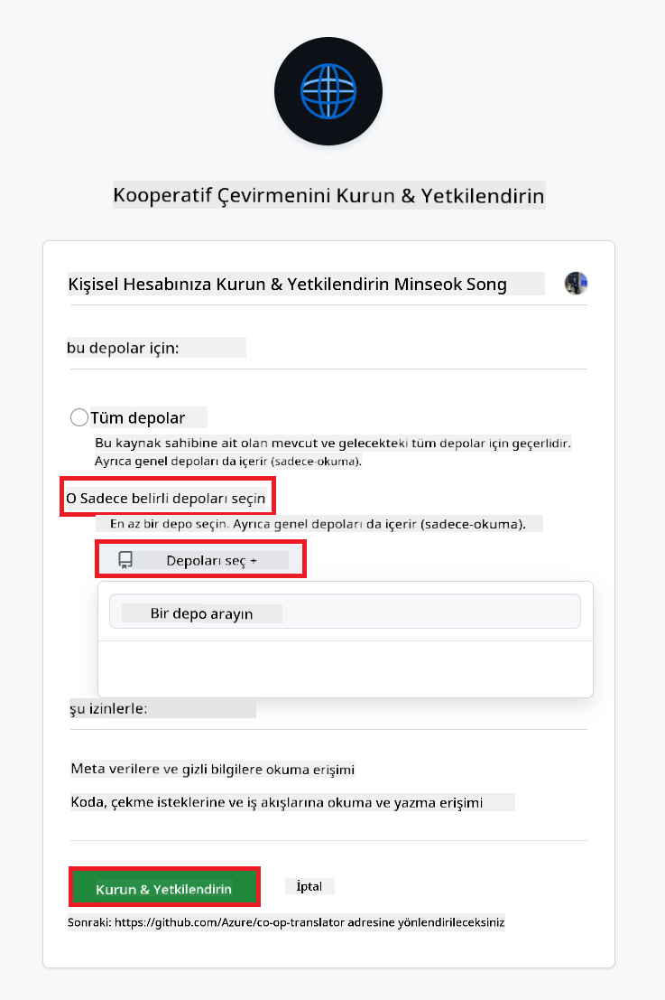
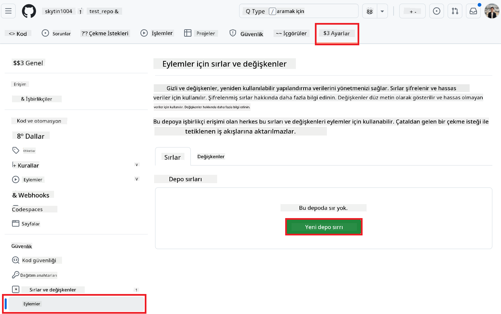
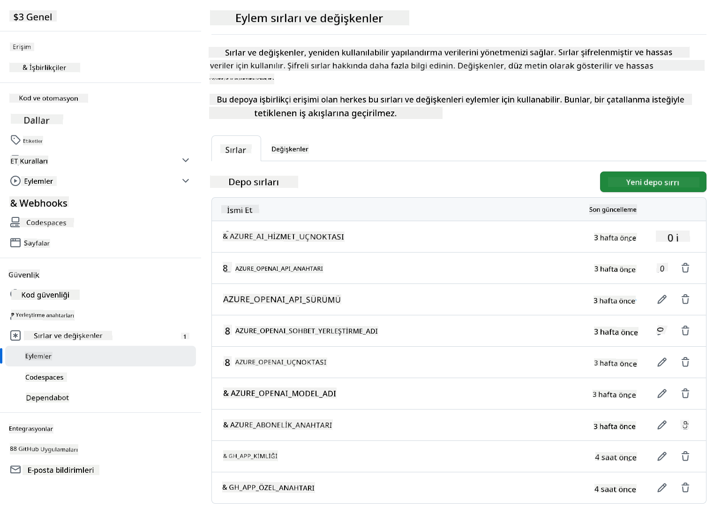

<!--
CO_OP_TRANSLATOR_METADATA:
{
  "original_hash": "c437820027c197f25fb2cbee95bae28c",
  "translation_date": "2025-06-12T19:09:38+00:00",
  "source_file": "getting_started/github-actions-guide/github-actions-guide-org.md",
  "language_code": "tr"
}
-->
# Co-op Translator GitHub Action Kullanımı (Organizasyon Rehberi)

**Hedef Kitle:** Bu rehber, **Microsoft iç kullanıcıları** veya **önceden hazırlanmış Co-op Translator GitHub Uygulaması için gerekli kimlik bilgilerine erişimi olan ya da kendi özel GitHub Uygulamasını oluşturabilen ekipler** için hazırlanmıştır.

Deponuzun dokümantasyonunun çevirisini Co-op Translator GitHub Action ile zahmetsizce otomatikleştirin. Bu rehber, kaynak Markdown dosyalarınız veya resimleriniz değiştiğinde güncellenmiş çevirilerle otomatik olarak pull request oluşturacak şekilde action’ı nasıl yapılandıracağınızı adım adım anlatır.

> [!IMPORTANT]
> 
> **Doğru Rehberi Seçmek:**
>
> Bu rehber, **GitHub Uygulama Kimliği ve Özel Anahtar** kullanılarak kurulumu detaylandırır. Genellikle bu "Organizasyon Rehberi" yöntemine ihtiyacınız olur eğer: **`GITHUB_TOKEN` İzinleri Kısıtlıysa:** Organizasyonunuz veya depo ayarlarınız standart `GITHUB_TOKEN`’a verilen varsayılan izinleri kısıtlıyorsa. Özellikle, `GITHUB_TOKEN` gerekli `write` izinlerine (örneğin `contents: write` veya `pull-requests: write`) sahip değilse, [Public Setup Guide](./github-actions-guide-public.md) içindeki iş akışı yetersiz izinler nedeniyle başarısız olur. Açıkça izin verilmiş özel bir GitHub Uygulaması kullanmak bu sınırlamayı aşar.
>
> **Eğer yukarıdakiler sizin için geçerli değilse:**
>
> Standart `GITHUB_TOKEN` depoda yeterli izinlere sahipse (yani organizasyon kısıtlamalarıyla engellenmiyorsanız), lütfen **[GITHUB_TOKEN kullanarak Public Setup Guide](./github-actions-guide-public.md)** rehberini kullanın. Public rehber, App ID veya Özel Anahtar edinmenizi veya yönetmenizi gerektirmez ve sadece standart `GITHUB_TOKEN` ile depo izinlerine dayanır.

## Ön Koşullar

GitHub Action’ı yapılandırmadan önce gerekli AI servis kimlik bilgilerine sahip olduğunuzdan emin olun.

**1. Gerekli: AI Dil Modeli Kimlik Bilgileri**  
Desteklenen en az bir Dil Modeli için kimlik bilgilerine ihtiyacınız var:

- **Azure OpenAI**: Endpoint, API Anahtarı, Model/Deployment İsimleri, API Versiyonu gerektirir.  
- **OpenAI**: API Anahtarı, (Opsiyonel: Org ID, Base URL, Model ID).  
- Detaylar için bkz. [Supported Models and Services](../../../../README.md).  
- Kurulum Rehberi: [Azure OpenAI Kurulumu](../set-up-resources/set-up-azure-openai.md).

**2. Opsiyonel: Bilgisayarla Görü Kimlik Bilgileri (Resim Çevirisi için)**

- Sadece resim içindeki metinleri çevirmek istiyorsanız gereklidir.  
- **Azure Computer Vision**: Endpoint ve Abonelik Anahtarı gerektirir.  
- Sağlanmazsa, action varsayılan olarak [Sadece Markdown modu](../markdown-only-mode.md) kullanır.  
- Kurulum Rehberi: [Azure Computer Vision Kurulumu](../set-up-resources/set-up-azure-computer-vision.md).

## Kurulum ve Yapılandırma

Deponuzda Co-op Translator GitHub Action’ı yapılandırmak için aşağıdaki adımları izleyin:

### Adım 1: GitHub Uygulaması Kimlik Doğrulamasını Kurun ve Yükleyin

İş akışı, deponuzla güvenli bir şekilde etkileşim kurmak (örneğin pull request oluşturmak) için GitHub Uygulaması kimlik doğrulamasını kullanır. Bir seçenek belirleyin:

#### **Seçenek A: Önceden Hazırlanmış Co-op Translator GitHub Uygulamasını Yükleyin (Microsoft İç Kullanımı için)**

1. [Co-op Translator GitHub Uygulaması](https://github.com/apps/co-op-translator) sayfasına gidin.

1. **Install** seçeneğini seçin ve hedef deponuzun bulunduğu hesap veya organizasyonu seçin.

    

1. **Only select repositories** seçeneğini seçin ve hedef deponuzu (örneğin `PhiCookBook`) seçin. **Install**’a tıklayın. Kimlik doğrulaması istenebilir.

    

1. **Uygulama Kimlik Bilgilerini Edinin (İç Süreç Gerekir):** İş akışının uygulama olarak kimlik doğrulaması yapabilmesi için Co-op Translator ekibinden şu iki bilgi alınmalıdır:  
  - **App ID:** Co-op Translator uygulamasının benzersiz kimliği. App ID: `1164076`.  
  - **Özel Anahtar:** `.pem` özel anahtar dosyasının **tam içeriğini** sağlayıcıdan alın. **Bu anahtarı şifre gibi tutun ve güvende saklayın.**

1. Adım 2’ye geçin.

#### **Seçenek B: Kendi Özel GitHub Uygulamanızı Kullanın**

- İsterseniz kendi GitHub Uygulamanızı oluşturup yapılandırabilirsiniz. İçeriklere ve Pull Request’lere Okuma & Yazma erişimi olduğundan emin olun. App ID ve oluşturulmuş Özel Anahtara ihtiyacınız olacak.

### Adım 2: Depo Sırlarınızı Yapılandırın

GitHub Uygulaması kimlik bilgilerini ve AI servis kimlik bilgilerinizi depoda şifreli sırlar olarak eklemeniz gerekir.

1. Hedef GitHub deponuza gidin (örneğin `PhiCookBook`).

1. **Settings** > **Secrets and variables** > **Actions** bölümüne gidin.

1. **Repository secrets** altında, aşağıda listelenen her sır için **New repository secret** butonuna tıklayın.

   

**Gerekli Sırlar (GitHub Uygulaması Kimlik Doğrulaması için):**

| Sır Adı              | Açıklama                                         | Değer Kaynağı                                   |
| :------------------- | :----------------------------------------------- | :----------------------------------------------- |
| `GH_APP_ID`          | GitHub Uygulamasının App ID’si (Adım 1’den).      | GitHub Uygulama Ayarları                        |
| `GH_APP_PRIVATE_KEY` | İndirilen `.pem` dosyasının **tam içeriği**. | `.pem` dosyası (Adım 1’den)          |

**AI Servis Sırları (Ön Koşullarınıza göre GEREKLİ OLANLARIN TAMAMINI ekleyin):**

| Sır Adı                         | Açıklama                                | Değer Kaynağı                   |
| :------------------------------ | :------------------------------------- | :------------------------------- |
| `AZURE_SUBSCRIPTION_KEY`            | Azure AI Servisi (Computer Vision) Anahtarı | Azure AI Foundry                  |
| `AZURE_AI_SERVICE_ENDPOINT`         | Azure AI Servisi (Computer Vision) Endpoint | Azure AI Foundry                  |
| `AZURE_OPENAI_API_KEY`              | Azure OpenAI servisi Anahtarı           | Azure AI Foundry                  |
| `AZURE_OPENAI_ENDPOINT`             | Azure OpenAI servisi Endpointi           | Azure AI Foundry                  |
| `AZURE_OPENAI_MODEL_NAME`           | Azure OpenAI Model Adınız                | Azure AI Foundry                  |
| `AZURE_OPENAI_CHAT_DEPLOYMENT_NAME` | Azure OpenAI Deployment Adınız           | Azure AI Foundry                  |
| `AZURE_OPENAI_API_VERSION`          | Azure OpenAI API Versiyonu                | Azure AI Foundry                  |
| `OPENAI_API_KEY`                    | OpenAI API Anahtarı                      | OpenAI Platform                  |
| `OPENAI_ORG_ID`                     | OpenAI Organizasyon ID’si                | OpenAI Platform                  |
| `OPENAI_CHAT_MODEL_ID`              | Belirli OpenAI model ID’si                | OpenAI Platform                  |
| `OPENAI_BASE_URL`                   | Özel OpenAI API Temel URL’si              | OpenAI Platform                  |



### Adım 3: İş Akışı Dosyasını Oluşturun

Son olarak, otomatik iş akışını tanımlayan YAML dosyasını oluşturun.

1. Depo kök dizininde `.github/workflows/` klasörü yoksa oluşturun.

1. `.github/workflows/` içinde `co-op-translator.yml` adlı bir dosya oluşturun.

1. Aşağıdaki içeriği co-op-translator.yml dosyasına yapıştırın.

```
name: Co-op Translator

on:
  push:
    branches:
      - main

jobs:
  co-op-translator:
    runs-on: ubuntu-latest

    permissions:
      contents: write
      pull-requests: write

    steps:
      - name: Checkout repository
        uses: actions/checkout@v4
        with:
          fetch-depth: 0

      - name: Set up Python
        uses: actions/setup-python@v4
        with:
          python-version: '3.10'

      - name: Install Co-op Translator
        run: |
          python -m pip install --upgrade pip
          pip install co-op-translator

      - name: Run Co-op Translator
        env:
          PYTHONIOENCODING: utf-8
          # Azure AI Service Credentials
          AZURE_SUBSCRIPTION_KEY: ${{ secrets.AZURE_SUBSCRIPTION_KEY }}
          AZURE_AI_SERVICE_ENDPOINT: ${{ secrets.AZURE_AI_SERVICE_ENDPOINT }}

          # Azure OpenAI Credentials
          AZURE_OPENAI_API_KEY: ${{ secrets.AZURE_OPENAI_API_KEY }}
          AZURE_OPENAI_ENDPOINT: ${{ secrets.AZURE_OPENAI_ENDPOINT }}
          AZURE_OPENAI_MODEL_NAME: ${{ secrets.AZURE_OPENAI_MODEL_NAME }}
          AZURE_OPENAI_CHAT_DEPLOYMENT_NAME: ${{ secrets.AZURE_OPENAI_CHAT_DEPLOYMENT_NAME }}
          AZURE_OPENAI_API_VERSION: ${{ secrets.AZURE_OPENAI_API_VERSION }}

          # OpenAI Credentials
          OPENAI_API_KEY: ${{ secrets.OPENAI_API_KEY }}
          OPENAI_ORG_ID: ${{ secrets.OPENAI_ORG_ID }}
          OPENAI_CHAT_MODEL_ID: ${{ secrets.OPENAI_CHAT_MODEL_ID }}
          OPENAI_BASE_URL: ${{ secrets.OPENAI_BASE_URL }}
        run: |
          # =====================================================================
          # IMPORTANT: Set your target languages here (REQUIRED CONFIGURATION)
          # =====================================================================
          # Example: Translate to Spanish, French, German. Add -y to auto-confirm.
          translate -l "es fr de" -y  # <--- MODIFY THIS LINE with your desired languages

      - name: Authenticate GitHub App
        id: generate_token
        uses: tibdex/github-app-token@v1
        with:
          app_id: ${{ secrets.GH_APP_ID }}
          private_key: ${{ secrets.GH_APP_PRIVATE_KEY }}

      - name: Create Pull Request with translations
        uses: peter-evans/create-pull-request@v5
        with:
          token: ${{ steps.generate_token.outputs.token }}
          commit-message: "🌐 Update translations via Co-op Translator"
          title: "🌐 Update translations via Co-op Translator"
          body: |
            This PR updates translations for recent changes to the main branch.

            ### 📋 Changes included
            - Translated contents are available in the `translations/` directory
            - Translated images are available in the `translated_images/` directory

            ---
            🌐 Automatically generated by the [Co-op Translator](https://github.com/Azure/co-op-translator) GitHub Action.
          branch: update-translations
          base: main
          labels: translation, automated-pr
          delete-branch: true
          add-paths: |
            translations/
            translated_images/

```

4.  **İş Akışını Özelleştirin:**  
  - **[!IMPORTANT] Hedef Diller:** `Run Co-op Translator` step, you **MUST review and modify the list of language codes** within the `translate -l "..." -y` command to match your project's requirements. The example list (`ar de es...`) needs to be replaced or adjusted.
  - **Trigger (`on:`):** The current trigger runs on every push to `main`. For large repositories, consider adding a `paths:` filter (see commented example in the YAML) to run the workflow only when relevant files (e.g., source documentation) change, saving runner minutes.
  - **PR Details:** Customize the `commit-message`, `title`, `body`, `branch` name, and `labels` in the `Create Pull Request` step if needed.

## Credential Management and Renewal

- **Security:** Always store sensitive credentials (API keys, private keys) as GitHub Actions secrets. Never expose them in your workflow file or repository code.
- **[!IMPORTANT] Key Renewal (Internal Microsoft Users):** Be aware that Azure OpenAI key used within Microsoft might have a mandatory renewal policy (e.g., every 5 months). Ensure you update the corresponding GitHub secrets (`AZURE_OPENAI_...` anahtarları içinde hedef dilleri, ana dal veya tetikleme yollarını ihtiyacınıza göre ayarlayın.  
  - Kimlik bilgisi sırlarınızın **süresi dolmadan** güncel olduğundan emin olun, aksi halde iş akışı hataları oluşabilir.

## İş Akışını Çalıştırma

`co-op-translator.yml` dosyası ana dalınıza (veya `on:` trigger), the workflow will automatically run whenever changes are pushed to that branch (and match the `paths` filtresi ile belirttiğiniz dal) merge edildiğinde,

Çeviriler oluşturulur veya güncellenirse, action otomatik olarak değişiklikleri içeren bir Pull Request oluşturur; inceleme ve birleştirme için hazır olur.

**Feragatname**:  
Bu belge, AI çeviri hizmeti [Co-op Translator](https://github.com/Azure/co-op-translator) kullanılarak çevrilmiştir. Doğruluk için çaba göstersek de, otomatik çevirilerin hatalar veya yanlışlıklar içerebileceğini lütfen unutmayınız. Orijinal belge, kendi dilinde yetkili kaynak olarak kabul edilmelidir. Kritik bilgiler için profesyonel insan çevirisi önerilir. Bu çevirinin kullanımı nedeniyle ortaya çıkabilecek yanlış anlamalar veya yanlış yorumlamalardan sorumlu değiliz.