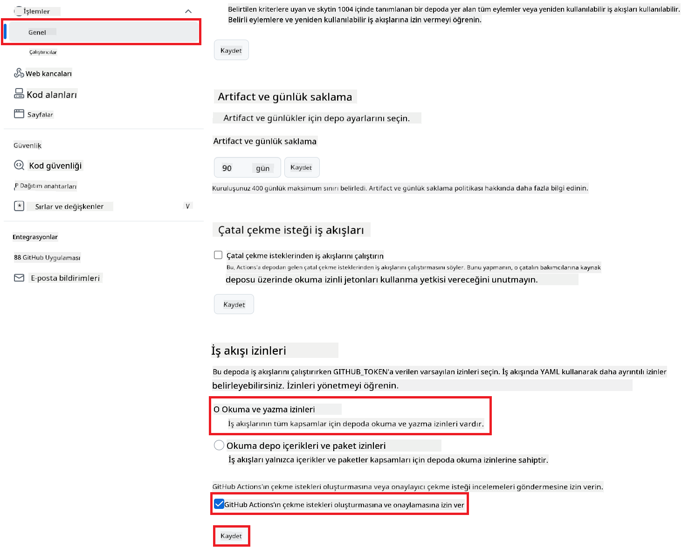

<!--
CO_OP_TRANSLATOR_METADATA:
{
  "original_hash": "a52587a512e667f70d92db853d3c61d5",
  "translation_date": "2025-06-12T19:28:18+00:00",
  "source_file": "getting_started/github-actions-guide/github-actions-guide-public.md",
  "language_code": "tr"
}
-->
# Co-op Translator GitHub Action Kullanımı (Genel Kurulum)

**Hedef Kitle:** Bu rehber, standart GitHub Actions izinlerinin yeterli olduğu çoğu genel veya özel depo kullanıcıları için hazırlanmıştır. Yerleşik `GITHUB_TOKEN` kullanır.

Depo dokümantasyonunuzun çevirisini Co-op Translator GitHub Action ile zahmetsizce otomatikleştirin. Bu rehber, kaynak Markdown dosyalarınız veya resimleriniz değiştiğinde otomatik olarak güncellenmiş çevirilerle pull request oluşturacak şekilde action'ı kurmanıza yardımcı olur.

> [!IMPORTANT]
>
> **Doğru Rehberi Seçmek:**
>
> Bu rehber, **standart `GITHUB_TOKEN` kullanılarak yapılan daha basit kurulumu** detaylandırır. Çoğu kullanıcı için önerilen yöntem budur çünkü hassas GitHub App Private Key’lerini yönetmenizi gerektirmez.
>

## Ön Koşullar

GitHub Action’ı yapılandırmadan önce gerekli AI servis kimlik bilgilerine sahip olduğunuzdan emin olun.

**1. Gerekli: AI Dil Modeli Kimlik Bilgileri**  
En az bir desteklenen Dil Modeli için kimlik bilgilerine ihtiyacınız var:

- **Azure OpenAI**: Endpoint, API Anahtarı, Model/Deployment İsimleri, API Versiyonu gerektirir.
- **OpenAI**: API Anahtarı, (İsteğe bağlı: Org ID, Base URL, Model ID).
- Detaylar için [Supported Models and Services](../../../../README.md) sayfasına bakın.

**2. İsteğe Bağlı: AI Vision Kimlik Bilgileri (Resim Çevirisi için)**

- Sadece resimlerdeki metni çevirmek istiyorsanız gereklidir.
- **Azure AI Vision**: Endpoint ve Abonelik Anahtarı gerektirir.
- Sağlanmazsa, action [Markdown-only mode](../markdown-only-mode.md) modunda çalışır.

## Kurulum ve Yapılandırma

Standart `GITHUB_TOKEN` kullanarak Co-op Translator GitHub Action’ı deponuzda yapılandırmak için şu adımları izleyin.

### Adım 1: Kimlik Doğrulamayı Anlayın ( `GITHUB_TOKEN` Kullanımı )

Bu iş akışı, GitHub Actions tarafından sağlanan yerleşik `GITHUB_TOKEN`’u kullanır. Bu token, **Adım 3**’te yapılandırılan ayarlara bağlı olarak iş akışına deponuzla etkileşim için gerekli izinleri otomatik olarak verir.

### Adım 2: Depo Secret’larını Yapılandırın

Sadece **AI servis kimlik bilgilerinizi** şifreli secret olarak depo ayarlarınıza eklemeniz yeterlidir.

1.  Hedef GitHub deponuza gidin.
2.  **Settings** > **Secrets and variables** > **Actions** sekmesine geçin.
3.  Aşağıda listelenen gerekli AI servis secret’ları için **New repository secret** butonuna tıklayarak her birini ekleyin.

     *(Görsel Referans: Secret ekleme yeri)*

**Gerekli AI Servis Secret’ları (Ön Koşullarınıza göre TÜM ilgili olanları ekleyin):**

| Secret Adı                         | Açıklama                               | Değer Kaynağı                     |
| :---------------------------------- | :---------------------------------------- | :------------------------------- |
| `AZURE_SUBSCRIPTION_KEY`            | Azure AI Servisi (Computer Vision) Anahtarı  | Azure AI Foundry hesabınız               |
| `AZURE_AI_SERVICE_ENDPOINT`         | Azure AI Servisi (Computer Vision) Endpoint’i | Azure AI Foundry hesabınız               |
| `AZURE_OPENAI_API_KEY`              | Azure OpenAI servisi Anahtarı              | Azure AI Foundry hesabınız               |
| `AZURE_OPENAI_ENDPOINT`             | Azure OpenAI servisi Endpoint’i         | Azure AI Foundry hesabınız               |
| `AZURE_OPENAI_MODEL_NAME`           | Azure OpenAI Model Adı              | Azure AI Foundry hesabınız               |
| `AZURE_OPENAI_CHAT_DEPLOYMENT_NAME` | Azure OpenAI Deployment Adı         | Azure AI Foundry hesabınız               |
| `AZURE_OPENAI_API_VERSION`          | Azure OpenAI API Versiyonu              | Azure AI Foundry hesabınız               |
| `OPENAI_API_KEY`                    | OpenAI API Anahtarı                        | OpenAI Platform hesabınız              |
| `OPENAI_ORG_ID`                     | OpenAI Organizasyon ID (İsteğe bağlı)         | OpenAI Platform hesabınız              |
| `OPENAI_CHAT_MODEL_ID`              | Belirli OpenAI model ID (İsteğe bağlı)       | OpenAI Platform hesabınız              |
| `OPENAI_BASE_URL`                   | Özel OpenAI API Base URL (İsteğe bağlı)     | OpenAI Platform hesabınız              |

### Adım 3: İş Akışı İzinlerini Yapılandırın

GitHub Action’ın kodu çekip pull request oluşturabilmesi için `GITHUB_TOKEN` aracılığıyla izinlere ihtiyacı vardır.

1.  Deponuzda **Settings** > **Actions** > **General** bölümüne gidin.
2.  Aşağı kaydırarak **Workflow permissions** kısmını bulun.
3.  **Read and write permissions** seçeneğini işaretleyin. Bu, `GITHUB_TOKEN`’a bu iş akışı için gerekli `contents: write` ve `pull-requests: write` izinlerini verir.
4.  **Allow GitHub Actions to create and approve pull requests** seçeneğinin işaretli olduğundan emin olun.
5.  **Save** butonuna tıklayın.



### Adım 4: İş Akışı Dosyasını Oluşturun

Son olarak, otomatik iş akışını tanımlayan YAML dosyasını `GITHUB_TOKEN` kullanarak oluşturun.

1.  Depo kök dizininde `.github/workflows/` klasörü yoksa oluşturun.
2.  `.github/workflows/` içinde `co-op-translator.yml` adlı bir dosya oluşturun.
3.  Aşağıdaki içeriği `co-op-translator.yml` dosyasına yapıştırın.

```yaml
name: Co-op Translator

on:
  push:
    branches:
      - main

jobs:
  co-op-translator:
    runs-on: ubuntu-latest

    permissions:
      contents: write
      pull-requests: write

    steps:
      - name: Checkout repository
        uses: actions/checkout@v4
        with:
          fetch-depth: 0

      - name: Set up Python
        uses: actions/setup-python@v4
        with:
          python-version: '3.10'

      - name: Install Co-op Translator
        run: |
          python -m pip install --upgrade pip
          pip install co-op-translator

      - name: Run Co-op Translator
        env:
          PYTHONIOENCODING: utf-8
          # === AI Service Credentials ===
          AZURE_SUBSCRIPTION_KEY: ${{ secrets.AZURE_SUBSCRIPTION_KEY }}
          AZURE_AI_SERVICE_ENDPOINT: ${{ secrets.AZURE_AI_SERVICE_ENDPOINT }}
          AZURE_OPENAI_API_KEY: ${{ secrets.AZURE_OPENAI_API_KEY }}
          AZURE_OPENAI_ENDPOINT: ${{ secrets.AZURE_OPENAI_ENDPOINT }}
          AZURE_OPENAI_MODEL_NAME: ${{ secrets.AZURE_OPENAI_MODEL_NAME }}
          AZURE_OPENAI_CHAT_DEPLOYMENT_NAME: ${{ secrets.AZURE_OPENAI_CHAT_DEPLOYMENT_NAME }}
          AZURE_OPENAI_API_VERSION: ${{ secrets.AZURE_OPENAI_API_VERSION }}
          OPENAI_API_KEY: ${{ secrets.OPENAI_API_KEY }}
          OPENAI_ORG_ID: ${{ secrets.OPENAI_ORG_ID }}
          OPENAI_CHAT_MODEL_ID: ${{ secrets.OPENAI_CHAT_MODEL_ID }}
          OPENAI_BASE_URL: ${{ secrets.OPENAI_BASE_URL }}
        run: |
          # =====================================================================
          # IMPORTANT: Set your target languages here (REQUIRED CONFIGURATION)
          # =====================================================================
          # Example: Translate to Spanish, French, German. Add -y to auto-confirm.
          translate -l "es fr de" -y  # <--- MODIFY THIS LINE with your desired languages

      - name: Create Pull Request with translations
        uses: peter-evans/create-pull-request@v5
        with:
          token: ${{ secrets.GITHUB_TOKEN }}
          commit-message: "🌐 Update translations via Co-op Translator"
          title: "🌐 Update translations via Co-op Translator"
          body: |
            This PR updates translations for recent changes to the main branch.

            ### 📋 Changes included
            - Translated contents are available in the `translations/` directory
            - Translated images are available in the `translated_images/` directory

            ---
            🌐 Automatically generated by the [Co-op Translator](https://github.com/Azure/co-op-translator) GitHub Action.
          branch: update-translations
          base: main
          labels: translation, automated-pr
          delete-branch: true
          add-paths: |
            translations/
            translated_images/
```  
4.  **İş Akışını Özelleştirin:**  
  - **[!IMPORTANT] Hedef Diller:** `Run Co-op Translator` step, you **MUST review and modify the list of language codes** within the `translate -l "..." -y` command to match your project's requirements. The example list (`ar de es...`) needs to be replaced or adjusted.
  - **Trigger (`on:`):** The current trigger runs on every push to `main`. For large repositories, consider adding a `paths:` filter (see commented example in the YAML) to run the workflow only when relevant files (e.g., source documentation) change, saving runner minutes.
  - **PR Details:** Customize the `commit-message`, `title`, `body`, `branch` name, and `labels` in the `Create Pull Request` adımında gerekirse hedef dilleri belirleyin.

**Feragatname**:  
Bu belge, AI çeviri hizmeti [Co-op Translator](https://github.com/Azure/co-op-translator) kullanılarak çevrilmiştir. Doğruluk için çaba gösterilse de, otomatik çevirilerin hatalar veya yanlışlıklar içerebileceğini lütfen unutmayınız. Orijinal belge, kendi dilinde yetkili kaynak olarak kabul edilmelidir. Kritik bilgiler için profesyonel insan çevirisi önerilir. Bu çevirinin kullanımı sonucu ortaya çıkabilecek yanlış anlamalar veya yanlış yorumlamalar için sorumluluk kabul edilmemektedir.