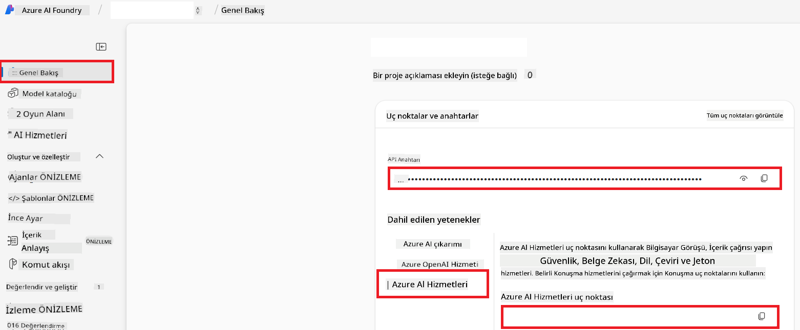

<!--
CO_OP_TRANSLATOR_METADATA:
{
  "original_hash": "b58d7c3cb4210697a073d20eb3064945",
  "translation_date": "2025-06-12T11:52:31+00:00",
  "source_file": "getting_started/set-up-azure-ai.md",
  "language_code": "tr"
}
-->
# Azure AI Co-op Translator (Azure OpenAI & Azure AI Vision) Kurulumu

Bu rehber, Azure AI Foundry içinde dil çevirisi için Azure OpenAI ve görüntü tabanlı çeviri için Azure Computer Vision kurulumunu adım adım anlatır.

**Gereksinimler:**
- Aktif aboneliğe sahip bir Azure hesabı.
- Azure aboneliğinizde kaynak ve dağıtım oluşturma yetkisi.

## Azure AI Projesi Oluşturma

AI kaynaklarınızı yönetmek için merkezi bir yer olan Azure AI Projesi oluşturmayla başlayacaksınız.

1. [https://ai.azure.com](https://ai.azure.com) adresine gidin ve Azure hesabınızla giriş yapın.

1. Yeni bir proje oluşturmak için **+Create** seçeneğini tıklayın.

1. Aşağıdaki adımları gerçekleştirin:
   - Bir **Proje adı** girin (örneğin `CoopTranslator-Project`).
   - **AI hub** seçin (örneğin `CoopTranslator-Hub`) (Gerekirse yenisini oluşturun).

1. Projenizi oluşturmak için "**Review and Create**" seçeneğine tıklayın. Projenizin genel bakış sayfasına yönlendirileceksiniz.

## Dil Çevirisi için Azure OpenAI Kurulumu

Projeniz içinde, metin çevirisi için arka uç görevi görecek bir Azure OpenAI modeli dağıtacaksınız.

### Projenize Gitme

Henüz açmadıysanız, Azure AI Foundry’de yeni oluşturduğunuz projeyi (örneğin `CoopTranslator-Project`) açın.

### OpenAI Modeli Dağıtma

1. Projenizin sol menüsünde, "My assets" altında "**Models + endpoints**" seçeneğini seçin.

1. **+ Deploy model** seçeneğine tıklayın.

1. **Deploy Base Model** seçeneğini seçin.

1. Karşınıza çıkan modeller listesinden uygun bir GPT modeli bulun. Biz `gpt-4o` modelini öneriyoruz.

1. İstediğiniz modeli seçin ve **Confirm** butonuna tıklayın.

1. **Deploy** seçeneğini tıklayarak dağıtımı başlatın.

### Azure OpenAI yapılandırması

Model dağıtıldıktan sonra, "**Models + endpoints**" sayfasından dağıtımı seçerek **REST endpoint URL**, **Anahtar**, **Dağıtım adı**, **Model adı** ve **API sürümü** bilgilerini bulabilirsiniz. Bu bilgiler, çeviri modelini uygulamanıza entegre etmek için gereklidir.

> [!NOTE]
> Gereksinimlerinize göre API sürümlerini [API version deprecation](https://learn.microsoft.com/azure/ai-services/openai/api-version-deprecation) sayfasından seçebilirsiniz. Dikkat edin, **API sürümü** Azure AI Foundry’daki "**Models + endpoints**" sayfasında görünen **Model sürümü**nden farklıdır.

## Görüntü Çevirisi için Azure Computer Vision Kurulumu

Görüntülerdeki metni çevirebilmek için Azure AI Hizmeti API Anahtarı ve Uç Noktasını bulmanız gerekir.

1. Azure AI Projenize (örneğin `CoopTranslator-Project`) gidin. Proje genel bakış sayfasında olduğunuzdan emin olun.

### Azure AI Hizmeti yapılandırması

Azure AI Hizmeti sekmesinden API Anahtarı ve Uç Noktayı bulun.

1. Azure AI Projenize (örneğin `CoopTranslator-Project`) gidin. Proje genel bakış sayfasında olduğunuzdan emin olun.

1. Azure AI Hizmeti sekmesinden **API Key** ve **Endpoint** bilgilerini bulun.

    

Bu bağlantı, bağlı Azure AI Hizmetleri kaynağının (görüntü analizi dahil) yeteneklerini AI Foundry projenize açar. Ardından, bu bağlantıyı not defterlerinizde veya uygulamalarınızda kullanarak görüntülerden metin çıkarabilir ve bu metni Azure OpenAI modeline çeviri için gönderebilirsiniz.

## Kimlik Bilgilerinizi Toparlama

Şu ana kadar aşağıdaki bilgileri toplamış olmalısınız:

**Azure OpenAI (Metin Çevirisi) için:**
- Azure OpenAI Uç Noktası
- Azure OpenAI API Anahtarı
- Azure OpenAI Model Adı (örneğin `gpt-4o`)
- Azure OpenAI Dağıtım Adı (örneğin `cooptranslator-gpt4o`)
- Azure OpenAI API Sürümü

**Azure AI Hizmetleri (Görüntüden Metin Çıkarma için Vision):**
- Azure AI Hizmeti Uç Noktası
- Azure AI Hizmeti API Anahtarı

### Örnek: Ortam Değişkeni Yapılandırması (Önizleme)

Uygulamanızı geliştirirken, bu topladığınız kimlik bilgilerini ortam değişkeni olarak yapılandırmanız muhtemeldir. Örneğin, şu şekilde ayarlayabilirsiniz:

```bash
# Azure AI Service Credentials (Required for image translation)
AZURE_AI_SERVICE_API_KEY="your_azure_ai_service_api_key" # e.g., 21xasd...
AZURE_AI_SERVICE_ENDPOINT="https://your_azure_ai_service_endpoint.cognitiveservices.azure.com/"

# Azure OpenAI Credentials (Required for text translation)
AZURE_OPENAI_API_KEY="your_azure_openai_api_key" # e.g., 21xasd...
AZURE_OPENAI_ENDPOINT="https://your_azure_openai_endpoint.openai.azure.com/"
AZURE_OPENAI_MODEL_NAME="your_model_name" # e.g., gpt-4o
AZURE_OPENAI_CHAT_DEPLOYMENT_NAME="your_deployment_name" # e.g., cooptranslator-gpt4o
AZURE_OPENAI_API_VERSION="your_api_version" # e.g., 2024-12-01-preview
```

---

### Daha Fazla Okuma

- [Azure AI Foundry’de Proje Oluşturma](https://learn.microsoft.com/azure/ai-foundry/how-to/create-projects?tabs=ai-studio)
- [Azure AI Kaynakları Oluşturma](https://learn.microsoft.com/azure/ai-foundry/how-to/create-azure-ai-resource?tabs=portal)
- [Azure AI Foundry’de OpenAI Modelleri Dağıtma](https://learn.microsoft.com/en-us/azure/ai-foundry/how-to/deploy-models-openai)

**Feragatname**:  
Bu belge, AI çeviri servisi [Co-op Translator](https://github.com/Azure/co-op-translator) kullanılarak çevrilmiştir. Doğruluk için çaba göstersek de, otomatik çevirilerin hatalar veya yanlışlıklar içerebileceğini lütfen unutmayınız. Orijinal belge, kendi dilinde yetkili kaynak olarak kabul edilmelidir. Kritik bilgiler için profesyonel insan çevirisi önerilir. Bu çevirinin kullanımı sonucu oluşabilecek herhangi bir yanlış anlama veya yanlış yorumlamadan sorumlu değiliz.