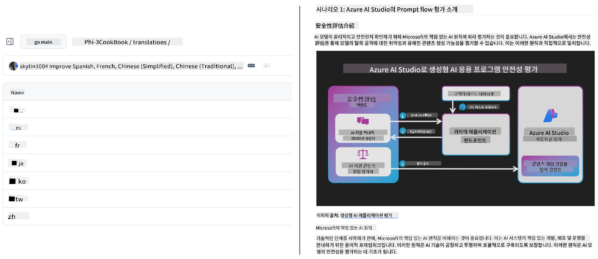
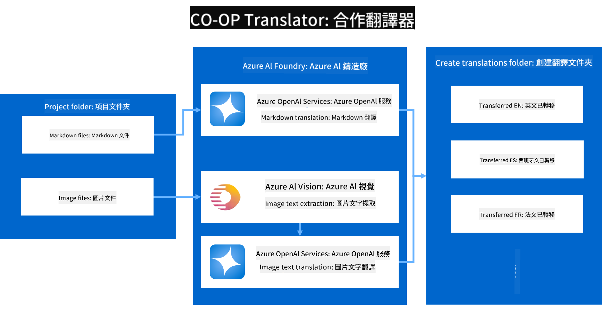

<!--
CO_OP_TRANSLATOR_METADATA:
{
  "original_hash": "044724537b57868117aadae8e7728c7c",
  "translation_date": "2025-06-12T10:04:23+00:00",
  "source_file": "README.md",
  "language_code": "tw"
}
-->


# Co-op Translator：輕鬆自動化教育文件的翻譯

_輕鬆將您的文件自動翻譯成多種語言，觸及全球讀者。_

[](https://pypi.org/project/co-op-translator/)
[](https://github.com/azure/co-op-translator/blob/main/LICENSE)
[](https://pepy.tech/project/co-op-translator)
[](https://pepy.tech/project/co-op-translator)
[](https://github.com/psf/black)

[](https://GitHub.com/azure/co-op-translator/graphs/contributors/)
[](https://GitHub.com/azure/co-op-translator/issues/)
[](https://GitHub.com/azure/co-op-translator/pulls/)
[](http://makeapullrequest.com)

### 由 Co-op Translator 提供的語言支援
[法文](../fr/README.md) | [西班牙文](../es/README.md) | [德文](../de/README.md) | [俄文](../ru/README.md) | [阿拉伯文](../ar/README.md) | [波斯文 (法爾西語)](../fa/README.md) | [烏爾都文](../ur/README.md) | [中文 (簡體)](../zh/README.md) | [中文 (繁體，澳門)](../mo/README.md) | [中文 (繁體，香港)](../hk/README.md) | [中文 (繁體，台灣)](./README.md) | [日文](../ja/README.md) | [韓文](../ko/README.md) | [印地文](../hi/README.md) | [孟加拉文](../bn/README.md) | [馬拉地文](../mr/README.md) | [尼泊爾文](../ne/README.md) | [旁遮普文 (古魯穆奇)](../pa/README.md) | [葡萄牙文 (葡萄牙)](../pt/README.md) | [葡萄牙文 (巴西)](../br/README.md) | [義大利文](../it/README.md) | [波蘭文](../pl/README.md) | [土耳其文](../tr/README.md) | [希臘文](../el/README.md) | [泰文](../th/README.md) | [瑞典文](../sv/README.md) | [丹麥文](../da/README.md) | [挪威文](../no/README.md) | [芬蘭文](../fi/README.md) | [荷蘭文](../nl/README.md) | [希伯來文](../he/README.md) | [越南文](../vi/README.md) | [印尼文](../id/README.md) | [馬來文](../ms/README.md) | [他加祿文 (菲律賓語)](../tl/README.md) | [斯瓦希里文](../sw/README.md) | [匈牙利文](../hu/README.md) | [捷克文](../cs/README.md) | [斯洛伐克文](../sk/README.md) | [羅馬尼亞文](../ro/README.md) | [保加利亞文](../bg/README.md) | [塞爾維亞文 (西里爾字母)](../sr/README.md) | [克羅埃西亞文](../hr/README.md) | [斯洛文尼亞文](../sl/README.md) | [烏克蘭文](../uk/README.md) | [緬甸文](../my/README.md)
> [!NOTE]
> 這些是本儲存庫內容目前的翻譯。欲查看 Co-op Translator 支援的完整語言列表，請參閱 [Language Support](../..) 區段。

[](https://GitHub.com/azure/co-op-translator/watchers/)
[](https://GitHub.com/azure/co-op-translator/network/)
[](https://GitHub.com/azure/co-op-translator/stargazers/)

[](https://discord.com/invite/ByRwuEEgH4)

[](https://codespaces.new/azure/co-op-translator)
[](https://vscode.dev/redirect?url=vscode://ms-vscode-remote.remote-containers/cloneInVolume?url=https://github.com/azure/co-op-translator)

## 概覽：簡化您的教育內容翻譯流程

語言障礙嚴重阻礙全球學習者與開發者取得寶貴的教育資源與技術知識，限制了參與度，也拖慢了全球創新與學習的步伐。

**Co-op Translator** 因應微軟自身大型教育系列（如「For Beginners」指南）手動翻譯效率低下的需求而誕生，逐步發展成一款操作簡便且強大的工具，致力於為所有人打破語言隔閡。透過 CLI 與 GitHub Actions 提供高品質的自動翻譯，Co-op Translator 讓教育者、學生、研究人員和開發者能跨越語言限制，共享並取得知識。

看看 Co-op Translator 如何整理翻譯後的教育內容：



Markdown 檔案與圖片中的文字會自動翻譯，並整齊歸類到各語言專屬資料夾。

**立即使用 Co-op Translator，開啟您的教育內容全球存取之路！**

## 支援微軟學習資源的全球存取

Co-op Translator 協助縮短微軟重要教育專案的語言差距，自動化翻譯流程，服務全球開發者社群。目前使用 Co-op Translator 的範例包括：

[](https://github.com/microsoft/Generative-AI-for-beginners)
[](https://github.com/microsoft/ML-For-Beginners)
[](https://github.com/microsoft/AI-For-Beginners)
[](https://github.com/microsoft/ai-agents-for-beginners)
[](https://github.com/microsoft/PhiCookBook)
[](https://github.com/microsoft/Generative-AI-for-beginners-dotnet)

## 主要功能

- **自動翻譯**：輕鬆將文字翻譯成多種語言。
- **GitHub Actions 整合**：將翻譯自動化納入 CI/CD 流程。
- **Markdown 格式保留**：翻譯過程中保持正確的 Markdown 語法。
- **圖片文字翻譯**：擷取並翻譯圖片中的文字。
- **先進的 LLM 技術**：使用尖端語言模型，提供高品質翻譯。
- **輕鬆整合**：無縫接入您現有的專案架構。
- **簡化本地化流程**：加速您的專案國際化步驟。

## 運作原理



Co-op Translator 會從您的專案資料夾擷取 Markdown 檔案與圖片，並依序執行：

1. **文字擷取**：從 Markdown 檔案擷取文字，若有設定（如 Azure AI Vision）也會擷取圖片中的文字。
1. **AI 翻譯**：將擷取的文字送至設定的 LLM（Azure OpenAI、OpenAI 等）進行翻譯。
1. **結果存檔**：將翻譯後的 Markdown 檔案與圖片（含翻譯文字）儲存至語言專屬資料夾，同時保留原始格式。

## 快速上手

您可以使用 CLI 快速開始，或透過 GitHub Actions 完整自動化。請依您的工作流程選擇適合的方式：

1. **命令列介面 (CLI)** — 適合一次性翻譯或手動控制
2. **GitHub Actions** — 每次推送時自動翻譯

> [!NOTE]
> 本教學以 Azure 資源為主，但您也能使用任何支援的語言模型。

### 語言支援

Co-op Translator 支援多種語言，助您觸及全球受眾。以下為相關說明：

#### 快速參考

| 語言 | 代碼 | 語言 | 代碼 | 語言 | 代碼 |
|----------|------|----------|------|----------|------|
| Arabic | ar | Bengali | bn | Bulgarian | bg |
| Burmese (Myanmar) | my | Chinese (Simplified) | zh | Chinese (Traditional, HK) | hk |
| Chinese (Traditional, Macau) | mo | Chinese (Traditional, TW) | tw | Croatian | hr |
| Czech | cs | Danish | da | Dutch | nl |
| Finnish | fi | French | fr | German | de |
| Greek | el | Hebrew | he | Hindi | hi |
| Hungarian | hu | Indonesian | id | Italian | it |
| Japanese | ja | Korean | ko | Malay | ms |
| Marathi | mr | Nepali | ne | Norwegian | no |
| Persian (Farsi) | fa | Polish | pl | Portuguese (Brazil) | br |
| Portuguese (Portugal) | pt | Punjabi (Gurmukhi) | pa | Romanian | ro |
| Russian | ru | Serbian (Cyrillic) | sr | Slovak | sk |
| Slovenian | sl | Spanish | es | Swahili | sw |
| Swedish | sv | Tagalog (Filipino) | tl | Thai | th |
| Turkish | tr | Ukrainian | uk | Urdu | ur |
| Vietnamese | vi | — | — | — | — |

#### 使用語言代碼

使用 Co-op Translator 時，需以代碼指定語言。例如：

```bash
# Translate to French, Spanish, and German
translate -l "fr es de"

# Translate to Chinese (Simplified) and Japanese
translate -l "zh ja"
```

> [!NOTE]
> 如需更詳細的技術資訊，包括：
>
> - 各語言字型規格
> - 已知問題
> - 如何新增語言
>
> 請參閱我們的 [Supported Languages Documentation](./getting_started/supported-languages.md)。

### 支援的模型與服務

| 類型                  | 名稱                           |
|-----------------------|--------------------------------|
| Language Model        |   |
| AI Vision       |  |

> [!NOTE]
> 若無 AI Vision 服務，co-op translator 將自動切換到 [Markdown-only mode](./getting_started/markdown-only-mode.md)。

### 初始設定

開始前，請先準備以下資源：

1. 語言模型資源（必須）：
   - Azure OpenAI（推薦）— 提供企業級穩定且高品質的翻譯
   - OpenAI — 若無 Azure 存取權，可作為替代方案
   - 詳細支援模型資訊，請參閱 [Supported Models and Services](../..)

1. AI Vision 資源（可選）：
   - Azure AI Vision — 支援圖片中文字翻譯
   - 若未設定，翻譯器會自動使用 [Markdown-only mode](./getting_started/markdown-only-mode.md)
   - 建議含有需翻譯文字圖片的專案使用

1. 設定步驟：
   - 請依照我們的 [Azure AI 設定指南](./getting_started/set-up-azure-ai.md) 完成詳細設定
   - 建立 `.env` 檔案，填入 API 金鑰與端點（參見 [Quick Start](../..)）
   - 確認擁有所需服務的權限與配額

### 翻譯前的專案準備

開始翻譯前，請依下列步驟整理您的專案：

1. 準備 README：
   - 在 README.md 加入翻譯版本的連結表格
   - 範例格式：

     ```markdown

     ### 🌐 Multi-Language Support
     
     [French](../fr/README.md) | [Spanish](../es/README.md) | [German](../de/README.md) | [Russian](../ru/README.md) | [Arabic](../ar/README.md) | [Persian (Farsi)](../fa/README.md) | [Urdu](../ur/README.md) | [Chinese (Simplified)](../zh/README.md) | [Chinese (Traditional, Macau)](../mo/README.md) | [Chinese (Traditional, Hong Kong)](../hk/README.md) | [Chinese (Traditional, Taiwan)](./README.md) | [Japanese](../ja/README.md) | [Korean](../ko/README.md) | [Hindi](../hi/README.md) | [Bengali](../bn/README.md) | [Marathi](../mr/README.md) | [Nepali](../ne/README.md) | [Punjabi (Gurmukhi)](../pa/README.md) | [Portuguese (Portugal)](../pt/README.md) | [Portuguese (Brazil)](../br/README.md) | [Italian](../it/README.md) | [Polish](../pl/README.md) | [Turkish](../tr/README.md) | [Greek](../el/README.md) | [Thai](../th/README.md) | [Swedish](../sv/README.md) | [Danish](../da/README.md) | [Norwegian](../no/README.md) | [Finnish](../fi/README.md) | [Dutch](../nl/README.md) | [Hebrew](../he/README.md) | [Vietnamese](../vi/README.md) | [Indonesian](../id/README.md) | [Malay](../ms/README.md) | [Tagalog (Filipino)](../tl/README.md) | [Swahili](../sw/README.md) | [Hungarian](../hu/README.md) | [Czech](../cs/README.md) | [Slovak](../sk/README.md) | [Romanian](../ro/README.md) | [Bulgarian](../bg/README.md) | [Serbian (Cyrillic)](../sr/README.md) | [Croatian](../hr/README.md) | [Slovenian](../sl/README.md) | [Ukrainian](../uk/README.md) | [Burmese (Myanmar)](../my/README.md) 
    
     ```

1. 清理現有翻譯（如有需要）：
   - 刪除現有的翻譯資料夾（例如 `translations/`）
   - 移除舊有翻譯檔案，確保翻譯流程不會衝突

### 快速上手：命令列

使用命令列快速開始：

1. 建立虛擬環境：

    ```bash
    python -m venv .venv
    ```

1. 啟動虛擬環境：

    - Windows：

    ```bash
    .venv\scripts\activate
    ```

    - Linux/macOS：

    ```bash
    source .venv/bin/activate
    ```

1. 安裝套件：

    ```bash
    pip install co-op-translator
    ```

1. 設定憑證：

    - 建立 `.env` file in your project's root directory.
    - Copy the contents from the [.env.template](../../.env.template) file into your new `.env` file.
    - Fill in the required API keys and endpoint information in your `.env` file.

1. Run Translation:
    - Navigate to your project's root directory in your terminal.
    - Execute the translate command, specifying target languages with the `-l` 參數：

    ```bash
    translate -l "ko ja fr"
    ```

    _(替換 `"ko ja fr"` with your desired space-separated language codes)_

### Detailed Usage Guides

Choose the approach that best fits your workflow:

#### 1. Using the Command Line (CLI)

- Best for: One-time translations, manual control, or integration into custom scripts.
- Requires: Local installation of Python and the `co-op-translator` package.
- Guide: [Command Line Guide](./getting_started/command-line-guide/command-line-guide.md)

#### 2. Using GitHub Actions (Automation)

- Best for: Automatically translating content whenever changes are pushed to your repository. Keeps translations consistently up-to-date.
- Requires: Setting up a workflow file (`.github/workflows`)，無需本機安裝。
- 指南：
  - [GitHub Actions 指南（公開儲存庫與標準祕密）](./getting_started/github-actions-guide/github-actions-guide-public.md) — 適用大多數公開或個人儲存庫，使用標準儲存庫祕密。
  - [GitHub Actions 指南（微軟組織儲存庫與組織層級設定）](./getting_started/github-actions-guide/github-actions-guide-org.md) — 適用於微軟 GitHub 組織內部或需使用組織層級祕密與執行器。

### 疑難排解與技巧

- [疑難排解指南](./getting_started/troubleshooting.md)

### 其他資源

- [命令參考](./getting_started/command-reference.md)：所有指令與選項的詳細說明。
- [支援語言](./getting_started/supported-languages.md)：支援語言列表及新增語言教學。
- [Markdown-only 模式](./getting_started/markdown-only-mode.md)：僅翻譯文字，不包含圖片翻譯。

## 影片簡報

透過我們的簡報進一步了解 Co-op Translator _(點擊下方圖片於 YouTube 觀看)_：

- **Open at Microsoft**：18 分鐘簡短介紹與快速使用指南。
[](https://www.youtube.com/watch?v=jX_swfH_KNU)

## 支持我們並促進全球學習

加入我們，一起革新教育內容的全球分享方式！在 GitHub 上為 [Co-op Translator](https://github.com/azure/co-op-translator) 點⭐，支持我們打破學習與科技語言障礙的使命。你的關注與貢獻將帶來深遠影響！我們隨時歡迎程式碼貢獻與功能建議。

## 貢獻方式

本專案歡迎各種貢獻與建議。有興趣參與 Azure Co-op Translator 的開發嗎？請參考我們的 [CONTRIBUTING.md](./CONTRIBUTING.md) 了解如何協助讓 Co-op Translator 更加普及。

## 貢獻者

[](https://github.com/Azure/co-op-translator/graphs/contributors)

## 行為守則

本專案採用 [Microsoft Open Source Code of Conduct](https://opensource.microsoft.com/codeofconduct/)。
更多資訊請參考 [Code of Conduct FAQ](https://opensource.microsoft.com/codeofconduct/faq/)，或
有任何問題與意見請聯絡 [opencode@microsoft.com](mailto:opencode@microsoft.com)。

## 負責任的 AI

Microsoft 致力協助客戶負責任地使用我們的 AI 產品，分享經驗，並透過像 Transparency Notes 和 Impact Assessments 等工具建立基於信任的合作關係。許多相關資源可在 [https://aka.ms/RAI](https://aka.ms/RAI) 找到。
Microsoft 的負責任 AI 策略根基於公平性、可靠性與安全性、隱私與安全、包容性、透明度及問責制等 AI 原則。

大型自然語言、影像與語音模型——如本範例所用——可能會產生不公平、不可靠或冒犯性的行為，進而造成傷害。請參考 [Azure OpenAI service Transparency note](https://learn.microsoft.com/legal/cognitive-services/openai/transparency-note?tabs=text) 以了解相關風險與限制。

建議的風險緩解方式是在架構中加入能偵測並阻止有害行為的安全系統。[Azure AI Content Safety](https://learn.microsoft.com/azure/ai-services/content-safety/overview) 提供獨立的保護層，能偵測應用程式與服務中的用戶生成及 AI 生成的有害內容。Azure AI Content Safety 包含文字與影像 API，可協助偵測有害材料。我們也提供互動式 Content Safety Studio，讓你瀏覽、探索並試用不同模式偵測有害內容的範例程式碼。以下的 [快速入門文件](https://learn.microsoft.com/azure/ai-services/content-safety/quickstart-text?tabs=visual-studio%2Clinux&pivots=programming-language-rest) 指引你如何向服務發出請求。

另一項需考量的是整體應用程式效能。多模態與多模型應用中，效能意指系統能如你與使用者所期望運作，包括不產生有害輸出。評估整體應用程式效能時，請使用 [生成品質及風險與安全指標](https://learn.microsoft.com/azure/ai-studio/concepts/evaluation-metrics-built-in)。

你可以使用 [prompt flow SDK](https://microsoft.github.io/promptflow/index.html) 在開發環境中評估 AI 應用。無論是測試資料集或目標，你的生成式 AI 產出都能透過內建或自訂評估器進行量化評估。想開始使用 prompt flow sdk 評估系統，請參考 [快速入門指南](https://learn.microsoft.com/azure/ai-studio/how-to/develop/flow-evaluate-sdk)。執行評估後，還能在 [Azure AI Studio](https://learn.microsoft.com/azure/ai-studio/how-to/evaluate-flow-results) 視覺化結果。

## 商標

本專案可能包含專案、產品或服務的商標或標誌。Microsoft 商標或標誌的授權使用須遵守並符合
[Microsoft's Trademark & Brand Guidelines](https://www.microsoft.com/en-us/legal/intellectualproperty/trademarks/usage/general)。
在本專案修改版本中使用 Microsoft 商標或標誌不得造成混淆或暗示 Microsoft 贊助。
任何第三方商標或標誌的使用，皆須遵守該第三方的政策。

**免責聲明**：  
本文件係使用 AI 翻譯服務 [Co-op Translator](https://github.com/Azure/co-op-translator) 進行翻譯。雖然我們致力於提供準確的翻譯，但請注意，自動翻譯可能包含錯誤或不準確之處。原始文件的母語版本應視為權威來源。對於重要資訊，建議採用專業人工翻譯。我們不對因使用此翻譯所產生之任何誤解或誤釋負責。