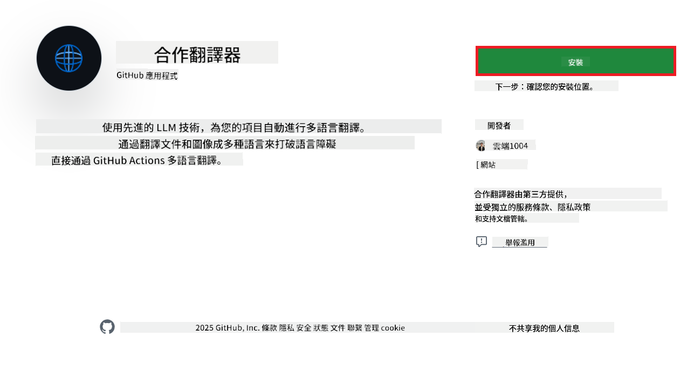
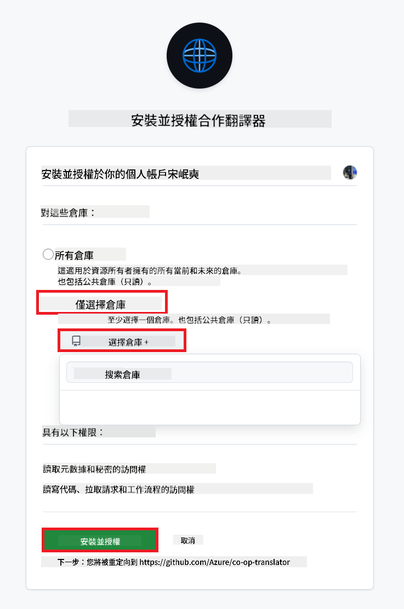
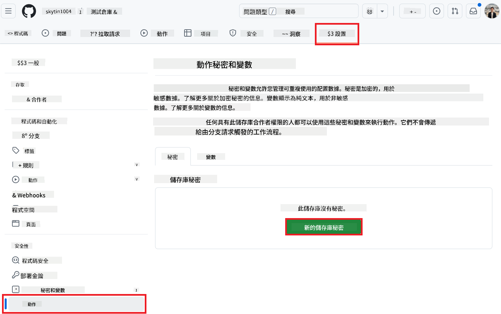
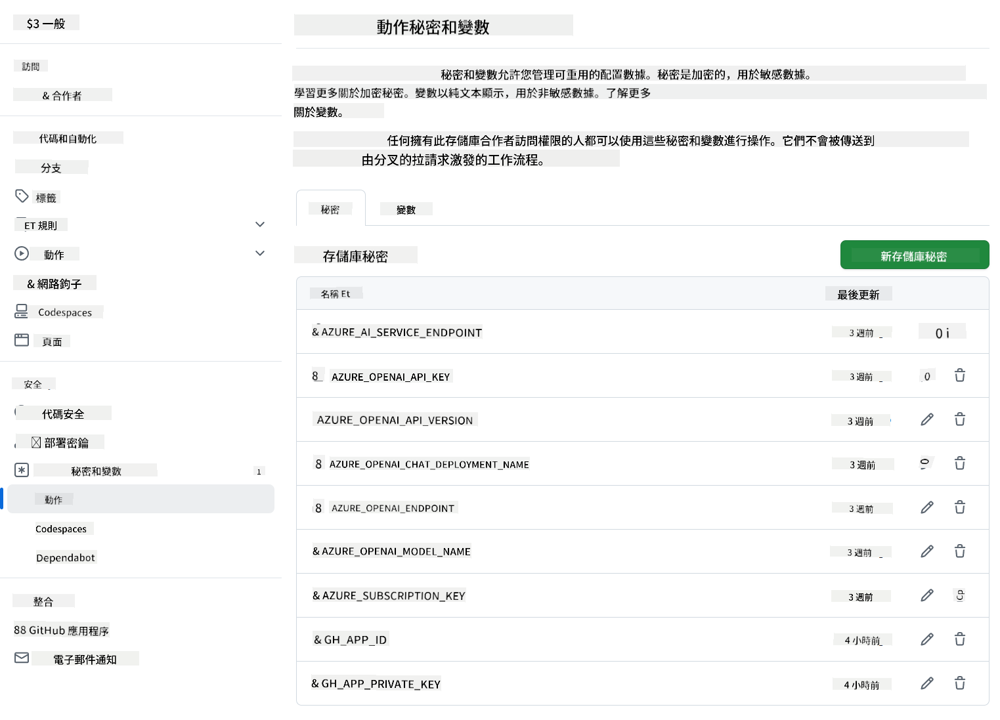

<!--
CO_OP_TRANSLATOR_METADATA:
{
  "original_hash": "c437820027c197f25fb2cbee95bae28c",
  "translation_date": "2025-06-12T19:04:08+00:00",
  "source_file": "getting_started/github-actions-guide/github-actions-guide-org.md",
  "language_code": "tw"
}
-->
# 使用 Co-op Translator GitHub Action（組織指南）

**目標讀者：** 本指南適用於 **Microsoft 內部使用者** 或 **擁有預建 Co-op Translator GitHub App 必要憑證的團隊**，或能自行建立自訂 GitHub App 的團隊。

透過 Co-op Translator GitHub Action，輕鬆自動化翻譯您的儲存庫文件。此指南將引導您設定該 Action，當您的原始 Markdown 檔案或圖片變更時，自動建立含更新翻譯的 Pull Request。

> [!IMPORTANT]
> 
> **選擇合適的指南：**
>
> 本指南說明如何使用 **GitHub App ID 與 Private Key** 進行設定。通常在以下情況需使用此「組織指南」方法：**`GITHUB_TOKEN` 權限受限：** 若您的組織或儲存庫設定限制了標準 `GITHUB_TOKEN` 預設權限，特別是當 `GITHUB_TOKEN` 無法取得必要的 `write` 權限（如 `contents: write` 或 `pull-requests: write`），則 [Public Setup Guide](./github-actions-guide-public.md) 中的工作流程會因權限不足而失敗。使用專用且明確授權權限的 GitHub App 可繞過此限制。
>
> **如果上述情況不適用於您：**
>
> 若標準 `GITHUB_TOKEN` 在您的儲存庫中擁有足夠權限（即未受組織限制阻擋），請使用 **[使用 GITHUB_TOKEN 的公開設定指南](./github-actions-guide-public.md)**。該公開指南不需取得或管理 App ID 或 Private Key，僅依賴標準 `GITHUB_TOKEN` 與儲存庫權限。

## 前置條件

在設定 GitHub Action 之前，請確保您已準備好所需的 AI 服務憑證。

**1. 必要：AI 語言模型憑證**  
您需擁有至少一種支援的語言模型憑證：

- **Azure OpenAI**：需提供 Endpoint、API Key、Model/Deployment 名稱、API 版本。
- **OpenAI**：需提供 API Key，（可選：Org ID、Base URL、Model ID）。
- 詳細請參閱 [Supported Models and Services](../../../../README.md)。
- 設定指南：[設定 Azure OpenAI](../set-up-resources/set-up-azure-openai.md)。

**2. 選用：電腦視覺憑證（用於圖片翻譯）**

- 僅當您需要翻譯圖片內文字時才需提供。
- **Azure Computer Vision**：需提供 Endpoint 與訂閱金鑰。
- 若未提供，該 Action 將預設為 [僅 Markdown 模式](../markdown-only-mode.md)。
- 設定指南：[設定 Azure Computer Vision](../set-up-resources/set-up-azure-computer-vision.md)。

## 安裝與設定

請依照以下步驟，在您的儲存庫中設定 Co-op Translator GitHub Action：

### 步驟 1：安裝並設定 GitHub App 認證

此工作流程使用 GitHub App 認證，以安全方式代表您與儲存庫互動（例如建立 Pull Request）。請選擇其中一個選項：

#### **選項 A：安裝預建 Co-op Translator GitHub App（僅限 Microsoft 內部使用）**

1. 前往 [Co-op Translator GitHub App](https://github.com/apps/co-op-translator) 頁面。

1. 選擇 **Install**，並選擇目標儲存庫所在的帳號或組織。

    

1. 選擇 **Only select repositories**，並選擇您的目標儲存庫（例如 `PhiCookBook`）。點擊 **Install**。系統可能會要求您進行驗證。

    

1. **取得 App 憑證（需內部流程）：** 為讓工作流程能以 App 身份認證，您需要從 Co-op Translator 團隊取得兩項資訊：
  - **App ID：** Co-op Translator App 的唯一識別碼。App ID 為：`1164076`。
  - **Private Key：** 您必須從維護者聯絡人處取得 `.pem` 私鑰檔案的**完整內容**。請妥善保管此金鑰，視同密碼。

1. 接著進入步驟 2。

#### **選項 B：使用您自己的自訂 GitHub App**

- 若您願意，也可自行建立並設定 GitHub App。請確保該 App 具有 Contents 與 Pull requests 的讀寫權限。您需要該 App 的 App ID 及產生的 Private Key。

### 步驟 2：設定儲存庫 Secrets

您需將 GitHub App 憑證與 AI 服務憑證，以加密秘密的形式新增至儲存庫設定。

1. 前往您的目標 GitHub 儲存庫（例如 `PhiCookBook`）。

1. 點選 **Settings** > **Secrets and variables** > **Actions**。

1. 在 **Repository secrets** 下，針對下列每個秘密點選 **New repository secret**。

   

**必填秘密（用於 GitHub App 認證）：**

| 秘密名稱           | 說明                                     | 來源                                     |
| :----------------- | :--------------------------------------- | :--------------------------------------- |
| `GH_APP_ID` | GitHub App 的 App ID（來自步驟 1）。       | GitHub App 設定頁面                      |
| `GH_APP_PRIVATE_KEY` | 下載的 `.pem` 私鑰檔案**完整內容**。 | `.pem` 私鑰檔案（來自步驟 1） |

**AI 服務秘密（依前置條件視需要全部新增）：**

| 秘密名稱           | 說明                                   | 來源                               |
| :----------------- | :------------------------------------- | :--------------------------------- |
| `AZURE_SUBSCRIPTION_KEY` | Azure AI 服務（電腦視覺）金鑰          | Azure AI Foundry                   |
| `AZURE_AI_SERVICE_ENDPOINT` | Azure AI 服務（電腦視覺）Endpoint      | Azure AI Foundry                   |
| `AZURE_OPENAI_API_KEY` | Azure OpenAI 服務金鑰                  | Azure AI Foundry                   |
| `AZURE_OPENAI_ENDPOINT` | Azure OpenAI 服務 Endpoint             | Azure AI Foundry                   |
| `AZURE_OPENAI_MODEL_NAME` | 您的 Azure OpenAI 模型名稱             | Azure AI Foundry                   |
| `AZURE_OPENAI_CHAT_DEPLOYMENT_NAME` | 您的 Azure OpenAI 部署名稱             | Azure AI Foundry                   |
| `AZURE_OPENAI_API_VERSION` | Azure OpenAI API 版本                  | Azure AI Foundry                   |
| `OPENAI_API_KEY` | OpenAI API Key                        | OpenAI 平台                       |
| `OPENAI_ORG_ID` | OpenAI 組織 ID                        | OpenAI 平台                       |
| `OPENAI_CHAT_MODEL_ID` | 特定 OpenAI 模型 ID                   | OpenAI 平台                       |
| `OPENAI_BASE_URL` | 自訂 OpenAI API 基底 URL              | OpenAI 平台                       |



### 步驟 3：建立工作流程檔案

最後，建立定義自動化工作流程的 YAML 檔案。

1. 在儲存庫根目錄建立 `.github/workflows/` 目錄（如果尚未存在）。

1. 在 `.github/workflows/` 目錄內建立名為 `co-op-translator.yml` 的檔案。

1. 將以下內容貼入 co-op-translator.yml。

```
name: Co-op Translator

on:
  push:
    branches:
      - main

jobs:
  co-op-translator:
    runs-on: ubuntu-latest

    permissions:
      contents: write
      pull-requests: write

    steps:
      - name: Checkout repository
        uses: actions/checkout@v4
        with:
          fetch-depth: 0

      - name: Set up Python
        uses: actions/setup-python@v4
        with:
          python-version: '3.10'

      - name: Install Co-op Translator
        run: |
          python -m pip install --upgrade pip
          pip install co-op-translator

      - name: Run Co-op Translator
        env:
          PYTHONIOENCODING: utf-8
          # Azure AI Service Credentials
          AZURE_SUBSCRIPTION_KEY: ${{ secrets.AZURE_SUBSCRIPTION_KEY }}
          AZURE_AI_SERVICE_ENDPOINT: ${{ secrets.AZURE_AI_SERVICE_ENDPOINT }}

          # Azure OpenAI Credentials
          AZURE_OPENAI_API_KEY: ${{ secrets.AZURE_OPENAI_API_KEY }}
          AZURE_OPENAI_ENDPOINT: ${{ secrets.AZURE_OPENAI_ENDPOINT }}
          AZURE_OPENAI_MODEL_NAME: ${{ secrets.AZURE_OPENAI_MODEL_NAME }}
          AZURE_OPENAI_CHAT_DEPLOYMENT_NAME: ${{ secrets.AZURE_OPENAI_CHAT_DEPLOYMENT_NAME }}
          AZURE_OPENAI_API_VERSION: ${{ secrets.AZURE_OPENAI_API_VERSION }}

          # OpenAI Credentials
          OPENAI_API_KEY: ${{ secrets.OPENAI_API_KEY }}
          OPENAI_ORG_ID: ${{ secrets.OPENAI_ORG_ID }}
          OPENAI_CHAT_MODEL_ID: ${{ secrets.OPENAI_CHAT_MODEL_ID }}
          OPENAI_BASE_URL: ${{ secrets.OPENAI_BASE_URL }}
        run: |
          # =====================================================================
          # IMPORTANT: Set your target languages here (REQUIRED CONFIGURATION)
          # =====================================================================
          # Example: Translate to Spanish, French, German. Add -y to auto-confirm.
          translate -l "es fr de" -y  # <--- MODIFY THIS LINE with your desired languages

      - name: Authenticate GitHub App
        id: generate_token
        uses: tibdex/github-app-token@v1
        with:
          app_id: ${{ secrets.GH_APP_ID }}
          private_key: ${{ secrets.GH_APP_PRIVATE_KEY }}

      - name: Create Pull Request with translations
        uses: peter-evans/create-pull-request@v5
        with:
          token: ${{ steps.generate_token.outputs.token }}
          commit-message: "🌐 Update translations via Co-op Translator"
          title: "🌐 Update translations via Co-op Translator"
          body: |
            This PR updates translations for recent changes to the main branch.

            ### 📋 Changes included
            - Translated contents are available in the `translations/` directory
            - Translated images are available in the `translated_images/` directory

            ---
            🌐 Automatically generated by the [Co-op Translator](https://github.com/Azure/co-op-translator) GitHub Action.
          branch: update-translations
          base: main
          labels: translation, automated-pr
          delete-branch: true
          add-paths: |
            translations/
            translated_images/

```

4.  **自訂工作流程：**
  - **[!IMPORTANT] 目標語言：** 在 `Run Co-op Translator` step, you **MUST review and modify the list of language codes** within the `translate -l "..." -y` command to match your project's requirements. The example list (`ar de es...`) needs to be replaced or adjusted.
  - **Trigger (`on:`):** The current trigger runs on every push to `main`. For large repositories, consider adding a `paths:` filter (see commented example in the YAML) to run the workflow only when relevant files (e.g., source documentation) change, saving runner minutes.
  - **PR Details:** Customize the `commit-message`, `title`, `body`, `branch` name, and `labels` in the `Create Pull Request` step if needed.

## Credential Management and Renewal

- **Security:** Always store sensitive credentials (API keys, private keys) as GitHub Actions secrets. Never expose them in your workflow file or repository code.
- **[!IMPORTANT] Key Renewal (Internal Microsoft Users):** Be aware that Azure OpenAI key used within Microsoft might have a mandatory renewal policy (e.g., every 5 months). Ensure you update the corresponding GitHub secrets (`AZURE_OPENAI_...` 等欄位中設定。請在金鑰過期前更新，以避免工作流程失敗。

## 執行工作流程

當 `co-op-translator.yml` 檔案合併至 main 分支（或設定於 `on:` trigger), the workflow will automatically run whenever changes are pushed to that branch (and match the `paths` 過濾器的分支）後，

若有生成或更新翻譯，該 Action 將自動建立包含變更的 Pull Request，供您審核與合併。

**免責聲明**：  
本文件係使用 AI 翻譯服務 [Co-op Translator](https://github.com/Azure/co-op-translator) 所翻譯。雖然我們致力於翻譯的準確性，但請注意，自動翻譯可能包含錯誤或不準確之處。原始文件的母語版本應被視為權威來源。對於重要資訊，建議採用專業人工翻譯。我們不對因使用本翻譯所產生的任何誤解或誤釋承擔責任。