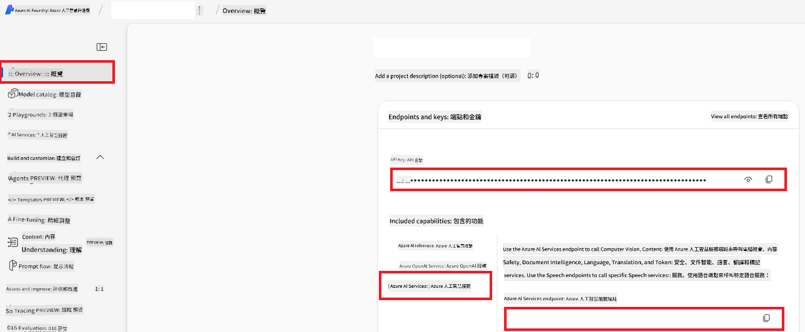

<!--
CO_OP_TRANSLATOR_METADATA:
{
  "original_hash": "b58d7c3cb4210697a073d20eb3064945",
  "translation_date": "2025-06-12T11:48:31+00:00",
  "source_file": "getting_started/set-up-azure-ai.md",
  "language_code": "tw"
}
-->
# Set Up Azure AI for Co-op Translator (Azure OpneAI & Azure AI Vision)

本指南將帶你設定 Azure OpenAI 以進行語言翻譯，以及 Azure Computer Vision 用於圖片內容分析（進而應用於圖片翻譯），這些都在 Azure AI Foundry 裡完成。

**先決條件：**
- 擁有一個有效訂閱的 Azure 帳號。
- 在你的 Azure 訂閱中有足夠權限來建立資源和部署。

## 建立 Azure AI 專案

你會先建立一個 Azure AI 專案，作為管理 AI 資源的中央平台。

1. 前往 [https://ai.azure.com](https://ai.azure.com) 並使用你的 Azure 帳號登入。

1. 選擇 **+Create** 來建立新專案。

1. 完成以下步驟：
   - 輸入 **Project name**（例如 `CoopTranslator-Project`）。
   - 選擇 **AI hub**（例如 `CoopTranslator-Hub`）（需要的話可以新建）。

1. 點選「**Review and Create**」來建立專案，系統會帶你到專案總覽頁面。

## 設定 Azure OpenAI 以進行語言翻譯

在你的專案中，部署 Azure OpenAI 模型作為文字翻譯的後端。

### 前往你的專案

如果還沒進入，打開你剛建立的專案（例如 `CoopTranslator-Project`）於 Azure AI Foundry。

### 部署 OpenAI 模型

1. 從專案左側選單中，於「My assets」底下選擇「**Models + endpoints**」。

1. 點選 **+ Deploy model**。

1. 選擇 **Deploy Base Model**。

1. 系統會顯示可用模型清單，篩選或搜尋合適的 GPT 模型，我們推薦 `gpt-4o`。

1. 選擇你想要的模型並點擊 **Confirm**。

1. 點選 **Deploy**。

### Azure OpenAI 配置

部署完成後，你可以在「**Models + endpoints**」頁面選擇該部署，查詢它的 **REST endpoint URL**、**Key**、**Deployment name**、**Model name** 及 **API version**。這些資訊將用於整合翻譯模型到你的應用程式。

> [!NOTE]
> 你可以根據需求，從 [API version deprecation](https://learn.microsoft.com/azure/ai-services/openai/api-version-deprecation) 頁面選擇 API 版本。請注意，**API version** 與 Azure AI Foundry「Models + endpoints」頁面顯示的 **Model version** 是不同的。

## 設定 Azure Computer Vision 以進行圖片翻譯

要讓圖片中的文字能被翻譯，你需要取得 Azure AI Service 的 API Key 和 Endpoint。

1. 前往你的 Azure AI 專案（例如 `CoopTranslator-Project`），確定你在專案總覽頁面。

### Azure AI Service 配置

從 Azure AI Service 找出 API Key 和 Endpoint。

1. 前往你的 Azure AI 專案（例如 `CoopTranslator-Project`），確定你在專案總覽頁面。

1. 從 Azure AI Service 分頁找到 **API Key** 和 **Endpoint**。

    

這個連結會讓你連結的 Azure AI Services 資源（包含圖片分析）功能能用於你的 AI Foundry 專案。接著你就可以在筆記本或應用程式中使用這個連結，從圖片中擷取文字，再將文字傳送給 Azure OpenAI 模型進行翻譯。

## 彙整你的認證資料

到目前為止，你應該已收集到以下資訊：

**Azure OpenAI（文字翻譯）：**
- Azure OpenAI Endpoint
- Azure OpenAI API Key
- Azure OpenAI Model Name（例如 `gpt-4o`）
- Azure OpenAI Deployment Name（例如 `cooptranslator-gpt4o`）
- Azure OpenAI API Version

**Azure AI Services（透過 Vision 擷取圖片文字）：**
- Azure AI Service Endpoint
- Azure AI Service API Key

### 範例：環境變數設定（預覽）

之後在建立應用程式時，通常會用這些認證設定環境變數，例如：

```bash
# Azure AI Service Credentials (Required for image translation)
AZURE_AI_SERVICE_API_KEY="your_azure_ai_service_api_key" # e.g., 21xasd...
AZURE_AI_SERVICE_ENDPOINT="https://your_azure_ai_service_endpoint.cognitiveservices.azure.com/"

# Azure OpenAI Credentials (Required for text translation)
AZURE_OPENAI_API_KEY="your_azure_openai_api_key" # e.g., 21xasd...
AZURE_OPENAI_ENDPOINT="https://your_azure_openai_endpoint.openai.azure.com/"
AZURE_OPENAI_MODEL_NAME="your_model_name" # e.g., gpt-4o
AZURE_OPENAI_CHAT_DEPLOYMENT_NAME="your_deployment_name" # e.g., cooptranslator-gpt4o
AZURE_OPENAI_API_VERSION="your_api_version" # e.g., 2024-12-01-preview
```

---

### 延伸閱讀

- [How to Create a project in Azure AI Foundry](https://learn.microsoft.com/azure/ai-foundry/how-to/create-projects?tabs=ai-studio)
- [How to Create Azure AI resources](https://learn.microsoft.com/azure/ai-foundry/how-to/create-azure-ai-resource?tabs=portal)
- [How to Deploy OpenAI models in Azure AI Foundry](https://learn.microsoft.com/en-us/azure/ai-foundry/how-to/deploy-models-openai)

**免責聲明**：  
本文件係使用 AI 翻譯服務 [Co-op Translator](https://github.com/Azure/co-op-translator) 進行翻譯。雖然我們努力追求準確性，但請注意，自動翻譯可能包含錯誤或不準確之處。原始文件之母語版本應視為權威來源。對於重要資訊，建議採用專業人工翻譯。我們對因使用本翻譯所導致之任何誤解或誤釋不負任何責任。