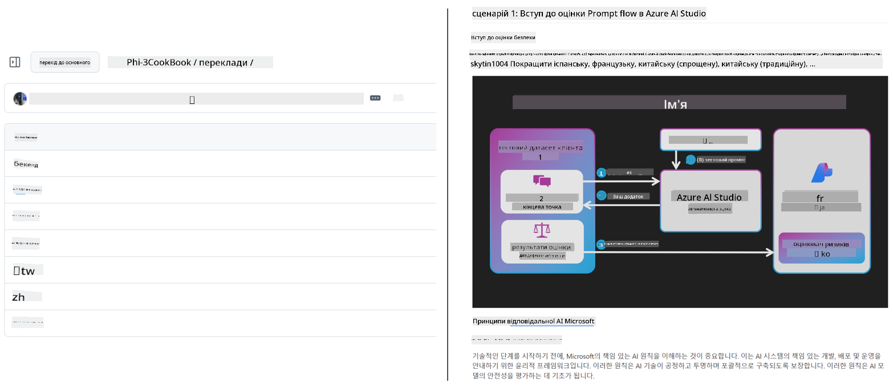
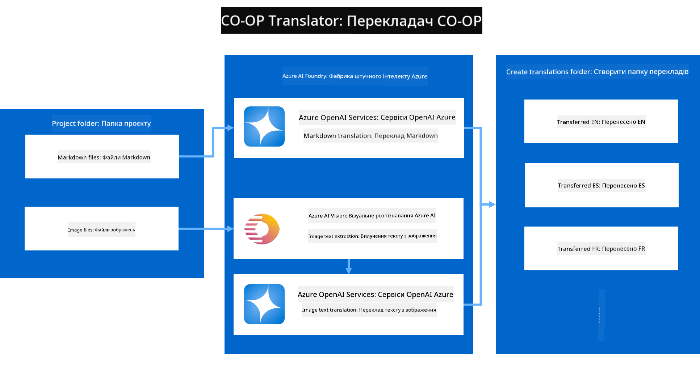
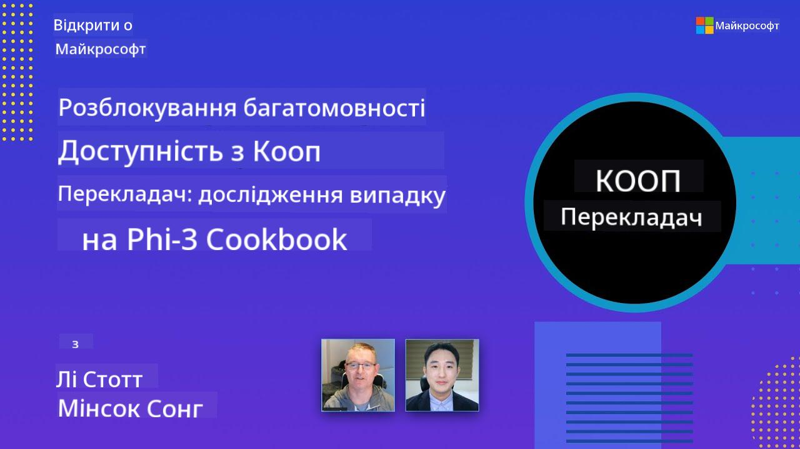

<!--
CO_OP_TRANSLATOR_METADATA:
{
  "original_hash": "044724537b57868117aadae8e7728c7c",
  "translation_date": "2025-06-12T11:01:34+00:00",
  "source_file": "README.md",
  "language_code": "uk"
}
-->


# Co-op Translator: Автоматизуйте переклад освітньої документації без зусиль

_Легко автоматизуйте переклад вашої документації на кілька мов, щоб охопити глобальну аудиторію._

[](https://pypi.org/project/co-op-translator/)
[](https://github.com/azure/co-op-translator/blob/main/LICENSE)
[](https://pepy.tech/project/co-op-translator)
[](https://pepy.tech/project/co-op-translator)
[](https://github.com/psf/black)

[](https://GitHub.com/azure/co-op-translator/graphs/contributors/)
[](https://GitHub.com/azure/co-op-translator/issues/)
[](https://GitHub.com/azure/co-op-translator/pulls/)
[](http://makeapullrequest.com)

### Підтримка мов за допомогою Co-op Translator
[French](../fr/README.md) | [Spanish](../es/README.md) | [German](../de/README.md) | [Russian](../ru/README.md) | [Arabic](../ar/README.md) | [Persian (Farsi)](../fa/README.md) | [Urdu](../ur/README.md) | [Chinese (Simplified)](../zh/README.md) | [Chinese (Traditional, Macau)](../mo/README.md) | [Chinese (Traditional, Hong Kong)](../hk/README.md) | [Chinese (Traditional, Taiwan)](../tw/README.md) | [Japanese](../ja/README.md) | [Korean](../ko/README.md) | [Hindi](../hi/README.md) | [Bengali](../bn/README.md) | [Marathi](../mr/README.md) | [Nepali](../ne/README.md) | [Punjabi (Gurmukhi)](../pa/README.md) | [Portuguese (Portugal)](../pt/README.md) | [Portuguese (Brazil)](../br/README.md) | [Italian](../it/README.md) | [Polish](../pl/README.md) | [Turkish](../tr/README.md) | [Greek](../el/README.md) | [Thai](../th/README.md) | [Swedish](../sv/README.md) | [Danish](../da/README.md) | [Norwegian](../no/README.md) | [Finnish](../fi/README.md) | [Dutch](../nl/README.md) | [Hebrew](../he/README.md) | [Vietnamese](../vi/README.md) | [Indonesian](../id/README.md) | [Malay](../ms/README.md) | [Tagalog (Filipino)](../tl/README.md) | [Swahili](../sw/README.md) | [Hungarian](../hu/README.md) | [Czech](../cs/README.md) | [Slovak](../sk/README.md) | [Romanian](../ro/README.md) | [Bulgarian](../bg/README.md) | [Serbian (Cyrillic)](../sr/README.md) | [Croatian](../hr/README.md) | [Slovenian](../sl/README.md) | [Ukrainian](./README.md) | [Burmese (Myanmar)](../my/README.md)
> [!NOTE]
> Це поточні переклади вмісту цього репозиторію. Для повного списку мов, підтримуваних Co-op Translator, будь ласка, дивіться розділ [Language Support](../..).

[](https://GitHub.com/azure/co-op-translator/watchers/)
[](https://GitHub.com/azure/co-op-translator/network/)
[](https://GitHub.com/azure/co-op-translator/stargazers/)

[](https://discord.com/invite/ByRwuEEgH4)

[](https://codespaces.new/azure/co-op-translator)
[](https://vscode.dev/redirect?url=vscode://ms-vscode-remote.remote-containers/cloneInVolume?url=https://github.com/azure/co-op-translator)

## Огляд: Оптимізуйте переклад вашого навчального контенту

Мовні бар’єри суттєво ускладнюють доступ до цінних освітніх ресурсів і технічних знань для учнів та розробників у всьому світі. Це обмежує участь і уповільнює темп глобальних інновацій та навчання.

**Co-op Translator** виник через необхідність розв’язати проблему неефективного ручного перекладу великомасштабних навчальних серій Microsoft (наприклад, посібників «Для початківців»). Він перетворився на зручний та потужний інструмент, створений, щоб усунути ці бар’єри для всіх. Завдяки якісному автоматичному перекладу через CLI та GitHub Actions, Co-op Translator дає змогу освітянам, студентам, дослідникам і розробникам у всьому світі ділитися знаннями та отримувати їх без мовних обмежень.

Дивіться, як Co-op Translator організовує перекладений навчальний контент:



Markdown-файли та текст на зображеннях автоматично перекладаються і акуратно розподіляються по папках, призначених для конкретних мов.

**Відкрийте світовий доступ до вашого навчального контенту вже сьогодні з Co-op Translator!**

## Підтримка глобального доступу до навчальних ресурсів Microsoft

Co-op Translator допомагає подолати мовний бар’єр для ключових освітніх ініціатив Microsoft, автоматизуючи процес перекладу репозиторіїв, що обслуговують глобальну спільноту розробників. Приклади, які вже використовують Co-op Translator:

[](https://github.com/microsoft/Generative-AI-for-beginners)
[](https://github.com/microsoft/ML-For-Beginners)
[](https://github.com/microsoft/AI-For-Beginners)
[](https://github.com/microsoft/ai-agents-for-beginners)
[](https://github.com/microsoft/PhiCookBook)
[](https://github.com/microsoft/Generative-AI-for-beginners-dotnet)

## Ключові можливості

- **Автоматичний переклад**: Легко перекладайте текст на кілька мов.
- **Інтеграція з GitHub Actions**: Автоматизуйте переклади у вашому CI/CD пайплайні.
- **Збереження синтаксису Markdown**: Під час перекладу зберігається правильний синтаксис Markdown.
- **Переклад тексту на зображеннях**: Витягуйте та перекладайте текст із зображень.
- **Сучасні технології LLM**: Використовуйте передові мовні моделі для якісного перекладу.
- **Проста інтеграція**: Легко інтегруйте у ваш існуючий проект.
- **Спрощення локалізації**: Оптимізуйте процес локалізації вашого проекту для міжнародних ринків.

## Як це працює



Co-op Translator бере Markdown-файли та зображення з вашої папки проєкту і обробляє їх так:

1. **Витяг тексту**: Витягує текст із Markdown-файлів і, якщо налаштовано (наприклад, з Azure AI Vision), текст, вбудований у зображення.
1. **AI переклад**: Надсилає витягнутий текст у налаштовану LLM (Azure OpenAI, OpenAI тощо) для перекладу.
1. **Збереження результату**: Зберігає перекладені Markdown-файли та зображення (з перекладеним текстом) у папки для конкретних мов, зберігаючи оригінальне форматування.

## Початок роботи

Почніть швидко з CLI або налаштуйте повну автоматизацію через GitHub Actions. Оберіть підхід, який найкраще підходить для вашого робочого процесу:

1. **Командний рядок (CLI)** — для одноразових перекладів або ручного контролю
2. **GitHub Actions** — для автоматичного перекладу при кожному пуші

> [!NOTE]
> Хоч цей посібник і зосереджений на ресурсах Azure, ви можете використовувати будь-яку підтримувану мовну модель.

### Підтримка мов

Co-op Translator підтримує широкий спектр мов, щоб допомогти вам охопити глобальну аудиторію. Ось що потрібно знати:

#### Швидка довідка

| Мова | Код | Мова | Код | Мова | Код |
|----------|------|----------|------|----------|------|
| Arabic | ar | Bengali | bn | Bulgarian | bg |
| Burmese (Myanmar) | my | Chinese (Simplified) | zh | Chinese (Traditional, HK) | hk |
| Chinese (Traditional, Macau) | mo | Chinese (Traditional, TW) | tw | Croatian | hr |
| Czech | cs | Danish | da | Dutch | nl |
| Finnish | fi | French | fr | German | de |
| Greek | el | Hebrew | he | Hindi | hi |
| Hungarian | hu | Indonesian | id | Italian | it |
| Japanese | ja | Korean | ko | Malay | ms |
| Marathi | mr | Nepali | ne | Norwegian | no |
| Persian (Farsi) | fa | Polish | pl | Portuguese (Brazil) | br |
| Portuguese (Portugal) | pt | Punjabi (Gurmukhi) | pa | Romanian | ro |
| Russian | ru | Serbian (Cyrillic) | sr | Slovak | sk |
| Slovenian | sl | Spanish | es | Swahili | sw |
| Swedish | sv | Tagalog (Filipino) | tl | Thai | th |
| Turkish | tr | Ukrainian | uk | Urdu | ur |
| Vietnamese | vi | — | — | — | — |

#### Використання кодів мов

При використанні Co-op Translator потрібно вказувати мови за їх кодами. Наприклад:

```bash
# Translate to French, Spanish, and German
translate -l "fr es de"

# Translate to Chinese (Simplified) and Japanese
translate -l "zh ja"
```

> [!NOTE]
> Для детальної технічної інформації про підтримку мов, включно з:
>
> - Специфікаціями шрифтів для кожної мови
> - Відомими проблемами
> - Як додавати нові мови
>
> Дивіться наш [Supported Languages Documentation](./getting_started/supported-languages.md).

### Підтримувані моделі та сервіси

| Тип                  | Назва                           |
|-----------------------|--------------------------------|
| Language Model        |   |
| AI Vision       |  |

> [!NOTE]
> Якщо сервіс AI Vision недоступний, co-op translator переключиться в [Markdown-only mode](./getting_started/markdown-only-mode.md).

### Початкове налаштування

Перед початком вам потрібно підготувати такі ресурси:

1. Ресурс мовної моделі (обов’язково):
   - Azure OpenAI (рекомендовано) — забезпечує якісний переклад з корпоративною надійністю
   - OpenAI — альтернативний варіант, якщо у вас немає доступу до Azure
   - Для детальної інформації про підтримувані моделі дивіться [Supported Models and Services](../..)

1. Ресурс AI Vision (за бажанням):
   - Azure AI Vision — дозволяє перекладати текст на зображеннях
   - Якщо не налаштовано, перекладач автоматично використовуватиме [Markdown-only mode](./getting_started/markdown-only-mode.md)
   - Рекомендовано для проєктів із зображеннями, що містять текст для перекладу

1. Кроки налаштування:
   - Дотримуйтесь нашого [Azure AI setup guide](./getting_started/set-up-azure-ai.md) для детальних інструкцій
   - Створіть файл `.env` з вашими API ключами та кінцевими точками (див. розділ [Quick Start](../..))
   - Переконайтеся, що у вас є необхідні дозволи та квоти для обраних сервісів

### Підготовка проєкту перед перекладом

Перед початком перекладу виконайте такі дії для підготовки проєкту:

1. Підготуйте README:
   - Додайте таблицю перекладів у ваш README.md для посилань на перекладені версії
   - Приклад формату:

     ```markdown

     ### 🌐 Multi-Language Support
     
     [French](../fr/README.md) | [Spanish](../es/README.md) | [German](../de/README.md) | [Russian](../ru/README.md) | [Arabic](../ar/README.md) | [Persian (Farsi)](../fa/README.md) | [Urdu](../ur/README.md) | [Chinese (Simplified)](../zh/README.md) | [Chinese (Traditional, Macau)](../mo/README.md) | [Chinese (Traditional, Hong Kong)](../hk/README.md) | [Chinese (Traditional, Taiwan)](../tw/README.md) | [Japanese](../ja/README.md) | [Korean](../ko/README.md) | [Hindi](../hi/README.md) | [Bengali](../bn/README.md) | [Marathi](../mr/README.md) | [Nepali](../ne/README.md) | [Punjabi (Gurmukhi)](../pa/README.md) | [Portuguese (Portugal)](../pt/README.md) | [Portuguese (Brazil)](../br/README.md) | [Italian](../it/README.md) | [Polish](../pl/README.md) | [Turkish](../tr/README.md) | [Greek](../el/README.md) | [Thai](../th/README.md) | [Swedish](../sv/README.md) | [Danish](../da/README.md) | [Norwegian](../no/README.md) | [Finnish](../fi/README.md) | [Dutch](../nl/README.md) | [Hebrew](../he/README.md) | [Vietnamese](../vi/README.md) | [Indonesian](../id/README.md) | [Malay](../ms/README.md) | [Tagalog (Filipino)](../tl/README.md) | [Swahili](../sw/README.md) | [Hungarian](../hu/README.md) | [Czech](../cs/README.md) | [Slovak](../sk/README.md) | [Romanian](../ro/README.md) | [Bulgarian](../bg/README.md) | [Serbian (Cyrillic)](../sr/README.md) | [Croatian](../hr/README.md) | [Slovenian](../sl/README.md) | [Ukrainian](./README.md) | [Burmese (Myanmar)](../my/README.md) 
    
     ```

1. Очистіть існуючі переклади (за потреби):
   - Видаліть усі існуючі папки з перекладами (наприклад, `translations/`)
   - Видаліть старі файли перекладу для чистого старту
   - Це допоможе уникнути конфліктів із новим процесом перекладу

### Швидкий старт: Командний рядок

Для швидкого початку з командного рядка:

1. Створіть віртуальне середовище:

    ```bash
    python -m venv .venv
    ```

1. Активуйте віртуальне середовище:

    - Для Windows:

    ```bash
    .venv\scripts\activate
    ```

    - Для Linux/macOS:

    ```bash
    source .venv/bin/activate
    ```

1. Встановіть пакет:

    ```bash
    pip install co-op-translator
    ```

1. Налаштуйте облікові дані:

    - Створіть файл `.env` file in your project's root directory.
    - Copy the contents from the [.env.template](../../.env.template) file into your new `.env` file.
    - Fill in the required API keys and endpoint information in your `.env` file.

1. Run Translation:
    - Navigate to your project's root directory in your terminal.
    - Execute the translate command, specifying target languages with the `-l` прапорець:

    ```bash
    translate -l "ko ja fr"
    ```

_(Далі текст файлу `.env` та приклади конфігурації згідно з оригіналом)_

### GitHub Actions

Для повної автоматизації перекладів через GitHub Actions у вашому репозиторії:

- Додайте workflow файли у папку `.github/workflows`
- Задайте необхідні секрети у налаштуваннях репозиторію
- Використовуйте прапорець `-l` для запуску перекладу без локальної інсталяції

- Посібники:
  - [GitHub Actions Guide (публічні репозиторії та стандартні секрети)](./getting_started/github-actions-guide/github-actions-guide-public.md) — для більшості публічних чи персональних репозиторіїв з використанням стандартних секретів репозиторію.
  - [GitHub Actions Guide (репозиторії Microsoft Organization та налаштування на рівні організації)](./getting_started/github-actions-guide/github-actions-guide-org.md) — для роботи в організації Microsoft GitHub або використання секретів та раннерів на рівні організації.

### Вирішення проблем і поради

- [Посібник з усунення неполадок](./getting_started/troubleshooting.md)

### Додаткові ресурси

- [Довідник команд](./getting_started/command-reference.md): Детальний опис усіх доступних команд і опцій.
- [Підтримувані мови](./getting_started/supported-languages.md): Перелік підтримуваних мов та інструкції для додавання нових.
- [Режим тільки Markdown](./getting_started/markdown-only-mode.md): Як перекладати лише текст без перекладу зображень.

## Відеопрезентації

Дізнайтеся більше про Co-op Translator через наші презентації _(натисніть на зображення нижче, щоб переглянути на YouTube)_:

- **Open at Microsoft**: Коротке 18-хвилинне введення та швидкий посібник з використання Co-op Translator.
[](https://www.youtube.com/watch?v=jX_swfH_KNU)

## Підтримайте нас і сприяйте глобальному навчанню

Приєднуйтеся до нас у революції способів поширення освітнього контенту по всьому світу! Поставте ⭐ [Co-op Translator](https://github.com/azure/co-op-translator) на GitHub і підтримайте нашу місію подолання мовних бар’єрів у навчанні та технологіях. Ваша зацікавленість і внески мають велике значення! Ми завжди раді отримувати код та пропозиції щодо функцій.

## Внесок у проект

Цей проєкт відкритий для внесків і пропозицій. Хочете допомогти з Azure Co-op Translator? Будь ласка, ознайомтеся з нашим [CONTRIBUTING.md](./CONTRIBUTING.md), щоб дізнатися, як ви можете зробити Co-op Translator більш доступним.

## Учасники проєкту

[](https://github.com/Azure/co-op-translator/graphs/contributors)

## Кодекс поведінки

У цьому проєкті застосовується [Microsoft Open Source Code of Conduct](https://opensource.microsoft.com/codeofconduct/).
Детальніше дивіться у [поширених запитаннях щодо Кодексу поведінки](https://opensource.microsoft.com/codeofconduct/faq/) або звертайтеся на [opencode@microsoft.com](mailto:opencode@microsoft.com) з будь-якими додатковими питаннями чи коментарями.

## Відповідальний ШІ

Microsoft прагне допомагати клієнтам відповідально використовувати наші продукти штучного інтелекту, ділитися набутими знаннями та будувати довірчі партнерства за допомогою таких інструментів, як Transparency Notes і Impact Assessments. Багато з цих ресурсів доступні за посиланням [https://aka.ms/RAI](https://aka.ms/RAI).
Підхід Microsoft до відповідального ШІ базується на наших принципах: справедливість, надійність і безпека, конфіденційність і захист, інклюзивність, прозорість і підзвітність.

Великі моделі природної мови, зображень і мови — такі, як у цьому прикладі — можуть потенційно проявляти несправедливу, ненадійну або образливу поведінку, що може призводити до шкоди. Будь ласка, ознайомтеся з [Transparency note для Azure OpenAI service](https://learn.microsoft.com/legal/cognitive-services/openai/transparency-note?tabs=text), щоб дізнатися про ризики та обмеження.

Рекомендований спосіб зменшення цих ризиків — включити в архітектуру систему безпеки, яка може виявляти та запобігати шкідливій поведінці. [Azure AI Content Safety](https://learn.microsoft.com/azure/ai-services/content-safety/overview) забезпечує незалежний рівень захисту, здатний виявляти шкідливий контент, створений користувачами та ШІ, у застосунках і сервісах. Azure AI Content Safety включає API для тексту та зображень, які дозволяють виявляти шкідливий матеріал. Також є інтерактивна Content Safety Studio, що дозволяє переглядати, досліджувати та випробовувати приклади коду для виявлення шкідливого контенту в різних форматах. Наступна [документація швидкого запуску](https://learn.microsoft.com/azure/ai-services/content-safety/quickstart-text?tabs=visual-studio%2Clinux&pivots=programming-language-rest) допоможе вам зробити запити до сервісу.

Ще один важливий аспект — загальна продуктивність застосунку. Для мультимодальних і мультимодельних застосунків продуктивність означає, що система працює так, як ви та ваші користувачі очікують, включно з тим, що не генерує шкідливий вміст. Важливо оцінювати продуктивність вашого застосунку, використовуючи [метрики якості генерації та ризиків і безпеки](https://learn.microsoft.com/azure/ai-studio/concepts/evaluation-metrics-built-in).

Ви можете оцінити свій застосунок ШІ у середовищі розробки за допомогою [prompt flow SDK](https://microsoft.github.io/promptflow/index.html). За наявності тестового набору даних або цілі, генерації вашого генеративного застосунку ШІ кількісно оцінюються за допомогою вбудованих або власних оцінювачів. Щоб почати працювати з prompt flow sdk для оцінки вашої системи, дотримуйтеся [керівництва швидкого запуску](https://learn.microsoft.com/azure/ai-studio/how-to/develop/flow-evaluate-sdk). Після виконання оцінки ви можете [візуалізувати результати в Azure AI Studio](https://learn.microsoft.com/azure/ai-studio/how-to/evaluate-flow-results).

## Торговельні марки

Цей проєкт може містити торговельні марки або логотипи проєктів, продуктів чи сервісів. Авторизоване використання торговельних марок або логотипів Microsoft підпорядковується і має відповідати [Microsoft's Trademark & Brand Guidelines](https://www.microsoft.com/en-us/legal/intellectualproperty/trademarks/usage/general).
Використання торговельних марок або логотипів Microsoft у змінених версіях цього проєкту не повинно вводити в оману або припускати спонсорство Microsoft.
Використання торговельних марок або логотипів третіх сторін підпорядковується політикам відповідних третіх сторін.

**Відмова від відповідальності**:  
Цей документ було перекладено за допомогою сервісу автоматичного перекладу [Co-op Translator](https://github.com/Azure/co-op-translator). Хоча ми прагнемо до точності, просимо враховувати, що автоматичні переклади можуть містити помилки або неточності. Оригінальний документ рідною мовою слід вважати авторитетним джерелом. Для критично важливої інформації рекомендується звертатися до професійного людського перекладу. Ми не несемо відповідальності за будь-які непорозуміння чи неправильні тлумачення, що виникли внаслідок використання цього перекладу.