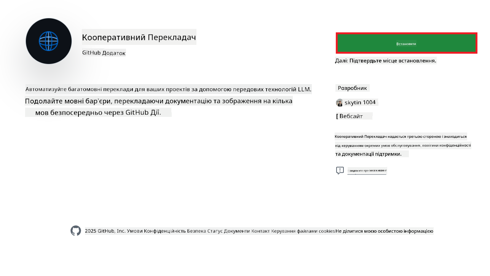
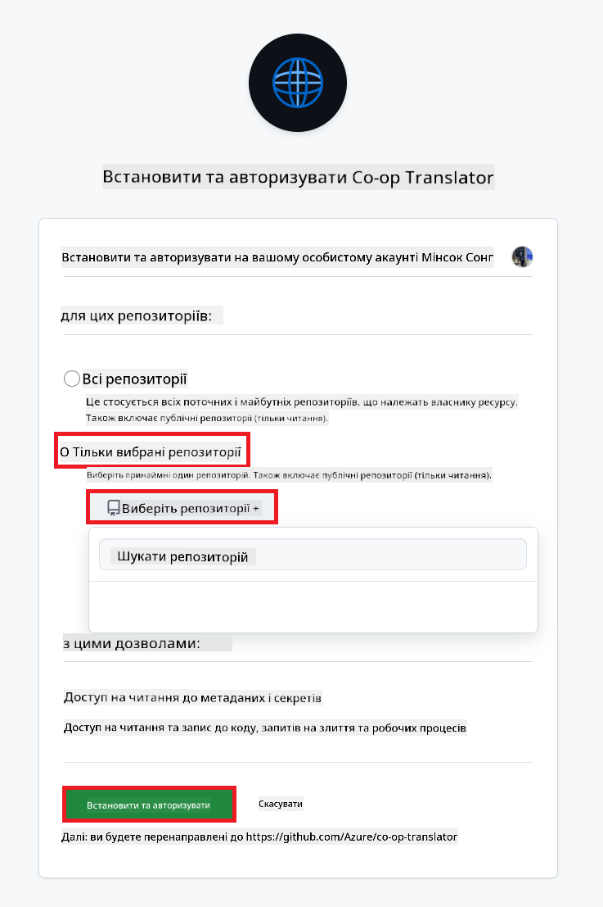
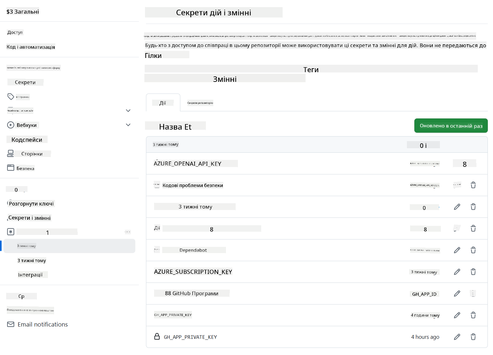

<!--
CO_OP_TRANSLATOR_METADATA:
{
  "original_hash": "c437820027c197f25fb2cbee95bae28c",
  "translation_date": "2025-06-12T19:20:04+00:00",
  "source_file": "getting_started/github-actions-guide/github-actions-guide-org.md",
  "language_code": "uk"
}
-->
# Використання GitHub Action Co-op Translator (Керівництво для організацій)

**Цільова аудиторія:** Це керівництво призначене для **внутрішніх користувачів Microsoft** або **команд, які мають доступ до необхідних облікових даних для готового GitHub App Co-op Translator** або можуть створити власний кастомний GitHub App.

Автоматизуйте переклад документації вашого репозиторію без зусиль за допомогою GitHub Action Co-op Translator. Це керівництво допоможе налаштувати дію для автоматичного створення pull request-ів з оновленими перекладами щоразу, коли змінюються ваші вихідні Markdown-файли або зображення.

> [!IMPORTANT]
> 
> **Вибір правильного керівництва:**
>
> Це керівництво описує налаштування за допомогою **GitHub App ID та приватного ключа**. Зазвичай вам потрібен цей метод "Керівництво для організацій", якщо: **`GITHUB_TOKEN` Права обмежені:** Налаштування вашої організації або репозиторію обмежують стандартні права, які надаються стандартному `GITHUB_TOKEN`. Зокрема, якщо `GITHUB_TOKEN` не має необхідних прав `write` (наприклад, `contents: write` або `pull-requests: write`), робочий процес із [Публічного керівництва з налаштування](./github-actions-guide-public.md) не спрацює через недостатні права. Використання спеціального GitHub App з явно наданими правами обминає це обмеження.
>
> **Якщо це вас не стосується:**
>
> Якщо стандартний `GITHUB_TOKEN` має достатні права у вашому репозиторії (тобто вас не обмежують організаційні налаштування), будь ласка, використовуйте **[Публічне керівництво з налаштування з GITHUB_TOKEN](./github-actions-guide-public.md)**. Публічне керівництво не вимагає отримання або керування App ID чи приватними ключами і покладається виключно на стандартний `GITHUB_TOKEN` та права репозиторію.

## Передумови

Перед налаштуванням GitHub Action переконайтеся, що у вас є необхідні облікові дані AI-сервісів.

**1. Обов’язково: облікові дані AI мовної моделі**  
Вам потрібні облікові дані принаймні для однієї підтримуваної мовної моделі:

- **Azure OpenAI**: Потрібні Endpoint, API Key, імена моделей/деплойментів, версія API.  
- **OpenAI**: Потрібен API Key, (за бажанням: Org ID, Base URL, Model ID).  
- Див. [Підтримувані моделі та сервіси](../../../../README.md) для деталей.  
- Керівництво з налаштування: [Налаштування Azure OpenAI](../set-up-resources/set-up-azure-openai.md).

**2. За бажанням: облікові дані Computer Vision (для перекладу зображень)**

- Потрібно лише, якщо потрібно перекладати текст на зображеннях.  
- **Azure Computer Vision**: Потрібні Endpoint та Subscription Key.  
- Якщо не вказано, дія переходить у [режим лише Markdown](../markdown-only-mode.md).  
- Керівництво з налаштування: [Налаштування Azure Computer Vision](../set-up-resources/set-up-azure-computer-vision.md).

## Налаштування та конфігурація

Виконайте ці кроки для налаштування GitHub Action Co-op Translator у вашому репозиторії:

### Крок 1: Встановлення та налаштування автентифікації GitHub App

Робочий процес використовує автентифікацію GitHub App для безпечної взаємодії з вашим репозиторієм (наприклад, створення pull request-ів) від вашого імені. Оберіть один із варіантів:

#### **Варіант A: Встановити готовий GitHub App Co-op Translator (для внутрішнього використання Microsoft)**

1. Перейдіть на сторінку [Co-op Translator GitHub App](https://github.com/apps/co-op-translator).

1. Оберіть **Install** та виберіть акаунт або організацію, де розташований ваш цільовий репозиторій.

    

1. Оберіть **Only select repositories** та виберіть ваш цільовий репозиторій (наприклад, `PhiCookBook`). Натисніть **Install**. Можливо, буде потрібно пройти автентифікацію.

    

1. **Отримайте облікові дані додатка (внутрішній процес):** Щоб дозволити робочому процесу автентифікуватися як додаток, вам потрібні дві інформації, які надає команда Co-op Translator:  
  - **App ID:** Унікальний ідентифікатор додатка Co-op Translator. App ID: `1164076`.  
  - **Приватний ключ:** Ви маєте отримати **повний вміст** приватного ключа `.pem` від контактної особи підтримки. **Ставтеся до ключа як до пароля і зберігайте його у безпеці.**

1. Перейдіть до Кроку 2.

#### **Варіант B: Використати власний кастомний GitHub App**

- Якщо бажаєте, можете створити і налаштувати власний GitHub App. Переконайтеся, що він має права Read & write на Contents та Pull requests. Вам знадобиться його App ID та згенерований приватний ключ.

### Крок 2: Налаштування секретів репозиторію

Вам потрібно додати облікові дані GitHub App та AI-сервісів як зашифровані секрети у налаштуваннях репозиторію.

1. Перейдіть до цільового репозиторію (наприклад, `PhiCookBook`).

1. Відкрийте **Settings** > **Secrets and variables** > **Actions**.

1. У розділі **Repository secrets** натисніть **New repository secret** для кожного з перерахованих нижче секретів.

   

**Обов’язкові секрети (для автентифікації GitHub App):**

| Назва секрету          | Опис                                       | Джерело значення                                |
| :--------------------- | :----------------------------------------- | :---------------------------------------------- |
| `GH_APP_ID`           | App ID GitHub App (з Кроку 1).              | Налаштування GitHub App                         |
| `GH_APP_PRIVATE_KEY` | **Повний вміст** завантаженого файлу `.pem`. | Файл `.pem` (з Кроку 1)             |

**Секрети AI-сервісів (додайте ВСІ, що потрібні відповідно до передумов):**

| Назва секрету                         | Опис                                      | Джерело значення                   |
| :------------------------------------ | :---------------------------------------- | :--------------------------------- |
| `AZURE_SUBSCRIPTION_KEY`            | Ключ для Azure AI Service (Computer Vision)  | Azure AI Foundry                  |
| `AZURE_AI_SERVICE_ENDPOINT`         | Endpoint для Azure AI Service (Computer Vision) | Azure AI Foundry                  |
| `AZURE_OPENAI_API_KEY`              | Ключ для Azure OpenAI service              | Azure AI Foundry                  |
| `AZURE_OPENAI_ENDPOINT`             | Endpoint для Azure OpenAI service          | Azure AI Foundry                  |
| `AZURE_OPENAI_MODEL_NAME`           | Назва вашої моделі Azure OpenAI             | Azure AI Foundry                  |
| `AZURE_OPENAI_CHAT_DEPLOYMENT_NAME` | Назва вашого деплойменту Azure OpenAI       | Azure AI Foundry                  |
| `AZURE_OPENAI_API_VERSION`          | Версія API для Azure OpenAI                  | Azure AI Foundry                  |
| `OPENAI_API_KEY`                    | API Key для OpenAI                         | OpenAI Platform                  |
| `OPENAI_ORG_ID`                     | Ідентифікатор організації OpenAI           | OpenAI Platform                  |
| `OPENAI_CHAT_MODEL_ID`              | Конкретний ID моделі OpenAI                  | OpenAI Platform                  |
| `OPENAI_BASE_URL`                   | Кастомна базова URL OpenAI API               | OpenAI Platform                  |



### Крок 3: Створення файлу робочого процесу

Нарешті, створіть YAML-файл, який визначає автоматизований робочий процес.

1. У кореневій директорії вашого репозиторію створіть папку `.github/workflows/`, якщо її немає.

1. Всередині `.github/workflows/` створіть файл з назвою `co-op-translator.yml`.

1. Вставте наступний вміст у co-op-translator.yml.

```
name: Co-op Translator

on:
  push:
    branches:
      - main

jobs:
  co-op-translator:
    runs-on: ubuntu-latest

    permissions:
      contents: write
      pull-requests: write

    steps:
      - name: Checkout repository
        uses: actions/checkout@v4
        with:
          fetch-depth: 0

      - name: Set up Python
        uses: actions/setup-python@v4
        with:
          python-version: '3.10'

      - name: Install Co-op Translator
        run: |
          python -m pip install --upgrade pip
          pip install co-op-translator

      - name: Run Co-op Translator
        env:
          PYTHONIOENCODING: utf-8
          # Azure AI Service Credentials
          AZURE_SUBSCRIPTION_KEY: ${{ secrets.AZURE_SUBSCRIPTION_KEY }}
          AZURE_AI_SERVICE_ENDPOINT: ${{ secrets.AZURE_AI_SERVICE_ENDPOINT }}

          # Azure OpenAI Credentials
          AZURE_OPENAI_API_KEY: ${{ secrets.AZURE_OPENAI_API_KEY }}
          AZURE_OPENAI_ENDPOINT: ${{ secrets.AZURE_OPENAI_ENDPOINT }}
          AZURE_OPENAI_MODEL_NAME: ${{ secrets.AZURE_OPENAI_MODEL_NAME }}
          AZURE_OPENAI_CHAT_DEPLOYMENT_NAME: ${{ secrets.AZURE_OPENAI_CHAT_DEPLOYMENT_NAME }}
          AZURE_OPENAI_API_VERSION: ${{ secrets.AZURE_OPENAI_API_VERSION }}

          # OpenAI Credentials
          OPENAI_API_KEY: ${{ secrets.OPENAI_API_KEY }}
          OPENAI_ORG_ID: ${{ secrets.OPENAI_ORG_ID }}
          OPENAI_CHAT_MODEL_ID: ${{ secrets.OPENAI_CHAT_MODEL_ID }}
          OPENAI_BASE_URL: ${{ secrets.OPENAI_BASE_URL }}
        run: |
          # =====================================================================
          # IMPORTANT: Set your target languages here (REQUIRED CONFIGURATION)
          # =====================================================================
          # Example: Translate to Spanish, French, German. Add -y to auto-confirm.
          translate -l "es fr de" -y  # <--- MODIFY THIS LINE with your desired languages

      - name: Authenticate GitHub App
        id: generate_token
        uses: tibdex/github-app-token@v1
        with:
          app_id: ${{ secrets.GH_APP_ID }}
          private_key: ${{ secrets.GH_APP_PRIVATE_KEY }}

      - name: Create Pull Request with translations
        uses: peter-evans/create-pull-request@v5
        with:
          token: ${{ steps.generate_token.outputs.token }}
          commit-message: "🌐 Update translations via Co-op Translator"
          title: "🌐 Update translations via Co-op Translator"
          body: |
            This PR updates translations for recent changes to the main branch.

            ### 📋 Changes included
            - Translated contents are available in the `translations/` directory
            - Translated images are available in the `translated_images/` directory

            ---
            🌐 Automatically generated by the [Co-op Translator](https://github.com/Azure/co-op-translator) GitHub Action.
          branch: update-translations
          base: main
          labels: translation, automated-pr
          delete-branch: true
          add-paths: |
            translations/
            translated_images/

```

4.  **Налаштуйте робочий процес:**  
  - **[!IMPORTANT] Цільові мови:** У `Run Co-op Translator` step, you **MUST review and modify the list of language codes** within the `translate -l "..." -y` command to match your project's requirements. The example list (`ar de es...`) needs to be replaced or adjusted.
  - **Trigger (`on:`):** The current trigger runs on every push to `main`. For large repositories, consider adding a `paths:` filter (see commented example in the YAML) to run the workflow only when relevant files (e.g., source documentation) change, saving runner minutes.
  - **PR Details:** Customize the `commit-message`, `title`, `body`, `branch` name, and `labels` in the `Create Pull Request` step if needed.

## Credential Management and Renewal

- **Security:** Always store sensitive credentials (API keys, private keys) as GitHub Actions secrets. Never expose them in your workflow file or repository code.
- **[!IMPORTANT] Key Renewal (Internal Microsoft Users):** Be aware that Azure OpenAI key used within Microsoft might have a mandatory renewal policy (e.g., every 5 months). Ensure you update the corresponding GitHub secrets (`AZURE_OPENAI_...` ключах) **до їхнього закінчення терміну дії**, щоб уникнути збоїв робочого процесу.

## Запуск робочого процесу

Як тільки файл `co-op-translator.yml` буде змерджений у вашу основну гілку (або в гілку, вказану у фільтрі `on:` trigger), the workflow will automatically run whenever changes are pushed to that branch (and match the `paths`, якщо налаштовано),

Якщо будуть створені або оновлені переклади, дія автоматично створить Pull Request з цими змінами, готовий до вашого перегляду та злиття.

**Відмова від відповідальності**:  
Цей документ був перекладений за допомогою сервісу автоматичного перекладу [Co-op Translator](https://github.com/Azure/co-op-translator). Хоча ми прагнемо до точності, будь ласка, майте на увазі, що автоматичні переклади можуть містити помилки або неточності. Оригінальний документ рідною мовою слід вважати авторитетним джерелом. Для критично важливої інформації рекомендується професійний людський переклад. Ми не несемо відповідальності за будь-які непорозуміння або неправильні тлумачення, що виникли внаслідок використання цього перекладу.