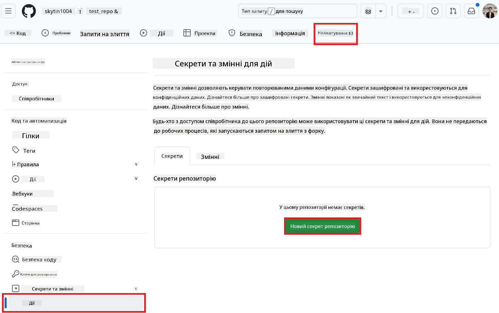
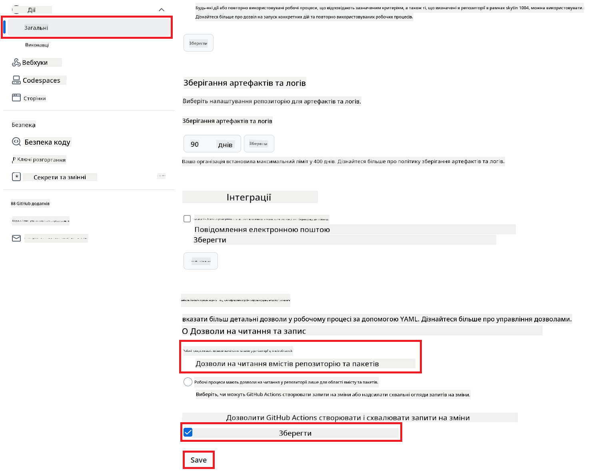

<!--
CO_OP_TRANSLATOR_METADATA:
{
  "original_hash": "a52587a512e667f70d92db853d3c61d5",
  "translation_date": "2025-06-12T19:36:55+00:00",
  "source_file": "getting_started/github-actions-guide/github-actions-guide-public.md",
  "language_code": "uk"
}
-->
# Використання GitHub Action Co-op Translator (Публічна налаштування)

**Цільова аудиторія:** Цей посібник призначений для користувачів у більшості публічних або приватних репозиторіях, де достатньо стандартних дозволів GitHub Actions. Він використовує вбудований `GITHUB_TOKEN`.

Автоматизуйте переклад документації вашого репозиторію легко за допомогою GitHub Action Co-op Translator. Цей посібник допоможе налаштувати дію так, щоб вона автоматично створювала pull request-и з оновленими перекладами щоразу, коли змінюються вихідні файли Markdown або зображення.

> [!IMPORTANT]
>
> **Вибір правильного посібника:**
>
> У цьому посібнику описано **простішу налаштування з використанням стандартного `GITHUB_TOKEN`**. Це рекомендований метод для більшості користувачів, оскільки він не вимагає керування конфіденційними приватними ключами GitHub App.
>

## Передумови

Перед налаштуванням GitHub Action переконайтеся, що у вас є необхідні облікові дані для AI-сервісів.

**1. Обов’язково: Облікові дані AI мовної моделі**  
Вам потрібні облікові дані принаймні для однієї підтримуваної мовної моделі:

- **Azure OpenAI**: Потрібні Endpoint, API Key, імена моделей/деплойментів, версія API.  
- **OpenAI**: Потрібен API Key, (опціонально: Org ID, базова URL, модель).  
- Детальніше див. у розділі [Supported Models and Services](../../../../README.md).

**2. Опціонально: Облікові дані AI Vision (для перекладу зображень)**

- Потрібно лише, якщо ви хочете перекладати текст на зображеннях.  
- **Azure AI Vision**: Потрібні Endpoint і Subscription Key.  
- Якщо не вказано, дія за замовчуванням працюватиме в [Markdown-only mode](../markdown-only-mode.md).

## Налаштування та конфігурація

Виконайте ці кроки, щоб налаштувати GitHub Action Co-op Translator у вашому репозиторії з використанням стандартного `GITHUB_TOKEN`.

### Крок 1: Розуміння аутентифікації (Використання `GITHUB_TOKEN`)

Цей workflow використовує вбудований `GITHUB_TOKEN`, наданий GitHub Actions. Цей токен автоматично надає workflow права на взаємодію з вашим репозиторієм відповідно до налаштувань, описаних у **Кроці 3**.

### Крок 2: Налаштування секретів репозиторію

Вам потрібно додати лише **облікові дані AI сервісів** як зашифровані секрети у налаштуваннях репозиторію.

1.  Перейдіть до цільового репозиторію на GitHub.  
2.  Відкрийте **Settings** > **Secrets and variables** > **Actions**.  
3.  У розділі **Repository secrets** натисніть **New repository secret** для кожного необхідного AI-секрету зі списку нижче.

     *(Зображення: де додавати секрети)*

**Обов’язкові секрети AI сервісів (Додайте ВСІ, які застосовуються згідно з вашими передумовами):**

| Назва секрету                      | Опис                                      | Джерело значення                 |
| :-------------------------------- | :---------------------------------------- | :------------------------------- |
| `AZURE_SUBSCRIPTION_KEY`            | Ключ для Azure AI Service (Computer Vision)  | Ваш Azure AI Foundry               |
| `AZURE_AI_SERVICE_ENDPOINT`         | Endpoint для Azure AI Service (Computer Vision) | Ваш Azure AI Foundry               |
| `AZURE_OPENAI_API_KEY`              | Ключ для Azure OpenAI сервісу             | Ваш Azure AI Foundry               |
| `AZURE_OPENAI_ENDPOINT`             | Endpoint для Azure OpenAI сервісу          | Ваш Azure AI Foundry               |
| `AZURE_OPENAI_MODEL_NAME`           | Назва моделі Azure OpenAI                  | Ваш Azure AI Foundry               |
| `AZURE_OPENAI_CHAT_DEPLOYMENT_NAME` | Назва деплойменту Azure OpenAI             | Ваш Azure AI Foundry               |
| `AZURE_OPENAI_API_VERSION`          | Версія API для Azure OpenAI                 | Ваш Azure AI Foundry               |
| `OPENAI_API_KEY`                    | API Key для OpenAI                         | Ваша платформа OpenAI             |
| `OPENAI_ORG_ID`                     | OpenAI Organization ID (опціонально)        | Ваша платформа OpenAI             |
| `OPENAI_CHAT_MODEL_ID`              | Конкретний ID моделі OpenAI (опціонально)  | Ваша платформа OpenAI             |
| `OPENAI_BASE_URL`                   | Користувацька базова URL OpenAI API (опціонально) | Ваша платформа OpenAI             |

### Крок 3: Налаштування дозволів workflow

GitHub Action потребує дозволів через `GITHUB_TOKEN`, щоб отримувати код і створювати pull request-и.

1.  У вашому репозиторії відкрийте **Settings** > **Actions** > **General**.  
2.  Прокрутіть до секції **Workflow permissions**.  
3.  Виберіть **Read and write permissions**. Це надасть `GITHUB_TOKEN` необхідні дозволи `contents: write` і `pull-requests: write` для цього workflow.  
4.  Переконайтеся, що встановлено прапорець **Allow GitHub Actions to create and approve pull requests**.  
5.  Натисніть **Save**.



### Крок 4: Створення файлу workflow

Нарешті, створіть YAML-файл, який визначає автоматизований workflow з використанням `GITHUB_TOKEN`.

1.  У кореневому каталозі вашого репозиторію створіть папку `.github/workflows/`, якщо її ще немає.  
2.  Усередині `.github/workflows/` створіть файл з ім’ям `co-op-translator.yml`.  
3.  Вставте наступний вміст у `co-op-translator.yml`.

```yaml
name: Co-op Translator

on:
  push:
    branches:
      - main

jobs:
  co-op-translator:
    runs-on: ubuntu-latest

    permissions:
      contents: write
      pull-requests: write

    steps:
      - name: Checkout repository
        uses: actions/checkout@v4
        with:
          fetch-depth: 0

      - name: Set up Python
        uses: actions/setup-python@v4
        with:
          python-version: '3.10'

      - name: Install Co-op Translator
        run: |
          python -m pip install --upgrade pip
          pip install co-op-translator

      - name: Run Co-op Translator
        env:
          PYTHONIOENCODING: utf-8
          # === AI Service Credentials ===
          AZURE_SUBSCRIPTION_KEY: ${{ secrets.AZURE_SUBSCRIPTION_KEY }}
          AZURE_AI_SERVICE_ENDPOINT: ${{ secrets.AZURE_AI_SERVICE_ENDPOINT }}
          AZURE_OPENAI_API_KEY: ${{ secrets.AZURE_OPENAI_API_KEY }}
          AZURE_OPENAI_ENDPOINT: ${{ secrets.AZURE_OPENAI_ENDPOINT }}
          AZURE_OPENAI_MODEL_NAME: ${{ secrets.AZURE_OPENAI_MODEL_NAME }}
          AZURE_OPENAI_CHAT_DEPLOYMENT_NAME: ${{ secrets.AZURE_OPENAI_CHAT_DEPLOYMENT_NAME }}
          AZURE_OPENAI_API_VERSION: ${{ secrets.AZURE_OPENAI_API_VERSION }}
          OPENAI_API_KEY: ${{ secrets.OPENAI_API_KEY }}
          OPENAI_ORG_ID: ${{ secrets.OPENAI_ORG_ID }}
          OPENAI_CHAT_MODEL_ID: ${{ secrets.OPENAI_CHAT_MODEL_ID }}
          OPENAI_BASE_URL: ${{ secrets.OPENAI_BASE_URL }}
        run: |
          # =====================================================================
          # IMPORTANT: Set your target languages here (REQUIRED CONFIGURATION)
          # =====================================================================
          # Example: Translate to Spanish, French, German. Add -y to auto-confirm.
          translate -l "es fr de" -y  # <--- MODIFY THIS LINE with your desired languages

      - name: Create Pull Request with translations
        uses: peter-evans/create-pull-request@v5
        with:
          token: ${{ secrets.GITHUB_TOKEN }}
          commit-message: "🌐 Update translations via Co-op Translator"
          title: "🌐 Update translations via Co-op Translator"
          body: |
            This PR updates translations for recent changes to the main branch.

            ### 📋 Changes included
            - Translated contents are available in the `translations/` directory
            - Translated images are available in the `translated_images/` directory

            ---
            🌐 Automatically generated by the [Co-op Translator](https://github.com/Azure/co-op-translator) GitHub Action.
          branch: update-translations
          base: main
          labels: translation, automated-pr
          delete-branch: true
          add-paths: |
            translations/
            translated_images/
```  
4.  **Налаштуйте workflow:**  
  - **[!IMPORTANT] Цільові мови:** у кроці `Run Co-op Translator` step, you **MUST review and modify the list of language codes** within the `translate -l "..." -y` command to match your project's requirements. The example list (`ar de es...`) needs to be replaced or adjusted.
  - **Trigger (`on:`):** The current trigger runs on every push to `main`. For large repositories, consider adding a `paths:` filter (see commented example in the YAML) to run the workflow only when relevant files (e.g., source documentation) change, saving runner minutes.
  - **PR Details:** Customize the `commit-message`, `title`, `body`, `branch` name, and `labels` in the `Create Pull Request` змініть список мов за потреби.

**Відмова від відповідальності**:  
Цей документ був перекладений за допомогою сервісу автоматичного перекладу [Co-op Translator](https://github.com/Azure/co-op-translator). Хоча ми прагнемо до точності, будь ласка, майте на увазі, що автоматичні переклади можуть містити помилки або неточності. Оригінальний документ рідною мовою слід вважати авторитетним джерелом. Для критично важливої інформації рекомендується звертатися до професійного людського перекладу. Ми не несемо відповідальності за будь-які непорозуміння чи неправильні тлумачення, що виникли внаслідок використання цього перекладу.