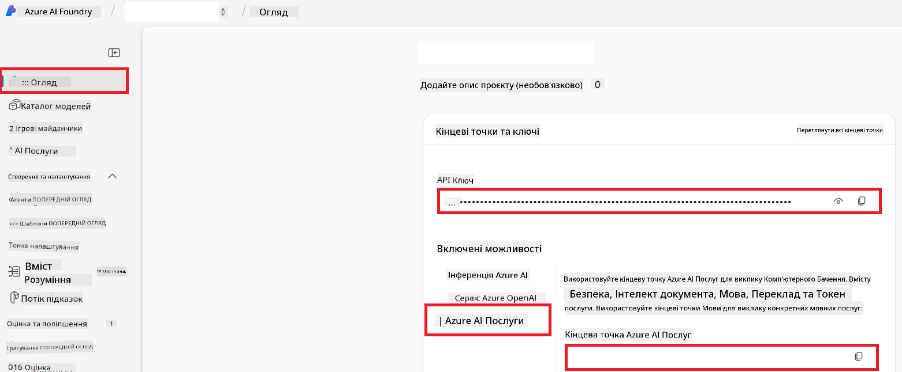

<!--
CO_OP_TRANSLATOR_METADATA:
{
  "original_hash": "b58d7c3cb4210697a073d20eb3064945",
  "translation_date": "2025-06-12T12:00:14+00:00",
  "source_file": "getting_started/set-up-azure-ai.md",
  "language_code": "uk"
}
-->
# Налаштування Azure AI для Co-op Translator (Azure OpenAI та Azure AI Vision)

Цей посібник допоможе вам налаштувати Azure OpenAI для перекладу мов і Azure Computer Vision для аналізу вмісту зображень (який потім можна використовувати для перекладу на основі зображень) у межах Azure AI Foundry.

**Вимоги:**
- Обліковий запис Azure з активною підпискою.
- Достатні права для створення ресурсів і розгортань у вашій підписці Azure.

## Створення проекту Azure AI

Почніть зі створення проекту Azure AI, який слугуватиме центральним місцем для керування вашими AI-ресурсами.

1. Перейдіть на [https://ai.azure.com](https://ai.azure.com) і увійдіть за допомогою свого облікового запису Azure.

1. Виберіть **+Create**, щоб створити новий проект.

1. Виконайте такі дії:
   - Введіть **Назву проекту** (наприклад, `CoopTranslator-Project`).
   - Виберіть **AI hub** (наприклад, `CoopTranslator-Hub`) (створіть новий, якщо потрібно).

1. Натисніть "**Review and Create**", щоб налаштувати проект. Вас перенаправить на сторінку огляду проекту.

## Налаштування Azure OpenAI для перекладу тексту

У межах вашого проекту ви розгорнете модель Azure OpenAI, яка слугуватиме бекендом для текстового перекладу.

### Перейдіть до свого проекту

Якщо ви ще не там, відкрийте щойно створений проект (наприклад, `CoopTranslator-Project`) в Azure AI Foundry.

### Розгортання моделі OpenAI

1. У лівому меню проекту, у розділі "My assets", виберіть "**Models + endpoints**".

1. Виберіть **+ Deploy model**.

1. Виберіть **Deploy Base Model**.

1. Вам буде показано список доступних моделей. Відфільтруйте або знайдіть відповідну модель GPT. Рекомендуємо `gpt-4o`.

1. Виберіть потрібну модель і натисніть **Confirm**.

1. Виберіть **Deploy**.

### Конфігурація Azure OpenAI

Після розгортання ви можете обрати розгортання на сторінці "**Models + endpoints**", щоб знайти його **REST endpoint URL**, **Key**, **Deployment name**, **Model name** і **API version**. Ці дані знадобляться для інтеграції моделі перекладу у ваш застосунок.

> [!NOTE]
> Ви можете обирати версії API на сторінці [API version deprecation](https://learn.microsoft.com/azure/ai-services/openai/api-version-deprecation) відповідно до ваших потреб. Зверніть увагу, що **API version** відрізняється від **Model version**, яка відображається на сторінці **Models + endpoints** в Azure AI Foundry.

## Налаштування Azure Computer Vision для перекладу тексту на зображеннях

Щоб увімкнути переклад тексту на зображеннях, потрібно отримати API Key і Endpoint служби Azure AI.

1. Перейдіть до свого проекту Azure AI (наприклад, `CoopTranslator-Project`). Переконайтеся, що ви на сторінці огляду проекту.

### Конфігурація служби Azure AI

Знайдіть API Key і Endpoint у службі Azure AI.

1. Перейдіть до свого проекту Azure AI (наприклад, `CoopTranslator-Project`). Переконайтеся, що ви на сторінці огляду проекту.

1. Знайдіть **API Key** та **Endpoint** на вкладці Azure AI Service.

    

Це з’єднання робить можливості пов’язаного ресурсу Azure AI Services (включно з аналізом зображень) доступними для вашого проекту AI Foundry. Ви зможете використовувати це з’єднання у своїх ноутбуках або застосунках для вилучення тексту з зображень, який потім можна надіслати до моделі Azure OpenAI для перекладу.

## Консолідація ваших облікових даних

На цей момент ви маєте зібрати такі дані:

**Для Azure OpenAI (текстовий переклад):**
- Azure OpenAI Endpoint
- Azure OpenAI API Key
- Azure OpenAI Model Name (наприклад, `gpt-4o`)
- Azure OpenAI Deployment Name (наприклад, `cooptranslator-gpt4o`)
- Azure OpenAI API Version

**Для Azure AI Services (вилучення тексту з зображень через Vision):**
- Azure AI Service Endpoint
- Azure AI Service API Key

### Приклад: Конфігурація змінних середовища (попередній перегляд)

Пізніше, під час створення вашого застосунку, ймовірно, ви налаштуєте його, використовуючи зібрані облікові дані. Наприклад, можна задати їх як змінні середовища так:

```bash
# Azure AI Service Credentials (Required for image translation)
AZURE_AI_SERVICE_API_KEY="your_azure_ai_service_api_key" # e.g., 21xasd...
AZURE_AI_SERVICE_ENDPOINT="https://your_azure_ai_service_endpoint.cognitiveservices.azure.com/"

# Azure OpenAI Credentials (Required for text translation)
AZURE_OPENAI_API_KEY="your_azure_openai_api_key" # e.g., 21xasd...
AZURE_OPENAI_ENDPOINT="https://your_azure_openai_endpoint.openai.azure.com/"
AZURE_OPENAI_MODEL_NAME="your_model_name" # e.g., gpt-4o
AZURE_OPENAI_CHAT_DEPLOYMENT_NAME="your_deployment_name" # e.g., cooptranslator-gpt4o
AZURE_OPENAI_API_VERSION="your_api_version" # e.g., 2024-12-01-preview
```

---

### Додаткова література

- [How to Create a project in Azure AI Foundry](https://learn.microsoft.com/azure/ai-foundry/how-to/create-projects?tabs=ai-studio)
- [How to Create Azure AI resources](https://learn.microsoft.com/azure/ai-foundry/how-to/create-azure-ai-resource?tabs=portal)
- [How to Deploy OpenAI models in Azure AI Foundry](https://learn.microsoft.com/en-us/azure/ai-foundry/how-to/deploy-models-openai)

**Відмова від відповідальності**:  
Цей документ було перекладено за допомогою сервісу автоматичного перекладу [Co-op Translator](https://github.com/Azure/co-op-translator). Хоч ми і прагнемо до точності, будь ласка, майте на увазі, що автоматичні переклади можуть містити помилки або неточності. Оригінальний документ рідною мовою слід вважати авторитетним джерелом. Для критично важливої інформації рекомендується звертатися до професійного людського перекладу. Ми не несемо відповідальності за будь-які непорозуміння чи неправильні тлумачення, що виникли внаслідок використання цього перекладу.