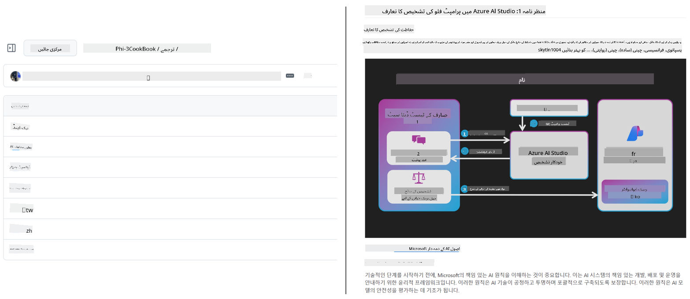
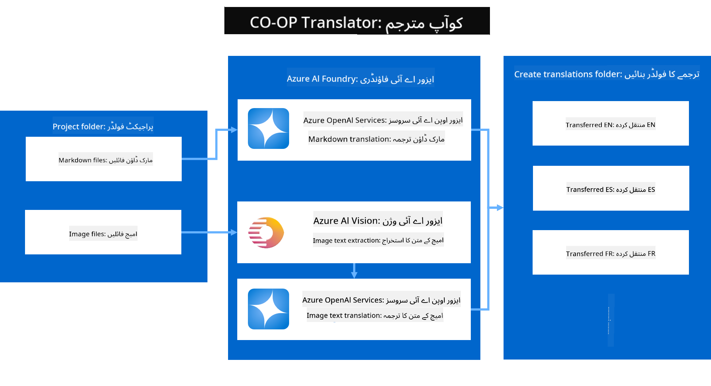

<!--
CO_OP_TRANSLATOR_METADATA:
{
  "original_hash": "044724537b57868117aadae8e7728c7c",
  "translation_date": "2025-06-12T09:56:55+00:00",
  "source_file": "README.md",
  "language_code": "ur"
}
-->


# Co-op Translator: تعلیمی دستاویزات کے ترجمے کو آسانی سے خودکار بنائیں

_اپنی دستاویزات کے ترجمے کو متعدد زبانوں میں آسانی سے خودکار بنائیں تاکہ عالمی سامعین تک پہنچ سکیں۔_

[](https://pypi.org/project/co-op-translator/)
[](https://github.com/azure/co-op-translator/blob/main/LICENSE)
[](https://pepy.tech/project/co-op-translator)
[](https://pepy.tech/project/co-op-translator)
[](https://github.com/psf/black)

[](https://GitHub.com/azure/co-op-translator/graphs/contributors/)
[](https://GitHub.com/azure/co-op-translator/issues/)
[](https://GitHub.com/azure/co-op-translator/pulls/)
[](http://makeapullrequest.com)

### زبان کی معاونت Co-op Translator کے ذریعے فراہم کی گئی ہے

> [!NOTE]
> یہ اس ذخیرے کے مواد کے موجودہ تراجم ہیں۔ Co-op Translator کی مدد سے سپورٹ کی جانے والی زبانوں کی مکمل فہرست کے لیے، براہ کرم [Language Support](../..) سیکشن دیکھیں۔

[](https://GitHub.com/azure/co-op-translator/watchers/)
[](https://GitHub.com/azure/co-op-translator/network/)
[](https://GitHub.com/azure/co-op-translator/stargazers/)

[](https://discord.com/invite/ByRwuEEgH4)

[](https://codespaces.new/azure/co-op-translator)
[](https://vscode.dev/redirect?url=vscode://ms-vscode-remote.remote-containers/cloneInVolume?url=https://github.com/azure/co-op-translator)

## جائزہ: اپنی تعلیمی مواد کے ترجمے کو آسان بنائیں

زبان کی رکاوٹیں دنیا بھر کے طلباء اور ڈویلپرز کے لیے قیمتی تعلیمی وسائل اور تکنیکی معلومات تک رسائی کو نمایاں طور پر محدود کرتی ہیں۔ اس سے شمولیت کم ہوتی ہے اور عالمی سطح پر جدت اور سیکھنے کی رفتار سست ہو جاتی ہے۔

**Co-op Translator** مائیکروسافٹ کی اپنی بڑی تعلیمی سیریز (جیسے "For Beginners" گائیڈز) کے غیر مؤثر دستی ترجمے کے مسئلے کو حل کرنے کی ضرورت سے پیدا ہوا۔ یہ ایک آسان، طاقتور آلہ بن چکا ہے جو ان رکاوٹوں کو سب کے لیے ختم کرنے کے لیے ڈیزائن کیا گیا ہے۔ CLI اور GitHub Actions کے ذریعے اعلیٰ معیار کے خودکار تراجم فراہم کر کے، Co-op Translator دنیا بھر کے اساتذہ، طلباء، محققین، اور ڈویلپرز کو زبان کی حدود کے بغیر علم شیئر کرنے اور حاصل کرنے کا موقع دیتا ہے۔

دیکھیں کہ Co-op Translator کس طرح ترجمہ شدہ تعلیمی مواد کو منظم کرتا ہے:



مارک ڈاؤن فائلیں اور تصاویر کے متن خودکار طور پر ترجمہ ہوتے ہیں اور زبان کے لحاظ سے فولڈرز میں خوبصورتی سے ترتیب دیے جاتے ہیں۔

**آج ہی Co-op Translator کے ساتھ اپنے تعلیمی مواد کو عالمی رسائی دیں!**

## مائیکروسافٹ کے تعلیمی وسائل کے لیے عالمی رسائی کی حمایت

Co-op Translator مائیکروسافٹ کی اہم تعلیمی پہلوں کے لیے زبان کی رکاوٹ کو ختم کرنے میں مدد دیتا ہے، اور ایسے ذخائر کے ترجمے کے عمل کو خودکار بناتا ہے جو عالمی ڈویلپر کمیونٹی کی خدمت کرتے ہیں۔ Co-op Translator کا استعمال کرنے والی موجودہ مثالیں درج ذیل ہیں:

[](https://github.com/microsoft/Generative-AI-for-beginners)
[](https://github.com/microsoft/ML-For-Beginners)
[](https://github.com/microsoft/AI-For-Beginners)
[](https://github.com/microsoft/ai-agents-for-beginners)
[](https://github.com/microsoft/PhiCookBook)
[](https://github.com/microsoft/Generative-AI-for-beginners-dotnet)

## اہم خصوصیات

- **خودکار تراجم**: بغیر کسی مشکل کے متن کو متعدد زبانوں میں ترجمہ کریں۔
- **GitHub Actions انضمام**: اپنے CI/CD پائپ لائن کے حصے کے طور پر تراجم کو خودکار بنائیں۔
- **مارک ڈاؤن کی حفاظت**: ترجمے کے دوران درست مارک ڈاؤن نحو برقرار رکھیں۔
- **تصویری متن کا ترجمہ**: تصاویر میں موجود متن کو نکالیں اور ترجمہ کریں۔
- **جدید LLM ٹیکنالوجی**: اعلیٰ معیار کے تراجم کے لیے جدید زبان کے ماڈلز استعمال کریں۔
- **آسان انضمام**: اپنے موجودہ پروجیکٹ سیٹ اپ کے ساتھ بغیر رکاوٹ ضم کریں۔
- **مقامی کاری کو آسان بنائیں**: اپنے پروجیکٹ کو بین الاقوامی مارکیٹ کے لیے مقامی بنانے کے عمل کو ہموار کریں۔

## یہ کیسے کام کرتا ہے



Co-op Translator آپ کے پروجیکٹ فولڈر سے مارک ڈاؤن فائلیں اور تصاویر لیتا ہے اور ان پر درج ذیل عمل کرتا ہے:

1. **متن نکالنا**: مارک ڈاؤن فائلوں سے متن نکالتا ہے اور اگر کنفیگر کیا گیا ہو (مثلاً Azure AI Vision کے ساتھ)، تو تصاویر میں موجود متن بھی نکالتا ہے۔
1. **AI ترجمہ**: نکالا گیا متن کنفیگر کیے گئے LLM (Azure OpenAI، OpenAI، وغیرہ) کو ترجمے کے لیے بھیجتا ہے۔
1. **نتائج محفوظ کرنا**: ترجمہ شدہ مارک ڈاؤن فائلیں اور تصاویر (ترجمہ شدہ متن کے ساتھ) زبان کے لحاظ سے فولڈرز میں محفوظ کرتا ہے، اصل فارمیٹنگ کو برقرار رکھتے ہوئے۔

## شروع کریں

CLI کے ساتھ تیزی سے شروع کریں یا GitHub Actions کے ذریعے مکمل خودکاری سیٹ اپ کریں۔ اپنی ورک فلو کے مطابق طریقہ منتخب کریں:

1. **کمانڈ لائن (CLI)** - ایک بار کے ترجمے یا دستی کنٹرول کے لیے
2. **GitHub Actions** - ہر پش پر خودکار تراجم کے لیے

> [!NOTE]
> اگرچہ یہ ٹیوٹوریل Azure وسائل پر مرکوز ہے، آپ کسی بھی سپورٹڈ زبان ماڈل کا استعمال کر سکتے ہیں۔

### زبان کی حمایت

Co-op Translator متعدد زبانوں کی حمایت کرتا ہے تاکہ آپ عالمی ناظرین تک پہنچ سکیں۔ یہاں وہ چیزیں ہیں جو آپ کو جاننا ضروری ہیں:

#### فوری حوالہ

| زبان | کوڈ | زبان | کوڈ | زبان | کوڈ |
|----------|------|----------|------|----------|------|
| Arabic | ar | Bengali | bn | Bulgarian | bg |
| Burmese (Myanmar) | my | Chinese (Simplified) | zh | Chinese (Traditional, HK) | hk |
| Chinese (Traditional, Macau) | mo | Chinese (Traditional, TW) | tw | Croatian | hr |
| Czech | cs | Danish | da | Dutch | nl |
| Finnish | fi | French | fr | German | de |
| Greek | el | Hebrew | he | Hindi | hi |
| Hungarian | hu | Indonesian | id | Italian | it |
| Japanese | ja | Korean | ko | Malay | ms |
| Marathi | mr | Nepali | ne | Norwegian | no |
| Persian (Farsi) | fa | Polish | pl | Portuguese (Brazil) | br |
| Portuguese (Portugal) | pt | Punjabi (Gurmukhi) | pa | Romanian | ro |
| Russian | ru | Serbian (Cyrillic) | sr | Slovak | sk |
| Slovenian | sl | Spanish | es | Swahili | sw |
| Swedish | sv | Tagalog (Filipino) | tl | Thai | th |
| Turkish | tr | Ukrainian | uk | Urdu | ur |
| Vietnamese | vi | — | — | — | — |

#### زبان کے کوڈ استعمال کرنا

Co-op Translator استعمال کرتے وقت، آپ کو زبانیں ان کے کوڈز کے ذریعے بتانی ہوں گی۔ مثال کے طور پر:

```bash
# Translate to French, Spanish, and German
translate -l "fr es de"

# Translate to Chinese (Simplified) and Japanese
translate -l "zh ja"
```

> [!NOTE]
> زبان کی حمایت کے تکنیکی تفصیلات، بشمول:
>
> - ہر زبان کے لیے فونٹ کی وضاحتیں
> - معروف مسائل
> - نئی زبانیں کیسے شامل کریں
>
> ہمارے [Supported Languages Documentation](./getting_started/supported-languages.md) میں دیکھیں۔

### سپورٹڈ ماڈلز اور سروسز

| قسم                  | نام                           |
|-----------------------|--------------------------------|
| Language Model        |   |
| AI Vision       |  |

> [!NOTE]
> اگر AI vision سروس دستیاب نہ ہو، تو co-op translator خود بخود [Markdown-only mode](./getting_started/markdown-only-mode.md) پر سوئچ کر دے گا۔

### ابتدائی سیٹ اپ

شروع کرنے سے پہلے، آپ کو درج ذیل وسائل سیٹ اپ کرنے ہوں گے:

1. Language Model Resource (ضروری):
   - Azure OpenAI (تجویز کردہ) - انٹرپرائز گریڈ قابل اعتماد کے ساتھ اعلیٰ معیار کے تراجم فراہم کرتا ہے
   - OpenAI - متبادل آپشن اگر آپ کے پاس Azure کی رسائی نہیں ہے
   - سپورٹڈ ماڈلز کی تفصیلات کے لیے، [Supported Models and Services](../..) دیکھیں

1. AI Vision Resource (اختیاری):
   - Azure AI Vision - تصاویر میں موجود متن کے ترجمے کو فعال کرتا ہے
   - اگر کنفیگر نہ کیا گیا ہو، تو translator خودکار طور پر [Markdown-only mode](./getting_started/markdown-only-mode.md) استعمال کرے گا
   - ایسی پروجیکٹس کے لیے تجویز کردہ جن میں ترجمے کے لیے متن والی تصاویر ہوں

1. کنفیگریشن کے اقدامات:
   - تفصیلی ہدایات کے لیے ہمارا [Azure AI setup guide](./getting_started/set-up-azure-ai.md) فالو کریں
   - API keys اور endpoints کے ساتھ `.env` فائل بنائیں (دیکھیں [Quick Start](../..) سیکشن)
   - یقینی بنائیں کہ آپ کے پاس منتخب کردہ سروسز کے لیے ضروری اجازتیں اور کوٹہ موجود ہے

### ترجمے سے پہلے پروجیکٹ سیٹ اپ

ترجمہ شروع کرنے سے پہلے، اپنے پروجیکٹ کی تیاری کے لیے یہ اقدامات کریں:

1. اپنا README تیار کریں:
   - اپنی README.md میں ترجمہ شدہ ورژنز کے لنکس کے لیے ترجمہ کی ٹیبل شامل کریں
   - مثال کے طور پر:

     ```markdown

     ### 🌐 Multi-Language Support
     
     [French](../fr/README.md) | [Spanish](../es/README.md) | [German](../de/README.md) | [Russian](../ru/README.md) | [Arabic](../ar/README.md) | [Persian (Farsi)](../fa/README.md) | [Urdu](./README.md) | [Chinese (Simplified)](../zh/README.md) | [Chinese (Traditional, Macau)](../mo/README.md) | [Chinese (Traditional, Hong Kong)](../hk/README.md) | [Chinese (Traditional, Taiwan)](../tw/README.md) | [Japanese](../ja/README.md) | [Korean](../ko/README.md) | [Hindi](../hi/README.md) | [Bengali](../bn/README.md) | [Marathi](../mr/README.md) | [Nepali](../ne/README.md) | [Punjabi (Gurmukhi)](../pa/README.md) | [Portuguese (Portugal)](../pt/README.md) | [Portuguese (Brazil)](../br/README.md) | [Italian](../it/README.md) | [Polish](../pl/README.md) | [Turkish](../tr/README.md) | [Greek](../el/README.md) | [Thai](../th/README.md) | [Swedish](../sv/README.md) | [Danish](../da/README.md) | [Norwegian](../no/README.md) | [Finnish](../fi/README.md) | [Dutch](../nl/README.md) | [Hebrew](../he/README.md) | [Vietnamese](../vi/README.md) | [Indonesian](../id/README.md) | [Malay](../ms/README.md) | [Tagalog (Filipino)](../tl/README.md) | [Swahili](../sw/README.md) | [Hungarian](../hu/README.md) | [Czech](../cs/README.md) | [Slovak](../sk/README.md) | [Romanian](../ro/README.md) | [Bulgarian](../bg/README.md) | [Serbian (Cyrillic)](../sr/README.md) | [Croatian](../hr/README.md) | [Slovenian](../sl/README.md) | [Ukrainian](../uk/README.md) | [Burmese (Myanmar)](../my/README.md) 
    
     ```

1. موجودہ تراجم کو صاف کریں (اگر ضرورت ہو):
   - موجودہ ترجمہ فولڈرز کو حذف کریں (جیسے `translations/`)
   - پرانے ترجمہ شدہ فائلز کو حذف کریں تاکہ تازہ آغاز ہو سکے
   - یہ نئے ترجمے کے عمل کے ساتھ تنازعات سے بچاتا ہے

### فوری آغاز: کمانڈ لائن

کمانڈ لائن کے ذریعے تیزی سے شروع کرنے کے لیے:

1. ورچوئل انوائرمنٹ بنائیں:

    ```bash
    python -m venv .venv
    ```

1. ورچوئل انوائرمنٹ کو فعال کریں:

    - ونڈوز پر:

    ```bash
    .venv\scripts\activate
    ```

    - لینکس/میک او ایس پر:

    ```bash
    source .venv/bin/activate
    ```

1. پیکیج انسٹال کریں:

    ```bash
    pip install co-op-translator
    ```

1. اسناد کنفیگر کریں:

    - `.env` file in your project's root directory.
    - Copy the contents from the [.env.template](../../.env.template) file into your new `.env` file.
    - Fill in the required API keys and endpoint information in your `.env` file.

1. Run Translation:
    - Navigate to your project's root directory in your terminal.
    - Execute the translate command, specifying target languages with the `-l` فلیگ بنائیں:

    ```bash
    translate -l "ko ja fr"
    ```

_(Replace `"ko ja fr"` with your desired space-separated language codes)_

### Detailed Usage Guides

Choose the approach that best fits your workflow:

#### 1. Using the Command Line (CLI)

- Best for: One-time translations, manual control, or integration into custom scripts.
- Requires: Local installation of Python and the `co-op-translator` package.
- Guide: [Command Line Guide](./getting_started/command-line-guide/command-line-guide.md)

#### 2. Using GitHub Actions (Automation)

- Best for: Automatically translating content whenever changes are pushed to your repository. Keeps translations consistently up-to-date.
- Requires: Setting up a workflow file (`.github/workflows`) آپ کے ذخیرے میں۔ مقامی انسٹالیشن کی ضرورت نہیں۔
- گائیڈز:
  - [GitHub Actions Guide (Public Repositories & Standard Secrets)](./getting_started/github-actions-guide/github-actions-guide-public.md) - زیادہ تر عوامی یا ذاتی ذخائر کے لیے استعمال کریں جو معیاری ریپوزیٹری سیکریٹس پر انحصار کرتے ہیں۔
  - [GitHub Actions Guide (Microsoft Organization Repos & Org-Level Setups)](./getting_started/github-actions-guide/github-actions-guide-org.md) - اگر آپ Microsoft GitHub تنظیم میں کام کر رہے ہیں یا تنظیمی سطح کے سیکریٹس یا رنرز استعمال کرنا چاہتے ہیں تو یہ گائیڈ استعمال کریں۔

### مسائل کا حل اور تجاویز

- [Troubleshooting Guide](./getting_started/troubleshooting.md)

### اضافی وسائل

- [Command Reference](./getting_started/command-reference.md): دستیاب تمام کمانڈز اور آپشنز کی تفصیلی گائیڈ۔
- [Supported Languages](./getting_started/supported-languages.md): سپورٹ کی گئی زبانوں کی فہرست اور نئی زبانیں شامل کرنے کی ہدایات۔
- [Markdown-Only Mode](./getting_started/markdown-only-mode.md): صرف متن کا ترجمہ کیسے کریں، بغیر تصویری ترجمے کے۔

## ویڈیو پریزنٹیشنز

Co-op Translator کے بارے میں مزید جاننے کے لیے ہماری پریزنٹیشنز دیکھیں _(نیچے تصویر پر کلک کر کے YouTube پر دیکھیں)_:

- **Open at Microsoft**: Co-op Translator استعمال کرنے کے بارے میں مختصر 18 منٹ کا تعارفی اور فوری گائیڈ۔
[](https://www.youtube.com/watch?v=jX_swfH_KNU)

## ہماری حمایت کریں اور عالمی تعلیم کو فروغ دیں

تعلیمی مواد کو عالمی سطح پر شیئر کرنے کے طریقے میں انقلاب لانے میں ہمارا ساتھ دیں! GitHub پر [Co-op Translator](https://github.com/azure/co-op-translator) کو ⭐ دیں اور زبان کی رکاوٹوں کو ختم کرنے کے ہمارے مشن کی حمایت کریں جو تعلیم اور ٹیکنالوجی میں ہے۔ آپ کی دلچسپی اور تعاون کا بڑا اثر ہوتا ہے! کوڈ میں تعاون اور فیچر کی تجاویز ہمیشہ خوش آمدید ہیں۔

## تعاون کرنا

یہ پروجیکٹ تعاون اور تجاویز کا خیرمقدم کرتا ہے۔ Azure Co-op Translator میں تعاون کرنے کے خواہشمند ہیں؟ براہ کرم ہماری [CONTRIBUTING.md](./CONTRIBUTING.md) دیکھیں تاکہ آپ جان سکیں کہ آپ کس طرح Co-op Translator کو مزید قابل رسائی بنا سکتے ہیں۔

## تعاون کرنے والے

[](https://github.com/Azure/co-op-translator/graphs/contributors)

## ضابطہ اخلاق

اس پروجیکٹ نے [Microsoft Open Source Code of Conduct](https://opensource.microsoft.com/codeofconduct/) کو اپنایا ہے۔
مزید معلومات کے لیے [Code of Conduct FAQ](https://opensource.microsoft.com/codeofconduct/faq/) دیکھیں یا
کسی اضافی سوال یا تبصرے کے لیے [opencode@microsoft.com](mailto:opencode@microsoft.com) سے رابطہ کریں۔

## ذمہ دار AI

Microsoft اپنے صارفین کی مدد کے لیے پرعزم ہے کہ وہ ہمارے AI مصنوعات کو ذمہ داری سے استعمال کریں، اپنے تجربات شیئر کریں، اور Transparency Notes اور Impact Assessments جیسے اوزاروں کے ذریعے اعتماد پر مبنی شراکت داری قائم کریں۔ ان میں سے کئی وسائل [https://aka.ms/RAI](https://aka.ms/RAI) پر دستیاب ہیں۔
Microsoft کا ذمہ دار AI کا نقطہ نظر ہمارے AI کے اصولوں پر مبنی ہے جن میں انصاف، قابلِ اعتماد ہونا اور حفاظت، رازداری اور سیکیورٹی، شمولیت، شفافیت، اور جوابدہی شامل ہیں۔

بڑے پیمانے پر قدرتی زبان، تصویر، اور تقریر کے ماڈلز - جیسے کہ اس نمونے میں استعمال ہونے والے - ممکنہ طور پر غیر منصفانہ، غیر قابل اعتماد، یا جارحانہ رویہ اختیار کر سکتے ہیں، جو نقصان کا باعث بن سکتے ہیں۔ براہ کرم خطرات اور حدود کے بارے میں آگاہی کے لیے [Azure OpenAI service Transparency note](https://learn.microsoft.com/legal/cognitive-services/openai/transparency-note?tabs=text) سے رجوع کریں۔

ان خطرات کو کم کرنے کے لیے تجویز کردہ طریقہ یہ ہے کہ آپ کے فن تعمیر میں ایک حفاظتی نظام شامل کیا جائے جو نقصان دہ رویے کا پتہ لگا سکے اور اسے روک سکے۔ [Azure AI Content Safety](https://learn.microsoft.com/azure/ai-services/content-safety/overview) ایک آزاد حفاظتی پرت فراہم کرتا ہے، جو ایپلیکیشنز اور سروسز میں نقصان دہ صارف اور AI کی تخلیق کردہ مواد کا پتہ لگا سکتا ہے۔ Azure AI Content Safety میں متن اور تصویر کے API شامل ہیں جو نقصان دہ مواد کی شناخت کی سہولت دیتے ہیں۔ ہمارے پاس ایک interactive Content Safety Studio بھی ہے جو آپ کو مختلف طریقوں سے نقصان دہ مواد کا پتہ لگانے کے لیے نمونہ کوڈ دیکھنے، دریافت کرنے اور آزمانے کی اجازت دیتا ہے۔ درج ذیل [quickstart documentation](https://learn.microsoft.com/azure/ai-services/content-safety/quickstart-text?tabs=visual-studio%2Clinux&pivots=programming-language-rest) آپ کو سروس کو درخواستیں بھیجنے کے عمل میں رہنمائی فراہم کرتا ہے۔

ایک اور پہلو جو مدنظر رکھنا چاہیے وہ مجموعی ایپلیکیشن کی کارکردگی ہے۔ کثیر النوع اور کثیر ماڈل ایپلیکیشنز کے ساتھ، ہم کارکردگی کو اس طرح سمجھتے ہیں کہ نظام آپ اور آپ کے صارفین کی توقعات کے مطابق کام کرے، جس میں نقصان دہ نتائج پیدا نہ کرنا شامل ہے۔ اپنے مجموعی ایپلیکیشن کی کارکردگی کا جائزہ لینا ضروری ہے، جس کے لیے آپ [generation quality and risk and safety metrics](https://learn.microsoft.com/azure/ai-studio/concepts/evaluation-metrics-built-in) استعمال کر سکتے ہیں۔

آپ اپنے AI ایپلیکیشن کا اندازہ اپنے ترقیاتی ماحول میں [prompt flow SDK](https://microsoft.github.io/promptflow/index.html) کے ذریعے لگا سکتے ہیں۔ چاہے آپ کے پاس ٹیسٹ ڈیٹا سیٹ ہو یا کوئی ہدف، آپ کی generative AI ایپلیکیشن کی تخلیقات built-in evaluators یا اپنی مرضی کے custom evaluators کے ساتھ مقداری طور پر ماپی جاتی ہیں۔ prompt flow SDK کے ساتھ اپنے نظام کا جائزہ لینے کے لیے شروع کرنے کے لیے، آپ [quickstart guide](https://learn.microsoft.com/azure/ai-studio/how-to/develop/flow-evaluate-sdk) پر عمل کر سکتے ہیں۔ ایک بار جب آپ evaluation run انجام دے لیں، تو آپ [Azure AI Studio میں نتائج کو دیکھ سکتے ہیں](https://learn.microsoft.com/azure/ai-studio/how-to/evaluate-flow-results)۔

## تجارتی نشان

اس پروجیکٹ میں پروجیکٹس، مصنوعات، یا خدمات کے لیے تجارتی نشان یا لوگو شامل ہو سکتے ہیں۔ Microsoft کے تجارتی نشان یا لوگوز کا مجاز استعمال [Microsoft's Trademark & Brand Guidelines](https://www.microsoft.com/en-us/legal/intellectualproperty/trademarks/usage/general) کے تابع ہے اور ان کی پیروی کرنا ضروری ہے۔
Microsoft کے تجارتی نشان یا لوگوز کا اس پروجیکٹ کے ترمیم شدہ ورژنز میں استعمال الجھن کا باعث نہیں بننا چاہیے اور نہ ہی Microsoft کی اسپانسرشپ کا تاثر دینا چاہیے۔
تیسری پارٹی کے تجارتی نشان یا لوگوز کا استعمال ان تیسری پارٹیوں کی پالیسیوں کے تابع ہے۔

**ڈس کلیمر**:  
یہ دستاویز AI ترجمہ سروس [Co-op Translator](https://github.com/Azure/co-op-translator) کے ذریعے ترجمہ کی گئی ہے۔ اگرچہ ہم درستگی کے لیے کوشاں ہیں، براہ کرم نوٹ کریں کہ خودکار ترجموں میں غلطیاں یا غیر درستیاں ہو سکتی ہیں۔ اصل دستاویز اپنی مادری زبان میں معتبر ذریعہ سمجھی جانی چاہیے۔ اہم معلومات کے لیے پیشہ ور انسانی ترجمہ کی سفارش کی جاتی ہے۔ اس ترجمے کے استعمال سے پیدا ہونے والی کسی بھی غلط فہمی یا غلط تشریح کی ذمہ داری ہم پر عائد نہیں ہوتی۔