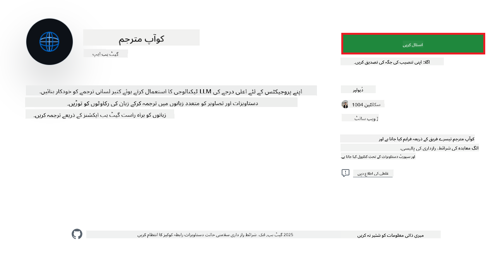
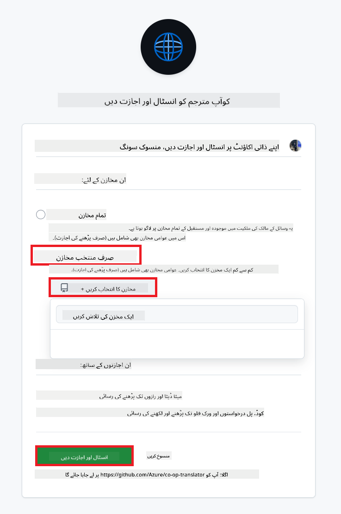
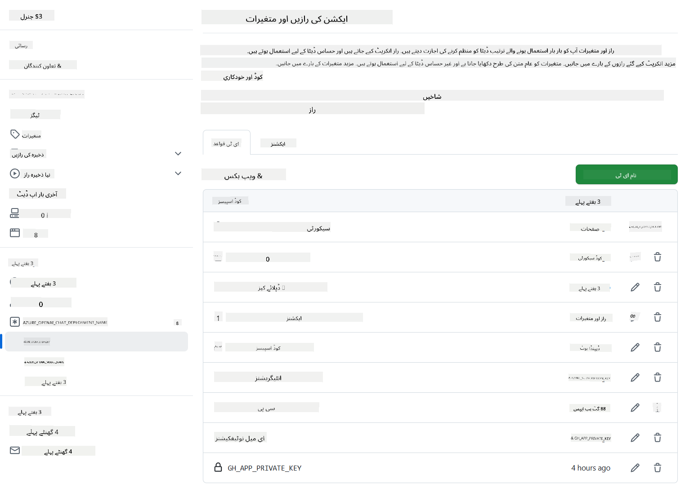

<!--
CO_OP_TRANSLATOR_METADATA:
{
  "original_hash": "c437820027c197f25fb2cbee95bae28c",
  "translation_date": "2025-06-12T19:01:53+00:00",
  "source_file": "getting_started/github-actions-guide/github-actions-guide-org.md",
  "language_code": "ur"
}
-->
# Co-op Translator GitHub Action استعمال کرنے کا طریقہ (ادارہ جاتی رہنمائی)

**مطلوبہ ناظرین:** یہ رہنمائی خاص طور پر **Microsoft کے اندرونی صارفین** یا **ایسے ٹیموں کے لیے ہے جن کے پاس پہلے سے بنائے گئے Co-op Translator GitHub App کے لیے ضروری اسناد تک رسائی ہو** یا جو اپنی مرضی کا GitHub App بنا سکتے ہوں۔

اپنے ریپوزیٹری کی دستاویزات کے ترجمے کو آسانی سے خودکار بنائیں Co-op Translator GitHub Action کے ذریعے۔ یہ رہنمائی آپ کو عمل کے سیٹ اپ کے ذریعے لے جاتی ہے تاکہ جب بھی آپ کی ماخذ Markdown فائلز یا تصاویر میں تبدیلی ہو، تو خود بخود ترجمے کے ساتھ pull requests بنائے جائیں۔

> [!IMPORTANT]
> 
> **صحیح رہنمائی کا انتخاب:**
>
> یہ رہنمائی GitHub App ID اور Private Key کے استعمال سے سیٹ اپ کی تفصیل دیتی ہے۔ آپ کو یہ "Organization Guide" طریقہ اس صورت میں درکار ہوتا ہے جب: **`GITHUB_TOKEN` کی اجازتیں محدود ہوں:** آپ کے ادارے یا ریپوزیٹری کی ترتیبات معیاری `GITHUB_TOKEN` کو دی گئی اجازتوں کو محدود کرتی ہیں۔ خاص طور پر، اگر `GITHUB_TOKEN` کو ضروری `write` اجازتیں (جیسے `contents: write` یا `pull-requests: write`) نہیں دی جاتیں، تو [Public Setup Guide](./github-actions-guide-public.md) میں دیا گیا ورک فلو اجازتوں کی کمی کی وجہ سے ناکام ہو جائے گا۔ ایک مخصوص GitHub App استعمال کرنا جسے واضح طور پر اجازتیں دی گئی ہوں، اس حد بندی کو دور کر دیتا ہے۔
>
> **اگر اوپر بیان کردہ آپ پر لاگو نہیں ہوتا:**
>
> اگر معیاری `GITHUB_TOKEN` کو آپ کے ریپوزیٹری میں کافی اجازتیں حاصل ہیں (یعنی آپ ادارہ جاتی پابندیوں کی وجہ سے بلاک نہیں ہیں)، تو براہ کرم **[Public Setup Guide using GITHUB_TOKEN](./github-actions-guide-public.md)** استعمال کریں۔ پبلک گائیڈ میں App IDs یا Private Keys حاصل کرنے یا ان کا انتظام کرنے کی ضرورت نہیں ہوتی اور یہ صرف معیاری `GITHUB_TOKEN` اور ریپوزیٹری اجازتوں پر منحصر ہے۔

## پیشگی ضروریات

GitHub Action کو ترتیب دینے سے پہلے، یقینی بنائیں کہ آپ کے پاس ضروری AI سروس اسناد موجود ہوں۔

**1. لازمی: AI زبان ماڈل کی اسناد**  
آپ کو کم از کم ایک سپورٹڈ زبان ماڈل کے لیے اسناد کی ضرورت ہے:

- **Azure OpenAI**: Endpoint، API Key، Model/Deployment Names، API Version درکار ہیں۔  
- **OpenAI**: API Key، (اختیاری: Org ID، Base URL، Model ID) درکار ہیں۔  
- تفصیلات کے لیے دیکھیں [Supported Models and Services](../../../../README.md)۔  
- سیٹ اپ گائیڈ: [Azure OpenAI سیٹ اپ کریں](../set-up-resources/set-up-azure-openai.md)۔

**2. اختیاری: کمپیوٹر وژن اسناد (تصویری ترجمے کے لیے)**

- صرف اس صورت میں ضروری جب آپ کو تصاویر میں موجود متن کا ترجمہ کرنا ہو۔  
- **Azure Computer Vision**: Endpoint اور Subscription Key درکار ہیں۔  
- اگر فراہم نہ کی جائیں تو ایکشن خود بخود [Markdown-only mode](../markdown-only-mode.md) میں چلا جائے گا۔  
- سیٹ اپ گائیڈ: [Azure Computer Vision سیٹ اپ کریں](../set-up-resources/set-up-azure-computer-vision.md)۔

## سیٹ اپ اور ترتیب

اپنے ریپوزیٹری میں Co-op Translator GitHub Action کو ترتیب دینے کے لیے درج ذیل مراحل پر عمل کریں:

### مرحلہ 1: GitHub App کی تصدیق کاری انسٹال اور ترتیب دیں

ورک فلو GitHub App کی تصدیق کاری استعمال کرتا ہے تاکہ آپ کی جانب سے آپ کے ریپوزیٹری کے ساتھ محفوظ طریقے سے تعامل کرے (جیسے pull requests بنانا)۔ ایک آپشن منتخب کریں:

#### **آپشن A: پہلے سے بنے ہوئے Co-op Translator GitHub App انسٹال کریں (Microsoft کے اندرونی استعمال کے لیے)**

1. [Co-op Translator GitHub App](https://github.com/apps/co-op-translator) صفحے پر جائیں۔

1. **Install** منتخب کریں اور وہ اکاؤنٹ یا ادارہ منتخب کریں جہاں آپ کا ہدف ریپوزیٹری موجود ہو۔

    

1. **Only select repositories** منتخب کریں اور اپنا ہدف ریپوزیٹری (مثلاً `PhiCookBook`) منتخب کریں۔ پھر **Install** پر کلک کریں۔ آپ سے تصدیق طلب کی جا سکتی ہے۔

    

1. **App اسناد حاصل کریں (اندرونی عمل درکار):** ورک فلو کو بطور ایپ تصدیق کرنے کی اجازت دینے کے لیے، آپ کو Co-op Translator ٹیم سے دو معلومات حاصل کرنی ہوں گی:  
  - **App ID:** Co-op Translator ایپ کی منفرد شناخت۔ App ID ہے: `1164076`۔  
  - **Private Key:** آپ کو `.pem` پرائیویٹ کی فائل کا **پورا مواد** مینٹینر سے حاصل کرنا ہوگا۔ **اس کی کو پاس ورڈ کی طرح سمجھیں اور محفوظ رکھیں۔**

1. مرحلہ 2 پر آگے بڑھیں۔

#### **آپشن B: اپنی مرضی کا GitHub App استعمال کریں**

- اگر چاہیں تو اپنا GitHub App بنا کر ترتیب دے سکتے ہیں۔ یقینی بنائیں کہ اس کے پاس Contents اور Pull requests کے لیے پڑھنے اور لکھنے کی اجازت ہو۔ آپ کو اس کا App ID اور ایک جنریٹ کی گئی Private Key درکار ہوگی۔

### مرحلہ 2: ریپوزیٹری سیکرٹس ترتیب دیں

GitHub App کی اسناد اور AI سروس کی اسناد کو اپنے ریپوزیٹری کی ترتیبات میں انکرپٹڈ سیکرٹس کے طور پر شامل کریں۔

1. اپنے ہدف GitHub ریپوزیٹری پر جائیں (مثلاً `PhiCookBook`)۔

1. **Settings** > **Secrets and variables** > **Actions** پر جائیں۔

1. **Repository secrets** کے تحت، نیچے دیے گئے ہر سیکرٹ کے لیے **New repository secret** پر کلک کریں۔

   

**ضروری سیکرٹس (GitHub App کی تصدیق کے لیے):**

| سیکرٹ کا نام          | وضاحت                                      | قدر کا ماخذ                                     |
| :------------------- | :------------------------------------------ | :---------------------------------------------- |
| `GH_APP_ID`          | GitHub App کا App ID (مرحلہ 1 سے)              | GitHub App کی ترتیبات                            |
| `GH_APP_PRIVATE_KEY` | ڈاؤن لوڈ شدہ `.pem` فائل کا **پورا مواد**۔ | `.pem` فائل (مرحلہ 1 سے)                      |

**AI سروس سیکرٹس (اپنی پیشگی ضروریات کی بنیاد پر تمام متعلقہ شامل کریں):**

| سیکرٹ کا نام                         | وضاحت                               | قدر کا ماخذ                     |
| :---------------------------------- | :---------------------------------- | :------------------------------- |
| `AZURE_SUBSCRIPTION_KEY`            | Azure AI سروس (Computer Vision) کی کلید    | Azure AI Foundry                    |
| `AZURE_AI_SERVICE_ENDPOINT`         | Azure AI سروس (Computer Vision) کا Endpoint | Azure AI Foundry                     |
| `AZURE_OPENAI_API_KEY`              | Azure OpenAI سروس کی کلید              | Azure AI Foundry                     |
| `AZURE_OPENAI_ENDPOINT`             | Azure OpenAI سروس کا Endpoint         | Azure AI Foundry                     |
| `AZURE_OPENAI_MODEL_NAME`           | آپ کا Azure OpenAI ماڈل نام            | Azure AI Foundry                     |
| `AZURE_OPENAI_CHAT_DEPLOYMENT_NAME` | آپ کا Azure OpenAI ڈپلائمنٹ نام         | Azure AI Foundry                     |
| `AZURE_OPENAI_API_VERSION`          | Azure OpenAI کے لیے API ورژن              | Azure AI Foundry                     |
| `OPENAI_API_KEY`                    | OpenAI کے لیے API Key                        | OpenAI Platform                  |
| `OPENAI_ORG_ID`                     | OpenAI Organization ID                    | OpenAI Platform                  |
| `OPENAI_CHAT_MODEL_ID`              | مخصوص OpenAI ماڈل ID                  | OpenAI Platform                    |
| `OPENAI_BASE_URL`                   | کسٹم OpenAI API Base URL                | OpenAI Platform                    |



### مرحلہ 3: ورک فلو فائل بنائیں

آخر میں، وہ YAML فائل بنائیں جو خودکار ورک فلو کی تعریف کرے۔

1. اپنے ریپوزیٹری کی روٹ ڈائریکٹری میں `.github/workflows/` فولڈر بنائیں اگر موجود نہ ہو۔

1. `.github/workflows/` کے اندر `co-op-translator.yml` نامی فائل بنائیں۔

1. درج ذیل مواد کو co-op-translator.yml میں پیسٹ کریں۔

```
name: Co-op Translator

on:
  push:
    branches:
      - main

jobs:
  co-op-translator:
    runs-on: ubuntu-latest

    permissions:
      contents: write
      pull-requests: write

    steps:
      - name: Checkout repository
        uses: actions/checkout@v4
        with:
          fetch-depth: 0

      - name: Set up Python
        uses: actions/setup-python@v4
        with:
          python-version: '3.10'

      - name: Install Co-op Translator
        run: |
          python -m pip install --upgrade pip
          pip install co-op-translator

      - name: Run Co-op Translator
        env:
          PYTHONIOENCODING: utf-8
          # Azure AI Service Credentials
          AZURE_SUBSCRIPTION_KEY: ${{ secrets.AZURE_SUBSCRIPTION_KEY }}
          AZURE_AI_SERVICE_ENDPOINT: ${{ secrets.AZURE_AI_SERVICE_ENDPOINT }}

          # Azure OpenAI Credentials
          AZURE_OPENAI_API_KEY: ${{ secrets.AZURE_OPENAI_API_KEY }}
          AZURE_OPENAI_ENDPOINT: ${{ secrets.AZURE_OPENAI_ENDPOINT }}
          AZURE_OPENAI_MODEL_NAME: ${{ secrets.AZURE_OPENAI_MODEL_NAME }}
          AZURE_OPENAI_CHAT_DEPLOYMENT_NAME: ${{ secrets.AZURE_OPENAI_CHAT_DEPLOYMENT_NAME }}
          AZURE_OPENAI_API_VERSION: ${{ secrets.AZURE_OPENAI_API_VERSION }}

          # OpenAI Credentials
          OPENAI_API_KEY: ${{ secrets.OPENAI_API_KEY }}
          OPENAI_ORG_ID: ${{ secrets.OPENAI_ORG_ID }}
          OPENAI_CHAT_MODEL_ID: ${{ secrets.OPENAI_CHAT_MODEL_ID }}
          OPENAI_BASE_URL: ${{ secrets.OPENAI_BASE_URL }}
        run: |
          # =====================================================================
          # IMPORTANT: Set your target languages here (REQUIRED CONFIGURATION)
          # =====================================================================
          # Example: Translate to Spanish, French, German. Add -y to auto-confirm.
          translate -l "es fr de" -y  # <--- MODIFY THIS LINE with your desired languages

      - name: Authenticate GitHub App
        id: generate_token
        uses: tibdex/github-app-token@v1
        with:
          app_id: ${{ secrets.GH_APP_ID }}
          private_key: ${{ secrets.GH_APP_PRIVATE_KEY }}

      - name: Create Pull Request with translations
        uses: peter-evans/create-pull-request@v5
        with:
          token: ${{ steps.generate_token.outputs.token }}
          commit-message: "🌐 Update translations via Co-op Translator"
          title: "🌐 Update translations via Co-op Translator"
          body: |
            This PR updates translations for recent changes to the main branch.

            ### 📋 Changes included
            - Translated contents are available in the `translations/` directory
            - Translated images are available in the `translated_images/` directory

            ---
            🌐 Automatically generated by the [Co-op Translator](https://github.com/Azure/co-op-translator) GitHub Action.
          branch: update-translations
          base: main
          labels: translation, automated-pr
          delete-branch: true
          add-paths: |
            translations/
            translated_images/

```

4. **ورک فلو کو اپنی مرضی کے مطابق بنائیں:**  
  - **[!IMPORTANT] ہدف زبانیں:** `Run Co-op Translator` step, you **MUST review and modify the list of language codes** within the `translate -l "..." -y` command to match your project's requirements. The example list (`ar de es...`) needs to be replaced or adjusted.
  - **Trigger (`on:`):** The current trigger runs on every push to `main`. For large repositories, consider adding a `paths:` filter (see commented example in the YAML) to run the workflow only when relevant files (e.g., source documentation) change, saving runner minutes.
  - **PR Details:** Customize the `commit-message`, `title`, `body`, `branch` name, and `labels` in the `Create Pull Request` step if needed.

## Credential Management and Renewal

- **Security:** Always store sensitive credentials (API keys, private keys) as GitHub Actions secrets. Never expose them in your workflow file or repository code.
- **[!IMPORTANT] Key Renewal (Internal Microsoft Users):** Be aware that Azure OpenAI key used within Microsoft might have a mandatory renewal policy (e.g., every 5 months). Ensure you update the corresponding GitHub secrets (`AZURE_OPENAI_...` کلیدوں میں **وہ زبانیں شامل کریں جو آپ چاہتے ہیں** اور انہیں **ان کی معیاد ختم ہونے سے پہلے** اپ ڈیٹ کرتے رہیں تاکہ ورک فلو کی ناکامی سے بچا جا سکے۔

## ورک فلو چلانا

جب `co-op-translator.yml` فائل آپ کی main برانچ میں (یا `on:` trigger), the workflow will automatically run whenever changes are pushed to that branch (and match the `paths` فلٹر میں دی گئی برانچ میں، اگر ترتیب دی گئی ہو) مرج ہو جائے۔

اگر ترجمے بنائے یا اپ ڈیٹ کیے جائیں تو، ایکشن خود بخود ایک Pull Request بنائے گا جس میں تبدیلیاں ہوں گی، تاکہ آپ جائزہ لے کر مرج کر سکیں۔

**ڈس کلیمر**:  
یہ دستاویز AI ترجمہ سروس [Co-op Translator](https://github.com/Azure/co-op-translator) کے ذریعے ترجمہ کی گئی ہے۔ اگرچہ ہم درستگی کے لیے کوشاں ہیں، براہ کرم اس بات سے آگاہ رہیں کہ خودکار ترجمے میں غلطیاں یا عدم درستیاں ہو سکتی ہیں۔ اصل دستاویز اپنی مادری زبان میں ہی معتبر ماخذ سمجھی جانی چاہیے۔ اہم معلومات کے لیے پیشہ ور انسانی ترجمہ تجویز کیا جاتا ہے۔ اس ترجمے کے استعمال سے پیدا ہونے والی کسی بھی غلط فہمی یا غلط تشریح کی ذمہ داری ہم پر عائد نہیں ہوتی۔