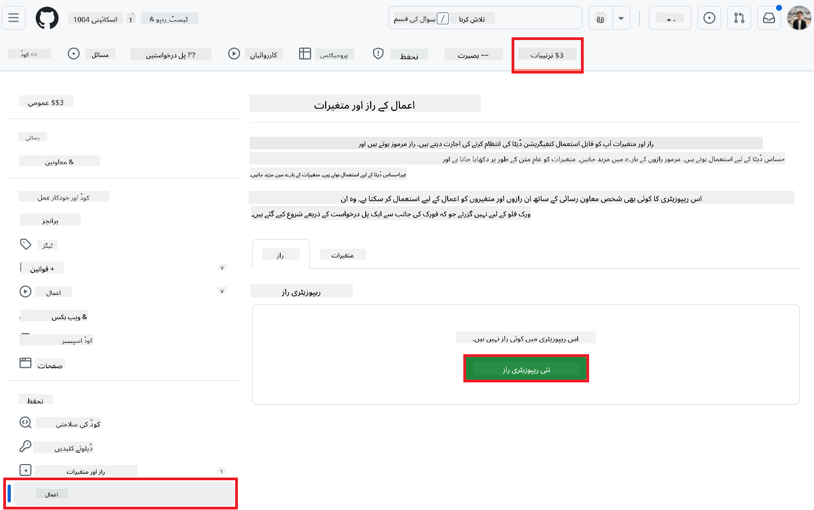
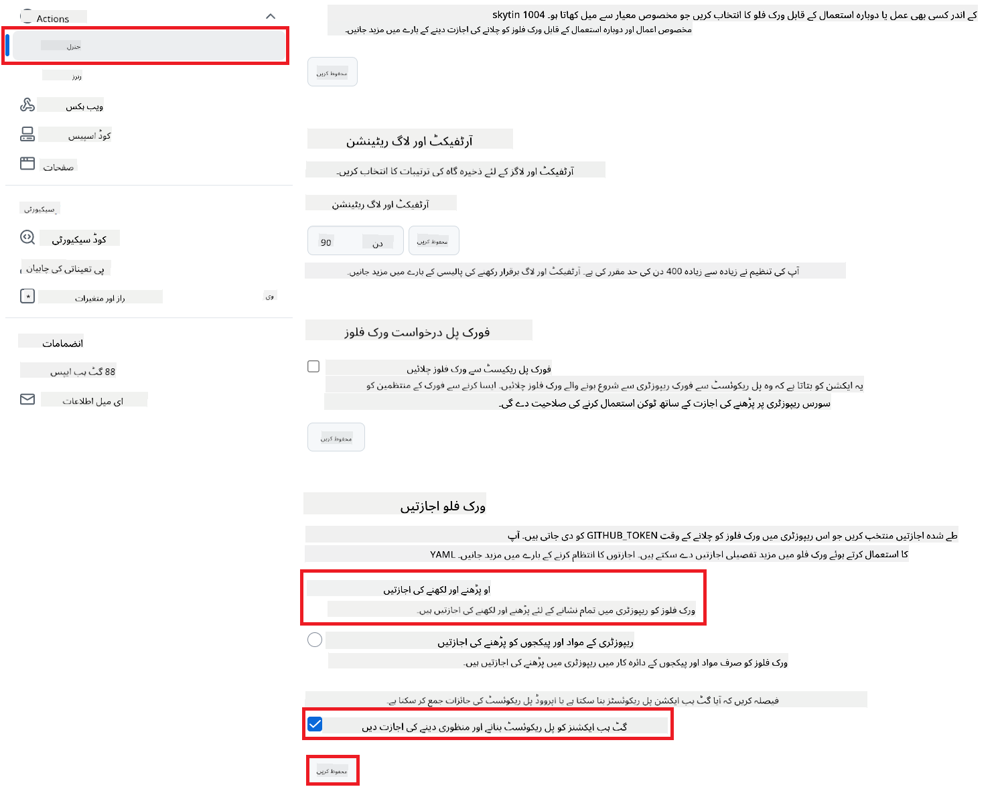

<!--
CO_OP_TRANSLATOR_METADATA:
{
  "original_hash": "a52587a512e667f70d92db853d3c61d5",
  "translation_date": "2025-06-12T19:22:45+00:00",
  "source_file": "getting_started/github-actions-guide/github-actions-guide-public.md",
  "language_code": "ur"
}
-->
# کو-آپ ٹرانسلیٹر GitHub ایکشن استعمال کرنا (عوامی سیٹ اپ)

**مخاطب:** یہ رہنما ان صارفین کے لیے ہے جو زیادہ تر عوامی یا نجی ریپوزٹریز میں کام کرتے ہیں جہاں معیاری GitHub Actions کی اجازتیں کافی ہوتی ہیں۔ یہ بلٹ ان `GITHUB_TOKEN` استعمال کرتا ہے۔

اپنے ریپوزٹری کی دستاویزات کا ترجمہ خودکار طریقے سے کو-آپ ٹرانسلیٹر GitHub ایکشن کے ذریعے کریں۔ یہ رہنما آپ کو ایکشن سیٹ اپ کرنے کا طریقہ بتاتا ہے تاکہ جب بھی آپ کے ماخذ Markdown فائلز یا تصاویر تبدیل ہوں، تو خودکار طریقے سے اپ ڈیٹ شدہ ترجمہ کے ساتھ پل ریکویسٹ بنائے جائیں۔

> [!IMPORTANT]
>
> **صحیح رہنما کا انتخاب:**
>
> یہ رہنما **معیاری `GITHUB_TOKEN` کے ذریعے آسان سیٹ اپ** کی تفصیل دیتا ہے۔ یہ زیادہ تر صارفین کے لیے تجویز کردہ طریقہ ہے کیونکہ اس میں حساس GitHub App Private Keys کے انتظام کی ضرورت نہیں ہوتی۔
>

## ضروریات

GitHub ایکشن کو ترتیب دینے سے پہلے یقینی بنائیں کہ آپ کے پاس مطلوبہ AI سروس کی اسناد موجود ہیں۔

**1. لازمی: AI زبان ماڈل کی اسناد**  
آپ کو کم از کم ایک سپورٹڈ زبان ماڈل کے لیے اسناد درکار ہیں:

- **Azure OpenAI**: Endpoint، API Key، Model/Deployment Names، API Version کی ضرورت ہوتی ہے۔  
- **OpenAI**: API Key، (اختیاری: Org ID، Base URL، Model ID) درکار ہیں۔  
- تفصیلات کے لیے [Supported Models and Services](../../../../README.md) دیکھیں۔

**2. اختیاری: AI وژن اسناد (تصویری ترجمے کے لیے)**

- صرف اس صورت میں ضروری جب آپ کو تصاویر میں موجود متن کا ترجمہ کرنا ہو۔  
- **Azure AI Vision**: Endpoint اور Subscription Key کی ضرورت ہوتی ہے۔  
- اگر فراہم نہ کی جائیں، تو ایکشن [Markdown-only mode](../markdown-only-mode.md) پر کام کرے گا۔

## سیٹ اپ اور ترتیب

معیاری `GITHUB_TOKEN` استعمال کرتے ہوئے اپنے ریپوزٹری میں کو-آپ ٹرانسلیٹر GitHub ایکشن کو ترتیب دینے کے لیے یہ اقدامات کریں۔

### مرحلہ 1: تصدیق کی سمجھ بوجھ (`GITHUB_TOKEN` کا استعمال)

یہ ورک فلو GitHub Actions کی فراہم کردہ بلٹ ان `GITHUB_TOKEN` استعمال کرتا ہے۔ یہ ٹوکن خود بخود ورک فلو کو آپ کے ریپوزٹری کے ساتھ تعامل کی اجازت دیتا ہے جیسا کہ **مرحلہ 3** میں سیٹ کی گئی ترتیبات کے مطابق ہے۔

### مرحلہ 2: ریپوزٹری سیکرٹس کی ترتیب

آپ کو صرف اپنی **AI سروس کی اسناد** کو اپنے ریپوزٹری کی ترتیبات میں انکرپٹڈ سیکرٹس کے طور پر شامل کرنا ہوگا۔

1.  اپنے ہدف GitHub ریپوزٹری پر جائیں۔  
2.  **Settings** > **Secrets and variables** > **Actions** پر جائیں۔  
3.  **Repository secrets** کے تحت، ہر مطلوبہ AI سروس سیکرٹ کے لیے **New repository secret** پر کلک کریں۔

     *(تصویر کا حوالہ: سیکرٹس شامل کرنے کی جگہ)*

**ضروری AI سروس سیکرٹس (اپنی ضروریات کے مطابق تمام شامل کریں):**

| سیکرٹ کا نام                         | وضاحت                                  | قدر کا ذریعہ                    |
| :---------------------------------- | :----------------------------------- | :----------------------------- |
| `AZURE_SUBSCRIPTION_KEY`            | Azure AI سروس (کمپیوٹر وژن) کے لیے کلید    | آپ کا Azure AI Foundry          |
| `AZURE_AI_SERVICE_ENDPOINT`         | Azure AI سروس (کمپیوٹر وژن) کے لیے اینڈ پوائنٹ | آپ کا Azure AI Foundry          |
| `AZURE_OPENAI_API_KEY`              | Azure OpenAI سروس کے لیے کلید              | آپ کا Azure AI Foundry          |
| `AZURE_OPENAI_ENDPOINT`             | Azure OpenAI سروس کے لیے اینڈ پوائنٹ        | آپ کا Azure AI Foundry          |
| `AZURE_OPENAI_MODEL_NAME`           | آپ کا Azure OpenAI ماڈل نام               | آپ کا Azure AI Foundry          |
| `AZURE_OPENAI_CHAT_DEPLOYMENT_NAME` | آپ کا Azure OpenAI ڈیپلائمنٹ نام            | آپ کا Azure AI Foundry          |
| `AZURE_OPENAI_API_VERSION`          | Azure OpenAI کے لیے API ورژن               | آپ کا Azure AI Foundry          |
| `OPENAI_API_KEY`                    | OpenAI کے لیے API کی                      | آپ کا OpenAI پلیٹ فارم          |
| `OPENAI_ORG_ID`                     | OpenAI آرگنائزیشن ID (اختیاری)            | آپ کا OpenAI پلیٹ فارم          |
| `OPENAI_CHAT_MODEL_ID`              | مخصوص OpenAI ماڈل ID (اختیاری)            | آپ کا OpenAI پلیٹ فارم          |
| `OPENAI_BASE_URL`                   | کسٹم OpenAI API بیس URL (اختیاری)         | آپ کا OpenAI پلیٹ فارم          |

### مرحلہ 3: ورک فلو کی اجازتیں ترتیب دیں

GitHub ایکشن کو کوڈ چیک آؤٹ کرنے اور پل ریکویسٹ بنانے کے لیے `GITHUB_TOKEN` کے ذریعے اجازتیں درکار ہیں۔

1.  اپنی ریپوزٹری میں **Settings** > **Actions** > **General** پر جائیں۔  
2.  نیچے **Workflow permissions** سیکشن تک سکرول کریں۔  
3.  **Read and write permissions** منتخب کریں۔ یہ ورک فلو کے لیے `GITHUB_TOKEN` کو ضروری `contents: write` اور `pull-requests: write` اجازتیں دیتا ہے۔  
4.  یقینی بنائیں کہ **Allow GitHub Actions to create and approve pull requests** کا چیک باکس منتخب ہو۔  
5.  **Save** پر کلک کریں۔



### مرحلہ 4: ورک فلو فائل بنائیں

آخر میں، وہ YAML فائل بنائیں جو `GITHUB_TOKEN` استعمال کرتے ہوئے خودکار ورک فلو کی تعریف کرتی ہے۔

1.  اپنی ریپوزٹری کی روٹ ڈائریکٹری میں، اگر موجود نہ ہو تو `.github/workflows/` ڈائریکٹری بنائیں۔  
2.  `.github/workflows/` کے اندر ایک فائل `co-op-translator.yml` کے نام سے بنائیں۔  
3.  مندرجہ ذیل مواد `co-op-translator.yml` میں پیسٹ کریں۔

```yaml
name: Co-op Translator

on:
  push:
    branches:
      - main

jobs:
  co-op-translator:
    runs-on: ubuntu-latest

    permissions:
      contents: write
      pull-requests: write

    steps:
      - name: Checkout repository
        uses: actions/checkout@v4
        with:
          fetch-depth: 0

      - name: Set up Python
        uses: actions/setup-python@v4
        with:
          python-version: '3.10'

      - name: Install Co-op Translator
        run: |
          python -m pip install --upgrade pip
          pip install co-op-translator

      - name: Run Co-op Translator
        env:
          PYTHONIOENCODING: utf-8
          # === AI Service Credentials ===
          AZURE_SUBSCRIPTION_KEY: ${{ secrets.AZURE_SUBSCRIPTION_KEY }}
          AZURE_AI_SERVICE_ENDPOINT: ${{ secrets.AZURE_AI_SERVICE_ENDPOINT }}
          AZURE_OPENAI_API_KEY: ${{ secrets.AZURE_OPENAI_API_KEY }}
          AZURE_OPENAI_ENDPOINT: ${{ secrets.AZURE_OPENAI_ENDPOINT }}
          AZURE_OPENAI_MODEL_NAME: ${{ secrets.AZURE_OPENAI_MODEL_NAME }}
          AZURE_OPENAI_CHAT_DEPLOYMENT_NAME: ${{ secrets.AZURE_OPENAI_CHAT_DEPLOYMENT_NAME }}
          AZURE_OPENAI_API_VERSION: ${{ secrets.AZURE_OPENAI_API_VERSION }}
          OPENAI_API_KEY: ${{ secrets.OPENAI_API_KEY }}
          OPENAI_ORG_ID: ${{ secrets.OPENAI_ORG_ID }}
          OPENAI_CHAT_MODEL_ID: ${{ secrets.OPENAI_CHAT_MODEL_ID }}
          OPENAI_BASE_URL: ${{ secrets.OPENAI_BASE_URL }}
        run: |
          # =====================================================================
          # IMPORTANT: Set your target languages here (REQUIRED CONFIGURATION)
          # =====================================================================
          # Example: Translate to Spanish, French, German. Add -y to auto-confirm.
          translate -l "es fr de" -y  # <--- MODIFY THIS LINE with your desired languages

      - name: Create Pull Request with translations
        uses: peter-evans/create-pull-request@v5
        with:
          token: ${{ secrets.GITHUB_TOKEN }}
          commit-message: "🌐 Update translations via Co-op Translator"
          title: "🌐 Update translations via Co-op Translator"
          body: |
            This PR updates translations for recent changes to the main branch.

            ### 📋 Changes included
            - Translated contents are available in the `translations/` directory
            - Translated images are available in the `translated_images/` directory

            ---
            🌐 Automatically generated by the [Co-op Translator](https://github.com/Azure/co-op-translator) GitHub Action.
          branch: update-translations
          base: main
          labels: translation, automated-pr
          delete-branch: true
          add-paths: |
            translations/
            translated_images/
```  
4.  **ورک فلو کو حسب ضرورت بنائیں:**  
  - **[!IMPORTANT] ہدف زبانیں:** اگر ضرورت ہو تو `Run Co-op Translator` step, you **MUST review and modify the list of language codes** within the `translate -l "..." -y` command to match your project's requirements. The example list (`ar de es...`) needs to be replaced or adjusted.
  - **Trigger (`on:`):** The current trigger runs on every push to `main`. For large repositories, consider adding a `paths:` filter (see commented example in the YAML) to run the workflow only when relevant files (e.g., source documentation) change, saving runner minutes.
  - **PR Details:** Customize the `commit-message`, `title`, `body`, `branch` name, and `labels` in the `Create Pull Request` مرحلے میں زبانیں تبدیل کریں۔

**ڈس کلیمر**:  
یہ دستاویز AI ترجمہ سروس [Co-op Translator](https://github.com/Azure/co-op-translator) کے ذریعے ترجمہ کی گئی ہے۔ اگرچہ ہم درستگی کے لیے کوشاں ہیں، براہ کرم اس بات سے آگاہ رہیں کہ خودکار ترجمے میں غلطیاں یا کمی بیشی ہو سکتی ہے۔ اصل دستاویز اپنی مادری زبان میں ہی معتبر ماخذ سمجھی جانی چاہیے۔ اہم معلومات کے لیے پیشہ ور انسانی ترجمہ کی سفارش کی جاتی ہے۔ اس ترجمے کے استعمال سے پیدا ہونے والی کسی بھی غلط فہمی یا غلط تشریح کی ذمہ داری ہم پر نہیں ہوگی۔