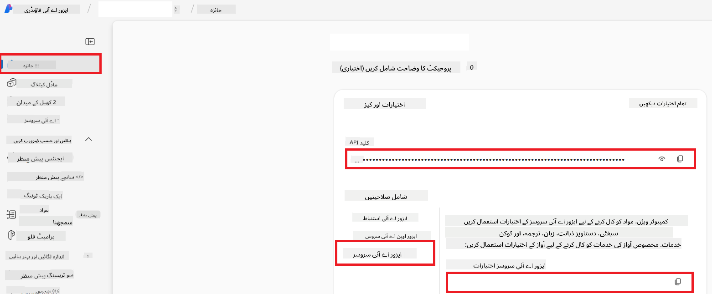

<!--
CO_OP_TRANSLATOR_METADATA:
{
  "original_hash": "b58d7c3cb4210697a073d20eb3064945",
  "translation_date": "2025-06-12T11:46:48+00:00",
  "source_file": "getting_started/set-up-azure-ai.md",
  "language_code": "ur"
}
-->
# Azure AI کو Co-op Translator کے لیے سیٹ اپ کریں (Azure OpneAI اور Azure AI Vision)

یہ گائیڈ آپ کو Azure AI Foundry کے اندر زبان کی ترجمہ کے لیے Azure OpenAI اور تصویر کے مواد کے تجزیہ کے لیے Azure Computer Vision (جسے بعد میں تصویر کی بنیاد پر ترجمہ کے لیے استعمال کیا جا سکتا ہے) کو سیٹ اپ کرنے کے عمل سے گزارتا ہے۔

**ضروریات:**
- ایک Azure اکاؤنٹ جس میں فعال سبسکرپشن ہو۔
- Azure سبسکرپشن میں وسائل اور ڈپلائمنٹس بنانے کی مناسب اجازتیں۔

## Azure AI پروجیکٹ بنائیں

آپ ایک Azure AI پروجیکٹ بنا کر شروع کریں گے، جو آپ کے AI وسائل کو منظم کرنے کے لیے مرکزی جگہ کا کام کرتا ہے۔

1. [https://ai.azure.com](https://ai.azure.com) پر جائیں اور اپنے Azure اکاؤنٹ سے سائن ان کریں۔

1. نیا پروجیکٹ بنانے کے لیے **+Create** منتخب کریں۔

1. درج ذیل کام کریں:
   - **Project name** درج کریں (مثلاً `CoopTranslator-Project`)۔
   - **AI hub** منتخب کریں (مثلاً `CoopTranslator-Hub`) (اگر ضرورت ہو تو نیا بنائیں)۔

1. اپنے پروجیکٹ کو سیٹ اپ کرنے کے لیے "**Review and Create**" پر کلک کریں۔ آپ کو پروجیکٹ کے اوورویو پیج پر لے جایا جائے گا۔

## زبان کے ترجمہ کے لیے Azure OpenAI سیٹ اپ کریں

اپنے پروجیکٹ کے اندر، آپ متن کے ترجمہ کے بیک اینڈ کے طور پر کام کرنے کے لیے Azure OpenAI ماڈل ڈپلائے کریں گے۔

### اپنے پروجیکٹ پر جائیں

اگر پہلے سے نہیں ہیں، تو اپنے نئے بنائے گئے پروجیکٹ (مثلاً `CoopTranslator-Project`) کو Azure AI Foundry میں کھولیں۔

### OpenAI ماڈل ڈپلائے کریں

1. اپنے پروجیکٹ کے بائیں مینو میں "My assets" کے تحت "**Models + endpoints**" منتخب کریں۔

1. **+ Deploy model** منتخب کریں۔

1. **Deploy Base Model** منتخب کریں۔

1. آپ کو دستیاب ماڈلز کی فہرست دکھائی جائے گی۔ مناسب GPT ماڈل کو فلٹر کریں یا تلاش کریں۔ ہم `gpt-4o` کی سفارش کرتے ہیں۔

1. مطلوبہ ماڈل منتخب کریں اور **Confirm** پر کلک کریں۔

1. **Deploy** منتخب کریں۔

### Azure OpenAI کی کنفیگریشن

ڈپلائے کرنے کے بعد، آپ "**Models + endpoints**" صفحے سے ڈپلائمنٹ منتخب کر کے اس کا **REST endpoint URL**، **Key**، **Deployment name**، **Model name** اور **API version** دیکھ سکتے ہیں۔ یہ معلومات آپ کے ایپلیکیشن میں ترجمہ ماڈل کو انٹیگریٹ کرنے کے لیے ضروری ہوں گی۔

> [!NOTE]
> آپ اپنی ضروریات کے مطابق API ورژنز [API version deprecation](https://learn.microsoft.com/azure/ai-services/openai/api-version-deprecation) صفحے سے منتخب کر سکتے ہیں۔ یاد رکھیں کہ **API version** مختلف ہوتا ہے اس **Model version** سے جو Azure AI Foundry کے "**Models + endpoints**" صفحے پر دکھایا جاتا ہے۔

## تصویر کے ترجمہ کے لیے Azure Computer Vision سیٹ اپ کریں

تصاویر میں موجود متن کے ترجمہ کو فعال کرنے کے لیے، آپ کو Azure AI Service API Key اور Endpoint تلاش کرنا ہوں گے۔

1. اپنے Azure AI پروجیکٹ (مثلاً `CoopTranslator-Project`) پر جائیں۔ یقینی بنائیں کہ آپ پروجیکٹ کے اوورویو صفحے پر ہیں۔

### Azure AI Service کی کنفیگریشن

Azure AI Service سے API Key اور Endpoint تلاش کریں۔

1. اپنے Azure AI پروجیکٹ (مثلاً `CoopTranslator-Project`) پر جائیں۔ یقینی بنائیں کہ آپ پروجیکٹ کے اوورویو صفحے پر ہیں۔

1. Azure AI Service ٹیب سے **API Key** اور **Endpoint** تلاش کریں۔

    

یہ کنکشن آپ کے AI Foundry پروجیکٹ کے لیے منسلک Azure AI Services ریسورس (جس میں تصویر کا تجزیہ شامل ہے) کی صلاحیتوں کو دستیاب بناتا ہے۔ آپ پھر اس کنکشن کو اپنے نوٹ بکس یا ایپلیکیشنز میں استعمال کر کے تصاویر سے متن نکال سکتے ہیں، جسے بعد میں ترجمہ کے لیے Azure OpenAI ماڈل کو بھیجا جا سکتا ہے۔

## اپنے اسناد کو یکجا کرنا

اب تک، آپ کو درج ذیل معلومات اکٹھی کرنی چاہیے:

**Azure OpenAI (متن کے ترجمہ کے لیے):**
- Azure OpenAI Endpoint
- Azure OpenAI API Key
- Azure OpenAI Model Name (مثلاً `gpt-4o`)
- Azure OpenAI Deployment Name (مثلاً `cooptranslator-gpt4o`)
- Azure OpenAI API Version

**Azure AI Services (تصویر سے متن نکالنے کے لیے Vision کے ذریعے):**
- Azure AI Service Endpoint
- Azure AI Service API Key

### مثال: ماحول کے متغیرات کی کنفیگریشن (پری ویو)

بعد میں، جب آپ اپنی ایپلیکیشن بنائیں گے، تو ممکنہ طور پر آپ انہیں جمع کی گئی اسناد کے ذریعے کنفیگر کریں گے۔ مثال کے طور پر، آپ انہیں ماحول کے متغیرات کی طرح سیٹ کر سکتے ہیں:

```bash
# Azure AI Service Credentials (Required for image translation)
AZURE_AI_SERVICE_API_KEY="your_azure_ai_service_api_key" # e.g., 21xasd...
AZURE_AI_SERVICE_ENDPOINT="https://your_azure_ai_service_endpoint.cognitiveservices.azure.com/"

# Azure OpenAI Credentials (Required for text translation)
AZURE_OPENAI_API_KEY="your_azure_openai_api_key" # e.g., 21xasd...
AZURE_OPENAI_ENDPOINT="https://your_azure_openai_endpoint.openai.azure.com/"
AZURE_OPENAI_MODEL_NAME="your_model_name" # e.g., gpt-4o
AZURE_OPENAI_CHAT_DEPLOYMENT_NAME="your_deployment_name" # e.g., cooptranslator-gpt4o
AZURE_OPENAI_API_VERSION="your_api_version" # e.g., 2024-12-01-preview
```

---

### مزید مطالعہ

- [Azure AI Foundry میں پروجیکٹ کیسے بنائیں](https://learn.microsoft.com/azure/ai-foundry/how-to/create-projects?tabs=ai-studio)
- [Azure AI وسائل کیسے بنائیں](https://learn.microsoft.com/azure/ai-foundry/how-to/create-azure-ai-resource?tabs=portal)
- [Azure AI Foundry میں OpenAI ماڈلز کو کیسے ڈپلائے کریں](https://learn.microsoft.com/en-us/azure/ai-foundry/how-to/deploy-models-openai)

**دستخطی:**
یہ دستاویز AI ترجمہ سروس [Co-op Translator](https://github.com/Azure/co-op-translator) کے ذریعے ترجمہ کی گئی ہے۔ اگرچہ ہم درستگی کے لیے کوشاں ہیں، براہ کرم آگاہ رہیں کہ خودکار ترجموں میں غلطیاں یا بے دقتیاں ہو سکتی ہیں۔ اصل دستاویز اپنی مادری زبان میں مستند ماخذ سمجھی جانی چاہیے۔ اہم معلومات کے لیے پیشہ ور انسانی ترجمہ کی سفارش کی جاتی ہے۔ اس ترجمے کے استعمال سے پیدا ہونے والی کسی بھی غلط فہمی یا غلط تعبیر کے لیے ہم ذمہ دار نہیں ہیں۔