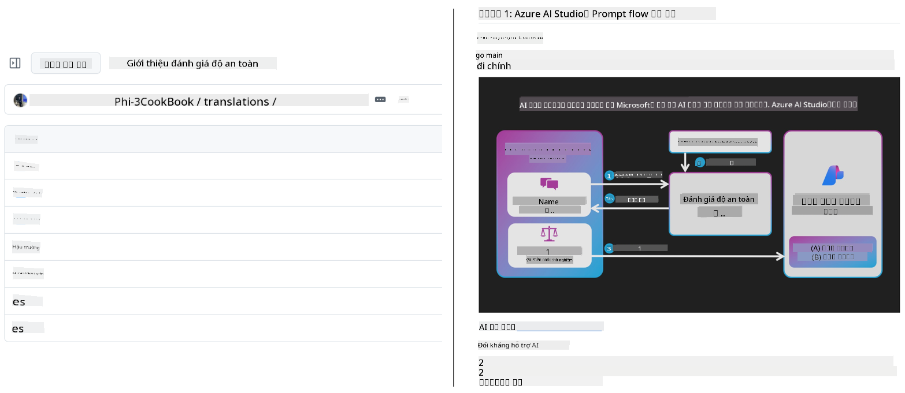
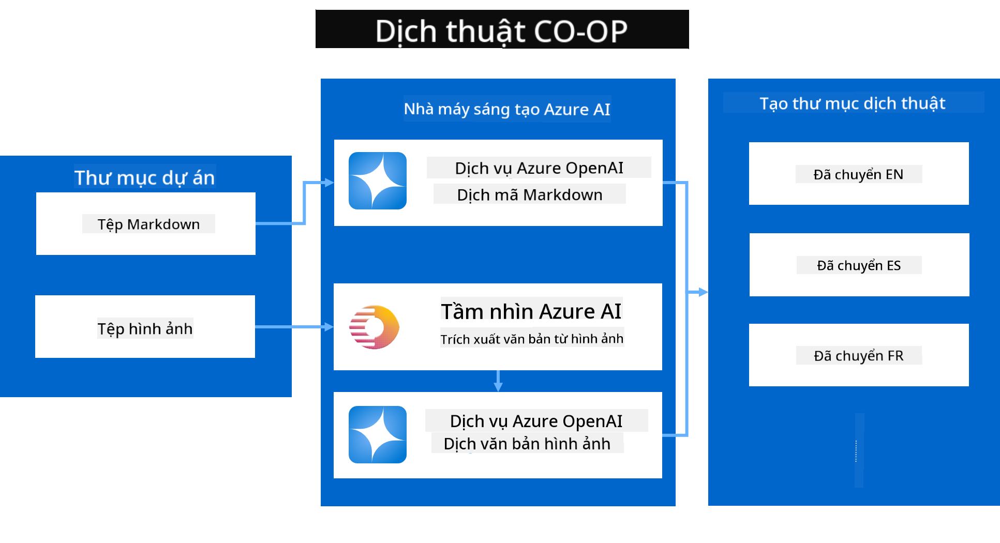
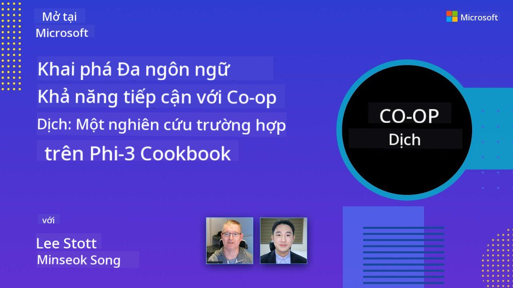

<!--
CO_OP_TRANSLATOR_METADATA:
{
  "original_hash": "044724537b57868117aadae8e7728c7c",
  "translation_date": "2025-06-12T10:40:25+00:00",
  "source_file": "README.md",
  "language_code": "vi"
}
-->


# Co-op Translator: Tự động hóa việc dịch tài liệu giáo dục một cách dễ dàng

_Dễ dàng tự động dịch tài liệu của bạn sang nhiều ngôn ngữ để tiếp cận khán giả toàn cầu._

[](https://pypi.org/project/co-op-translator/)
[](https://github.com/azure/co-op-translator/blob/main/LICENSE)
[](https://pepy.tech/project/co-op-translator)
[](https://pepy.tech/project/co-op-translator)
[](https://github.com/psf/black)

[](https://GitHub.com/azure/co-op-translator/graphs/contributors/)
[](https://GitHub.com/azure/co-op-translator/issues/)
[](https://GitHub.com/azure/co-op-translator/pulls/)
[](http://makeapullrequest.com)

### Hỗ trợ ngôn ngữ được cung cấp bởi Co-op Translator

> [!NOTE]
> Đây là các bản dịch hiện tại của nội dung kho lưu trữ này. Để xem danh sách đầy đủ các ngôn ngữ được Co-op Translator hỗ trợ, vui lòng tham khảo phần [Language Support](../..).

[](https://GitHub.com/azure/co-op-translator/watchers/)
[](https://GitHub.com/azure/co-op-translator/network/)
[](https://GitHub.com/azure/co-op-translator/stargazers/)

[](https://discord.com/invite/ByRwuEEgH4)

[](https://codespaces.new/azure/co-op-translator)
[](https://vscode.dev/redirect?url=vscode://ms-vscode-remote.remote-containers/cloneInVolume?url=https://github.com/azure/co-op-translator)

## Tổng quan: Đơn giản hóa việc dịch nội dung giáo dục của bạn

Rào cản ngôn ngữ gây khó khăn lớn trong việc tiếp cận các tài nguyên giáo dục giá trị và kiến thức kỹ thuật cho người học và nhà phát triển trên toàn thế giới. Điều này giới hạn sự tham gia và làm chậm tiến độ đổi mới và học hỏi toàn cầu.

**Co-op Translator** ra đời nhằm giải quyết quy trình dịch thủ công kém hiệu quả cho các chuỗi giáo dục quy mô lớn của Microsoft (như các hướng dẫn "For Beginners"). Công cụ này đã phát triển thành một giải pháp mạnh mẽ, dễ sử dụng, giúp phá bỏ rào cản ngôn ngữ cho mọi người. Bằng cách cung cấp bản dịch tự động chất lượng cao qua CLI và GitHub Actions, Co-op Translator giúp các nhà giáo dục, sinh viên, nhà nghiên cứu và nhà phát triển trên toàn cầu chia sẻ và tiếp cận kiến thức mà không bị giới hạn bởi ngôn ngữ.

Xem cách Co-op Translator tổ chức nội dung giáo dục đã được dịch:



Các file Markdown và văn bản trong hình ảnh được dịch tự động và sắp xếp gọn gàng vào các thư mục theo từng ngôn ngữ.

**Hãy mở rộng quyền truy cập toàn cầu cho nội dung giáo dục của bạn với Co-op Translator ngay hôm nay!**

## Hỗ trợ truy cập toàn cầu cho tài nguyên học tập của Microsoft

Co-op Translator giúp thu hẹp khoảng cách ngôn ngữ cho các sáng kiến giáo dục quan trọng của Microsoft, tự động hóa quá trình dịch cho các kho lưu trữ phục vụ cộng đồng nhà phát triển toàn cầu. Một số ví dụ đang sử dụng Co-op Translator bao gồm:

[](https://github.com/microsoft/Generative-AI-for-beginners)
[](https://github.com/microsoft/ML-For-Beginners)
[](https://github.com/microsoft/AI-For-Beginners)
[](https://github.com/microsoft/ai-agents-for-beginners)
[](https://github.com/microsoft/PhiCookBook)
[](https://github.com/microsoft/Generative-AI-for-beginners-dotnet)

## Các tính năng chính

- **Dịch tự động**: Dịch văn bản sang nhiều ngôn ngữ một cách dễ dàng.
- **Tích hợp GitHub Actions**: Tự động hóa việc dịch trong quy trình CI/CD của bạn.
- **Giữ nguyên định dạng Markdown**: Bảo toàn cú pháp Markdown chính xác trong quá trình dịch.
- **Dịch văn bản trong hình ảnh**: Trích xuất và dịch văn bản có trong hình ảnh.
- **Công nghệ LLM tiên tiến**: Sử dụng các mô hình ngôn ngữ hiện đại để có bản dịch chất lượng cao.
- **Dễ dàng tích hợp**: Kết nối mượt mà với cấu hình dự án hiện có của bạn.
- **Đơn giản hóa bản địa hóa**: Tinh gọn quy trình bản địa hóa dự án cho thị trường quốc tế.

## Cách thức hoạt động



Co-op Translator lấy các file Markdown và hình ảnh từ thư mục dự án của bạn và xử lý như sau:

1. **Trích xuất văn bản**: Lấy văn bản từ các file Markdown và, nếu được cấu hình (ví dụ với Azure AI Vision), văn bản trong hình ảnh.
1. **Dịch AI**: Gửi văn bản đã trích xuất đến LLM được cấu hình (Azure OpenAI, OpenAI, v.v.) để dịch.
1. **Lưu kết quả**: Lưu các file Markdown và hình ảnh đã dịch vào các thư mục theo ngôn ngữ, đồng thời giữ nguyên định dạng ban đầu.

## Bắt đầu

Bắt đầu nhanh với CLI hoặc thiết lập tự động hóa đầy đủ bằng GitHub Actions. Chọn cách phù hợp nhất với quy trình làm việc của bạn:

1. **Command Line (CLI)** - Dịch một lần hoặc điều khiển thủ công
2. **GitHub Actions** - Tự động dịch mỗi khi có thay đổi đẩy lên

> [!NOTE]
> Mặc dù hướng dẫn này tập trung vào tài nguyên Azure, bạn có thể dùng bất kỳ mô hình ngôn ngữ nào được hỗ trợ.

### Hỗ trợ ngôn ngữ

Co-op Translator hỗ trợ nhiều ngôn ngữ để giúp bạn tiếp cận khán giả toàn cầu. Dưới đây là những điều bạn cần biết:

#### Tham khảo nhanh

| Ngôn ngữ | Mã | Ngôn ngữ | Mã | Ngôn ngữ | Mã |
|----------|----|----------|----|----------|----|
| Arabic | ar | Bengali | bn | Bulgarian | bg |
| Burmese (Myanmar) | my | Chinese (Simplified) | zh | Chinese (Traditional, HK) | hk |
| Chinese (Traditional, Macau) | mo | Chinese (Traditional, TW) | tw | Croatian | hr |
| Czech | cs | Danish | da | Dutch | nl |
| Finnish | fi | French | fr | German | de |
| Greek | el | Hebrew | he | Hindi | hi |
| Hungarian | hu | Indonesian | id | Italian | it |
| Japanese | ja | Korean | ko | Malay | ms |
| Marathi | mr | Nepali | ne | Norwegian | no |
| Persian (Farsi) | fa | Polish | pl | Portuguese (Brazil) | br |
| Portuguese (Portugal) | pt | Punjabi (Gurmukhi) | pa | Romanian | ro |
| Russian | ru | Serbian (Cyrillic) | sr | Slovak | sk |
| Slovenian | sl | Spanish | es | Swahili | sw |
| Swedish | sv | Tagalog (Filipino) | tl | Thai | th |
| Turkish | tr | Ukrainian | uk | Urdu | ur |
| Vietnamese | vi | — | — | — | — |

#### Cách dùng mã ngôn ngữ

Khi sử dụng Co-op Translator, bạn cần chỉ định ngôn ngữ bằng mã tương ứng. Ví dụ:

```bash
# Translate to French, Spanish, and German
translate -l "fr es de"

# Translate to Chinese (Simplified) and Japanese
translate -l "zh ja"
```

> [!NOTE]
> Để biết thông tin kỹ thuật chi tiết về hỗ trợ ngôn ngữ, bao gồm:
>
> - Đặc tả font chữ cho từng ngôn ngữ
> - Các vấn đề đã biết
> - Cách thêm ngôn ngữ mới
>
> Hãy xem [Supported Languages Documentation](./getting_started/supported-languages.md).

### Mô hình và dịch vụ được hỗ trợ

| Loại                  | Tên                           |
|-----------------------|--------------------------------|
| Language Model        |   |
| AI Vision       |  |

> [!NOTE]
> Nếu dịch vụ AI vision không có sẵn, co-op translator sẽ chuyển sang [Markdown-only mode](./getting_started/markdown-only-mode.md).

### Thiết lập ban đầu

Trước khi bắt đầu, bạn cần chuẩn bị các tài nguyên sau:

1. Language Model Resource (Bắt buộc):
   - Azure OpenAI (Khuyến nghị) - Cung cấp bản dịch chất lượng cao với độ tin cậy doanh nghiệp
   - OpenAI - Lựa chọn thay thế nếu bạn không có quyền truy cập Azure
   - Để biết chi tiết về các mô hình được hỗ trợ, xem [Supported Models and Services](../..)

1. AI Vision Resource (Tùy chọn):
   - Azure AI Vision - Cho phép dịch văn bản trong hình ảnh
   - Nếu không cấu hình, công cụ sẽ tự động dùng [Markdown-only mode](./getting_started/markdown-only-mode.md)
   - Khuyến nghị cho các dự án có hình ảnh chứa văn bản cần dịch

1. Các bước cấu hình:
   - Làm theo [hướng dẫn thiết lập Azure AI](./getting_started/set-up-azure-ai.md) để biết chi tiết
   - Tạo file `.env` chứa khóa API và endpoint (xem phần [Quick Start](../..))
   - Đảm bảo bạn có quyền và hạn mức phù hợp cho các dịch vụ đã chọn

### Chuẩn bị dự án trước khi dịch

Trước khi bắt đầu quá trình dịch, làm theo các bước sau để chuẩn bị dự án:

1. Chuẩn bị README của bạn:
   - Thêm bảng dịch trong README.md để liên kết đến các phiên bản dịch
   - Ví dụ định dạng:

     ```markdown

     ### 🌐 Multi-Language Support
     
     [French](../fr/README.md) | [Spanish](../es/README.md) | [German](../de/README.md) | [Russian](../ru/README.md) | [Arabic](../ar/README.md) | [Persian (Farsi)](../fa/README.md) | [Urdu](../ur/README.md) | [Chinese (Simplified)](../zh/README.md) | [Chinese (Traditional, Macau)](../mo/README.md) | [Chinese (Traditional, Hong Kong)](../hk/README.md) | [Chinese (Traditional, Taiwan)](../tw/README.md) | [Japanese](../ja/README.md) | [Korean](../ko/README.md) | [Hindi](../hi/README.md) | [Bengali](../bn/README.md) | [Marathi](../mr/README.md) | [Nepali](../ne/README.md) | [Punjabi (Gurmukhi)](../pa/README.md) | [Portuguese (Portugal)](../pt/README.md) | [Portuguese (Brazil)](../br/README.md) | [Italian](../it/README.md) | [Polish](../pl/README.md) | [Turkish](../tr/README.md) | [Greek](../el/README.md) | [Thai](../th/README.md) | [Swedish](../sv/README.md) | [Danish](../da/README.md) | [Norwegian](../no/README.md) | [Finnish](../fi/README.md) | [Dutch](../nl/README.md) | [Hebrew](../he/README.md) | [Vietnamese](./README.md) | [Indonesian](../id/README.md) | [Malay](../ms/README.md) | [Tagalog (Filipino)](../tl/README.md) | [Swahili](../sw/README.md) | [Hungarian](../hu/README.md) | [Czech](../cs/README.md) | [Slovak](../sk/README.md) | [Romanian](../ro/README.md) | [Bulgarian](../bg/README.md) | [Serbian (Cyrillic)](../sr/README.md) | [Croatian](../hr/README.md) | [Slovenian](../sl/README.md) | [Ukrainian](../uk/README.md) | [Burmese (Myanmar)](../my/README.md) 
    
     ```

1. Dọn dẹp các bản dịch hiện có (nếu cần):
   - Xóa các thư mục dịch hiện có (ví dụ `translations/`)
   - Xóa các file dịch cũ để bắt đầu mới
   - Điều này giúp tránh xung đột với quy trình dịch mới

### Bắt đầu nhanh: Dòng lệnh

Để khởi động nhanh qua dòng lệnh:

1. Tạo môi trường ảo:

    ```bash
    python -m venv .venv
    ```

1. Kích hoạt môi trường ảo:

    - Trên Windows:

    ```bash
    .venv\scripts\activate
    ```

    - Trên Linux/macOS:

    ```bash
    source .venv/bin/activate
    ```

1. Cài đặt gói:

    ```bash
    pip install co-op-translator
    ```

1. Cấu hình thông tin đăng nhập:

    - Tạo file `.env` file in your project's root directory.
    - Copy the contents from the [.env.template](../../.env.template) file into your new `.env` file.
    - Fill in the required API keys and endpoint information in your `.env` file.

1. Run Translation:
    - Navigate to your project's root directory in your terminal.
    - Execute the translate command, specifying target languages with the `-l` với cờ:

    ```bash
    translate -l "ko ja fr"
    ```

    _(Thay thế `"ko ja fr"` with your desired space-separated language codes)_

### Detailed Usage Guides

Choose the approach that best fits your workflow:

#### 1. Using the Command Line (CLI)

- Best for: One-time translations, manual control, or integration into custom scripts.
- Requires: Local installation of Python and the `co-op-translator` package.
- Guide: [Command Line Guide](./getting_started/command-line-guide/command-line-guide.md)

#### 2. Using GitHub Actions (Automation)

- Best for: Automatically translating content whenever changes are pushed to your repository. Keeps translations consistently up-to-date.
- Requires: Setting up a workflow file (`.github/workflows`) trong kho lưu trữ của bạn. Không cần cài đặt cục bộ.
- Hướng dẫn:
  - [GitHub Actions Guide (Public Repositories & Standard Secrets)](./getting_started/github-actions-guide/github-actions-guide-public.md) - Dùng cho hầu hết kho công khai hoặc cá nhân dựa trên secrets tiêu chuẩn.
  - [GitHub Actions Guide (Microsoft Organization Repos & Org-Level Setups)](./getting_started/github-actions-guide/github-actions-guide-org.md) - Dùng nếu bạn làm việc trong tổ chức Microsoft GitHub hoặc cần dùng secrets/cơ sở hạ tầng ở cấp tổ chức.

### Khắc phục sự cố và mẹo

- [Troubleshooting Guide](./getting_started/troubleshooting.md)

### Tài nguyên bổ sung

- [Command Reference](./getting_started/command-reference.md): Hướng dẫn chi tiết tất cả lệnh và tùy chọn.
- [Supported Languages](./getting_started/supported-languages.md): Danh sách ngôn ngữ được hỗ trợ và cách thêm ngôn ngữ mới.
- [Markdown-Only Mode](./getting_started/markdown-only-mode.md): Cách dịch chỉ văn bản, không dịch trong hình ảnh.

## Video trình bày

Tìm hiểu thêm về Co-op Translator qua các bài trình bày _(Nhấn vào hình bên dưới để xem trên YouTube.)_:

- **Open at Microsoft**: Giới thiệu ngắn 18 phút và hướng dẫn nhanh cách dùng Co-op Translator.
[](https://www.youtube.com/watch?v=jX_swfH_KNU)

## Hỗ trợ chúng tôi và Thúc đẩy Học tập Toàn cầu

Hãy cùng chúng tôi cách mạng hóa cách chia sẻ nội dung giáo dục trên toàn thế giới! Hãy dành ⭐ cho [Co-op Translator](https://github.com/azure/co-op-translator) trên GitHub và ủng hộ sứ mệnh phá bỏ rào cản ngôn ngữ trong học tập và công nghệ. Sự quan tâm và đóng góp của bạn tạo nên sự khác biệt lớn! Chúng tôi luôn hoan nghênh các đóng góp mã nguồn và đề xuất tính năng.

## Đóng góp

Dự án này hoan nghênh mọi đóng góp và đề xuất. Bạn quan tâm muốn đóng góp cho Azure Co-op Translator? Vui lòng xem [CONTRIBUTING.md](./CONTRIBUTING.md) để biết hướng dẫn giúp làm cho Co-op Translator trở nên dễ tiếp cận hơn.

## Những người đóng góp

[](https://github.com/Azure/co-op-translator/graphs/contributors)

## Quy tắc ứng xử

Dự án này đã áp dụng [Microsoft Open Source Code of Conduct](https://opensource.microsoft.com/codeofconduct/).
Để biết thêm thông tin, xem [Code of Conduct FAQ](https://opensource.microsoft.com/codeofconduct/faq/) hoặc
liên hệ [opencode@microsoft.com](mailto:opencode@microsoft.com) nếu bạn có câu hỏi hoặc góp ý thêm.

## AI có trách nhiệm

Microsoft cam kết giúp khách hàng sử dụng các sản phẩm AI của chúng tôi một cách có trách nhiệm, chia sẻ những bài học kinh nghiệm và xây dựng các quan hệ đối tác dựa trên sự tin cậy thông qua các công cụ như Transparency Notes và Impact Assessments. Nhiều tài nguyên này có thể tìm thấy tại [https://aka.ms/RAI](https://aka.ms/RAI).
Cách tiếp cận AI có trách nhiệm của Microsoft dựa trên các nguyên tắc AI về công bằng, độ tin cậy và an toàn, quyền riêng tư và bảo mật, tính bao trùm, minh bạch và trách nhiệm giải trình.

Các mô hình ngôn ngữ tự nhiên, hình ảnh và giọng nói quy mô lớn - như những mô hình được sử dụng trong ví dụ này - có thể hoạt động theo những cách không công bằng, không đáng tin cậy hoặc gây xúc phạm, từ đó gây ra những tác hại. Vui lòng tham khảo [Azure OpenAI service Transparency note](https://learn.microsoft.com/legal/cognitive-services/openai/transparency-note?tabs=text) để được thông tin về các rủi ro và giới hạn.

Cách tiếp cận được khuyến nghị để giảm thiểu các rủi ro này là tích hợp một hệ thống an toàn trong kiến trúc của bạn có thể phát hiện và ngăn chặn hành vi gây hại. [Azure AI Content Safety](https://learn.microsoft.com/azure/ai-services/content-safety/overview) cung cấp một lớp bảo vệ độc lập, có khả năng phát hiện nội dung do người dùng và AI tạo ra có tính chất gây hại trong các ứng dụng và dịch vụ. Azure AI Content Safety bao gồm các API văn bản và hình ảnh giúp bạn phát hiện các tài liệu có hại. Chúng tôi cũng có một Content Safety Studio tương tác cho phép bạn xem, khám phá và thử nghiệm mã mẫu để phát hiện nội dung gây hại trên nhiều loại hình khác nhau. Tài liệu [quickstart](https://learn.microsoft.com/azure/ai-services/content-safety/quickstart-text?tabs=visual-studio%2Clinux&pivots=programming-language-rest) dưới đây hướng dẫn bạn cách gửi yêu cầu đến dịch vụ.

Một khía cạnh khác cần lưu ý là hiệu suất tổng thể của ứng dụng. Với các ứng dụng đa phương thức và đa mô hình, chúng tôi xem hiệu suất là hệ thống hoạt động đúng như bạn và người dùng mong đợi, bao gồm không tạo ra các kết quả gây hại. Việc đánh giá hiệu suất tổng thể của ứng dụng bằng cách sử dụng [các chỉ số chất lượng tạo sinh và rủi ro, an toàn](https://learn.microsoft.com/azure/ai-studio/concepts/evaluation-metrics-built-in) là rất quan trọng.

Bạn có thể đánh giá ứng dụng AI của mình trong môi trường phát triển bằng cách sử dụng [prompt flow SDK](https://microsoft.github.io/promptflow/index.html). Dựa trên bộ dữ liệu kiểm thử hoặc mục tiêu, các kết quả tạo sinh AI của bạn sẽ được đo lường định lượng bằng các trình đánh giá tích hợp sẵn hoặc tùy chỉnh theo lựa chọn của bạn. Để bắt đầu với prompt flow sdk nhằm đánh giá hệ thống, bạn có thể theo dõi [hướng dẫn quickstart](https://learn.microsoft.com/azure/ai-studio/how-to/develop/flow-evaluate-sdk). Khi bạn thực hiện một lần chạy đánh giá, bạn có thể [trực quan hóa kết quả trong Azure AI Studio](https://learn.microsoft.com/azure/ai-studio/how-to/evaluate-flow-results).

## Nhãn hiệu

Dự án này có thể chứa nhãn hiệu hoặc logo của các dự án, sản phẩm hoặc dịch vụ. Việc sử dụng nhãn hiệu hoặc logo Microsoft được ủy quyền phải tuân theo
[Microsoft's Trademark & Brand Guidelines](https://www.microsoft.com/en-us/legal/intellectualproperty/trademarks/usage/general).
Việc sử dụng nhãn hiệu hoặc logo Microsoft trong các phiên bản chỉnh sửa của dự án này không được gây nhầm lẫn hoặc ngụ ý Microsoft tài trợ.
Mọi việc sử dụng nhãn hiệu hoặc logo của bên thứ ba phải tuân theo chính sách của bên thứ ba đó.

**Tuyên bố từ chối trách nhiệm**:  
Tài liệu này đã được dịch bằng dịch vụ dịch thuật AI [Co-op Translator](https://github.com/Azure/co-op-translator). Mặc dù chúng tôi cố gắng đảm bảo độ chính xác, xin lưu ý rằng bản dịch tự động có thể chứa lỗi hoặc không chính xác. Tài liệu gốc bằng ngôn ngữ nguyên bản nên được xem là nguồn thông tin chính thức. Đối với những thông tin quan trọng, nên sử dụng dịch vụ dịch thuật chuyên nghiệp do con người thực hiện. Chúng tôi không chịu trách nhiệm về bất kỳ sự hiểu lầm hoặc giải thích sai nào phát sinh từ việc sử dụng bản dịch này.