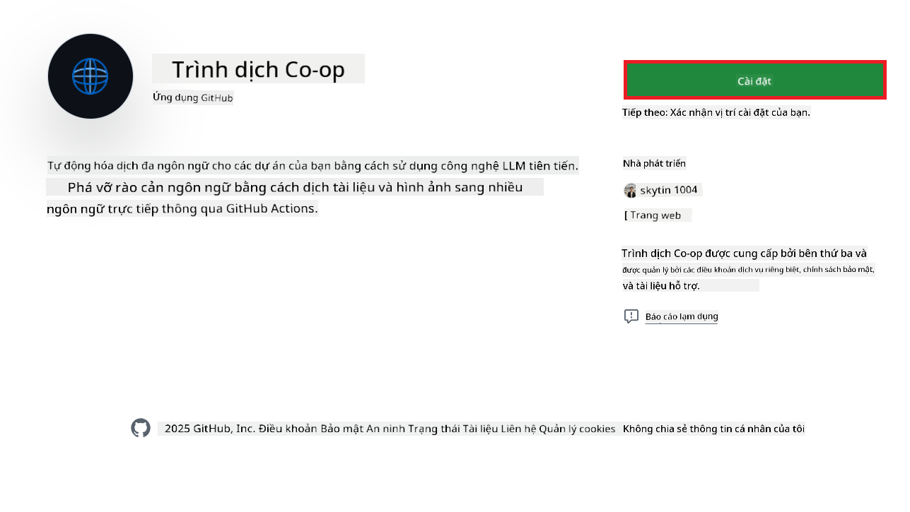
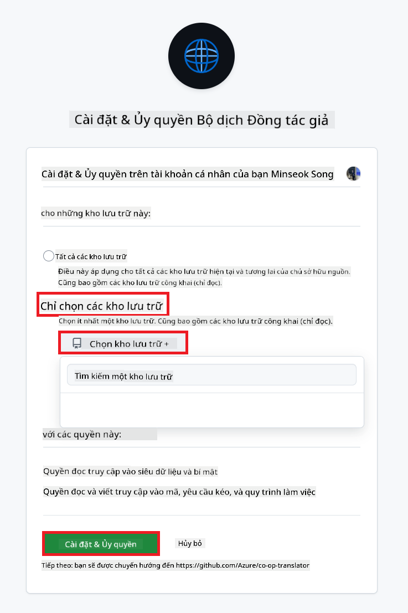
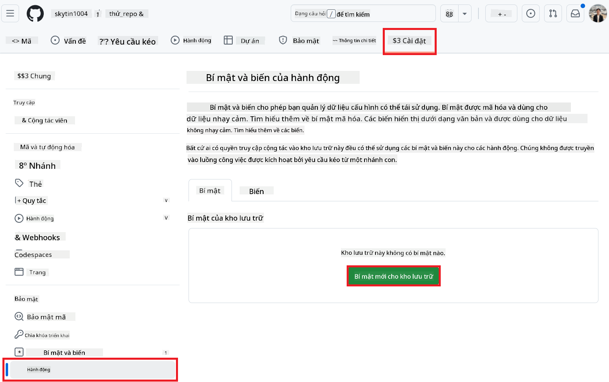
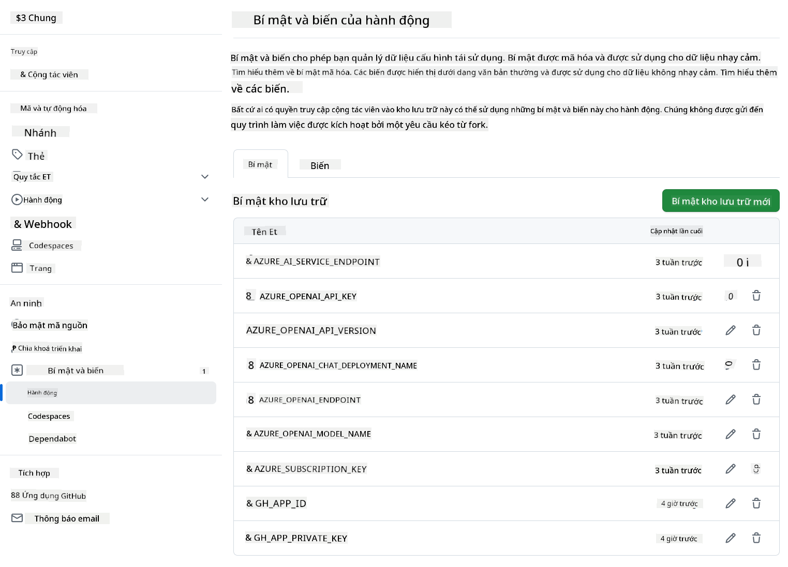

<!--
CO_OP_TRANSLATOR_METADATA:
{
  "original_hash": "c437820027c197f25fb2cbee95bae28c",
  "translation_date": "2025-06-12T19:13:47+00:00",
  "source_file": "getting_started/github-actions-guide/github-actions-guide-org.md",
  "language_code": "vi"
}
-->
# Sử dụng Co-op Translator GitHub Action (Hướng dẫn dành cho Tổ chức)

**Đối tượng hướng đến:** Hướng dẫn này dành cho **người dùng nội bộ Microsoft** hoặc **các nhóm có quyền truy cập vào thông tin đăng nhập cần thiết cho Co-op Translator GitHub App đã được xây dựng sẵn** hoặc có thể tạo GitHub App tùy chỉnh riêng.

Tự động hóa việc dịch tài liệu trong kho lưu trữ của bạn một cách dễ dàng với Co-op Translator GitHub Action. Hướng dẫn này sẽ giúp bạn thiết lập action để tự động tạo pull request với bản dịch cập nhật mỗi khi các tệp Markdown nguồn hoặc hình ảnh của bạn thay đổi.

> [!IMPORTANT]
> 
> **Lựa chọn Hướng dẫn phù hợp:**
>
> Hướng dẫn này mô tả cách thiết lập sử dụng **GitHub App ID và Khóa riêng tư**. Thông thường bạn cần phương pháp "Hướng dẫn dành cho Tổ chức" này nếu: **`GITHUB_TOKEN` Quyền bị giới hạn:** Cài đặt tổ chức hoặc kho lưu trữ của bạn giới hạn các quyền mặc định được cấp cho `GITHUB_TOKEN` tiêu chuẩn. Cụ thể, nếu `GITHUB_TOKEN` không được cấp các quyền `write` cần thiết (như `contents: write` hoặc `pull-requests: write`), workflow trong [Hướng dẫn Cài đặt Công khai](./github-actions-guide-public.md) sẽ thất bại do thiếu quyền. Việc sử dụng GitHub App riêng với quyền được cấp rõ ràng sẽ vượt qua hạn chế này.
>
> **Nếu điều trên không áp dụng cho bạn:**
>
> Nếu `GITHUB_TOKEN` tiêu chuẩn có đủ quyền trong kho lưu trữ của bạn (tức là bạn không bị chặn bởi giới hạn tổ chức), vui lòng sử dụng **[Hướng dẫn Cài đặt Công khai sử dụng GITHUB_TOKEN](./github-actions-guide-public.md)**. Hướng dẫn công khai không yêu cầu lấy hoặc quản lý App ID hay Khóa riêng tư mà chỉ dựa vào `GITHUB_TOKEN` tiêu chuẩn và quyền kho lưu trữ.

## Yêu cầu trước

Trước khi cấu hình GitHub Action, hãy đảm bảo bạn đã có thông tin đăng nhập dịch vụ AI cần thiết.

**1. Bắt buộc: Thông tin đăng nhập Mô hình Ngôn ngữ AI**  
Bạn cần thông tin đăng nhập cho ít nhất một Mô hình Ngôn ngữ được hỗ trợ:

- **Azure OpenAI**: Yêu cầu Endpoint, API Key, Tên Model/Deployment, Phiên bản API.  
- **OpenAI**: Yêu cầu API Key, (Tùy chọn: Org ID, Base URL, Model ID).  
- Xem [Mô hình và Dịch vụ được Hỗ trợ](../../../../README.md) để biết chi tiết.  
- Hướng dẫn thiết lập: [Thiết lập Azure OpenAI](../set-up-resources/set-up-azure-openai.md).

**2. Tùy chọn: Thông tin đăng nhập Computer Vision (cho Dịch hình ảnh)**

- Chỉ cần nếu bạn cần dịch văn bản trong hình ảnh.  
- **Azure Computer Vision**: Yêu cầu Endpoint và Subscription Key.  
- Nếu không cung cấp, action sẽ mặc định ở [chế độ chỉ Markdown](../markdown-only-mode.md).  
- Hướng dẫn thiết lập: [Thiết lập Azure Computer Vision](../set-up-resources/set-up-azure-computer-vision.md).

## Thiết lập và Cấu hình

Thực hiện các bước sau để cấu hình Co-op Translator GitHub Action trong kho lưu trữ của bạn:

### Bước 1: Cài đặt và Cấu hình Xác thực GitHub App

Workflow sử dụng xác thực GitHub App để tương tác an toàn với kho lưu trữ của bạn (ví dụ: tạo pull request) thay mặt bạn. Chọn một trong các tùy chọn:

#### **Tùy chọn A: Cài đặt Co-op Translator GitHub App đã xây dựng sẵn (dành cho nội bộ Microsoft)**

1. Truy cập trang [Co-op Translator GitHub App](https://github.com/apps/co-op-translator).

1. Chọn **Install** và chọn tài khoản hoặc tổ chức chứa kho lưu trữ mục tiêu của bạn.

    

1. Chọn **Only select repositories** và chọn kho lưu trữ mục tiêu (ví dụ: `PhiCookBook`). Nhấn **Install**. Bạn có thể được yêu cầu xác thực.

    

1. **Lấy thông tin đăng nhập App (Quy trình nội bộ bắt buộc):** Để workflow có thể xác thực dưới dạng app, bạn cần hai thông tin do nhóm Co-op Translator cung cấp:  
  - **App ID:** Mã định danh duy nhất của app Co-op Translator. App ID là: `1164076`.  
  - **Khóa riêng tư:** Bạn phải lấy **toàn bộ nội dung** của tệp khóa riêng tư `.pem` từ người quản lý liên hệ. **Hãy bảo mật khóa này như mật khẩu.**

1. Tiếp tục đến Bước 2.

#### **Tùy chọn B: Sử dụng GitHub App Tùy chỉnh của riêng bạn**

- Nếu muốn, bạn có thể tạo và cấu hình GitHub App riêng. Đảm bảo app có quyền Đọc & Ghi với Nội dung và Pull request. Bạn sẽ cần App ID và Khóa riêng tư được tạo.

### Bước 2: Cấu hình Bí mật trong Kho lưu trữ

Bạn cần thêm thông tin đăng nhập GitHub App và dịch vụ AI của bạn dưới dạng bí mật mã hóa trong cài đặt kho lưu trữ.

1. Truy cập kho lưu trữ GitHub mục tiêu (ví dụ: `PhiCookBook`).

1. Vào **Settings** > **Secrets and variables** > **Actions**.

1. Dưới **Repository secrets**, nhấn **New repository secret** cho từng bí mật dưới đây.

   

**Bí mật Bắt buộc (cho Xác thực GitHub App):**

| Tên Bí mật          | Mô tả                                      | Nguồn Giá trị                                     |
| :------------------- | :------------------------------------------ | :------------------------------------------------ |
| `GH_APP_ID`          | App ID của GitHub App (từ Bước 1).            | Cài đặt GitHub App                                |
| `GH_APP_PRIVATE_KEY` | **Toàn bộ nội dung** của tệp `.pem` đã tải về. | Tệp `.pem` (từ Bước 1)               |

**Bí mật Dịch vụ AI (Thêm TẤT CẢ bí mật phù hợp dựa trên Yêu cầu trước):**

| Tên Bí mật                         | Mô tả                                   | Nguồn Giá trị                  |
| :---------------------------------- | :-------------------------------------- | :----------------------------- |
| `AZURE_SUBSCRIPTION_KEY`            | Khóa cho Azure AI Service (Computer Vision) | Azure AI Foundry               |
| `AZURE_AI_SERVICE_ENDPOINT`         | Endpoint cho Azure AI Service (Computer Vision) | Azure AI Foundry               |
| `AZURE_OPENAI_API_KEY`              | Khóa cho dịch vụ Azure OpenAI            | Azure AI Foundry               |
| `AZURE_OPENAI_ENDPOINT`             | Endpoint cho dịch vụ Azure OpenAI         | Azure AI Foundry               |
| `AZURE_OPENAI_MODEL_NAME`           | Tên Model Azure OpenAI của bạn             | Azure AI Foundry               |
| `AZURE_OPENAI_CHAT_DEPLOYMENT_NAME` | Tên Deployment Azure OpenAI của bạn          | Azure AI Foundry               |
| `AZURE_OPENAI_API_VERSION`          | Phiên bản API cho Azure OpenAI              | Azure AI Foundry               |
| `OPENAI_API_KEY`                    | API Key cho OpenAI                        | OpenAI Platform               |
| `OPENAI_ORG_ID`                     | OpenAI Organization ID                    | OpenAI Platform               |
| `OPENAI_CHAT_MODEL_ID`              | ID model cụ thể của OpenAI                 | OpenAI Platform               |
| `OPENAI_BASE_URL`                   | URL cơ sở API tùy chỉnh của OpenAI          | OpenAI Platform               |



### Bước 3: Tạo Tệp Workflow

Cuối cùng, tạo tệp YAML định nghĩa workflow tự động.

1. Tại thư mục gốc của kho lưu trữ, tạo thư mục `.github/workflows/` nếu chưa có.

1. Trong `.github/workflows/`, tạo tệp có tên `co-op-translator.yml`.

1. Dán nội dung sau vào co-op-translator.yml.

```
name: Co-op Translator

on:
  push:
    branches:
      - main

jobs:
  co-op-translator:
    runs-on: ubuntu-latest

    permissions:
      contents: write
      pull-requests: write

    steps:
      - name: Checkout repository
        uses: actions/checkout@v4
        with:
          fetch-depth: 0

      - name: Set up Python
        uses: actions/setup-python@v4
        with:
          python-version: '3.10'

      - name: Install Co-op Translator
        run: |
          python -m pip install --upgrade pip
          pip install co-op-translator

      - name: Run Co-op Translator
        env:
          PYTHONIOENCODING: utf-8
          # Azure AI Service Credentials
          AZURE_SUBSCRIPTION_KEY: ${{ secrets.AZURE_SUBSCRIPTION_KEY }}
          AZURE_AI_SERVICE_ENDPOINT: ${{ secrets.AZURE_AI_SERVICE_ENDPOINT }}

          # Azure OpenAI Credentials
          AZURE_OPENAI_API_KEY: ${{ secrets.AZURE_OPENAI_API_KEY }}
          AZURE_OPENAI_ENDPOINT: ${{ secrets.AZURE_OPENAI_ENDPOINT }}
          AZURE_OPENAI_MODEL_NAME: ${{ secrets.AZURE_OPENAI_MODEL_NAME }}
          AZURE_OPENAI_CHAT_DEPLOYMENT_NAME: ${{ secrets.AZURE_OPENAI_CHAT_DEPLOYMENT_NAME }}
          AZURE_OPENAI_API_VERSION: ${{ secrets.AZURE_OPENAI_API_VERSION }}

          # OpenAI Credentials
          OPENAI_API_KEY: ${{ secrets.OPENAI_API_KEY }}
          OPENAI_ORG_ID: ${{ secrets.OPENAI_ORG_ID }}
          OPENAI_CHAT_MODEL_ID: ${{ secrets.OPENAI_CHAT_MODEL_ID }}
          OPENAI_BASE_URL: ${{ secrets.OPENAI_BASE_URL }}
        run: |
          # =====================================================================
          # IMPORTANT: Set your target languages here (REQUIRED CONFIGURATION)
          # =====================================================================
          # Example: Translate to Spanish, French, German. Add -y to auto-confirm.
          translate -l "es fr de" -y  # <--- MODIFY THIS LINE with your desired languages

      - name: Authenticate GitHub App
        id: generate_token
        uses: tibdex/github-app-token@v1
        with:
          app_id: ${{ secrets.GH_APP_ID }}
          private_key: ${{ secrets.GH_APP_PRIVATE_KEY }}

      - name: Create Pull Request with translations
        uses: peter-evans/create-pull-request@v5
        with:
          token: ${{ steps.generate_token.outputs.token }}
          commit-message: "🌐 Update translations via Co-op Translator"
          title: "🌐 Update translations via Co-op Translator"
          body: |
            This PR updates translations for recent changes to the main branch.

            ### 📋 Changes included
            - Translated contents are available in the `translations/` directory
            - Translated images are available in the `translated_images/` directory

            ---
            🌐 Automatically generated by the [Co-op Translator](https://github.com/Azure/co-op-translator) GitHub Action.
          branch: update-translations
          base: main
          labels: translation, automated-pr
          delete-branch: true
          add-paths: |
            translations/
            translated_images/

```

4.  **Tùy chỉnh Workflow:**  
  - **[!IMPORTANT] Ngôn ngữ Mục tiêu:** Trong phần `Run Co-op Translator` step, you **MUST review and modify the list of language codes** within the `translate -l "..." -y` command to match your project's requirements. The example list (`ar de es...`) needs to be replaced or adjusted.
  - **Trigger (`on:`):** The current trigger runs on every push to `main`. For large repositories, consider adding a `paths:` filter (see commented example in the YAML) to run the workflow only when relevant files (e.g., source documentation) change, saving runner minutes.
  - **PR Details:** Customize the `commit-message`, `title`, `body`, `branch` name, and `labels` in the `Create Pull Request` step if needed.

## Credential Management and Renewal

- **Security:** Always store sensitive credentials (API keys, private keys) as GitHub Actions secrets. Never expose them in your workflow file or repository code.
- **[!IMPORTANT] Key Renewal (Internal Microsoft Users):** Be aware that Azure OpenAI key used within Microsoft might have a mandatory renewal policy (e.g., every 5 months). Ensure you update the corresponding GitHub secrets (`AZURE_OPENAI_...` khóa) **trước khi hết hạn** để tránh lỗi workflow.

## Chạy Workflow

Khi tệp `co-op-translator.yml` được hợp nhất vào nhánh chính của bạn (hoặc nhánh được chỉ định trong bộ lọc `on:` trigger), the workflow will automatically run whenever changes are pushed to that branch (and match the `paths`, nếu có cấu hình).

Nếu có bản dịch được tạo hoặc cập nhật, action sẽ tự động tạo Pull Request chứa các thay đổi, sẵn sàng để bạn xem xét và hợp nhất.

**Tuyên bố từ chối trách nhiệm**:  
Tài liệu này đã được dịch bằng dịch vụ dịch thuật AI [Co-op Translator](https://github.com/Azure/co-op-translator). Mặc dù chúng tôi cố gắng đảm bảo độ chính xác, xin lưu ý rằng các bản dịch tự động có thể chứa lỗi hoặc không chính xác. Tài liệu gốc bằng ngôn ngữ gốc nên được xem là nguồn thông tin chính xác và đáng tin cậy. Đối với những thông tin quan trọng, khuyến nghị sử dụng dịch vụ dịch thuật chuyên nghiệp bởi con người. Chúng tôi không chịu trách nhiệm về bất kỳ sự hiểu nhầm hay giải thích sai nào phát sinh từ việc sử dụng bản dịch này.