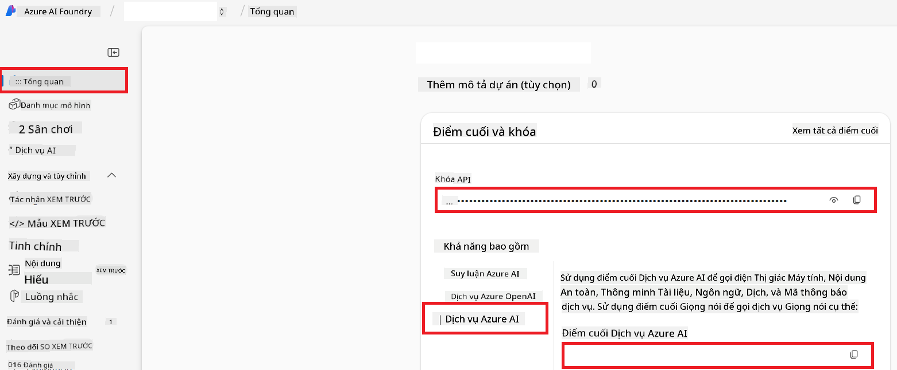

<!--
CO_OP_TRANSLATOR_METADATA:
{
  "original_hash": "b58d7c3cb4210697a073d20eb3064945",
  "translation_date": "2025-06-12T11:55:42+00:00",
  "source_file": "getting_started/set-up-azure-ai.md",
  "language_code": "vi"
}
-->
# Thiết lập Azure AI cho Co-op Translator (Azure OpenAI & Azure AI Vision)

Hướng dẫn này sẽ dẫn bạn qua các bước thiết lập Azure OpenAI cho dịch ngôn ngữ và Azure Computer Vision để phân tích nội dung hình ảnh (sau đó có thể dùng cho dịch dựa trên hình ảnh) trong Azure AI Foundry.

**Yêu cầu trước:**
- Một tài khoản Azure với đăng ký hoạt động.
- Quyền đủ để tạo tài nguyên và triển khai trong đăng ký Azure của bạn.

## Tạo một Dự án Azure AI

Bạn sẽ bắt đầu bằng cách tạo một Dự án Azure AI, nơi trung tâm để quản lý các tài nguyên AI của bạn.

1. Truy cập [https://ai.azure.com](https://ai.azure.com) và đăng nhập bằng tài khoản Azure của bạn.

1. Chọn **+Create** để tạo dự án mới.

1. Thực hiện các bước sau:
   - Nhập **Project name** (ví dụ: `CoopTranslator-Project`).
   - Chọn **AI hub** (ví dụ: `CoopTranslator-Hub`) (Tạo mới nếu cần).

1. Nhấn "**Review and Create**" để thiết lập dự án. Bạn sẽ được chuyển đến trang tổng quan dự án.

## Thiết lập Azure OpenAI cho Dịch Ngôn ngữ

Trong dự án, bạn sẽ triển khai mô hình Azure OpenAI để làm backend cho việc dịch văn bản.

### Truy cập Dự án của bạn

Nếu chưa ở đó, mở dự án mới tạo (ví dụ `CoopTranslator-Project`) trong Azure AI Foundry.

### Triển khai Mô hình OpenAI

1. Từ menu bên trái của dự án, dưới "My assets", chọn "**Models + endpoints**".

1. Chọn **+ Deploy model**.

1. Chọn **Deploy Base Model**.

1. Bạn sẽ thấy danh sách các mô hình có sẵn. Lọc hoặc tìm kiếm mô hình GPT phù hợp. Chúng tôi khuyên dùng `gpt-4o`.

1. Chọn mô hình mong muốn và nhấn **Confirm**.

1. Chọn **Deploy**.

### Cấu hình Azure OpenAI

Sau khi triển khai, bạn có thể chọn triển khai từ trang "**Models + endpoints**" để lấy **REST endpoint URL**, **Key**, **Deployment name**, **Model name** và **API version**. Những thông tin này cần để tích hợp mô hình dịch vào ứng dụng của bạn.

> [!NOTE]
> Bạn có thể chọn phiên bản API từ trang [API version deprecation](https://learn.microsoft.com/azure/ai-services/openai/api-version-deprecation) dựa trên nhu cầu. Lưu ý rằng **API version** khác với **Model version** hiển thị trên trang **Models + endpoints** trong Azure AI Foundry.

## Thiết lập Azure Computer Vision cho Dịch Hình ảnh

Để kích hoạt dịch văn bản trong hình ảnh, bạn cần lấy API Key và Endpoint của Azure AI Service.

1. Truy cập dự án Azure AI của bạn (ví dụ `CoopTranslator-Project`). Đảm bảo bạn đang ở trang tổng quan dự án.

### Cấu hình Azure AI Service

Tìm API Key và Endpoint từ Azure AI Service.

1. Truy cập dự án Azure AI của bạn (ví dụ `CoopTranslator-Project`). Đảm bảo bạn đang ở trang tổng quan dự án.

1. Tìm **API Key** và **Endpoint** trong tab Azure AI Service.

    

Kết nối này giúp các tính năng của tài nguyên Azure AI Services liên kết (bao gồm phân tích hình ảnh) có thể sử dụng trong dự án AI Foundry của bạn. Bạn có thể dùng kết nối này trong notebook hoặc ứng dụng để trích xuất văn bản từ hình ảnh, sau đó gửi cho mô hình Azure OpenAI để dịch.

## Tổng hợp Thông tin Đăng nhập của bạn

Đến đây, bạn đã thu thập được các thông tin sau:

**Cho Azure OpenAI (Dịch Văn bản):**
- Azure OpenAI Endpoint
- Azure OpenAI API Key
- Azure OpenAI Model Name (ví dụ `gpt-4o`)
- Azure OpenAI Deployment Name (ví dụ `cooptranslator-gpt4o`)
- Azure OpenAI API Version

**Cho Azure AI Services (Trích xuất Văn bản từ Hình ảnh qua Vision):**
- Azure AI Service Endpoint
- Azure AI Service API Key

### Ví dụ: Cấu hình Biến Môi trường (Xem trước)

Sau này, khi xây dựng ứng dụng, bạn có thể cấu hình bằng cách dùng các thông tin đăng nhập đã thu thập. Ví dụ, bạn có thể thiết lập biến môi trường như sau:

```bash
# Azure AI Service Credentials (Required for image translation)
AZURE_AI_SERVICE_API_KEY="your_azure_ai_service_api_key" # e.g., 21xasd...
AZURE_AI_SERVICE_ENDPOINT="https://your_azure_ai_service_endpoint.cognitiveservices.azure.com/"

# Azure OpenAI Credentials (Required for text translation)
AZURE_OPENAI_API_KEY="your_azure_openai_api_key" # e.g., 21xasd...
AZURE_OPENAI_ENDPOINT="https://your_azure_openai_endpoint.openai.azure.com/"
AZURE_OPENAI_MODEL_NAME="your_model_name" # e.g., gpt-4o
AZURE_OPENAI_CHAT_DEPLOYMENT_NAME="your_deployment_name" # e.g., cooptranslator-gpt4o
AZURE_OPENAI_API_VERSION="your_api_version" # e.g., 2024-12-01-preview
```

---

### Đọc thêm

- [How to Create a project in Azure AI Foundry](https://learn.microsoft.com/azure/ai-foundry/how-to/create-projects?tabs=ai-studio)
- [How to Create Azure AI resources](https://learn.microsoft.com/azure/ai-foundry/how-to/create-azure-ai-resource?tabs=portal)
- [How to Deploy OpenAI models in Azure AI Foundry](https://learn.microsoft.com/en-us/azure/ai-foundry/how-to/deploy-models-openai)

**Tuyên bố từ chối trách nhiệm**:  
Tài liệu này đã được dịch bằng dịch vụ dịch thuật AI [Co-op Translator](https://github.com/Azure/co-op-translator). Mặc dù chúng tôi cố gắng đảm bảo độ chính xác, xin lưu ý rằng các bản dịch tự động có thể chứa lỗi hoặc sai sót. Tài liệu gốc bằng ngôn ngữ gốc nên được coi là nguồn tham khảo chính xác nhất. Đối với thông tin quan trọng, nên sử dụng dịch vụ dịch thuật chuyên nghiệp do con người thực hiện. Chúng tôi không chịu trách nhiệm về bất kỳ sự hiểu lầm hay giải thích sai nào phát sinh từ việc sử dụng bản dịch này.