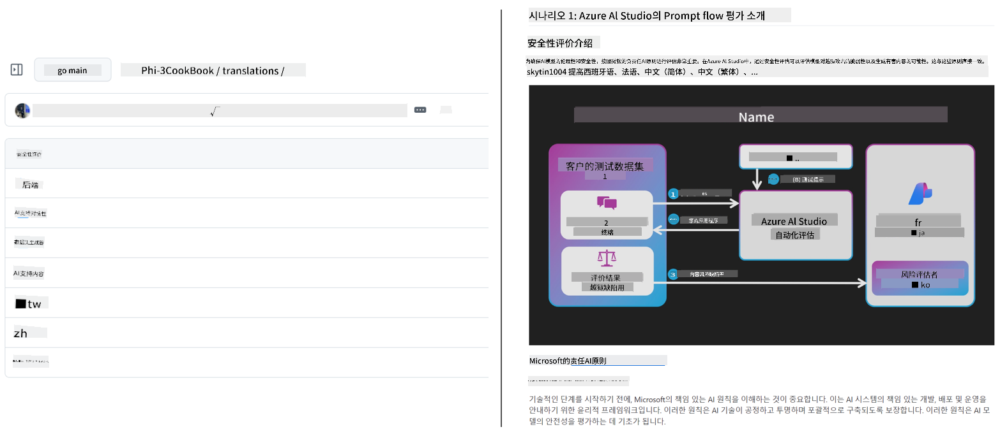
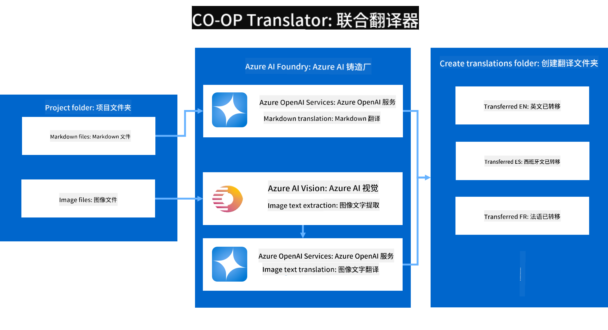

<!--
CO_OP_TRANSLATOR_METADATA:
{
  "original_hash": "044724537b57868117aadae8e7728c7c",
  "translation_date": "2025-06-12T09:58:41+00:00",
  "source_file": "README.md",
  "language_code": "zh"
}
-->


# Co-op Translator：轻松实现教育文档的自动翻译

_轻松将您的文档自动翻译成多种语言，覆盖全球受众。_

[](https://pypi.org/project/co-op-translator/)
[](https://github.com/azure/co-op-translator/blob/main/LICENSE)
[](https://pepy.tech/project/co-op-translator)
[](https://pepy.tech/project/co-op-translator)
[](https://github.com/psf/black)

[](https://GitHub.com/azure/co-op-translator/graphs/contributors/)
[](https://GitHub.com/azure/co-op-translator/issues/)
[](https://GitHub.com/azure/co-op-translator/pulls/)
[](http://makeapullrequest.com)

### 由 Co-op Translator 提供支持的语言列表
[法语](../fr/README.md) | [西班牙语](../es/README.md) | [德语](../de/README.md) | [俄语](../ru/README.md) | [阿拉伯语](../ar/README.md) | [波斯语 (法尔西语)](../fa/README.md) | [乌尔都语](../ur/README.md) | [中文 (简体)](./README.md) | [中文 (繁体，澳门)](../mo/README.md) | [中文 (繁体，香港)](../hk/README.md) | [中文 (繁体，台湾)](../tw/README.md) | [日语](../ja/README.md) | [韩语](../ko/README.md) | [印地语](../hi/README.md) | [孟加拉语](../bn/README.md) | [马拉地语](../mr/README.md) | [尼泊尔语](../ne/README.md) | [旁遮普语 (古鲁姆基)](../pa/README.md) | [葡萄牙语 (葡萄牙)](../pt/README.md) | [葡萄牙语 (巴西)](../br/README.md) | [意大利语](../it/README.md) | [波兰语](../pl/README.md) | [土耳其语](../tr/README.md) | [希腊语](../el/README.md) | [泰语](../th/README.md) | [瑞典语](../sv/README.md) | [丹麦语](../da/README.md) | [挪威语](../no/README.md) | [芬兰语](../fi/README.md) | [荷兰语](../nl/README.md) | [希伯来语](../he/README.md) | [越南语](../vi/README.md) | [印尼语](../id/README.md) | [马来语](../ms/README.md) | [他加禄语 (菲律宾语)](../tl/README.md) | [斯瓦希里语](../sw/README.md) | [匈牙利语](../hu/README.md) | [捷克语](../cs/README.md) | [斯洛伐克语](../sk/README.md) | [罗马尼亚语](../ro/README.md) | [保加利亚语](../bg/README.md) | [塞尔维亚语 (西里尔字母)](../sr/README.md) | [克罗地亚语](../hr/README.md) | [斯洛文尼亚语](../sl/README.md) | [乌克兰语](../uk/README.md) | [缅甸语 (缅甸)](../my/README.md)
> [!NOTE]
> 这些是本仓库当前内容的翻译版本。有关 Co-op Translator 支持的完整语言列表，请参见[语言支持](../..)部分。

[](https://GitHub.com/azure/co-op-translator/watchers/)
[](https://GitHub.com/azure/co-op-translator/network/)
[](https://GitHub.com/azure/co-op-translator/stargazers/)

[](https://discord.com/invite/ByRwuEEgH4)

[](https://codespaces.new/azure/co-op-translator)
[](https://vscode.dev/redirect?url=vscode://ms-vscode-remote.remote-containers/cloneInVolume?url=https://github.com/azure/co-op-translator)

## 概览：简化您的教育内容翻译流程

语言障碍极大地限制了全球学习者和开发者获取宝贵教育资源与技术知识的机会。这不仅影响了参与度，也减缓了全球创新和学习的步伐。

**Co-op Translator** 诞生于解决微软自身大型教育系列（如“入门指南”）手动翻译效率低下的问题。它已发展成一款易用且强大的工具，旨在为所有人打破语言障碍。通过命令行界面和 GitHub Actions 提供高质量的自动翻译，Co-op Translator 使教育者、学生、研究人员和开发者能够无语言限制地分享和获取知识。

看看 Co-op Translator 如何组织翻译后的教育内容：



Markdown 文件和图片中的文本会自动翻译，并整齐地归档到特定语言的文件夹中。

**今天就用 Co-op Translator 打开您教育内容的全球通道吧！**

## 支持微软学习资源的全球访问

Co-op Translator 助力微软关键教育项目跨越语言鸿沟，自动化为全球开发者社区服务的仓库翻译流程。目前使用 Co-op Translator 的项目示例包括：

[](https://github.com/microsoft/Generative-AI-for-beginners)
[](https://github.com/microsoft/ML-For-Beginners)
[](https://github.com/microsoft/AI-For-Beginners)
[](https://github.com/microsoft/ai-agents-for-beginners)
[](https://github.com/microsoft/PhiCookBook)
[](https://github.com/microsoft/Generative-AI-for-beginners-dotnet)

## 主要功能

- **自动翻译**：轻松将文本翻译成多种语言。
- **GitHub Actions 集成**：将翻译自动化纳入您的 CI/CD 流程。
- **Markdown 语法保留**：翻译过程中保持正确的 Markdown 格式。
- **图片文本翻译**：提取并翻译图片中的文字。
- **先进的 LLM 技术**：使用最前沿的语言模型实现高质量翻译。
- **易于集成**：无缝融入现有项目架构。
- **简化本地化**：优化项目国际化流程。

## 工作原理



Co-op Translator 会处理项目文件夹中的 Markdown 文件和图片，流程如下：

1. **文本提取**：从 Markdown 文件中提取文本，若配置了（例如使用 Azure AI Vision），还会提取图片中的嵌入文本。
1. **AI 翻译**：将提取的文本发送到配置的语言模型（Azure OpenAI、OpenAI 等）进行翻译。
1. **结果保存**：将翻译后的 Markdown 文件和图片（带翻译文本）保存到对应语言的文件夹中，保持原始格式不变。

## 快速开始

您可以通过命令行快速开始，或使用 GitHub Actions 实现完全自动化。根据您的工作流程选择合适方式：

1. **命令行 (CLI)** — 适合一次性翻译或手动控制
2. **GitHub Actions** — 每次推送时自动翻译

> [!NOTE]
> 本教程以 Azure 资源为例，但您也可以使用任何支持的语言模型。

### 语言支持

Co-op Translator 支持多种语言，助您触达全球受众。以下是相关信息：

#### 快速参考

| 语言 | 代码 | 语言 | 代码 | 语言 | 代码 |
|----------|------|----------|------|----------|------|
| 阿拉伯语 | ar | 孟加拉语 | bn | 保加利亚语 | bg |
| 缅甸语（缅甸） | my | 中文（简体） | zh | 中文（繁体，香港） | hk |
| 中文（繁体，澳门） | mo | 中文（繁体，台湾） | tw | 克罗地亚语 | hr |
| 捷克语 | cs | 丹麦语 | da | 荷兰语 | nl |
| 芬兰语 | fi | 法语 | fr | 德语 | de |
| 希腊语 | el | 希伯来语 | he | 印地语 | hi |
| 匈牙利语 | hu | 印度尼西亚语 | id | 意大利语 | it |
| 日语 | ja | 韩语 | ko | 马来语 | ms |
| 马拉地语 | mr | 尼泊尔语 | ne | 挪威语 | no |
| 波斯语（法尔西语） | fa | 波兰语 | pl | 葡萄牙语（巴西） | br |
| 葡萄牙语（葡萄牙） | pt | 旁遮普语（古鲁姆克希文） | pa | 罗马尼亚语 | ro |
| 俄语 | ru | 塞尔维亚语（西里尔文） | sr | 斯洛伐克语 | sk |
| 斯洛文尼亚语 | sl | 西班牙语 | es | 斯瓦希里语 | sw |
| 瑞典语 | sv | 他加禄语（菲律宾语） | tl | 泰语 | th |
| 土耳其语 | tr | 乌克兰语 | uk | 乌尔都语 | ur |
| 越南语 | vi | — | — | — | — |

#### 使用语言代码

使用 Co-op Translator 时，需通过语言代码指定目标语言。例如：

```bash
# Translate to French, Spanish, and German
translate -l "fr es de"

# Translate to Chinese (Simplified) and Japanese
translate -l "zh ja"
```

> [!NOTE]
> 有关语言支持的详细技术信息，包括：
>
> - 各语言字体规格
> - 已知问题
> - 如何添加新语言
>
> 请参见我们的[支持语言文档](./getting_started/supported-languages.md)。

### 支持的模型和服务

| 类型                  | 名称                           |
|-----------------------|--------------------------------|
| 语言模型              |   |
| AI 视觉               |  |

> [!NOTE]
> 如果没有 AI 视觉服务，co-op translator 会自动切换到[仅 Markdown 模式](./getting_started/markdown-only-mode.md)。

### 初始设置

开始前，您需要准备以下资源：

1. 语言模型资源（必需）：
   - Azure OpenAI（推荐）— 提供高质量且企业级可靠的翻译
   - OpenAI — 如果无法访问 Azure，可作为备选
   - 详细支持模型信息见[支持的模型和服务](../..)

1. AI 视觉资源（可选）：
   - Azure AI Vision — 支持图片中嵌入文字的翻译
   - 若未配置，翻译器将自动使用[仅 Markdown 模式](./getting_started/markdown-only-mode.md)
   - 推荐用于包含需翻译文字的图片项目

1. 配置步骤：
   - 请参照我们的[Azure AI 设置指南](./getting_started/set-up-azure-ai.md)完成详细配置
   - 创建 `.env` 文件，填写您的 API 密钥和端点（详见[快速开始](../..)部分）
   - 确保您拥有所选服务的权限和配额

### 翻译前的项目准备

开始翻译前，请完成以下准备工作：

1. 准备您的 README：
   - 在 README.md 中添加翻译表，链接至各语言版本
   - 示例格式：

     ```markdown

     ### 🌐 Multi-Language Support
     
     [French](../fr/README.md) | [Spanish](../es/README.md) | [German](../de/README.md) | [Russian](../ru/README.md) | [Arabic](../ar/README.md) | [Persian (Farsi)](../fa/README.md) | [Urdu](../ur/README.md) | [Chinese (Simplified)](./README.md) | [Chinese (Traditional, Macau)](../mo/README.md) | [Chinese (Traditional, Hong Kong)](../hk/README.md) | [Chinese (Traditional, Taiwan)](../tw/README.md) | [Japanese](../ja/README.md) | [Korean](../ko/README.md) | [Hindi](../hi/README.md) | [Bengali](../bn/README.md) | [Marathi](../mr/README.md) | [Nepali](../ne/README.md) | [Punjabi (Gurmukhi)](../pa/README.md) | [Portuguese (Portugal)](../pt/README.md) | [Portuguese (Brazil)](../br/README.md) | [Italian](../it/README.md) | [Polish](../pl/README.md) | [Turkish](../tr/README.md) | [Greek](../el/README.md) | [Thai](../th/README.md) | [Swedish](../sv/README.md) | [Danish](../da/README.md) | [Norwegian](../no/README.md) | [Finnish](../fi/README.md) | [Dutch](../nl/README.md) | [Hebrew](../he/README.md) | [Vietnamese](../vi/README.md) | [Indonesian](../id/README.md) | [Malay](../ms/README.md) | [Tagalog (Filipino)](../tl/README.md) | [Swahili](../sw/README.md) | [Hungarian](../hu/README.md) | [Czech](../cs/README.md) | [Slovak](../sk/README.md) | [Romanian](../ro/README.md) | [Bulgarian](../bg/README.md) | [Serbian (Cyrillic)](../sr/README.md) | [Croatian](../hr/README.md) | [Slovenian](../sl/README.md) | [Ukrainian](../uk/README.md) | [Burmese (Myanmar)](../my/README.md) 
    
     ```

1. 清理现有翻译（如有需要）：
   - 删除已有的翻译文件夹（例如 `translations/`）
   - 删除旧翻译文件，确保从头开始
   - 避免与新翻译流程冲突

### 快速开始：命令行

快速使用命令行启动：

1. 创建虚拟环境：

    ```bash
    python -m venv .venv
    ```

1. 激活虚拟环境：

    - Windows 下：

    ```bash
    .venv\scripts\activate
    ```

    - Linux/macOS 下：

    ```bash
    source .venv/bin/activate
    ```

1. 安装软件包：

    ```bash
    pip install co-op-translator
    ```

1. 配置凭据：

    - 创建 `.env` file in your project's root directory.
    - Copy the contents from the [.env.template](../../.env.template) file into your new `.env` file.
    - Fill in the required API keys and endpoint information in your `.env` file.

1. Run Translation:
    - Navigate to your project's root directory in your terminal.
    - Execute the translate command, specifying target languages with the `-l` 标志：

    ```bash
    translate -l "ko ja fr"
    ```

_(替换 `"ko ja fr"` with your desired space-separated language codes)_

### Detailed Usage Guides

Choose the approach that best fits your workflow:

#### 1. Using the Command Line (CLI)

- Best for: One-time translations, manual control, or integration into custom scripts.
- Requires: Local installation of Python and the `co-op-translator` package.
- Guide: [Command Line Guide](./getting_started/command-line-guide/command-line-guide.md)

#### 2. Using GitHub Actions (Automation)

- Best for: Automatically translating content whenever changes are pushed to your repository. Keeps translations consistently up-to-date.
- Requires: Setting up a workflow file (`.github/workflows`)，无需本地安装。  
- 指南：  
  - [GitHub Actions 指南（公共仓库与标准 Secrets）](./getting_started/github-actions-guide/github-actions-guide-public.md) — 适用于大多数公共或个人仓库，使用标准仓库 Secrets。  
  - [GitHub Actions 指南（微软组织仓库与组织级配置）](./getting_started/github-actions-guide/github-actions-guide-org.md) — 如果您在微软 GitHub 组织内工作，或需要使用组织级 Secrets 或运行器，请参考此指南。

### 故障排除与技巧

- [故障排除指南](./getting_started/troubleshooting.md)

### 其他资源

- [命令参考](./getting_started/command-reference.md)：所有可用命令和选项的详细说明。
- [支持语言](./getting_started/supported-languages.md)：查看支持语言列表及新增语言指南。
- [仅 Markdown 模式](./getting_started/markdown-only-mode.md)：仅翻译文本，不翻译图片的使用方法。

## 视频演示

通过我们的演示了解更多关于 Co-op Translator 的内容 _(点击下方图片，在 YouTube 观看)_：

- **Open at Microsoft**：18 分钟简短介绍和快速使用指南。
[](https://www.youtube.com/watch?v=jX_swfH_KNU)

## 支持我们，促进全球学习

加入我们，一起革新教育内容的全球分享方式！在 GitHub 上为 [Co-op Translator](https://github.com/azure/co-op-translator) 点⭐，支持我们打破学习和技术中的语言障碍。您的关注和贡献意义重大！我们欢迎代码贡献和功能建议。

## 贡献指南

本项目欢迎贡献和建议。想为 Azure Co-op Translator 贡献力量吗？请查看我们的 [CONTRIBUTING.md](./CONTRIBUTING.md)，了解如何帮助让 Co-op Translator 更加易用。

## 贡献者

[](https://github.com/Azure/co-op-translator/graphs/contributors)

## 行为准则

本项目采用了 [Microsoft Open Source Code of Conduct](https://opensource.microsoft.com/codeofconduct/)。
欲了解更多信息，请参阅 [行为准则常见问题](https://opensource.microsoft.com/codeofconduct/faq/) 或通过邮件联系 [opencode@microsoft.com](mailto:opencode@microsoft.com) 以获取更多问题或建议。

## 负责任的 AI

微软致力于帮助客户负责任地使用我们的 AI 产品，分享我们的经验，并通过透明度说明和影响评估等工具建立基于信任的合作关系。许多资源可在 [https://aka.ms/RAI](https://aka.ms/RAI) 找到。
微软的负责任 AI 方法基于我们的 AI 原则：公平性、可靠性和安全性、隐私和安全性、包容性、透明度和问责制。

大规模自然语言、图像和语音模型——如本示例中使用的模型——可能会出现不公平、不可靠或冒犯性的行为，从而造成伤害。请查阅 [Azure OpenAI service Transparency note](https://learn.microsoft.com/legal/cognitive-services/openai/transparency-note?tabs=text)，了解相关风险和限制。

减轻这些风险的推荐方法是在架构中包含安全系统，能够检测和防止有害行为。[Azure AI Content Safety](https://learn.microsoft.com/azure/ai-services/content-safety/overview) 提供独立的保护层，能够检测应用和服务中的用户生成和 AI 生成的有害内容。Azure AI Content Safety 包含文本和图像 API，帮助检测有害内容。我们还提供互动式 Content Safety Studio，允许您查看、探索并试用跨多种模态检测有害内容的示例代码。以下 [快速入门文档](https://learn.microsoft.com/azure/ai-services/content-safety/quickstart-text?tabs=visual-studio%2Clinux&pivots=programming-language-rest) 指导您如何向服务发起请求。

另一个需要考虑的方面是整体应用性能。对于多模态和多模型应用，我们认为性能意味着系统表现符合您和用户的预期，包括不产生有害输出。评估整体应用性能时，重要的是使用 [生成质量及风险和安全指标](https://learn.microsoft.com/azure/ai-studio/concepts/evaluation-metrics-built-in)。

您可以在开发环境中使用 [prompt flow SDK](https://microsoft.github.io/promptflow/index.html) 评估您的 AI 应用。无论是测试数据集还是目标，您的生成式 AI 应用的生成结果都可以通过内置评估器或您选择的自定义评估器进行定量测量。想要开始使用 prompt flow sdk 评估系统，可以参考 [快速入门指南](https://learn.microsoft.com/azure/ai-studio/how-to/develop/flow-evaluate-sdk)。执行评估后，您可以在 [Azure AI Studio](https://learn.microsoft.com/azure/ai-studio/how-to/evaluate-flow-results) 中可视化结果。

## 商标

本项目可能包含项目、产品或服务的商标或标志。微软商标或标志的授权使用须遵守并遵循 [Microsoft's Trademark & Brand Guidelines](https://www.microsoft.com/en-us/legal/intellectualproperty/trademarks/usage/general)。
在本项目的修改版本中使用微软商标或标志不得引起混淆或暗示微软的赞助。
任何第三方商标或标志的使用均须遵守相应第三方的政策。

**免责声明**：  
本文件使用 AI 翻译服务 [Co-op Translator](https://github.com/Azure/co-op-translator) 进行翻译。虽然我们努力确保翻译的准确性，但请注意，自动翻译可能存在错误或不准确之处。原始文件的母语版本应被视为权威来源。对于重要信息，建议采用专业人工翻译。对于因使用本翻译而产生的任何误解或误释，我们概不负责。