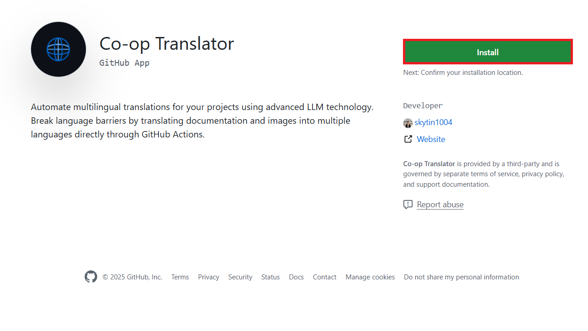

<!--
CO_OP_TRANSLATOR_METADATA:
{
  "original_hash": "9fac847815936ef6e6c8bfde6d191571",
  "translation_date": "2025-10-15T02:27:54+00:00",
  "source_file": "getting_started/github-actions-guide/github-actions-guide-org.md",
  "language_code": "zh"
}
-->
# 使用 Co-op Translator GitHub Action（组织指南）

**目标读者：** 本指南适用于**微软内部用户**或**拥有预置 Co-op Translator GitHub App 所需凭据**的团队，或能够自行创建自定义 GitHub App 的团队。

通过 Co-op Translator GitHub Action，您可以轻松自动化仓库文档的翻译。当您的源 Markdown 文件或图片发生更改时，该 Action 会自动创建包含最新翻译内容的拉取请求。以下是详细的配置步骤。

> [!IMPORTANT]
>
> **选择合适的指南：**
>
> 本指南介绍了使用**GitHub App ID 和私钥**的配置方法。通常在以下情况下需要使用本“组织指南”方法：**`GITHUB_TOKEN` 权限受限：** 如果您的组织或仓库设置限制了标准 `GITHUB_TOKEN` 的默认权限（如不允许 `contents: write` 或 `pull-requests: write`），则[公共设置指南](./github-actions-guide-public.md)中的工作流会因权限不足而失败。此时，使用专门的 GitHub App 并明确授予所需权限可以绕过该限制。
>
> **如果上述情况不适用：**
>
> 如果您的仓库中的标准 `GITHUB_TOKEN` 权限充足（即未受组织限制），请使用**[公共设置指南（使用 GITHUB_TOKEN）](./github-actions-guide-public.md)**。公共指南无需获取或管理 App ID 或私钥，仅依赖标准 `GITHUB_TOKEN` 和仓库权限。

## 前置条件

在配置 GitHub Action 之前，请确保您已准备好所需的 AI 服务凭据。

**1. 必需：AI 语言模型凭据**
您需要至少一种受支持的语言模型的凭据：

- **Azure OpenAI**：需要 Endpoint、API Key、模型/部署名称、API 版本。
- **OpenAI**：需要 API Key，（可选：Org ID、Base URL、Model ID）。
- 详细信息请参见 [支持的模型和服务](../../../../README.md)。
- 配置指南：[设置 Azure OpenAI](../set-up-resources/set-up-azure-openai.md)。

**2. 可选：计算机视觉凭据（用于图片翻译）**

- 仅在需要翻译图片中的文本时才需要。
- **Azure Computer Vision**：需要 Endpoint 和订阅密钥。
- 如果未提供，将默认进入[仅 Markdown 模式](../markdown-only-mode.md)。
- 配置指南：[设置 Azure Computer Vision](../set-up-resources/set-up-azure-computer-vision.md)。

## 配置步骤

请按照以下步骤在您的仓库中配置 Co-op Translator GitHub Action：

### 步骤 1：安装并配置 GitHub App 认证

该工作流通过 GitHub App 认证安全地与您的仓库交互（如创建拉取请求）。请选择以下其中一种方式：

#### **方式 A：安装预置的 Co-op Translator GitHub App（仅限微软内部）**

1. 访问 [Co-op Translator GitHub App](https://github.com/apps/co-op-translator) 页面。

1. 选择**安装**，并选择您的目标仓库所在的账号或组织。

    

1. 选择**仅选择仓库**，并勾选您的目标仓库（如 `PhiCookBook`）。点击**安装**。可能需要进行身份验证。

    

1. **获取 App 凭据（需内部流程）：** 为了让工作流以 App 身份认证，您需要从 Co-op Translator 团队获取以下两项信息：
   - **App ID：** Co-op Translator App 的唯一标识。App ID 为：`1164076`。
   - **私钥：** 您需要从维护者处获取 `.pem` 私钥文件的**完整内容**。**请像保护密码一样妥善保管此密钥。**

1. 继续执行步骤 2。

#### **方式 B：使用自定义 GitHub App**

- 如果您愿意，也可以自行创建并配置 GitHub App。请确保其拥有对 Contents 和 Pull requests 的读写权限。您需要获取其 App ID 和生成的私钥。

### 步骤 2：配置仓库密钥

您需要将 GitHub App 凭据和 AI 服务凭据作为加密密钥添加到仓库设置中。

1. 进入您的目标 GitHub 仓库（如 `PhiCookBook`）。

1. 打开**设置** > **Secrets and variables** > **Actions**。

1. 在**Repository secrets** 下，为下表中的每个密钥点击**New repository secret**。

   

**必需密钥（用于 GitHub App 认证）：**

| 密钥名称              | 描述                                         | 来源                                         |
| :------------------- | :------------------------------------------- | :------------------------------------------- |
| `GH_APP_ID`          | GitHub App 的 App ID（见步骤 1）             | GitHub App 设置                              |
| `GH_APP_PRIVATE_KEY` | 下载的 `.pem` 文件的**完整内容**              | `.pem` 文件（见步骤 1）                      |

**AI 服务密钥（根据前置条件添加所有适用项）：**

| 密钥名称                             | 描述                                   | 来源                         |
| :---------------------------------- | :------------------------------------ | :--------------------------- |
| `AZURE_AI_SERVICE_API_KEY`            | Azure AI 服务（计算机视觉）的密钥         | Azure AI Foundry                |
| `AZURE_AI_SERVICE_ENDPOINT`         | Azure AI 服务（计算机视觉）的 Endpoint    | Azure AI Foundry                |
| `AZURE_OPENAI_API_KEY`              | Azure OpenAI 服务的密钥                  | Azure AI Foundry                |
| `AZURE_OPENAI_ENDPOINT`             | Azure OpenAI 服务的 Endpoint             | Azure AI Foundry                |
| `AZURE_OPENAI_MODEL_NAME`           | Azure OpenAI 模型名称                    | Azure AI Foundry                |
| `AZURE_OPENAI_CHAT_DEPLOYMENT_NAME` | Azure OpenAI 部署名称                    | Azure AI Foundry                |
| `AZURE_OPENAI_API_VERSION`          | Azure OpenAI 的 API 版本                 | Azure AI Foundry                |
| `OPENAI_API_KEY`                    | OpenAI 的 API Key                        | OpenAI Platform              |
| `OPENAI_ORG_ID`                     | OpenAI 组织 ID                           | OpenAI Platform              |
| `OPENAI_CHAT_MODEL_ID`              | 指定的 OpenAI 模型 ID                     | OpenAI Platform                |
| `OPENAI_BASE_URL`                   | 自定义 OpenAI API Base URL                | OpenAI Platform                |


### 步骤 3：创建工作流文件

最后，创建定义自动化工作流的 YAML 文件。

1. 在仓库根目录下创建 `.github/workflows/` 目录（如尚未存在）。

1. 在 `.github/workflows/` 目录下创建名为 `co-op-translator.yml` 的文件。

1. 将以下内容粘贴到 co-op-translator.yml 文件中。

```
name: Co-op Translator

on:
  push:
    branches:
      - main

jobs:
  co-op-translator:
    runs-on: ubuntu-latest

    permissions:
      contents: write
      pull-requests: write

    steps:
      - name: Checkout repository
        uses: actions/checkout@v4
        with:
          fetch-depth: 0

      - name: Set up Python
        uses: actions/setup-python@v4
        with:
          python-version: '3.10'

      - name: Install Co-op Translator
        run: |
          python -m pip install --upgrade pip
          pip install co-op-translator

      - name: Run Co-op Translator
        env:
          PYTHONIOENCODING: utf-8
          # Azure AI Service Credentials
          AZURE_AI_SERVICE_API_KEY: ${{ secrets.AZURE_AI_SERVICE_API_KEY }}
          AZURE_AI_SERVICE_ENDPOINT: ${{ secrets.AZURE_AI_SERVICE_ENDPOINT }}

          # Azure OpenAI Credentials
          AZURE_OPENAI_API_KEY: ${{ secrets.AZURE_OPENAI_API_KEY }}
          AZURE_OPENAI_ENDPOINT: ${{ secrets.AZURE_OPENAI_ENDPOINT }}
          AZURE_OPENAI_MODEL_NAME: ${{ secrets.AZURE_OPENAI_MODEL_NAME }}
          AZURE_OPENAI_CHAT_DEPLOYMENT_NAME: ${{ secrets.AZURE_OPENAI_CHAT_DEPLOYMENT_NAME }}
          AZURE_OPENAI_API_VERSION: ${{ secrets.AZURE_OPENAI_API_VERSION }}

          # OpenAI Credentials
          OPENAI_API_KEY: ${{ secrets.OPENAI_API_KEY }}
          OPENAI_ORG_ID: ${{ secrets.OPENAI_ORG_ID }}
          OPENAI_CHAT_MODEL_ID: ${{ secrets.OPENAI_CHAT_MODEL_ID }}
          OPENAI_BASE_URL: ${{ secrets.OPENAI_BASE_URL }}
        run: |
          # =====================================================================
          # IMPORTANT: Set your target languages here (REQUIRED CONFIGURATION)
          # =====================================================================
          # Example: Translate to Spanish, French, German. Add -y to auto-confirm.
          translate -l "es fr de" -y  # <--- MODIFY THIS LINE with your desired languages

      - name: Authenticate GitHub App
        id: generate_token
        uses: tibdex/github-app-token@v1
        with:
          app_id: ${{ secrets.GH_APP_ID }}
          private_key: ${{ secrets.GH_APP_PRIVATE_KEY }}

      - name: Create Pull Request with translations
        uses: peter-evans/create-pull-request@v5
        with:
          token: ${{ steps.generate_token.outputs.token }}
          commit-message: "🌐 Update translations via Co-op Translator"
          title: "🌐 Update translations via Co-op Translator"
          body: |
            This PR updates translations for recent changes to the main branch.

            ### 📋 Changes included
            - Translated contents are available in the `translations/` directory
            - Translated images are available in the `translated_images/` directory

            ---
            🌐 Automatically generated by the [Co-op Translator](https://github.com/Azure/co-op-translator) GitHub Action.
          branch: update-translations
          base: main
          labels: translation, automated-pr
          delete-branch: true
          add-paths: |
            translations/
            translated_images/

```

4.  **自定义工作流：**
   - **[!IMPORTANT] 目标语言：** 在 `Run Co-op Translator` 步骤中，您**必须检查并修改** `translate -l "..." -y` 命令中的语言代码列表，以符合您的项目需求。示例列表（`ar de es...`）需要根据实际情况替换或调整。
   - **触发器（`on:`）：** 当前设置为每次推送到 `main` 分支时触发。对于大型仓库，建议添加 `paths:` 过滤器（见 YAML 中的注释示例），仅在相关文件（如源文档）变更时运行工作流，以节省运行时间。
   - **PR 详情：** 如有需要，可自定义 `commit-message`、`title`、`body`、`branch` 名称和 `labels`。

## 凭据管理与更新

- **安全性：** 始终将敏感凭据（API 密钥、私钥）存储为 GitHub Actions 密钥。切勿在工作流文件或仓库代码中明文暴露。
- **[!IMPORTANT] 密钥更新（微软内部用户）：** 请注意，微软内部使用的 Azure OpenAI 密钥可能有强制更新政策（如每 5 个月）。请务必在密钥到期前及时更新对应的 GitHub 密钥（`AZURE_OPENAI_...`），以避免工作流失败。

## 运行工作流

> [!WARNING]  
> **GitHub 托管 Runner 时间限制：**  
> GitHub 托管的 runner（如 `ubuntu-latest`）**最长执行时间为 6 小时**。  
> 对于大型文档仓库，如果翻译过程超过 6 小时，工作流将被自动终止。  
> 为避免此问题，建议：  
> - 使用**自托管 runner**（无时间限制）  
> - 每次运行时减少目标语言数量

当 `co-op-translator.yml` 文件合并到主分支（或 `on:` 触发器指定的分支）后，每当有变更推送到该分支（并符合 `paths` 过滤条件，如已配置），工作流将自动运行。

如果生成或更新了翻译内容，Action 会自动创建包含更改的拉取请求，等待您审核和合并。

---

**免责声明**：
本文件由 AI 翻译服务 [Co-op Translator](https://github.com/Azure/co-op-translator) 翻译。我们力求准确，但请注意，自动翻译可能包含错误或不准确之处。原始语言版本应被视为权威来源。对于关键信息，建议使用专业人工翻译。因使用本翻译而产生的任何误解或误读，我们概不负责。