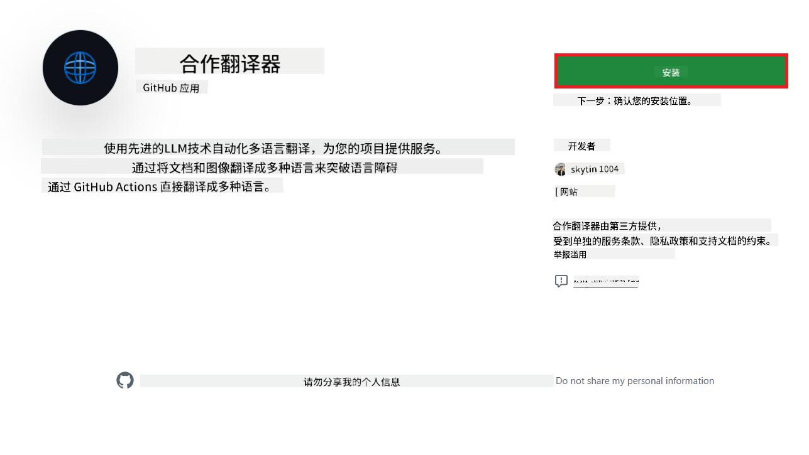
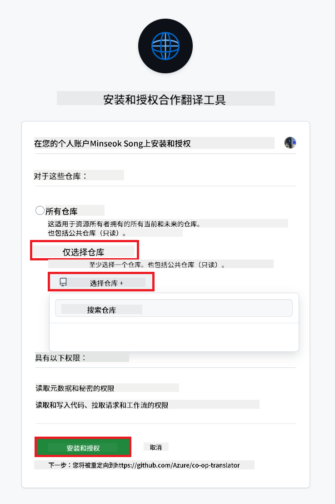
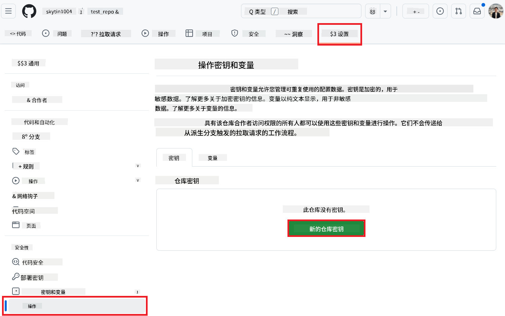
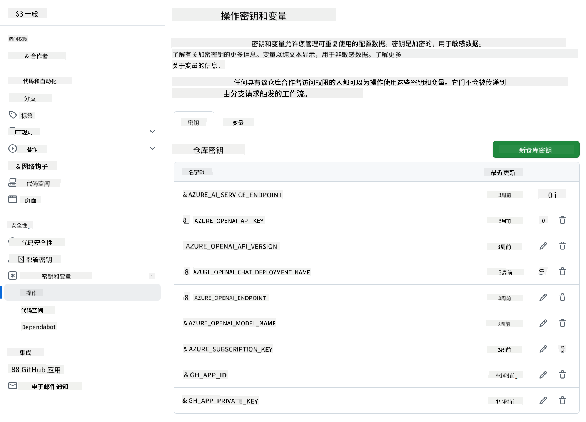

<!--
CO_OP_TRANSLATOR_METADATA:
{
  "original_hash": "c437820027c197f25fb2cbee95bae28c",
  "translation_date": "2025-06-12T19:02:19+00:00",
  "source_file": "getting_started/github-actions-guide/github-actions-guide-org.md",
  "language_code": "zh"
}
-->
# 使用 Co-op Translator GitHub Action（组织指南）

**目标受众：** 本指南面向**微软内部用户**或**拥有预构建 Co-op Translator GitHub App 所需凭据的团队**，或能够创建自定义 GitHub App 的团队。

使用 Co-op Translator GitHub Action，轻松实现仓库文档的自动翻译。本指南将指导你设置该 Action，当源 Markdown 文件或图片发生变化时，自动创建包含更新翻译的拉取请求。

> [!IMPORTANT]
> 
> **选择合适的指南：**
>
> 本指南介绍使用**GitHub App ID 和私钥**的设置方法。如果你的情况符合以下条件，通常需要采用“组织指南”方法：**`GITHUB_TOKEN` 权限受限：** 你的组织或仓库设置限制了标准 `GITHUB_TOKEN` 默认授予的权限。特别是，如果 `GITHUB_TOKEN` 无法获得必要的 `write` 权限（如 `contents: write` 或 `pull-requests: write`），则[公共设置指南](./github-actions-guide-public.md)中的工作流将因权限不足而失败。使用专用的 GitHub App 并显式授予权限可以绕过此限制。
>
> **如果上述情况不适用：**
>
> 如果标准 `GITHUB_TOKEN` 在你的仓库中权限充足（即未受组织限制），请使用**[使用 GITHUB_TOKEN 的公共设置指南](./github-actions-guide-public.md)**。公共指南无需获取或管理 App ID 和私钥，仅依赖标准 `GITHUB_TOKEN` 和仓库权限。

## 前提条件

在配置 GitHub Action 之前，请确保你已准备好所需的 AI 服务凭据。

**1. 必需：AI 语言模型凭据**  
你需要至少一个支持的语言模型凭据：

- **Azure OpenAI**：需要 Endpoint、API Key、模型/部署名称、API 版本。  
- **OpenAI**：需要 API Key，（可选：Org ID、Base URL、模型 ID）。  
- 详情见 [支持的模型和服务](../../../../README.md)。  
- 设置指南：[设置 Azure OpenAI](../set-up-resources/set-up-azure-openai.md)。

**2. 可选：计算机视觉凭据（用于图像翻译）**

- 仅当需要翻译图片中的文本时才需提供。  
- **Azure 计算机视觉**：需要 Endpoint 和订阅密钥。  
- 若未提供，Action 将默认使用[仅 Markdown 模式](../markdown-only-mode.md)。  
- 设置指南：[设置 Azure 计算机视觉](../set-up-resources/set-up-azure-computer-vision.md)。

## 安装与配置

按照以下步骤在你的仓库中配置 Co-op Translator GitHub Action：

### 第一步：安装并配置 GitHub App 认证

该工作流使用 GitHub App 认证，安全地代表你与仓库交互（例如创建拉取请求）。请选择以下方案之一：

#### **方案 A：安装预构建的 Co-op Translator GitHub App（仅限微软内部使用）**

1. 访问 [Co-op Translator GitHub App](https://github.com/apps/co-op-translator) 页面。

2. 点击 **Install**，选择你的目标仓库所在的账户或组织。

    

3. 选择 **Only select repositories**，选中你的目标仓库（例如 `PhiCookBook`），点击 **Install**。可能需要进行身份验证。

    

4. **获取 App 凭据（需内部流程）：** 为允许工作流以该 App 身份认证，你需要 Co-op Translator 团队提供两项信息：  
   - **App ID：** Co-op Translator 应用的唯一标识，App ID 为：`1164076`。  
   - **私钥：** 你必须从维护联系人处获取 `.pem` 私钥文件的**完整内容**。**请像保管密码一样妥善保管该密钥。**

5. 继续执行步骤二。

#### **方案 B：使用自定义 GitHub App**

- 如果你愿意，也可以创建并配置自己的 GitHub App，确保其对 Contents 和 Pull requests 具有读写权限。你需要该 App 的 App ID 和生成的私钥。

### 第二步：配置仓库 Secrets

你需要在仓库设置中将 GitHub App 凭据和 AI 服务凭据作为加密 Secrets 添加。

1. 进入你的目标 GitHub 仓库（例如 `PhiCookBook`）。

2. 进入 **Settings** > **Secrets and variables** > **Actions**。

3. 在 **Repository secrets** 下，点击 **New repository secret**，依次添加以下 Secrets。

   

**必填 Secrets（GitHub App 认证）：**

| Secret 名称           | 描述                                      | 来源                                     |
| :-------------------- | :---------------------------------------- | :-------------------------------------- |
| `GH_APP_ID`            | GitHub App 的 App ID（来自步骤一）           | GitHub App 设置                         |
| `GH_APP_PRIVATE_KEY`  | 下载的 `.pem` 文件的**完整内容** | `.pem` 文件（来自步骤一）    |

**AI 服务 Secrets（根据前提条件添加所有适用项）：**

| Secret 名称                 | 描述                                    | 来源                                 |
| :-------------------------- | :------------------------------------- | :---------------------------------- |
| `AZURE_SUBSCRIPTION_KEY`      | Azure AI 服务（计算机视觉）密钥          | Azure AI Foundry                    |
| `AZURE_AI_SERVICE_ENDPOINT`      | Azure AI 服务（计算机视觉）Endpoint     | Azure AI Foundry                    |
| `AZURE_OPENAI_API_KEY`      | Azure OpenAI 服务密钥                    | Azure AI Foundry                    |
| `AZURE_OPENAI_ENDPOINT`      | Azure OpenAI 服务 Endpoint               | Azure AI Foundry                    |
| `AZURE_OPENAI_MODEL_NAME`      | 你的 Azure OpenAI 模型名称               | Azure AI Foundry                    |
| `AZURE_OPENAI_CHAT_DEPLOYMENT_NAME`      | 你的 Azure OpenAI 部署名称               | Azure AI Foundry                    |
| `AZURE_OPENAI_API_VERSION`      | Azure OpenAI API 版本                    | Azure AI Foundry                    |
| `OPENAI_API_KEY`      | OpenAI API Key                          | OpenAI 平台                        |
| `OPENAI_ORG_ID`      | OpenAI 组织 ID                          | OpenAI 平台                        |
| `OPENAI_CHAT_MODEL_ID`      | 指定的 OpenAI 模型 ID                   | OpenAI 平台                        |
| `OPENAI_BASE_URL`      | 自定义 OpenAI API 基础 URL              | OpenAI 平台                        |



### 第三步：创建工作流文件

最后，创建定义自动化工作流的 YAML 文件。

1. 在仓库根目录下，若不存在 `.github/workflows/` 目录，请创建它。

2. 在 `.github/workflows/` 目录内，创建名为 `co-op-translator.yml` 的文件。

3. 将以下内容粘贴到 co-op-translator.yml 文件中。

```
name: Co-op Translator

on:
  push:
    branches:
      - main

jobs:
  co-op-translator:
    runs-on: ubuntu-latest

    permissions:
      contents: write
      pull-requests: write

    steps:
      - name: Checkout repository
        uses: actions/checkout@v4
        with:
          fetch-depth: 0

      - name: Set up Python
        uses: actions/setup-python@v4
        with:
          python-version: '3.10'

      - name: Install Co-op Translator
        run: |
          python -m pip install --upgrade pip
          pip install co-op-translator

      - name: Run Co-op Translator
        env:
          PYTHONIOENCODING: utf-8
          # Azure AI Service Credentials
          AZURE_SUBSCRIPTION_KEY: ${{ secrets.AZURE_SUBSCRIPTION_KEY }}
          AZURE_AI_SERVICE_ENDPOINT: ${{ secrets.AZURE_AI_SERVICE_ENDPOINT }}

          # Azure OpenAI Credentials
          AZURE_OPENAI_API_KEY: ${{ secrets.AZURE_OPENAI_API_KEY }}
          AZURE_OPENAI_ENDPOINT: ${{ secrets.AZURE_OPENAI_ENDPOINT }}
          AZURE_OPENAI_MODEL_NAME: ${{ secrets.AZURE_OPENAI_MODEL_NAME }}
          AZURE_OPENAI_CHAT_DEPLOYMENT_NAME: ${{ secrets.AZURE_OPENAI_CHAT_DEPLOYMENT_NAME }}
          AZURE_OPENAI_API_VERSION: ${{ secrets.AZURE_OPENAI_API_VERSION }}

          # OpenAI Credentials
          OPENAI_API_KEY: ${{ secrets.OPENAI_API_KEY }}
          OPENAI_ORG_ID: ${{ secrets.OPENAI_ORG_ID }}
          OPENAI_CHAT_MODEL_ID: ${{ secrets.OPENAI_CHAT_MODEL_ID }}
          OPENAI_BASE_URL: ${{ secrets.OPENAI_BASE_URL }}
        run: |
          # =====================================================================
          # IMPORTANT: Set your target languages here (REQUIRED CONFIGURATION)
          # =====================================================================
          # Example: Translate to Spanish, French, German. Add -y to auto-confirm.
          translate -l "es fr de" -y  # <--- MODIFY THIS LINE with your desired languages

      - name: Authenticate GitHub App
        id: generate_token
        uses: tibdex/github-app-token@v1
        with:
          app_id: ${{ secrets.GH_APP_ID }}
          private_key: ${{ secrets.GH_APP_PRIVATE_KEY }}

      - name: Create Pull Request with translations
        uses: peter-evans/create-pull-request@v5
        with:
          token: ${{ steps.generate_token.outputs.token }}
          commit-message: "🌐 Update translations via Co-op Translator"
          title: "🌐 Update translations via Co-op Translator"
          body: |
            This PR updates translations for recent changes to the main branch.

            ### 📋 Changes included
            - Translated contents are available in the `translations/` directory
            - Translated images are available in the `translated_images/` directory

            ---
            🌐 Automatically generated by the [Co-op Translator](https://github.com/Azure/co-op-translator) GitHub Action.
          branch: update-translations
          base: main
          labels: translation, automated-pr
          delete-branch: true
          add-paths: |
            translations/
            translated_images/

```

4. **自定义工作流：**  
  - **[!IMPORTANT] 目标语言：** 在 `Run Co-op Translator` step, you **MUST review and modify the list of language codes** within the `translate -l "..." -y` command to match your project's requirements. The example list (`ar de es...`) needs to be replaced or adjusted.
  - **Trigger (`on:`):** The current trigger runs on every push to `main`. For large repositories, consider adding a `paths:` filter (see commented example in the YAML) to run the workflow only when relevant files (e.g., source documentation) change, saving runner minutes.
  - **PR Details:** Customize the `commit-message`, `title`, `body`, `branch` name, and `labels` in the `Create Pull Request` step if needed.

## Credential Management and Renewal

- **Security:** Always store sensitive credentials (API keys, private keys) as GitHub Actions secrets. Never expose them in your workflow file or repository code.
- **[!IMPORTANT] Key Renewal (Internal Microsoft Users):** Be aware that Azure OpenAI key used within Microsoft might have a mandatory renewal policy (e.g., every 5 months). Ensure you update the corresponding GitHub secrets (`AZURE_OPENAI_...` 相关键中设置，确保在密钥过期前更新以避免工作流失败。

## 运行工作流

当 `co-op-translator.yml` 文件合并到你的主分支（或在 `on:` trigger), the workflow will automatically run whenever changes are pushed to that branch (and match the `paths` 过滤器中指定的分支）后，

如果生成或更新了翻译，Action 会自动创建一个包含更改的拉取请求，供你审核和合并。

**免责声明**：  
本文件使用 AI 翻译服务 [Co-op Translator](https://github.com/Azure/co-op-translator) 进行翻译。虽然我们力求准确，但请注意，自动翻译可能包含错误或不准确之处。原始文件的母语版本应被视为权威来源。对于重要信息，建议采用专业人工翻译。对于因使用本翻译而产生的任何误解或误释，我们概不负责。