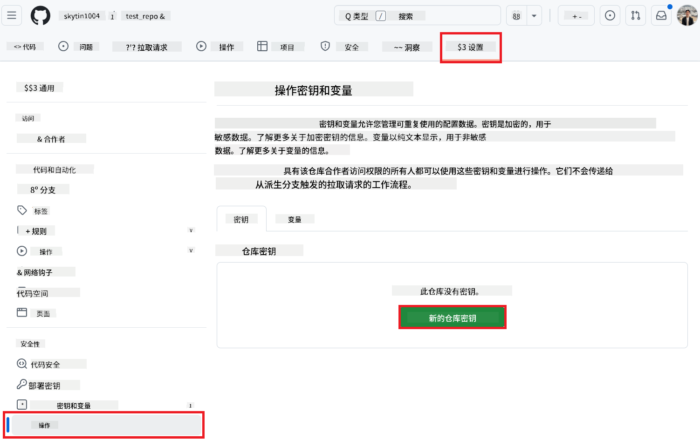
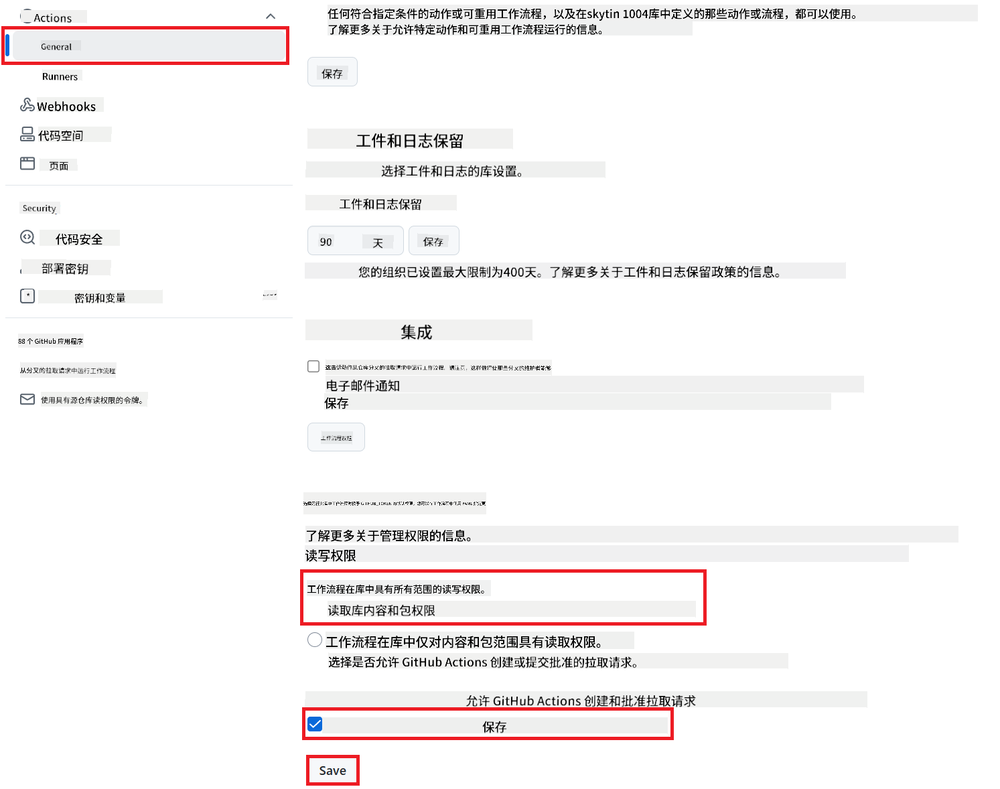

<!--
CO_OP_TRANSLATOR_METADATA:
{
  "original_hash": "a52587a512e667f70d92db853d3c61d5",
  "translation_date": "2025-06-12T19:23:07+00:00",
  "source_file": "getting_started/github-actions-guide/github-actions-guide-public.md",
  "language_code": "zh"
}
-->
# 使用 Co-op Translator GitHub Action（公共设置）

**目标用户：** 本指南适用于大多数公共或私有仓库中的用户，这些仓库的标准 GitHub Actions 权限已足够使用。它利用内置的 `GITHUB_TOKEN`。

使用 Co-op Translator GitHub Action，轻松实现仓库文档的自动翻译。本指南将引导你设置该 Action，以便在源 Markdown 文件或图片发生更改时，自动创建包含更新翻译的拉取请求。

> [!IMPORTANT]
>
> **选择合适的指南：**
>
> 本指南介绍了使用标准 `GITHUB_TOKEN` 的**简易设置方法**。这是大多数用户推荐的方式，因为无需管理敏感的 GitHub App 私钥。
>

## 前提条件

在配置 GitHub Action 之前，请确保你已准备好所需的 AI 服务凭据。

**1. 必需：AI 语言模型凭据**  
你需要至少一个支持的语言模型凭据：

- **Azure OpenAI**：需要 Endpoint、API Key、模型/部署名称、API 版本。  
- **OpenAI**：需要 API Key，（可选：组织 ID、基础 URL、模型 ID）。  
- 详情请参见 [Supported Models and Services](../../../../README.md)。

**2. 可选：AI 视觉凭据（用于图片翻译）**

- 仅当你需要翻译图片中的文本时才需提供。  
- **Azure AI Vision**：需要 Endpoint 和订阅密钥。  
- 如果未提供，Action 会默认进入[仅 Markdown 模式](../markdown-only-mode.md)。

## 设置与配置

按照以下步骤，使用标准 `GITHUB_TOKEN` 在你的仓库中配置 Co-op Translator GitHub Action。

### 第一步：了解认证（使用 `GITHUB_TOKEN`）

该工作流使用 GitHub Actions 提供的内置 `GITHUB_TOKEN`。该令牌会根据第 3 步中配置的设置，自动授予工作流与仓库交互的权限。

### 第二步：配置仓库密钥

你只需将 **AI 服务凭据** 作为加密密钥添加到仓库设置中。

1. 进入目标 GitHub 仓库。  
2. 转到 **Settings** > **Secrets and variables** > **Actions**。  
3. 依次点击 **New repository secret**，为下方所需的每个 AI 服务密钥添加密钥。

 *(图片说明：显示添加密钥的位置)*

**必需的 AI 服务密钥（根据前提条件添加所有适用项）：**

| 密钥名称                         | 说明                                   | 值来源                       |
| :------------------------------- | :------------------------------------- | :--------------------------- |
| `AZURE_SUBSCRIPTION_KEY`            | Azure AI 服务（计算机视觉）的密钥          | 你的 Azure AI Foundry         |
| `AZURE_AI_SERVICE_ENDPOINT`         | Azure AI 服务（计算机视觉）的 Endpoint     | 你的 Azure AI Foundry         |
| `AZURE_OPENAI_API_KEY`              | Azure OpenAI 服务密钥                     | 你的 Azure AI Foundry         |
| `AZURE_OPENAI_ENDPOINT`             | Azure OpenAI 服务 Endpoint                 | 你的 Azure AI Foundry         |
| `AZURE_OPENAI_MODEL_NAME`           | 你的 Azure OpenAI 模型名称                  | 你的 Azure AI Foundry         |
| `AZURE_OPENAI_CHAT_DEPLOYMENT_NAME` | 你的 Azure OpenAI 部署名称                  | 你的 Azure AI Foundry         |
| `AZURE_OPENAI_API_VERSION`          | Azure OpenAI API 版本                      | 你的 Azure AI Foundry         |
| `OPENAI_API_KEY`                    | OpenAI API Key                         | 你的 OpenAI 平台              |
| `OPENAI_ORG_ID`                     | OpenAI 组织 ID（可选）                   | 你的 OpenAI 平台              |
| `OPENAI_CHAT_MODEL_ID`              | 指定的 OpenAI 模型 ID（可选）               | 你的 OpenAI 平台              |
| `OPENAI_BASE_URL`                   | 自定义 OpenAI API 基础 URL（可选）           | 你的 OpenAI 平台              |

### 第三步：配置工作流权限

GitHub Action 需要通过 `GITHUB_TOKEN` 授予权限，以便检出代码并创建拉取请求。

1. 进入仓库，打开 **Settings** > **Actions** > **General**。  
2. 滚动到 **Workflow permissions** 部分。  
3. 选择 **Read and write permissions**，这将赋予 `GITHUB_TOKEN` 该工作流所需的 `contents: write` 和 `pull-requests: write` 权限。  
4. 确保勾选了 **Allow GitHub Actions to create and approve pull requests**。  
5. 点击 **Save**。



### 第四步：创建工作流文件

最后，创建定义自动工作流的 YAML 文件，使用 `GITHUB_TOKEN`。

1. 在仓库根目录下，若 `.github/workflows/` 目录不存在，则创建它。  
2. 在 `.github/workflows/` 目录中，创建名为 `co-op-translator.yml` 的文件。  
3. 将以下内容粘贴到 `co-op-translator.yml` 中。

```yaml
name: Co-op Translator

on:
  push:
    branches:
      - main

jobs:
  co-op-translator:
    runs-on: ubuntu-latest

    permissions:
      contents: write
      pull-requests: write

    steps:
      - name: Checkout repository
        uses: actions/checkout@v4
        with:
          fetch-depth: 0

      - name: Set up Python
        uses: actions/setup-python@v4
        with:
          python-version: '3.10'

      - name: Install Co-op Translator
        run: |
          python -m pip install --upgrade pip
          pip install co-op-translator

      - name: Run Co-op Translator
        env:
          PYTHONIOENCODING: utf-8
          # === AI Service Credentials ===
          AZURE_SUBSCRIPTION_KEY: ${{ secrets.AZURE_SUBSCRIPTION_KEY }}
          AZURE_AI_SERVICE_ENDPOINT: ${{ secrets.AZURE_AI_SERVICE_ENDPOINT }}
          AZURE_OPENAI_API_KEY: ${{ secrets.AZURE_OPENAI_API_KEY }}
          AZURE_OPENAI_ENDPOINT: ${{ secrets.AZURE_OPENAI_ENDPOINT }}
          AZURE_OPENAI_MODEL_NAME: ${{ secrets.AZURE_OPENAI_MODEL_NAME }}
          AZURE_OPENAI_CHAT_DEPLOYMENT_NAME: ${{ secrets.AZURE_OPENAI_CHAT_DEPLOYMENT_NAME }}
          AZURE_OPENAI_API_VERSION: ${{ secrets.AZURE_OPENAI_API_VERSION }}
          OPENAI_API_KEY: ${{ secrets.OPENAI_API_KEY }}
          OPENAI_ORG_ID: ${{ secrets.OPENAI_ORG_ID }}
          OPENAI_CHAT_MODEL_ID: ${{ secrets.OPENAI_CHAT_MODEL_ID }}
          OPENAI_BASE_URL: ${{ secrets.OPENAI_BASE_URL }}
        run: |
          # =====================================================================
          # IMPORTANT: Set your target languages here (REQUIRED CONFIGURATION)
          # =====================================================================
          # Example: Translate to Spanish, French, German. Add -y to auto-confirm.
          translate -l "es fr de" -y  # <--- MODIFY THIS LINE with your desired languages

      - name: Create Pull Request with translations
        uses: peter-evans/create-pull-request@v5
        with:
          token: ${{ secrets.GITHUB_TOKEN }}
          commit-message: "🌐 Update translations via Co-op Translator"
          title: "🌐 Update translations via Co-op Translator"
          body: |
            This PR updates translations for recent changes to the main branch.

            ### 📋 Changes included
            - Translated contents are available in the `translations/` directory
            - Translated images are available in the `translated_images/` directory

            ---
            🌐 Automatically generated by the [Co-op Translator](https://github.com/Azure/co-op-translator) GitHub Action.
          branch: update-translations
          base: main
          labels: translation, automated-pr
          delete-branch: true
          add-paths: |
            translations/
            translated_images/
```  
4. **自定义工作流：**  
  - **[!IMPORTANT] 目标语言：** 如有需要，在 `Run Co-op Translator` step, you **MUST review and modify the list of language codes** within the `translate -l "..." -y` command to match your project's requirements. The example list (`ar de es...`) needs to be replaced or adjusted.
  - **Trigger (`on:`):** The current trigger runs on every push to `main`. For large repositories, consider adding a `paths:` filter (see commented example in the YAML) to run the workflow only when relevant files (e.g., source documentation) change, saving runner minutes.
  - **PR Details:** Customize the `commit-message`, `title`, `body`, `branch` name, and `labels` in the `Create Pull Request` 步骤中修改。

**免责声明**：  
本文件由 AI 翻译服务 [Co-op Translator](https://github.com/Azure/co-op-translator) 进行翻译。尽管我们力求准确，但请注意，自动翻译可能存在错误或不准确之处。原始文档的母语版本应被视为权威来源。对于重要信息，建议使用专业人工翻译。对于因使用本翻译而产生的任何误解或误释，我们概不负责。