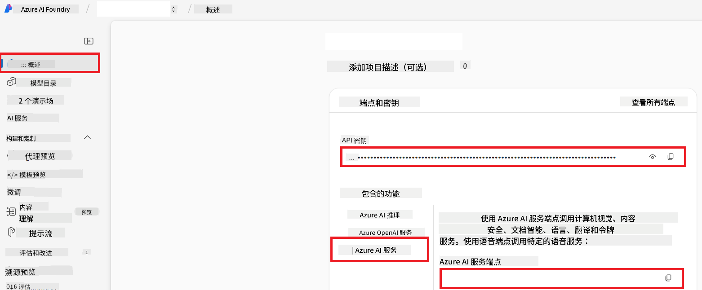

<!--
CO_OP_TRANSLATOR_METADATA:
{
  "original_hash": "b58d7c3cb4210697a073d20eb3064945",
  "translation_date": "2025-06-12T11:47:09+00:00",
  "source_file": "getting_started/set-up-azure-ai.md",
  "language_code": "zh"
}
-->
# 为合作翻译器设置 Azure AI（Azure OpenAI 和 Azure AI Vision）

本指南将引导你在 Azure AI Foundry 中设置 Azure OpenAI 进行语言翻译，以及 Azure 计算机视觉用于图像内容分析（随后可用于基于图像的翻译）。

**前提条件：**
- 拥有带有有效订阅的 Azure 账户。
- 具有在你的 Azure 订阅中创建资源和部署的足够权限。

## 创建 Azure AI 项目

首先创建一个 Azure AI 项目，它作为管理 AI 资源的中心位置。

1. 访问 [https://ai.azure.com](https://ai.azure.com) 并使用你的 Azure 账户登录。

1. 选择 **+Create** 创建一个新项目。

1. 完成以下操作：
   - 输入 **项目名称**（例如 `CoopTranslator-Project`）。
   - 选择 **AI hub**（例如 `CoopTranslator-Hub`）（如有需要可新建）。

1. 点击“**Review and Create**”完成项目设置。你将进入项目的概览页面。

## 设置 Azure OpenAI 进行语言翻译

在你的项目中，部署一个 Azure OpenAI 模型，作为文本翻译的后端。

### 进入你的项目

如果还未进入，请在 Azure AI Foundry 中打开你新创建的项目（例如 `CoopTranslator-Project`）。

### 部署 OpenAI 模型

1. 在项目左侧菜单的“我的资产”下，选择“**Models + endpoints**”。

1. 选择 **+ Deploy model**。

1. 选择 **Deploy Base Model**。

1. 系统会显示可用模型列表。筛选或搜索合适的 GPT 模型。我们推荐 `gpt-4o`。

1. 选择你想要的模型，点击 **Confirm**。

1. 选择 **Deploy**。

### Azure OpenAI 配置

部署完成后，你可以在“**Models + endpoints**”页面选择该部署，查看它的 **REST endpoint URL**、**Key**、**Deployment name**、**Model name** 和 **API version**。这些信息将在集成翻译模型到你的应用时用到。

> [!NOTE]
> 你可以根据需求，从[API 版本弃用](https://learn.microsoft.com/azure/ai-services/openai/api-version-deprecation)页面选择 API 版本。请注意，**API 版本**与 Azure AI Foundry “Models + endpoints”页面显示的**模型版本**不同。

## 设置 Azure 计算机视觉进行图像翻译

要实现图像中文字的翻译，需要获取 Azure AI 服务的 API Key 和 Endpoint。

1. 进入你的 Azure AI 项目（例如 `CoopTranslator-Project`），确保你在项目概览页面。

### Azure AI 服务配置

从 Azure AI 服务中找到 API Key 和 Endpoint。

1. 进入你的 Azure AI 项目（例如 `CoopTranslator-Project`），确保你在项目概览页面。

1. 在 Azure AI 服务标签页中找到 **API Key** 和 **Endpoint**。

    

此连接使关联的 Azure AI 服务资源（包括图像分析）功能可用于你的 AI Foundry 项目。你随后可以在笔记本或应用中使用该连接，从图像中提取文本，并将其发送到 Azure OpenAI 模型进行翻译。

## 整理你的凭据

到目前为止，你应该已经收集了以下信息：

**针对 Azure OpenAI（文本翻译）：**
- Azure OpenAI Endpoint
- Azure OpenAI API Key
- Azure OpenAI 模型名称（例如 `gpt-4o`）
- Azure OpenAI 部署名称（例如 `cooptranslator-gpt4o`）
- Azure OpenAI API 版本

**针对 Azure AI 服务（通过 Vision 进行图像文本提取）：**
- Azure AI 服务 Endpoint
- Azure AI 服务 API Key

### 示例：环境变量配置（预览）

之后构建应用时，通常会用这些凭据进行配置。例如，你可能会将它们设置为环境变量，如下所示：

```bash
# Azure AI Service Credentials (Required for image translation)
AZURE_AI_SERVICE_API_KEY="your_azure_ai_service_api_key" # e.g., 21xasd...
AZURE_AI_SERVICE_ENDPOINT="https://your_azure_ai_service_endpoint.cognitiveservices.azure.com/"

# Azure OpenAI Credentials (Required for text translation)
AZURE_OPENAI_API_KEY="your_azure_openai_api_key" # e.g., 21xasd...
AZURE_OPENAI_ENDPOINT="https://your_azure_openai_endpoint.openai.azure.com/"
AZURE_OPENAI_MODEL_NAME="your_model_name" # e.g., gpt-4o
AZURE_OPENAI_CHAT_DEPLOYMENT_NAME="your_deployment_name" # e.g., cooptranslator-gpt4o
AZURE_OPENAI_API_VERSION="your_api_version" # e.g., 2024-12-01-preview
```

---

### 延伸阅读

- [如何在 Azure AI Foundry 创建项目](https://learn.microsoft.com/azure/ai-foundry/how-to/create-projects?tabs=ai-studio)
- [如何创建 Azure AI 资源](https://learn.microsoft.com/azure/ai-foundry/how-to/create-azure-ai-resource?tabs=portal)
- [如何在 Azure AI Foundry 部署 OpenAI 模型](https://learn.microsoft.com/en-us/azure/ai-foundry/how-to/deploy-models-openai)

**免责声明**：  
本文件使用AI翻译服务[Co-op Translator](https://github.com/Azure/co-op-translator)进行翻译。虽然我们力求准确，但请注意自动翻译可能存在错误或不准确之处。原始文件的原文版本应被视为权威来源。对于重要信息，建议采用专业人工翻译。因使用本翻译而产生的任何误解或误释，我们不承担任何责任。